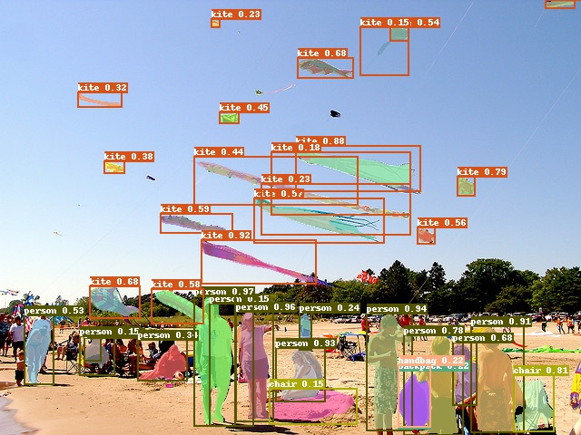

简体中文 | [English](README_en.md)

文档：[https://paddledetection.readthedocs.io](https://paddledetection.readthedocs.io)

# PaddleDetection

飞桨推出的PaddleDetection是端到端目标检测开发套件，旨在帮助开发者更快更好地完成检测模型的训练、精度速度优化到部署全流程。PaddleDetection以模块化的设计实现了多种主流目标检测算法，并且提供了丰富的数据增强、网络组件、损失函数等模块，集成了模型压缩和跨平台高性能部署能力。目前基于PaddleDetection已经完成落地的项目涉及工业质检、遥感图像检测、无人巡检等多个领域。

**目前检测库下模型均要求使用PaddlePaddle 1.7及以上版本或适当的develop版本。**

  

## 简介

特性：

- 模型丰富：

  PaddleDetection提供了丰富的模型，包含目标检测、实例分割、人脸检测等100+个预训练模型，涵盖多种数据集竞赛冠军方案、适合云端/边缘端设备部署的检测方案。

- 易部署:

  PaddleDetection的模型中使用的核心算子均通过C++或CUDA实现，同时基于PaddlePaddle的高性能推理引擎可以方便地部署在多种硬件平台上。

- 高灵活度：

  PaddleDetection通过模块化设计来解耦各个组件，基于配置文件可以轻松地搭建各种检测模型。

- 高性能：

  基于PaddlePaddle框架的高性能内核，在模型训练速度、显存占用上有一定的优势。例如，YOLOv3的训练速度快于其他框架，在Tesla V100 16GB环境下，Mask-RCNN(ResNet50)可以单卡Batch Size可以达到4 (甚至到5)。

支持的模型结构：

|                    | ResNet | ResNet-vd [1](#vd) | ResNeXt-vd | SENet | MobileNet |  HRNet | Res2Net |
|--------------------|:------:|------------------------------:|:----------:|:-----:|:---------:|:------:| :--:    |
| Faster R-CNN       | ✓      |                             ✓ | x          | ✓     | ✗         |  ✗     |  ✗      |
| Faster R-CNN + FPN | ✓      |                             ✓ | ✓          | ✓     | ✗         |  ✓     |  ✓      |
| Mask R-CNN         | ✓      |                             ✓ | x          | ✓     | ✗         |  ✗     |  ✗      |
| Mask R-CNN + FPN   | ✓      |                             ✓ | ✓          | ✓     | ✗         |  ✗     |  ✓      |
| Cascade Faster-RCNN | ✓     |                             ✓ | ✓          | ✗     | ✗         |  ✗     |  ✗      |
| Cascade Mask-RCNN  | ✓      |                             ✗ | ✗          | ✓     | ✗         |  ✗     |  ✗      |
| Libra R-CNN        | ✗      |                             ✓ | ✗          | ✗     | ✗         |  ✗     |  ✗      |
| RetinaNet          | ✓      |                             ✗ | ✓          | ✗     | ✗         |  ✗     |  ✗      |
| YOLOv3             | ✓      |                             ✓ | ✗          | ✗     | ✓         |  ✗     |  ✗      |
| SSD                | ✗      |                             ✗ | ✗          | ✗     | ✓         |  ✗     |  ✗      |
| BlazeFace          | ✗      |                             ✗ | ✗          | ✗     | ✗         |  ✗     |  ✗      |
| Faceboxes          | ✗      |                             ✗ | ✗          | ✗     | ✗         |  ✗     |  ✗      |

<a name="vd">[1]</a> [ResNet-vd](https://arxiv.org/pdf/1812.01187) 模型预测速度基本不变的情况下提高了精度。

**说明：** ✓ 为[模型库](docs/MODEL_ZOO_cn.md)中提供了对应配置文件和预训练模型，✗ 为未提供参考配置，但一般都支持。

更多的模型:

- EfficientDet
- FCOS
- CornerNet-Squeeze
- YOLOv4

更多的Backone：

- DarkNet
- VGG
- GCNet
- CBNet
- Hourglass

扩展特性：

- [x] **Synchronized Batch Norm**
- [x] **Group Norm**
- [x] **Modulated Deformable Convolution**
- [x] **Deformable PSRoI Pooling**
- [x] **Non-local和GCNet**

**注意:** Synchronized batch normalization 只能在多GPU环境下使用，不能在CPU环境或者单GPU环境下使用。

以下为选取各模型结构和骨干网络的代表模型COCO数据集精度mAP和单卡Tesla V100上预测速度(FPS)关系图。

  

**说明：**
- `CBResNet`为`Cascade-Faster-RCNN-CBResNet200vd-FPN`模型，COCO数据集mAP高达53.3%
- `Cascade-Faster-RCNN`为`Cascade-Faster-RCNN-ResNet50vd-DCN`，PaddleDetection将其优化到COCO数据mAP为47.8%时推理速度为20FPS
- PaddleDetection增强版`YOLOv3-ResNet50vd-DCN`在COCO数据集mAP高于原作10.6个绝对百分点，推理速度为61.3FPS，快于原作约70%
- 图中模型均可在[模型库](#模型库)中获取

## 文档教程

### 入门教程

- [安装说明](docs/tutorials/INSTALL_cn.md)
- [快速开始](docs/tutorials/QUICK_STARTED_cn.md)
- [训练/评估/预测流程](docs/tutorials/GETTING_STARTED_cn.md)
- [如何训练自定义数据集](docs/tutorials/Custom_DataSet.md)
- [常见问题汇总](docs/FAQ.md)

### 进阶教程
- [数据预处理及数据集定义](docs/advanced_tutorials/READER.md)
- [搭建模型步骤](docs/advanced_tutorials/MODEL_TECHNICAL.md)
- [模型参数配置](docs/advanced_tutorials/config_doc):
  - [配置模块设计和介绍](docs/advanced_tutorials/config_doc/CONFIG_cn.md)
  - [RCNN模型参数说明](docs/advanced_tutorials/config_doc/RCNN_PARAMS_DOC.md)
- [迁移学习教程](docs/advanced_tutorials/TRANSFER_LEARNING_cn.md)
- [IPython Notebook demo](demo/mask_rcnn_demo.ipynb)
- [模型压缩](slim)
    - [压缩benchmark](slim)
    - [量化](slim/quantization)
    - [剪枝](slim/prune)
    - [蒸馏](slim/distillation)
    - [神经网络搜索](slim/nas)
- [推理部署](deploy)
    - [模型导出教程](docs/advanced_tutorials/deploy/EXPORT_MODEL.md)
    - [Python端推理部署](deploy/python)
    - [C++端推理部署](deploy/cpp)
    - [推理Benchmark](docs/advanced_tutorials/deploy/BENCHMARK_INFER_cn.md)

## 模型库

- [模型库](docs/MODEL_ZOO_cn.md)
- [移动端模型](configs/mobile/README.md)
- [Anchor free模型](configs/anchor_free/README.md)
- [人脸检测模型](docs/featured_model/FACE_DETECTION.md)
- [YOLOv3增强模型](docs/featured_model/YOLOv3_ENHANCEMENT.md): COCO mAP高达43.6%，原论文精度为33.0%
- [行人检测预训练模型](docs/featured_model/CONTRIB_cn.md)
- [车辆检测预训练模型](docs/featured_model/CONTRIB_cn.md)
- [Objects365 2019 Challenge夺冠模型](docs/featured_model/champion_model/CACascadeRCNN.md)
- [Open Images 2019-Object Detction比赛最佳单模型](docs/featured_model/champion_model/OIDV5_BASELINE_MODEL.md)
- [服务器端实用目标检测模型](configs/rcnn_enhance/README.md): V100上速度20FPS时，COCO mAP高达47.8%。

## 许可证书
本项目的发布受[Apache 2.0 license](LICENSE)许可认证。

## 版本更新
v0.3.0版本已经在`05/2020`发布，增加Anchor-free、EfficientDet和YOLOv4等多个模型，推出移动端、服务器端实用高效多个模型，例如移动端将YOLOv3-MobileNetv3加速3.5倍，服务器端优化两阶段模型，速度和精度具备较高性价比。重构预测部署功能，提升易用性，修复已知诸多bug等，详细内容请参考[版本更新文档](docs/CHANGELOG.md)。

## 如何贡献代码

我们非常欢迎你可以为PaddleDetection提供代码，也十分感谢你的反馈。
