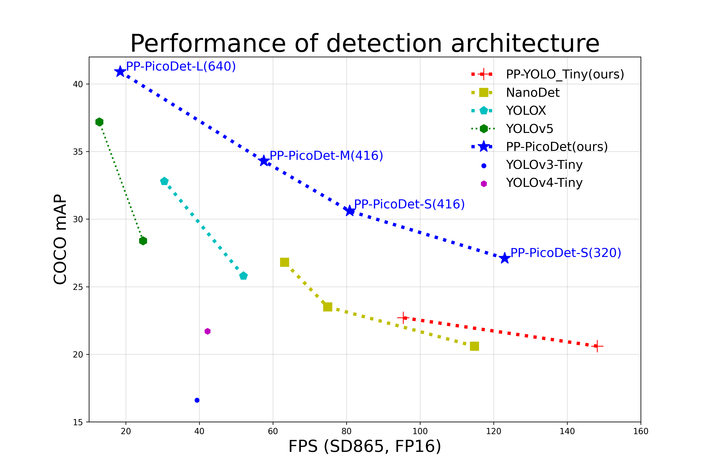

简体中文 | [English](README_en.md)

<div align="center">
<p align="center">
  
</p>

**飞桨目标检测开发套件，端到端地完成从训练到部署的全流程目标检测应用。**

<p align="center">
    <a href="./LICENSE"></a>
    <a href="https://github.com/PaddlePaddle/PaddleDetection/releases"></a>
    <a href=""></a>
    <a href=""></a>
    <a href="https://github.com/PaddlePaddle/PaddleDetection/stargazers"></a>
</p>
</div>


<div  align="center">
  

</div>

## 🚀 热门活动
- 🎊 **【AI快车道两日课】手把手教你将PP-YOLOE+用于旋转框、小目标检测，达成SOTA性能**
  - ⏰ **时间：11月16-17日 晚上8:15**
  - **11月16日：更高效更鲁棒的小目标检测器PP-YOLOE-SOD**
  - **11月17日：SOTA旋转框检测器PP-YOLOE-R**
  - 🎁 **扫码入群即可获取专属直播链接与技术大礼包！**


  <div align="center">
    
  </div>

##  贡献代码

PaddleDetection非常欢迎你加入到飞桨社区的开源建设中，参与贡献方式可以参考[文档](docs/contribution/README.md)

同时我们也会组织专项活动，引导大家参与到PaddleDetection的开发中：

- [Yes, PP-YOLOE! 基于PP-YOLOE的算法开发](https://github.com/PaddlePaddle/PaddleDetection/issues/7345)

##  产品动态


- 🔥 **2022.11.15：发布基于PP-YOLOE+扩展的旋转框、小目标检测SOTA模型**
  - 旋转框检测模型[PP-YOLOE-R](configs/rotate/ppyoloe_r)
    - Anchor-free旋转框检测SOTA模型，精度速度双高
    - 云边一体，s/m/l/x四个模型适配不用算力硬件
    - 部署友好，避免使用特殊算子，能够轻松使用TensorRT加速
  - 小目标检测模型[PP-YOLOE-SOD](configs/smalldet)
    - 基于切图的端到端检测方案
    - 基于原图的检测模型，精度达VisDrone开源最优


- 2022.8.26：PaddleDetection发布[release/2.5版本](https://github.com/PaddlePaddle/PaddleDetection/tree/release/2.5)
  - 🗳 特色模型：
    - 发布[PP-YOLOE+](configs/ppyoloe)，最高精度提升2.4% mAP，达到54.9% mAP，模型训练收敛速度提升3.75倍，端到端预测速度最高提升2.3倍；多个下游任务泛化性提升
    - 发布[PicoDet-NPU](configs/picodet)模型，支持模型全量化部署；新增[PicoDet](configs/picodet)版面分析模型
    - 发布[PP-TinyPose升级版](./configs/keypoint/tiny_pose/)增强版，在健身、舞蹈等场景精度提升9.1% AP，支持侧身、卧躺、跳跃、高抬腿等非常规动作
  - 🔮 场景能力：
    - 发布行人分析工具[PP-Human v2](./deploy/pipeline)，新增打架、打电话、抽烟、闯入四大行为识别，底层算法性能升级，覆盖行人检测、跟踪、属性三类核心算法能力，提供保姆级全流程开发及模型优化策略，支持在线视频流输入
    - 首次发布[PP-Vehicle](./deploy/pipeline)，提供车牌识别、车辆属性分析（颜色、车型）、车流量统计以及违章检测四大功能，兼容图片、在线视频流、视频输入，提供完善的二次开发文档教程
  - 💡 前沿算法：
    - 全面覆盖的[YOLO家族](docs/feature_models/YOLOSERIES_MODEL.md)经典与最新模型代码库[PaddleDetection_YOLOSeries](https://github.com/nemonameless/PaddleDetection_YOLOSeries): 包括YOLOv3，百度飞桨自研的实时高精度目标检测模型PP-YOLOE，以及前沿检测算法YOLOv4、YOLOv5、YOLOX，YOLOv6及YOLOv7
    - 新增基于[ViT](configs/vitdet)骨干网络高精度检测模型，COCO数据集精度达到55.7% mAP；新增[OC-SORT](configs/mot/ocsort)多目标跟踪模型；新增[ConvNeXt](configs/convnext)骨干网络
  - 📋 产业范例：新增[智能健身](https://aistudio.baidu.com/aistudio/projectdetail/4385813)、[打架识别](https://aistudio.baidu.com/aistudio/projectdetail/4086987?channelType=0&channel=0)、[来客分析](https://aistudio.baidu.com/aistudio/projectdetail/4230123?channelType=0&channel=0)、车辆结构化范例

- [更多版本发布](https://github.com/PaddlePaddle/PaddleDetection/releases)

##  简介

**PaddleDetection**为基于飞桨PaddlePaddle的端到端目标检测套件，内置**30+模型算法**及**300+预训练模型**，覆盖**目标检测、实例分割、跟踪、关键点检测**等方向，其中包括**服务器端和移动端高精度、轻量级**产业级SOTA模型、冠军方案和学术前沿算法，并提供配置化的网络模块组件、十余种数据增强策略和损失函数等高阶优化支持和多种部署方案，在打通数据处理、模型开发、训练、压缩、部署全流程的基础上，提供丰富的案例及教程，加速算法产业落地应用。

<div  align="center">
  
</div>


##  特性

- **模型丰富**: 包含**目标检测**、**实例分割**、**人脸检测**、****关键点检测****、**多目标跟踪**等**300+个预训练模型**，涵盖多种**全球竞赛冠军**方案。
- **使用简洁**：模块化设计，解耦各个网络组件，开发者轻松搭建、试用各种检测模型及优化策略，快速得到高性能、定制化的算法。
- **端到端打通**: 从数据增强、组网、训练、压缩、部署端到端打通，并完备支持**云端**/**边缘端**多架构、多设备部署。
- **高性能**: 基于飞桨的高性能内核，模型训练速度及显存占用优势明显。支持FP16训练, 支持多机训练。

<div  align="center">
  
</div>

##  技术交流

- 如果你发现任何PaddleDetection存在的问题或者是建议, 欢迎通过[GitHub Issues](https://github.com/PaddlePaddle/PaddleDetection/issues)给我们提issues。

- **欢迎加入PaddleDetection 微信用户群（扫码填写问卷即可入群）**
  - **入群福利 💎：获取PaddleDetection团队整理的重磅学习大礼包🎁**
    - 📊 福利一：获取飞桨联合业界企业整理的开源数据集
    - 👨‍🏫 福利二：获取PaddleDetection历次发版直播视频与最新直播咨询
    - 🗳 福利三：获取垂类场景预训练模型集合，包括工业、安防、交通等5+行业场景
    - 🗂 福利四：获取10+全流程产业实操范例，覆盖火灾烟雾检测、人流量计数等产业高频场景
  <div align="center">
    
  </div>

##  套件结构概览

<table align="center">
  <tbody>
    <tr align="center" valign="bottom">
      <td>
        <b>Architectures</b>
      </td>
      <td>
        <b>Backbones</b>
      </td>
      <td>
        <b>Components</b>
      </td>
      <td>
        <b>Data Augmentation</b>
      </td>
    </tr>
    <tr valign="top">
      <td>
        <ul>
        <details><summary><b>Object Detection</b></summary>
          <ul>
            <li>Faster RCNN</li>
            <li>FPN</li>
            <li>Cascade-RCNN</li>
            <li>PSS-Det</li>
            <li>RetinaNet</li>
            <li>YOLOv3</li>  
            <li>YOLOv5</li>  
            <li>YOLOv6</li>  
            <li>YOLOv7</li>  
            <li>PP-YOLOv1/v2</li>
            <li>PP-YOLO-Tiny</li>
            <li>PP-YOLOE</li>
            <li>PP-YOLOE+</li>
            <li>PP-YOLOE-R</li>
            <li>PP-YOLOE-SOD</li>
            <li>YOLOX</li>
            <li>YOLOF</li>
            <li>SSD</li>
            <li>CenterNet</li>
            <li>FCOS</li>  
            <li>FCOS-R</li>  
            <li>TTFNet</li>
            <li>TOOD</li>
            <li>GFL</li>
            <li>PP-PicoDet</li>
            <li>DETR</li>
            <li>Deformable DETR</li>
            <li>Swin Transformer</li>
            <li>Sparse RCNN</li>
         </ul></details>
        <details><summary><b>Instance Segmentation</b></summary>
         <ul>
            <li>Mask RCNN</li>
            <li>Cascade Mask RCNN</li>
            <li>SOLOv2</li>
        </ul></details>
        <details><summary><b>Face Detection</b></summary>
        <ul>
            <li>BlazeFace</li>
        </ul></details>
        <details><summary><b>Multi-Object-Tracking</b></summary>
        <ul>
            <li>JDE</li>
            <li>FairMOT</li>
            <li>DeepSORT</li>
            <li>ByteTrack</li>
            <li>OC-SORT</li>
        </ul></details>
        <details><summary><b>KeyPoint-Detection</b></summary>
        <ul>
            <li>HRNet</li>
            <li>HigherHRNet</li>
            <li>Lite-HRNet</li>
            <li>PP-TinyPose</li>
        </ul></details>
      </ul>
      </td>
      <td>
        <details><summary><b>Details</b></summary>
        <ul>
          <li>ResNet(&vd)</li>
          <li>Res2Net(&vd)</li>
          <li>CSPResNet</li>
          <li>SENet</li>
          <li>Res2Net</li>
          <li>HRNet</li>
          <li>Lite-HRNet</li>
          <li>DarkNet</li>
          <li>CSPDarkNet</li>
          <li>MobileNetv1/v3</li>  
          <li>ShuffleNet</li>
          <li>GhostNet</li>
          <li>BlazeNet</li>
          <li>DLA</li>
          <li>HardNet</li>
          <li>LCNet</li>  
          <li>ESNet</li>  
          <li>Swin-Transformer</li>
          <li>ConvNeXt</li>
          <li>Vision Transformer</li>
        </ul></details>
      </td>
      <td>
        <details><summary><b>Common</b></summary>
          <ul>
            <li>Sync-BN</li>
            <li>Group Norm</li>
            <li>DCNv2</li>
            <li>EMA</li>
          </ul> </details>
        </ul>
        <details><summary><b>KeyPoint</b></summary>
          <ul>
            <li>DarkPose</li>
          </ul></details>
        </ul>
        <details><summary><b>FPN</b></summary>
          <ul>
            <li>BiFPN</li>
            <li>CSP-PAN</li>
            <li>Custom-PAN</li>
            <li>ES-PAN</li>
            <li>HRFPN</li>
          </ul> </details>
        </ul>  
        <details><summary><b>Loss</b></summary>
          <ul>
            <li>Smooth-L1</li>
            <li>GIoU/DIoU/CIoU</li>  
            <li>IoUAware</li>
            <li>Focal Loss</li>
            <li>CT Focal Loss</li>
            <li>VariFocal Loss</li>
          </ul> </details>
        </ul>  
        <details><summary><b>Post-processing</b></summary>
          <ul>
            <li>SoftNMS</li>
            <li>MatrixNMS</li>  
          </ul> </details>  
        </ul>
        <details><summary><b>Speed</b></summary>
          <ul>
            <li>FP16 training</li>
            <li>Multi-machine training </li>  
          </ul> </details>  
        </ul>  
      </td>
      <td>
        <details><summary><b>Details</b></summary>
        <ul>
          <li>Resize</li>  
          <li>Lighting</li>  
          <li>Flipping</li>  
          <li>Expand</li>
          <li>Crop</li>
          <li>Color Distort</li>  
          <li>Random Erasing</li>  
          <li>Mixup </li>
          <li>AugmentHSV</li>
          <li>Mosaic</li>
          <li>Cutmix </li>
          <li>Grid Mask</li>
          <li>Auto Augment</li>  
          <li>Random Perspective</li>  
        </ul> </details>  
      </td>  
    </tr>

</td>
    </tr>
  </tbody>
</table>

##  模型性能概览

<details>
<summary><b> 云端模型性能对比</b></summary>

各模型结构和骨干网络的代表模型在COCO数据集上精度mAP和单卡Tesla V100上预测速度(FPS)对比图。

<div align="center">
  
</div>

**说明：**

- `ViT`为`ViT-Cascade-Faster-RCNN`模型，COCO数据集mAP高达55.7%
- `Cascade-Faster-RCNN`为`Cascade-Faster-RCNN-ResNet50vd-DCN`，PaddleDetection将其优化到COCO数据mAP为47.8%时推理速度为20FPS
- `PP-YOLOE`是对`PP-YOLO v2`模型的进一步优化，L版本在COCO数据集mAP为51.6%，Tesla V100预测速度78.1FPS
- `PP-YOLOE+`是对`PPOLOE`模型的进一步优化，L版本在COCO数据集mAP为53.3%，Tesla V100预测速度78.1FPS
- [`YOLOX`](configs/yolox)和[`YOLOv5`](https://github.com/nemonameless/PaddleDetection_YOLOSeries/tree/develop/configs/yolov5)均为基于PaddleDetection复现算法，`YOLOv5`代码在[`PaddleDetection_YOLOSeries`](https://github.com/nemonameless/PaddleDetection_YOLOSeries)中，参照[YOLOSERIES_MODEL](docs/feature_models/YOLOSERIES_MODEL.md)
- 图中模型均可在[模型库](#模型库)中获取

</details>

<details>
<summary><b> 移动端模型性能对比</b></summary>

各移动端模型在COCO数据集上精度mAP和高通骁龙865处理器上预测速度(FPS)对比图。

<div align="center">
  
</div>

**说明：**

- 测试数据均使用高通骁龙865(4\*A77 + 4\*A55)处理器batch size为1, 开启4线程测试，测试使用NCNN预测库，测试脚本见[MobileDetBenchmark](https://github.com/JiweiMaster/MobileDetBenchmark)
- [PP-PicoDet](configs/picodet)及[PP-YOLO-Tiny](configs/ppyolo)为PaddleDetection自研模型，其余模型PaddleDetection暂未提供

</details>

##  模型库

<details>
<summary><b> 1. 通用检测</b></summary>

#### [PP-YOLOE+](./configs/ppyoloe)系列 推荐场景：Nvidia V100, T4等云端GPU和Jetson系列等边缘端设备

| 模型名称       | COCO精度（mAP） | V100 TensorRT FP16速度(FPS) | 配置文件                                                  | 模型下载                                                                                 |
|:---------- |:-----------:|:-------------------------:|:-----------------------------------------------------:|:------------------------------------------------------------------------------------:|
| PP-YOLOE+_s | 43.9        | 333.3                     | [链接](configs/ppyoloe/ppyoloe_plus_crn_s_80e_coco.yml)     | [下载地址](https://paddledet.bj.bcebos.com/models/ppyoloe_plus_crn_s_80e_coco.pdparams)      |
| PP-YOLOE+_m | 50.0        | 208.3                     | [链接](configs/ppyoloe/ppyoloe_plus_crn_m_80e_coco.yml)     | [下载地址](https://paddledet.bj.bcebos.com/models/ppyoloe_plus_crn_m_80e_coco.pdparams)     |
| PP-YOLOE+_l | 53.3        | 149.2                     | [链接](configs/ppyoloe/ppyoloe_plus_crn_l_80e_coco.yml) | [下载地址](https://paddledet.bj.bcebos.com/models/ppyoloe_plus_crn_m_80e_coco.pdparams) |
| PP-YOLOE+_x | 54.9        | 95.2                      | [链接](configs/ppyoloe/ppyoloe_plus_crn_x_80e_coco.yml) | [下载地址](https://paddledet.bj.bcebos.com/models/ppyoloe_plus_crn_x_80e_coco.pdparams) |

#### [PP-PicoDet](./configs/picodet)系列 推荐场景：ARM CPU(RK3399, 树莓派等) 和NPU(比特大陆，晶晨等)移动端芯片和x86 CPU设备

| 模型名称       | COCO精度（mAP） | 骁龙865 四线程速度(ms) | 配置文件                                                | 模型下载                                                                              |
|:---------- |:-----------:|:---------------:|:---------------------------------------------------:|:---------------------------------------------------------------------------------:|
| PicoDet-XS | 23.5        | 7.81            | [链接](configs/picodet/picodet_xs_320_coco_lcnet.yml) | [下载地址](https://paddledet.bj.bcebos.com/models/picodet_xs_320_coco_lcnet.pdparams) |
| PicoDet-S  | 29.1        | 9.56            | [链接](configs/picodet/picodet_s_320_coco_lcnet.yml)  | [下载地址](https://paddledet.bj.bcebos.com/models/picodet_s_320_coco_lcnet.pdparams)  |
| PicoDet-M  | 34.4        | 17.68           | [链接](configs/picodet/picodet_m_320_coco_lcnet.yml)  | [下载地址](https://paddledet.bj.bcebos.com/models/picodet_m_320_coco_lcnet.pdparams)  |
| PicoDet-L  | 36.1        | 25.21           | [链接](configs/picodet/picodet_l_320_coco_lcnet.yml)  | [下载地址](https://paddledet.bj.bcebos.com/models/picodet_l_320_coco_lcnet.pdparams)  |

#### 前沿检测算法

| 模型名称                                                               | COCO精度（mAP） | V100 TensorRT FP16速度(FPS) | 配置文件                                                                                                         | 模型下载                                                                       |
|:------------------------------------------------------------------ |:-----------:|:-------------------------:|:------------------------------------------------------------------------------------------------------------:|:--------------------------------------------------------------------------:|
| [YOLOX-l](configs/yolox)                                           | 50.1        | 107.5                     | [链接](configs/yolox/yolox_l_300e_coco.yml)                                                                    | [下载地址](https://paddledet.bj.bcebos.com/models/yolox_l_300e_coco.pdparams)  |
| [YOLOv5-l](https://github.com/nemonameless/PaddleDetection_YOLOSeries/tree/develop/configs/yolov5) | 48.6        | 136.0                     | [链接](https://github.com/nemonameless/PaddleDetection_YOLOSeries/blob/develop/configs/yolov5/yolov5_l_300e_coco.yml) | [下载地址](https://paddledet.bj.bcebos.com/models/yolov5_l_300e_coco.pdparams) |
| [YOLOv7-l](https://github.com/nemonameless/PaddleDetection_YOLOSeries/tree/develop/configs/yolov7) | 51.0        | 135.0                     | [链接](https://github.com/nemonameless/PaddleDetection_YOLOSeries/blob/develop/configs/yolov7/yolov7_l_300e_coco.yml) | [下载地址](https://paddledet.bj.bcebos.com/models/yolov7_l_300e_coco.pdparams) |

**注意:**
- `YOLOv5`和`YOLOv7`代码在[`PaddleDetection_YOLOSeries`](https://github.com/nemonameless/PaddleDetection_YOLOSeries)中，为基于`PaddleDetection`复现的算法，可参照[YOLOSERIES_MODEL](docs/feature_models/YOLOSERIES_MODEL.md)。

#### 其他通用检测模型 [文档链接](docs/MODEL_ZOO_cn.md)

</details>

<details>
<summary><b> 2. 实例分割</b></summary>

| 模型名称              | 模型简介         | 推荐场景 | COCO精度(mAP)                      | 配置文件                                                                  | 模型下载                                                                                              |
|:----------------- |:------------ |:---- |:--------------------------------:|:---------------------------------------------------------------------:|:-------------------------------------------------------------------------------------------------:|
| Mask RCNN         | 两阶段实例分割算法    | 云边端  | box AP: 41.4 <br/> mask AP: 37.5 | [链接](configs/mask_rcnn/mask_rcnn_r50_vd_fpn_2x_coco.yml)              | [下载地址](https://paddledet.bj.bcebos.com/models/mask_rcnn_r50_vd_fpn_2x_coco.pdparams)              |
| Cascade Mask RCNN | 两阶段实例分割算法    | 云边端  | box AP: 45.7 <br/> mask AP: 39.7 | [链接](configs/mask_rcnn/cascade_mask_rcnn_r50_vd_fpn_ssld_2x_coco.yml) | [下载地址](https://paddledet.bj.bcebos.com/models/cascade_mask_rcnn_r50_vd_fpn_ssld_2x_coco.pdparams) |
| SOLOv2            | 轻量级单阶段实例分割算法 | 云边端  | mask AP: 38.0                    | [链接](configs/solov2/solov2_r50_fpn_3x_coco.yml)                       | [下载地址](https://paddledet.bj.bcebos.com/models/solov2_r50_fpn_3x_coco.pdparams)                    |

</details>

<details>
<summary><b> 3. 关键点检测</b></summary>

| 模型名称                                        | 模型简介                                                             | 推荐场景                               | COCO精度（AP） | 速度                      | 配置文件                                                    | 模型下载                                                                                    |
|:------------------------------------------- |:---------------------------------------------------------------- |:---------------------------------- |:----------:|:-----------------------:|:-------------------------------------------------------:|:---------------------------------------------------------------------------------------:|
| HRNet-w32 + DarkPose                        | <div style="width: 130pt">top-down 关键点检测算法<br/>输入尺寸384x288</div> | <div style="width: 50pt">云边端</div> | 78.3       | T4 TensorRT FP16 2.96ms | [链接](configs/keypoint/hrnet/dark_hrnet_w32_384x288.yml) | [下载地址](https://paddledet.bj.bcebos.com/models/keypoint/dark_hrnet_w32_384x288.pdparams) |
| HRNet-w32 + DarkPose                        | top-down 关键点检测算法<br/>输入尺寸256x192                                 | 云边端                                | 78.0       | T4 TensorRT FP16 1.75ms | [链接](configs/keypoint/hrnet/dark_hrnet_w32_256x192.yml) | [下载地址](https://paddledet.bj.bcebos.com/models/keypoint/dark_hrnet_w32_256x192.pdparams) |
| [PP-TinyPose](./configs/keypoint/tiny_pose) | 轻量级关键点算法<br/>输入尺寸256x192                                         | 移动端                                | 68.8       | 骁龙865 四线程 6.30ms        | [链接](configs/keypoint/tiny_pose/tinypose_256x192.yml)   | [下载地址](https://bj.bcebos.com/v1/paddledet/models/keypoint/tinypose_256x192.pdparams)    |
| [PP-TinyPose](./configs/keypoint/tiny_pose) | 轻量级关键点算法<br/>输入尺寸128x96                                          | 移动端                                | 58.1       | 骁龙865 四线程 2.37ms        | [链接](configs/keypoint/tiny_pose/tinypose_128x96.yml)    | [下载地址](https://bj.bcebos.com/v1/paddledet/models/keypoint/tinypose_128x96.pdparams)     |

#### 其他关键点检测模型 [文档链接](configs/keypoint)

</details>

<details>
<summary><b> 4. 多目标跟踪PP-Tracking </b></summary>

| 模型名称      | 模型简介                     | 推荐场景                               | 精度                     | 配置文件                                                                  | 模型下载                                                                                              |
|:--------- |:------------------------ |:---------------------------------- |:----------------------:|:---------------------------------------------------------------------:|:-------------------------------------------------------------------------------------------------:|
| ByteTrack | SDE多目标跟踪算法 仅包含检测模型       | 云边端                                | MOT-17 test:  78.4 | [链接](configs/mot/bytetrack/bytetrack_yolox.yml) | [下载地址](https://bj.bcebos.com/v1/paddledet/models/mot/yolox_x_24e_800x1440_mix_det.pdparams) |
| FairMOT   | JDE多目标跟踪算法 多任务联合学习方法     | 云边端                                | MOT-16 test: 75.0      | [链接](configs/mot/fairmot/fairmot_dla34_30e_1088x608.yml)              | [下载地址](https://paddledet.bj.bcebos.com/models/mot/fairmot_dla34_30e_1088x608.pdparams)            |
| OC-SORT | SDE多目标跟踪算法 仅包含检测模型       | 云边端                                | MOT-17 half val:  75.5 | [链接](configs/mot/ocsort/ocsort_yolox.yml) | [下载地址](https://bj.bcebos.com/v1/paddledet/models/mot/yolox_x_24e_800x1440_mix_mot_ch.pdparams) |

#### 其他多目标跟踪模型 [文档链接](configs/mot)

</details>

<details>
<summary><b> 5. 产业级实时行人分析工具PP-Human </b></summary>


| 任务            | 端到端速度（ms）|  模型方案  |  模型体积 |
| :---------:     | :-------:  |  :------: |:------: |
|  行人检测（高精度）  | 25.1ms  |  [目标检测](https://bj.bcebos.com/v1/paddledet/models/pipeline/mot_ppyoloe_l_36e_pipeline.zip) | 182M |  
|  行人检测（轻量级）  | 16.2ms  |  [目标检测](https://bj.bcebos.com/v1/paddledet/models/pipeline/mot_ppyoloe_s_36e_pipeline.zip) | 27M |
|  行人跟踪（高精度）  | 31.8ms  |  [多目标跟踪](https://bj.bcebos.com/v1/paddledet/models/pipeline/mot_ppyoloe_l_36e_pipeline.zip) | 182M |  
|  行人跟踪（轻量级）  | 21.0ms  |  [多目标跟踪](https://bj.bcebos.com/v1/paddledet/models/pipeline/mot_ppyoloe_s_36e_pipeline.zip) | 27M |
|  属性识别（高精度）  |   单人8.5ms | [目标检测](https://bj.bcebos.com/v1/paddledet/models/pipeline/mot_ppyoloe_l_36e_pipeline.zip)<br> [属性识别](https://bj.bcebos.com/v1/paddledet/models/pipeline/PPHGNet_small_person_attribute_954_infer.zip) | 目标检测：182M<br>属性识别：86M |
|  属性识别（轻量级）  |   单人7.1ms | [目标检测](https://bj.bcebos.com/v1/paddledet/models/pipeline/mot_ppyoloe_l_36e_pipeline.zip)<br> [属性识别](https://bj.bcebos.com/v1/paddledet/models/pipeline/PPLCNet_x1_0_person_attribute_945_infer.zip) | 目标检测：182M<br>属性识别：86M |
|  摔倒识别  |   单人10ms | [多目标跟踪](https://bj.bcebos.com/v1/paddledet/models/pipeline/mot_ppyoloe_l_36e_pipeline.zip) <br> [关键点检测](https://bj.bcebos.com/v1/paddledet/models/pipeline/dark_hrnet_w32_256x192.zip) <br> [基于关键点行为识别](https://bj.bcebos.com/v1/paddledet/models/pipeline/STGCN.zip) | 多目标跟踪：182M<br>关键点检测：101M<br>基于关键点行为识别：21.8M |
|  闯入识别  |   31.8ms | [多目标跟踪](https://bj.bcebos.com/v1/paddledet/models/pipeline/mot_ppyoloe_l_36e_pipeline.zip) | 182M |
|  打架识别  |   19.7ms | [视频分类](https://bj.bcebos.com/v1/paddledet/models/pipeline/mot_ppyoloe_l_36e_pipeline.zip) | 90M |
|  抽烟识别  |   单人15.1ms | [目标检测](https://bj.bcebos.com/v1/paddledet/models/pipeline/mot_ppyoloe_l_36e_pipeline.zip)<br>[基于人体id的目标检测](https://bj.bcebos.com/v1/paddledet/models/pipeline/ppyoloe_crn_s_80e_smoking_visdrone.zip) | 目标检测：182M<br>基于人体id的目标检测：27M |
|  打电话识别  |   单人ms | [目标检测](https://bj.bcebos.com/v1/paddledet/models/pipeline/mot_ppyoloe_l_36e_pipeline.zip)<br>[基于人体id的图像分类](https://bj.bcebos.com/v1/paddledet/models/pipeline/PPHGNet_tiny_calling_halfbody.zip) | 目标检测：182M<br>基于人体id的图像分类：45M |


点击模型方案中的模型即可下载指定模型

详细信息参考[文档](deploy/pipeline)

</details>

<details>
<summary><b> 6. 产业级实时车辆分析工具PP-Vehicle </b></summary>

| 任务            | 端到端速度（ms）|  模型方案  |  模型体积 |
| :---------:     | :-------:  |  :------: |:------: |
|  车辆检测（高精度）  | 25.7ms  |  [目标检测](https://bj.bcebos.com/v1/paddledet/models/pipeline/mot_ppyoloe_l_36e_ppvehicle.zip) | 182M |  
|  车辆检测（轻量级）  | 13.2ms  |  [目标检测](https://bj.bcebos.com/v1/paddledet/models/pipeline/mot_ppyoloe_s_36e_ppvehicle.zip) | 27M |
|  车辆跟踪（高精度）  | 40ms  |  [多目标跟踪](https://bj.bcebos.com/v1/paddledet/models/pipeline/mot_ppyoloe_l_36e_ppvehicle.zip) | 182M |
|  车辆跟踪（轻量级）  | 25ms  |  [多目标跟踪](https://bj.bcebos.com/v1/paddledet/models/pipeline/mot_ppyoloe_s_36e_ppvehicle.zip) | 27M |
|  车牌识别  |   4.68ms |  [车牌检测](https://bj.bcebos.com/v1/paddledet/models/pipeline/ch_PP-OCRv3_det_infer.tar.gz) <br> [车牌识别](https://bj.bcebos.com/v1/paddledet/models/pipeline/ch_PP-OCRv3_rec_infer.tar.gz) | 车牌检测：3.9M  <br> 车牌字符识别： 12M |
|  车辆属性  |   7.31ms | [属性识别](https://bj.bcebos.com/v1/paddledet/models/pipeline/vehicle_attribute_model.zip) | 7.2M |

点击模型方案中的模型即可下载指定模型

详细信息参考[文档](deploy/pipeline)

</details>


##  文档教程

### 入门教程

- [安装说明](docs/tutorials/INSTALL_cn.md)
- [快速体验](docs/tutorials/QUICK_STARTED_cn.md)
- [数据准备](docs/tutorials/data/README.md)
- [PaddleDetection全流程使用](docs/tutorials/GETTING_STARTED_cn.md)
- [FAQ/常见问题汇总](docs/tutorials/FAQ)

### 进阶教程

- 参数配置

  - [RCNN参数说明](docs/tutorials/config_annotation/faster_rcnn_r50_fpn_1x_coco_annotation.md)
  - [PP-YOLO参数说明](docs/tutorials/config_annotation/ppyolo_r50vd_dcn_1x_coco_annotation.md)

- 模型压缩(基于[PaddleSlim](https://github.com/PaddlePaddle/PaddleSlim))

  - [剪裁/量化/蒸馏教程](configs/slim)

- [推理部署](deploy/README.md)

  - [模型导出教程](deploy/EXPORT_MODEL.md)
  - [Paddle Inference部署](deploy/README.md)
    - [Python端推理部署](deploy/python)
    - [C++端推理部署](deploy/cpp)
  - [Paddle-Lite部署](deploy/lite)
  - [Paddle Serving部署](deploy/serving)
  - [ONNX模型导出](deploy/EXPORT_ONNX_MODEL.md)
  - [推理benchmark](deploy/BENCHMARK_INFER.md)

- 进阶开发

  - [数据处理模块](docs/advanced_tutorials/READER.md)
  - [新增检测模型](docs/advanced_tutorials/MODEL_TECHNICAL.md)
  - 二次开发教程
    - [目标检测](docs/advanced_tutorials/customization/detection.md)
    - [关键点检测](docs/advanced_tutorials/customization/keypoint_detection.md)
    - [多目标跟踪](docs/advanced_tutorials/customization/pphuman_mot.md)
    - [行为识别](docs/advanced_tutorials/customization/action_recognotion/)
    - [属性识别](docs/advanced_tutorials/customization/pphuman_attribute.md)

### 课程专栏

- **【理论基础】[目标检测7日打卡营](https://aistudio.baidu.com/aistudio/education/group/info/1617)：** 目标检测任务综述、RCNN系列目标检测算法详解、YOLO系列目标检测算法详解、PP-YOLO优化策略与案例分享、AnchorFree系列算法介绍和实践

- **【产业实践】[AI快车道产业级目标检测技术与应用](https://aistudio.baidu.com/aistudio/education/group/info/23670)：** 目标检测超强目标检测算法矩阵、实时行人分析系统PP-Human、目标检测产业应用全流程拆解与实践

- **【行业特色】2022.3.26 [智慧城市行业七日课](https://aistudio.baidu.com/aistudio/education/group/info/25620)：** 城市规划、城市治理、智慧政务、交通管理、社区治理

- **【学术交流】2022.9.27 [YOLO Vision世界学术交流大会](https://www.youtube.com/playlist?list=PL1FZnkj4ad1NHVC7CMc3pjSQ-JRK-Ev6O)：** PaddleDetection受邀参与首个以YOLO为主题的YOLO Vision世界大会，与全球AI领先开发者学习交流

### [产业实践范例教程](./industrial_tutorial/README.md)

- [基于PP-Human v2的摔倒检测](https://aistudio.baidu.com/aistudio/projectdetail/4606001)

- [基于PP-TinyPose增强版的智能健身动作识别](https://aistudio.baidu.com/aistudio/projectdetail/4385813)

- [基于PP-Human的打架识别](https://aistudio.baidu.com/aistudio/projectdetail/4086987?contributionType=1)

- [基于PP-PicoDet增强版的路面垃圾检测](https://aistudio.baidu.com/aistudio/projectdetail/3846170?channelType=0&channel=0)

- [基于PP-PicoDet的通信塔识别及Android端部署](https://aistudio.baidu.com/aistudio/projectdetail/3561097)

- [基于FairMOT实现人流量统计](https://aistudio.baidu.com/aistudio/projectdetail/2421822)

- [基于PP-Human的来客分析案例教程](https://aistudio.baidu.com/aistudio/projectdetail/4537344)

- [更多其他范例](./industrial_tutorial/README.md)

##  应用案例

- [安卓健身APP](https://github.com/zhiboniu/pose_demo_android)
- [多目标跟踪系统GUI可视化界面](https://github.com/yangyudong2020/PP-Tracking_GUi)

##  第三方教程推荐

- [PaddleDetection在Windows下的部署(一)](https://zhuanlan.zhihu.com/p/268657833)
- [PaddleDetection在Windows下的部署(二)](https://zhuanlan.zhihu.com/p/280206376)
- [Jetson Nano上部署PaddleDetection经验分享](https://zhuanlan.zhihu.com/p/319371293)
- [安全帽检测YOLOv3模型在树莓派上的部署](https://github.com/PaddleCV-FAQ/PaddleDetection-FAQ/blob/main/Lite%E9%83%A8%E7%BD%B2/yolov3_for_raspi.md)
- [使用SSD-MobileNetv1完成一个项目--准备数据集到完成树莓派部署](https://github.com/PaddleCV-FAQ/PaddleDetection-FAQ/blob/main/Lite%E9%83%A8%E7%BD%B2/ssd_mobilenet_v1_for_raspi.md)

##  版本更新

版本更新内容请参考[版本更新文档](docs/CHANGELOG.md)

##  许可证书

本项目的发布受[Apache 2.0 license](LICENSE)许可认证。


##  引用

```
@misc{ppdet2019,
title={PaddleDetection, Object detection and instance segmentation toolkit based on PaddlePaddle.},
author={PaddlePaddle Authors},
howpublished = {\url{https://github.com/PaddlePaddle/PaddleDetection}},
year={2019}
}
```
