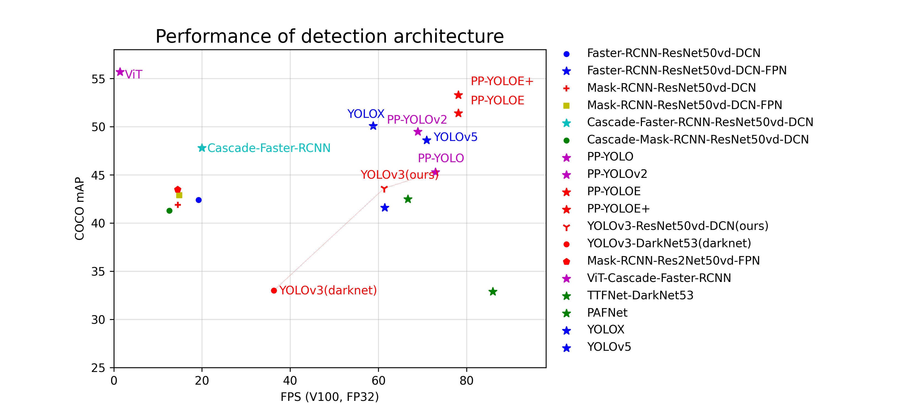

简体中文 | [English](README_en.md)

<div align="center">
<p align="center">
  
</p>

**飞桨目标检测开发套件，端到端地完成从训练到部署的全流程目标检测应用。**

[](https://travis-ci.org/PaddlePaddle/PaddleSeg)
[](LICENSE)
[](https://github.com/PaddlePaddle/PaddleSeg/releases)


</div>

## 产品动态 

- 2022.3.24：PaddleDetection发布[release/2.4版本](https://github.com/PaddlePaddle/PaddleDetection/tree/release/2.4)
	- 发布高精度云边一体SOTA目标检测模型[PP-YOLOE](config/ppyoloe)，全系列多尺度模型，满足不同硬件算力需求，可适配服务器、边缘端GPU及其他服务器端AI加速卡。
    - 发布边缘端和CPU端超轻量SOTA目标检测模型[PP-PicoDet增强版](configs/picodet),提供模型稀疏化和量化功能，便于模型加速，各类硬件无需单独开发后处理模块，降低部署门槛。
    - 发布实时行人分析工具[PP-Human](deploy/pphuman),支持行人跟踪、人流量统计、人体属性识别与摔倒检测四大能力，基于真实场景数据特殊优化，精准识别各类摔倒姿势，适应不同环境背景、光线及摄像角度。
    - 
- 2021.11.03: PaddleDetection发布[release/2.3版本](https://github.com/PaddlePaddle/PaddleDetection/tree/release/2.3)
  - 发布轻量级检测特色模型⚡[PP-PicoDet](configs/picodet)，0.99m的参数量可实现精度30+mAP、速度150FPS。
  
  - 发布轻量级关键点特色模型⚡[PP-TinyPose](configs/keypoint/tiny_pose)，单人场景FP16推理可达122FPS、51.8AP，具有精度高速度快、检测人数无限制、微小目标效果好的优势。
  
  - 发布实时跟踪系统[PP-Tracking](deploy/pptracking)，覆盖单、多镜头下行人、车辆、多类别跟踪，对小目标、密集型特殊优化，提供人、车流量技术解决方案。
  
  - 新增[Swin Transformer](configs/faster_rcnn)，[TOOD](configs/tood)，[GFL](configs/gfl)目标检测模型。
  
  - 发布[Sniper](configs/sniper)小目标检测优化模型，发布针对EdgeBoard优化[PP-YOLO-EB](configs/ppyolo)模型。
  
  - 新增轻量化关键点模型[Lite HRNet](configs/keypoint)关键点模型并支持Paddle Lite部署。
- 2021.08.10: PaddleDetection发布[release/2.2版本](https://github.com/PaddlePaddle/PaddleDetection/tree/release/2.2)
  - 发布Transformer检测系列模型，包括[DETR](configs/detr), [Deformable DETR](configs/deformable_detr), [Sparse RCNN](configs/sparse_rcnn)。
  - 新增Dark HRNet关键点模型和MPII数据集[关键点模型](configs/keypoint)
  - 新增[人头](configs/mot/headtracking21)、[车辆](configs/mot/vehicle)跟踪垂类模型。
- 2021.05.20: PaddleDetection发布[release/2.1版本](https://github.com/PaddlePaddle/PaddleDetection/tree/release/2.1)
  - 新增[关键点检测](configs/keypoint)，模型包括HigherHRNet，HRNet。
  - 新增[多目标跟踪](configs/mot)能力，模型包括DeepSORT，JDE，FairMOT。
  - 发布PPYOLO系列模型压缩模型，新增[ONNX模型导出教程](deploy/EXPORT_ONNX_MODEL.md)。

## 简介 

**PaddleDetection**为基于飞桨PaddlePaddle的端到端目标检测套件，内置**190+主流目标检测、实例分割、跟踪、关键点检测**算法，其中包括**服务器端和移动端高精度、轻量级**产业级SOTA模型、冠军方案和学术前沿算法，并提供配置化的网络模块组件、十余种数据增强策略和损失函数等高阶优化支持和多种部署方案，在打通数据处理、模型开发、训练、压缩、部署全流程的基础上，提供丰富的案例及教程，加速算法产业落地应用。

#### 提供目标检测、实例分割、多目标跟踪、关键点检测等多种能力

<div width="1000" align="center">
  
</div>

#### 应用场景覆盖工业、智慧城市、安防、交通、零售、医疗等十余种行业

<div  align="center">
  
</div>

## 特性 

- **模型丰富**: 包含**目标检测**、**实例分割**、**人脸检测**等**100+个预训练模型**，涵盖多种**全球竞赛冠军**方案。
- **使用简洁**：模块化设计，解耦各个网络组件，开发者轻松搭建、试用各种检测模型及优化策略，快速得到高性能、定制化的算法。
- **端到端打通**: 从数据增强、组网、训练、压缩、部署端到端打通，并完备支持**云端**/**边缘端**多架构、多设备部署。
- **高性能**: 基于飞桨的高性能内核，模型训练速度及显存占用优势明显。支持FP16训练, 支持多机训练。

## 技术交流 

- 如果你发现任何PaddleDetection存在的问题或者是建议, 欢迎通过[GitHub Issues](https://github.com/PaddlePaddle/PaddleDetection/issues)给我们提issues。

- 欢迎加入PaddleDetection QQ、微信（添加并回复小助手“检测”）用户群
  
  <div align="center">
    
    
  </div>

## 套件结构概览 

<table align="center">
  <tbody>
    <tr align="center" valign="bottom">
      <td>
        <b>Architectures</b>
      </td>
      <td>
        <b>Backbones</b>
      </td>
      <td>
        <b>Components</b>
      </td>
      <td>
        <b>Data Augmentation</b>
      </td>
    </tr>
    <tr valign="top">
      <td>
        <ul>
          <li><b>Object Detection</b></li>
          <ul>
            <li>Faster RCNN</li>
            <li>FPN</li>
            <li>Cascade-RCNN</li>
            <li>Libra RCNN</li>
            <li>Hybrid Task RCNN</li>
            <li>PSS-Det</li>
            <li>RetinaNet</li>
            <li>YOLOv3</li>
            <li>YOLOv4</li>  
            <li>PP-YOLOv1/v2</li>
            <li>PP-YOLO-Tiny</li>
            <li>SSD</li>
            <li>CornerNet-Squeeze</li>
            <li>FCOS</li>  
            <li>TTFNet</li>
            <li>PP-PicoDet</li>
            <li>DETR</li>
            <li>Deformable DETR</li>
            <li>Swin Transformer</li>
            <li>Sparse RCNN</li>
        </ul>
        <li><b>Instance Segmentation</b></li>
        <ul>
            <li>Mask RCNN</li>
            <li>SOLOv2</li>
        </ul>
        <li><b>Face Detection</b></li>
        <ul>
            <li>FaceBoxes</li>
            <li>BlazeFace</li>
            <li>BlazeFace-NAS</li>
        </ul>
        <li><b>Multi-Object-Tracking</b></li>
        <ul>
            <li>JDE</li>
            <li>FairMOT</li>
            <li>DeepSort</li>
        </ul>
        <li><b>KeyPoint-Detection</b></li>
        <ul>
            <li>HRNet</li>
            <li>HigherHRNet</li>
        </ul>
      </ul>
      </td>
      <td>
        <ul>
          <li>ResNet(&vd)</li>
          <li>ResNeXt(&vd)</li>
          <li>SENet</li>
          <li>Res2Net</li>
          <li>HRNet</li>
          <li>Hourglass</li>
          <li>CBNet</li>
          <li>GCNet</li>
          <li>DarkNet</li>
          <li>CSPDarkNet</li>
          <li>VGG</li>
          <li>MobileNetv1/v3</li>  
          <li>GhostNet</li>
          <li>Efficientnet</li>  
          <li>BlazeNet</li>  
        </ul>
      </td>
      <td>
        <ul><li><b>Common</b></li>
          <ul>
            <li>Sync-BN</li>
            <li>Group Norm</li>
            <li>DCNv2</li>
            <li>Non-local</li>
          </ul>  
        </ul>
        <ul><li><b>KeyPoint</b></li>
          <ul>
            <li>DarkPose</li>
          </ul>  
        </ul>
        <ul><li><b>FPN</b></li>
          <ul>
            <li>BiFPN</li>
            <li>BFP</li>  
            <li>HRFPN</li>
            <li>ACFPN</li>
          </ul>  
        </ul>  
        <ul><li><b>Loss</b></li>
          <ul>
            <li>Smooth-L1</li>
            <li>GIoU/DIoU/CIoU</li>  
            <li>IoUAware</li>
          </ul>  
        </ul>  
        <ul><li><b>Post-processing</b></li>
          <ul>
            <li>SoftNMS</li>
            <li>MatrixNMS</li>  
          </ul>  
        </ul>
        <ul><li><b>Speed</b></li>
          <ul>
            <li>FP16 training</li>
            <li>Multi-machine training </li>  
          </ul>  
        </ul>  
      </td>
      <td>
        <ul>
          <li>Resize</li>  
          <li>Lighting</li>  
          <li>Flipping</li>  
          <li>Expand</li>
          <li>Crop</li>
          <li>Color Distort</li>  
          <li>Random Erasing</li>  
          <li>Mixup </li>
          <li>Mosaic</li>
          <li>Cutmix </li>
          <li>Grid Mask</li>
          <li>Auto Augment</li>  
          <li>Random Perspective</li>  
        </ul>  
      </td>  
    </tr>

</td>
    </tr>
  </tbody>
</table>

## 模型性能概览 

各模型结构和骨干网络的代表模型在COCO数据集上精度mAP和单卡Tesla V100上预测速度(FPS)对比图。

<div align="center">
  
</div>

**说明：**

- `CBResNet`为`Cascade-Faster-RCNN-CBResNet200vd-FPN`模型，COCO数据集mAP高达53.3%
- `Cascade-Faster-RCNN`为`Cascade-Faster-RCNN-ResNet50vd-DCN`，PaddleDetection将其优化到COCO数据mAP为47.8%时推理速度为20FPS
- `PP-YOLO`在COCO数据集精度45.9%，Tesla V100预测速度72.9FPS，精度速度均优于[YOLOv4](https://arxiv.org/abs/2004.10934)
- `PP-YOLO v2`是对`PP-YOLO`模型的进一步优化，在COCO数据集精度49.5%，Tesla V100预测速度68.9FPS
- 图中模型均可在[模型库](#模型库)中获取

各移动端模型在COCO数据集上精度mAP和高通骁龙865处理器上预测速度(FPS)对比图。

<div align="center">
  
</div>

**说明：**

- 测试数据均使用高通骁龙865(4\*A77 + 4\*A55)处理器batch size为1, 开启4线程测试，测试使用NCNN预测库，测试脚本见[MobileDetBenchmark](https://github.com/JiweiMaster/MobileDetBenchmark)
- [PP-PicoDet](configs/picodet)及[PP-YOLO-Tiny](configs/ppyolo)为PaddleDetection自研模型，其余模型PaddleDetection暂未提供

## 文档教程 

### 入门教程

- [安装说明](docs/tutorials/INSTALL_cn.md)
- [数据准备](docs/tutorials/PrepareDataSet.md)
- [30分钟上手PaddleDetecion](docs/tutorials/GETTING_STARTED_cn.md)
- [FAQ/常见问题汇总](docs/tutorials/FAQ)

### 进阶教程

- 参数配置
  
  - [RCNN参数说明](docs/tutorials/config_annotation/faster_rcnn_r50_fpn_1x_coco_annotation.md)
  - [PP-YOLO参数说明](docs/tutorials/config_annotation/ppyolo_r50vd_dcn_1x_coco_annotation.md)

- 模型压缩(基于[PaddleSlim](https://github.com/PaddlePaddle/PaddleSlim))
  
  - [剪裁/量化/蒸馏教程](configs/slim)

- [推理部署](deploy/README.md)
  
  - [模型导出教程](deploy/EXPORT_MODEL.md)
  - [Paddle Inference部署](deploy/README.md)
    - [Python端推理部署](deploy/python)
    - [C++端推理部署](deploy/cpp)
  - [Paddle-Lite部署](deploy/lite)
  - [Paddle Serving部署](deploy/serving)
  - [ONNX模型导出](deploy/EXPORT_ONNX_MODEL.md)
  - [推理benchmark](deploy/BENCHMARK_INFER.md)

- 进阶开发
  
  - [数据处理模块](docs/advanced_tutorials/READER.md)
  - [新增检测模型](docs/advanced_tutorials/MODEL_TECHNICAL.md)

## 模型库 

| [通用检测](docs/MODEL_ZOO_cn.md)  | [PP-YOLO模型](configs/ppyolo/README_cn.md)、[PP-PicoDet模型](configs/picodet/README.md)、[增强版Anchor Free模型TTFNet](configs/ttfnet/README.md)、[移动端模型](static/configs/mobile/README.md)、[676类目标检测](static/docs/featured_model/LARGE_SCALE_DET_MODEL.md)、[两阶段实用模型PSS-Det](configs/rcnn_enhance/README.md)、[半监督知识蒸馏预训练检测模型](docs/feature_models/SSLD_PRETRAINED_MODEL.md) |
| ：----|：-----|
| **[关键点检测](configs/keypoint)**        | [PP-TinyPose](configs/keypoint/tiny_pose)、HigherHRNet、HRNet、LiteHRNet                                                                                                                                                                                                                                                                                          |
| **[多目标跟踪]((configs/mot/README.md))** | [PP-Tracking](deploy/pptracking/README_cn.md)、[DeepSORT](configs/mot/deepsort/README_cn.md)、[JDE](configs/mot/jde/README_cn.md)、[FairMOT](configs/mot/fairmot/README_cn.md)                                                                                                                                                                                    |
| **实例分割**                             | [SOLOv2](configs/solov2/README.md)                                                                                                                                                                                                                                                                                                                             |
| **旋转框检测**                            | [S2ANet](configs/dota/README.md)                                                                                                                                                                                                                                                                                                                               |
| **垂类预训练模型**                          | [行人检测](configs/pedestrian/README.md)、[车辆检测](configs/vehicle/README.md)、[人脸检测](configs/face_detection/README.md)                                                                                                                                                                                                                                                |
| **比赛冠军方案**                           | [Objects365 2019 Challenge夺冠模型](static/docs/featured_model/champion_model/CACascadeRCNN.md)、[Open Images 2019-Object Detction比赛最佳单模型](static/docs/featured_model/champion_model/OIDV5_BASELINE_MODEL.md)                                                                                                                                                       |

## 应用案例 

- [人像圣诞特效自动生成工具](static/application/christmas)
- [安卓健身APP](https://github.com/zhiboniu/pose_demo_android)

## 第三方教程推荐 

- [PaddleDetection在Windows下的部署(一)](https://zhuanlan.zhihu.com/p/268657833)
- [PaddleDetection在Windows下的部署(二)](https://zhuanlan.zhihu.com/p/280206376)
- [Jetson Nano上部署PaddleDetection经验分享](https://zhuanlan.zhihu.com/p/319371293)
- [安全帽检测YOLOv3模型在树莓派上的部署](https://github.com/PaddleCV-FAQ/PaddleDetection-FAQ/blob/main/Lite%E9%83%A8%E7%BD%B2/yolov3_for_raspi.md)
- [使用SSD-MobileNetv1完成一个项目--准备数据集到完成树莓派部署](https://github.com/PaddleCV-FAQ/PaddleDetection-FAQ/blob/main/Lite%E9%83%A8%E7%BD%B2/ssd_mobilenet_v1_for_raspi.md)

## 版本更新 

版本更新内容请参考[版本更新文档](docs/CHANGELOG.md)

## 许可证书 

本项目的发布受[Apache 2.0 license](LICENSE)许可认证。

## 贡献代码 

我们非常欢迎你可以为PaddleDetection提供代码，也十分感谢你的反馈。

- 感谢[Mandroide](https://github.com/Mandroide)清理代码并且统一部分函数接口。
- 感谢[FL77N](https://github.com/FL77N/)贡献`Sparse-RCNN`模型。
- 感谢[Chen-Song](https://github.com/Chen-Song)贡献`Swin Faster-RCNN`模型。
- 感谢[yangyudong](https://github.com/yangyudong2020), [hchhtc123](https://github.com/hchhtc123) 开发PP-Tracking GUI界面
- 感谢[Shigure19](https://github.com/Shigure19) 开发PP-TinyPose健身APP

## 引用 

```
@misc{ppdet2019,
title={PaddleDetection, Object detection and instance segmentation toolkit based on PaddlePaddle.},
author={PaddlePaddle Authors},
howpublished = {\url{https://github.com/PaddlePaddle/PaddleDetection}},
year={2019}
}
```
