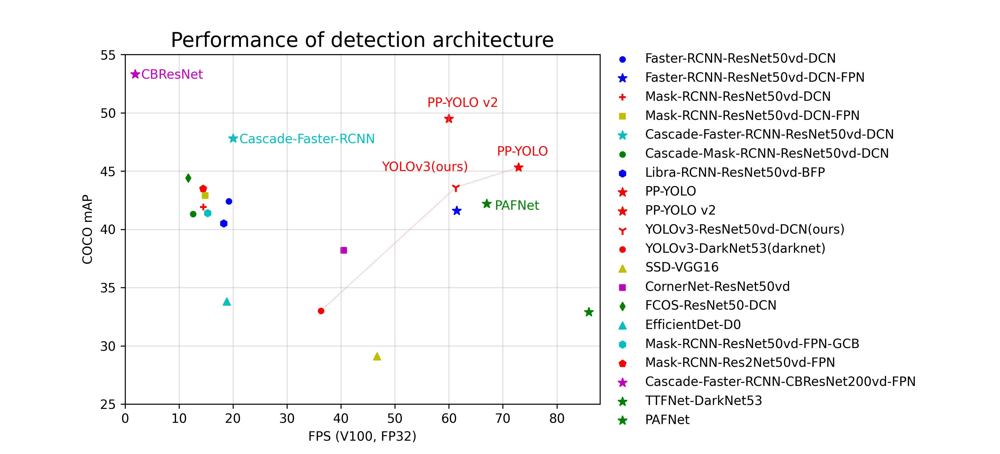
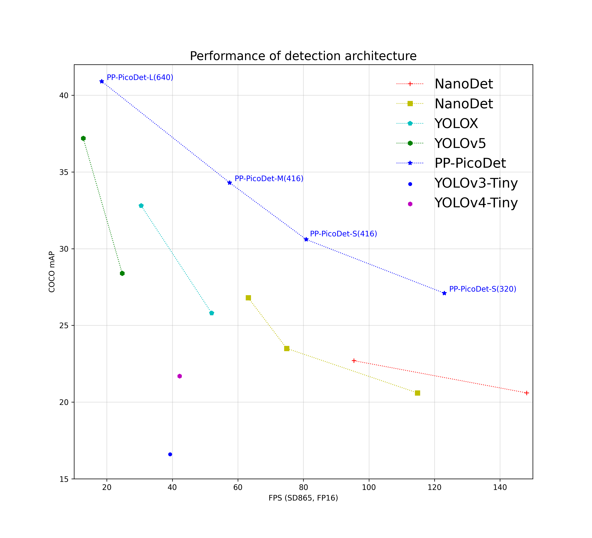

[简体中文](README_cn.md) | English

<div align="center">
<p align="center">
  
</p>

**A High-Efficient Development Toolkit for Object Detection based on [PaddlePaddle](https://github.com/paddlepaddle/paddle)**

<p align="center">
    <a href="./LICENSE"></a>
    <a href="https://github.com/PaddlePaddle/PaddleDetection/releases"></a>
    <a href=""></a>
    <a href=""></a>
    <a href="https://github.com/PaddlePaddle/PaddleDetection/stargazers"></a>
</p>
</div>

<div  align="center">
  

</div>

##  Product Update

- 🔥 **2022.11.15：SOTA rotated object detector and small object detector based on PP-YOLOE**
  - Rotated object detector [PP-YOLOE-R](configs/rotate/ppyoloe_r)
    - SOTA Anchor-free rotated object detection model with high accuracy and efficiency
    - A series of models, named s/m/l/x, for cloud and edge devices
    - Avoiding using special operators to be deployed friendly with TensorRT.
  - Small object detector [PP-YOLOE-SOD](configs/smalldet)
    - End-to-end detection pipeline based on sliced images
    - SOTA model on VisDrone based on original images.

- 2022.8.26：PaddleDetection releases[release/2.5 version](https://github.com/PaddlePaddle/PaddleDetection/tree/release/2.5)

  - 🗳 Model features：

    - Release [PP-YOLOE+](configs/ppyoloe): Increased accuracy by a maximum of 2.4% mAP to 54.9% mAP, 3.75 times faster model training convergence rate, and up to 2.3 times faster end-to-end inference speed; improved generalization for multiple downstream tasks
    - Release [PicoDet-NPU](configs/picodet) model which supports full quantization deployment of models; add [PicoDet](configs/picodet) layout analysis model
    - Release [PP-TinyPose Plus](./configs/keypoint/tiny_pose/). With 9.1% AP accuracy improvement in physical exercise, dance, and other scenarios, our PP-TinyPose Plus supports unconventional movements such as turning to one side, lying down, jumping, and high lifts

  - 🔮 Functions in different scenarios

    - Release the pedestrian analysis tool [PP-Human v2](./deploy/pipeline). It introduces four new behavior recognition: fighting, telephoning, smoking, and trespassing. The underlying algorithm performance is optimized, covering three core algorithm capabilities: detection, tracking, and attributes of pedestrians. Our model provides end-to-end development and model optimization strategies for beginners and supports online video streaming input.
    - First release [PP-Vehicle](./deploy/pipeline), which has four major functions: license plate recognition, vehicle attribute analysis (color, model), traffic flow statistics, and violation detection. It is compatible with input formats, including pictures, online video streaming, and video. And we also offer our users a comprehensive set of tutorials for customization.

  - 💡 Cutting-edge algorithms：

    - Release [PaddleYOLO](https://github.com/PaddlePaddle/PaddleYOLO) which overs classic and latest models of [YOLO family](https://github.com/PaddlePaddle/PaddleYOLO/tree/develop/docs/MODEL_ZOO_en.md): YOLOv3, PP-YOLOE (a real-time high-precision object detection model developed by Baidu PaddlePaddle), and cutting-edge detection algorithms such as YOLOv4, YOLOv5, YOLOX, YOLOv6, YOLOv7 and YOLOv8
    - Newly add high precision detection model based on [ViT](configs/vitdet) backbone network, with a 55.7% mAP accuracy on COCO dataset; newly add multi-object tracking model [OC-SORT](configs/mot/ocsort); newly add [ConvNeXt](configs/convnext) backbone network.

  - 📋 Industrial applications: Newly add [Smart Fitness](https://aistudio.baidu.com/aistudio/projectdetail/4385813), [Fighting recognition](https://aistudio.baidu.com/aistudio/projectdetail/4086987?channelType=0&channel=0),[ and Visitor Analysis](https://aistudio.baidu.com/aistudio/projectdetail/4230123?channelType=0&channel=0).

- 2022.3.24：PaddleDetection released[release/2.4 version](https://github.com/PaddlePaddle/PaddleDetection/tree/release/2.4)  
  - Release high-performanace SOTA object detection model [PP-YOLOE](configs/ppyoloe). It integrates cloud and edge devices and provides S/M/L/X versions. In particular, Verson L has the accuracy as 51.4% on COCO test 2017 dataset, inference speed as 78.1 FPS on a single Test V100. It supports mixed precision training, 33% faster than PP-YOLOv2. Its full range of multi-sized models can meet different hardware arithmetic requirements, and adaptable to server, edge-device GPU and other AI accelerator cards on servers.
  - Release ultra-lightweight SOTA object detection model [PP-PicoDet Plus](configs/picodet) with 2% improvement in accuracy and 63% improvement in CPU inference speed. Add PicoDet-XS model with a 0.7M parameter, providing model sparsification and quantization functions for model acceleration. No specific post processing module is required for all the hardware, simplifying the deployment.  
  - Release the real-time pedestrian analysis tool [PP-Human](deploy/pphuman). It has four major functions: pedestrian tracking, visitor flow statistics, human attribute recognition and falling detection. For falling detection, it is optimized based on real-life data with accurate recognition of various types of falling posture. It can adapt to different environmental background, light and camera angle.
  - Add [YOLOX](configs/yolox) object detection model with nano/tiny/S/M/L/X. X version has the accuracy as 51.8% on COCO  Val2017 dataset.

- [More releases](https://github.com/PaddlePaddle/PaddleDetection/releases)

##  Brief Introduction

**PaddleDetection** is an end-to-end object detection development kit based on PaddlePaddle. Providing **over 30 model algorithm** and **over 300 pre-trained models**, it covers object detection, instance segmentation, keypoint detection, multi-object tracking. In particular, PaddleDetection offers **high- performance & light-weight** industrial SOTA models on **servers and mobile** devices, champion solution and cutting-edge algorithm. PaddleDetection provides various data augmentation methods, configurable network components, loss functions and other advanced optimization & deployment schemes. In addition to running through the whole process of data processing, model development, training, compression and deployment, PaddlePaddle also provides rich cases and tutorials to accelerate the industrial application of algorithm.

<div  align="center">
  
</div>

##  Features

- **Rich model library**: PaddleDetection provides over 250 pre-trained models including **object detection, instance segmentation, face recognition, multi-object tracking**. It covers a variety of **global competition champion** schemes.
- **Simple to use**: Modular design, decoupling each network component, easy for developers to build and try various detection models and optimization strategies, quick access to high-performance, customized algorithm.
- **Getting Through End to End**: PaddlePaddle gets through end to end from data augmentation, constructing models, training, compression, depolyment. It also supports multi-architecture, multi-device deployment for **cloud and edge** device.
- **High Performance**: Due to the high performance core, PaddlePaddle has clear advantages in training speed and memory occupation. It also supports FP16 training and multi-machine training.

<div  align="center">
  
</div>

##  Exchanges

- If you have any question or suggestion, please give us your valuable input via [GitHub Issues](https://github.com/PaddlePaddle/PaddleDetection/issues)

  Welcome to join PaddleDetection user groups on WeChat (scan the QR code, add and reply "D" to the assistant)

  <div align="center">
    
  </div>

##  Kit Structure

<table align="center">
  <tbody>
    <tr align="center" valign="bottom">
      <td>
        <b>Architectures</b>
      </td>
      <td>
        <b>Backbones</b>
      </td>
      <td>
        <b>Components</b>
      </td>
      <td>
        <b>Data Augmentation</b>
      </td>
    </tr>
    <tr valign="top">
      <td>
        <ul>
        <details><summary><b>Object Detection</b></summary>
          <ul>
            <li>Faster RCNN</li>
            <li>FPN</li>
            <li>Cascade-RCNN</li>
            <li>PSS-Det</li>
            <li>RetinaNet</li>
            <li>YOLOv3</li>  
            <li>YOLOF</li>  
            <li>YOLOX</li>  
            <li>YOLOv5</li>  
            <li>YOLOv6</li>  
            <li>YOLOv7</li>  
            <li>YOLOv8</li>  
            <li>RTMDet</li>  
            <li>PP-YOLO</li>
            <li>PP-YOLO-Tiny</li>
            <li>PP-PicoDet</li>
            <li>PP-YOLOv2</li>
            <li>PP-YOLOE</li>
            <li>PP-YOLOE+</li>
            <li>PP-YOLOE-SOD</li>
            <li>PP-YOLOE-R</li>
            <li>SSD</li>
            <li>CenterNet</li>
            <li>FCOS</li>  
            <li>FCOSR</li>  
            <li>TTFNet</li>
            <li>TOOD</li>
            <li>GFL</li>
            <li>GFLv2</li>
            <li>DETR</li>
            <li>Deformable DETR</li>
            <li>Swin Transformer</li>
            <li>Sparse RCNN</li>
         </ul></details>
        <details><summary><b>Instance Segmentation</b></summary>
         <ul>
            <li>Mask RCNN</li>
            <li>Cascade Mask RCNN</li>
            <li>SOLOv2</li>
        </ul></details>
        <details><summary><b>Face Detection</b></summary>
        <ul>
            <li>BlazeFace</li>
        </ul></details>
        <details><summary><b>Multi-Object-Tracking</b></summary>
        <ul>
            <li>JDE</li>
            <li>FairMOT</li>
            <li>DeepSORT</li>
            <li>ByteTrack</li>
            <li>OC-SORT</li>
            <li>BoT-SORT</li>
            <li>CenterTrack</li>
        </ul></details>
        <details><summary><b>KeyPoint-Detection</b></summary>
        <ul>
            <li>HRNet</li>
            <li>HigherHRNet</li>
            <li>Lite-HRNet</li>
            <li>PP-TinyPose</li>
        </ul></details>
      </ul>
      </td>
      <td>
        <details><summary><b>Details</b></summary>
        <ul>
          <li>ResNet(&vd)</li>
          <li>Res2Net(&vd)</li>
          <li>CSPResNet</li>
          <li>SENet</li>
          <li>Res2Net</li>
          <li>HRNet</li>
          <li>Lite-HRNet</li>
          <li>DarkNet</li>
          <li>CSPDarkNet</li>
          <li>MobileNetv1/v3</li>  
          <li>ShuffleNet</li>
          <li>GhostNet</li>
          <li>BlazeNet</li>
          <li>DLA</li>
          <li>HardNet</li>
          <li>LCNet</li>  
          <li>ESNet</li>  
          <li>Swin-Transformer</li>
          <li>ConvNeXt</li>
          <li>Vision Transformer</li>
        </ul></details>
      </td>
      <td>
        <details><summary><b>Common</b></summary>
          <ul>
            <li>Sync-BN</li>
            <li>Group Norm</li>
            <li>DCNv2</li>
            <li>EMA</li>
          </ul> </details>
        </ul>
        <details><summary><b>KeyPoint</b></summary>
          <ul>
            <li>DarkPose</li>
          </ul></details>
        </ul>
        <details><summary><b>FPN</b></summary>
          <ul>
            <li>BiFPN</li>
            <li>CSP-PAN</li>
            <li>Custom-PAN</li>
            <li>ES-PAN</li>
            <li>HRFPN</li>
          </ul> </details>
        </ul>  
        <details><summary><b>Loss</b></summary>
          <ul>
            <li>Smooth-L1</li>
            <li>GIoU/DIoU/CIoU</li>  
            <li>IoUAware</li>
            <li>Focal Loss</li>
            <li>CT Focal Loss</li>
            <li>VariFocal Loss</li>
          </ul> </details>
        </ul>  
        <details><summary><b>Post-processing</b></summary>
          <ul>
            <li>SoftNMS</li>
            <li>MatrixNMS</li>  
          </ul> </details>  
        </ul>
        <details><summary><b>Speed</b></summary>
          <ul>
            <li>FP16 training</li>
            <li>Multi-machine training </li>  
          </ul> </details>  
        </ul>  
      </td>
      <td>
        <details><summary><b>Details</b></summary>
        <ul>
          <li>Resize</li>  
          <li>Lighting</li>  
          <li>Flipping</li>  
          <li>Expand</li>
          <li>Crop</li>
          <li>Color Distort</li>  
          <li>Random Erasing</li>  
          <li>Mixup </li>
          <li>AugmentHSV</li>
          <li>Mosaic</li>
          <li>Cutmix </li>
          <li>Grid Mask</li>
          <li>Auto Augment</li>  
          <li>Random Perspective</li>  
        </ul> </details>  
      </td>  
    </tr>

</td>
    </tr>
  </tbody>
</table>

##  Model Performance

<details>
<summary><b> Performance comparison of Cloud models</b></summary>

The comparison between COCO mAP and FPS on Tesla V100 of representative models of each architectures and backbones.

<div align="center">
  
</div>

**Clarification：**

- `ViT` stands for `ViT-Cascade-Faster-RCNN`, which has highest mAP on COCO as 55.7%
- `Cascade-Faster-RCNN`stands for `Cascade-Faster-RCNN-ResNet50vd-DCN`, which has been optimized to 20 FPS inference speed when COCO mAP as 47.8% in PaddleDetection models
- `PP-YOLOE` are optimized `PP-YOLO v2`. It reached accuracy as 51.4% on COCO dataset, inference speed as 78.1 FPS on Tesla V100
- `PP-YOLOE+` are optimized `PP-YOLOE`. It reached accuracy as 53.3% on COCO dataset, inference speed as 78.1 FPS on Tesla V100
- The models in the figure are available in the[ model library](#模型库)

</details>

<details>
<summary><b> Performance omparison on mobiles</b></summary>

The comparison between COCO mAP and FPS on Qualcomm Snapdragon 865 processor of models on mobile devices.

<div align="center">
  
</div>

**Clarification：**

- Tests were conducted on Qualcomm Snapdragon 865 (4 \*A77 + 4 \*A55) batch_size=1, 4 thread, and NCNN inference library, test script see [MobileDetBenchmark](https://github.com/JiweiMaster/MobileDetBenchmark)
- [PP-PicoDet](configs/picodet) and [PP-YOLO-Tiny](configs/ppyolo) are self-developed models of PaddleDetection, and other models are not tested yet.

</details>

##  Model libraries

<details>
<summary><b> 1. General detection</b></summary>

#### PP-YOLOE series Recommended scenarios: Cloud GPU such as Nvidia V100, T4 and edge devices such as Jetson series

| Model      | COCO Accuracy（mAP） | V100 TensorRT FP16 Speed(FPS) | Configuration                                           | Download                                                                                 |
|:---------- |:------------------:|:-----------------------------:|:-------------------------------------------------------:|:----------------------------------------------------------------------------------------:|
| PP-YOLOE+_s | 43.9        | 333.3                     | [link](configs/ppyoloe/ppyoloe_plus_crn_s_80e_coco.yml)     | [download](https://paddledet.bj.bcebos.com/models/ppyoloe_plus_crn_s_80e_coco.pdparams)      |
| PP-YOLOE+_m | 50.0        | 208.3                     | [link](configs/ppyoloe/ppyoloe_plus_crn_m_80e_coco.yml)     | [download](https://paddledet.bj.bcebos.com/models/ppyoloe_plus_crn_m_80e_coco.pdparams)     |
| PP-YOLOE+_l | 53.3        | 149.2                     | [link](configs/ppyoloe/ppyoloe_plus_crn_l_80e_coco.yml) | [download](https://paddledet.bj.bcebos.com/models/ppyoloe_plus_crn_l_80e_coco.pdparams) |
| PP-YOLOE+_x | 54.9        | 95.2                      | [link](configs/ppyoloe/ppyoloe_plus_crn_x_80e_coco.yml) | [download](https://paddledet.bj.bcebos.com/models/ppyoloe_plus_crn_x_80e_coco.pdparams) |

#### PP-PicoDet series Recommended scenarios: Mobile chips and x86 CPU devices, such as ARM CPU(RK3399, Raspberry Pi) and NPU(BITMAIN)

| Model      | COCO Accuracy（mAP） | Snapdragon 865 four-thread speed (ms) | Configuration                                         | Download                                                                              |
|:---------- |:------------------:|:-------------------------------------:|:-----------------------------------------------------:|:-------------------------------------------------------------------------------------:|
| PicoDet-XS | 23.5               | 7.81                                  | [Link](configs/picodet/picodet_xs_320_coco_lcnet.yml) | [Download](https://paddledet.bj.bcebos.com/models/picodet_xs_320_coco_lcnet.pdparams) |
| PicoDet-S  | 29.1               | 9.56                                  | [Link](configs/picodet/picodet_s_320_coco_lcnet.yml)  | [Download](https://paddledet.bj.bcebos.com/models/picodet_s_320_coco_lcnet.pdparams)  |
| PicoDet-M  | 34.4               | 17.68                                 | [Link](configs/picodet/picodet_m_320_coco_lcnet.yml)  | [Download](https://paddledet.bj.bcebos.com/models/picodet_m_320_coco_lcnet.pdparams)  |
| PicoDet-L  | 36.1               | 25.21                                 | [Link](configs/picodet/picodet_l_320_coco_lcnet.yml)  | [Download](https://paddledet.bj.bcebos.com/models/picodet_l_320_coco_lcnet.pdparams)  |

#### [Frontier detection algorithm](docs/feature_models/PaddleYOLO_MODEL.md)

| Model    | COCO Accuracy（mAP） | V100 TensorRT FP16 speed(FPS) | Configuration                                                                                                  | Download                                                                       |
|:-------- |:------------------:|:-----------------------------:|:--------------------------------------------------------------------------------------------------------------:|:------------------------------------------------------------------------------:|
| [YOLOX-l](configs/yolox)  | 50.1               | 107.5                         | [Link](configs/yolox/yolox_l_300e_coco.yml)                                                                    | [Download](https://paddledet.bj.bcebos.com/models/yolox_l_300e_coco.pdparams)  |
| [YOLOv5-l](https://github.com/PaddlePaddle/PaddleYOLO/tree/develop/configs/yolov5) | 48.6               | 136.0                         | [Link](https://github.com/PaddlePaddle/PaddleYOLO/tree/develop/configs/yolov5/yolov5_l_300e_coco.yml) | [Download](https://paddledet.bj.bcebos.com/models/yolov5_l_300e_coco.pdparams) |
| [YOLOv7-l](https://github.com/PaddlePaddle/PaddleYOLO/tree/develop/configs/yolov7) | 51.0        | 135.0                     | [链接](https://github.com/PaddlePaddle/PaddleYOLO/tree/develop/configs/yolov7/yolov7_l_300e_coco.yml) | [下载地址](https://paddledet.bj.bcebos.com/models/yolov7_l_300e_coco.pdparams) |

#### Other general purpose models [doc](docs/MODEL_ZOO_en.md)

</details>

<details>
<summary><b> 2. Instance segmentation</b></summary>

| Model             | Introduction                                             | Recommended Scenarios                         | COCO Accuracy(mAP)               | Configuration                                                           | Download                                                                                              |
|:----------------- |:-------------------------------------------------------- |:--------------------------------------------- |:--------------------------------:|:-----------------------------------------------------------------------:|:-----------------------------------------------------------------------------------------------------:|
| Mask RCNN         | Two-stage instance segmentation algorithm                | <div style="width: 50pt">Edge-Cloud end</div> | box AP: 41.4 <br/> mask AP: 37.5 | [Link](configs/mask_rcnn/mask_rcnn_r50_vd_fpn_2x_coco.yml)              | [Download](https://paddledet.bj.bcebos.com/models/mask_rcnn_r50_vd_fpn_2x_coco.pdparams)              |
| Cascade Mask RCNN | Two-stage instance segmentation algorithm                | <div style="width: 50pt">Edge-Cloud end</div> | box AP: 45.7 <br/> mask AP: 39.7 | [Link](configs/mask_rcnn/cascade_mask_rcnn_r50_vd_fpn_ssld_2x_coco.yml) | [Download](https://paddledet.bj.bcebos.com/models/cascade_mask_rcnn_r50_vd_fpn_ssld_2x_coco.pdparams) |
| SOLOv2            | Lightweight single-stage instance segmentation algorithm | <div style="width: 50pt">Edge-Cloud end</div> | mask AP: 38.0                    | [Link](configs/solov2/solov2_r50_fpn_3x_coco.yml)                       | [Download](https://paddledet.bj.bcebos.com/models/solov2_r50_fpn_3x_coco.pdparams)                    |

</details>

<details>
<summary><b> 3. Keypoint detection</b></summary>

| Model                | Introduction                                                                                  | Recommended scenarios                         | COCO Accuracy（AP） | Speed                             | Configuration                                             | Download                                                                                    |
|:-------------------- |:--------------------------------------------------------------------------------------------- |:--------------------------------------------- |:-----------------:|:---------------------------------:|:---------------------------------------------------------:|:-------------------------------------------------------------------------------------------:|
| HRNet-w32 + DarkPose | <div style="width: 130pt">Top-down Keypoint detection algorithm<br/>Input size: 384x288</div> | <div style="width: 50pt">Edge-Cloud end</div> | 78.3              | T4 TensorRT FP16 2.96ms           | [Link](configs/keypoint/hrnet/dark_hrnet_w32_384x288.yml) | [Download](https://paddledet.bj.bcebos.com/models/keypoint/dark_hrnet_w32_384x288.pdparams) |
| HRNet-w32 + DarkPose | Top-down Keypoint detection algorithm<br/>Input size: 256x192                                 | Edge-Cloud end                                | 78.0              | T4 TensorRT FP16 1.75ms           | [Link](configs/keypoint/hrnet/dark_hrnet_w32_256x192.yml) | [Download](https://paddledet.bj.bcebos.com/models/keypoint/dark_hrnet_w32_256x192.pdparams) |
| PP-TinyPose          | Light-weight keypoint algorithm<br/>Input size: 256x192                                       | Mobile                                        | 68.8              | Snapdragon 865 four-thread 6.30ms | [Link](configs/keypoint/tiny_pose/tinypose_256x192.yml)   | [Download](https://bj.bcebos.com/v1/paddledet/models/keypoint/tinypose_256x192.pdparams)    |
| PP-TinyPose          | Light-weight keypoint algorithm<br/>Input size: 128x96                                        | Mobile                                        | 58.1              | Snapdragon 865 four-thread 2.37ms | [Link](configs/keypoint/tiny_pose/tinypose_128x96.yml)    | [Download](https://bj.bcebos.com/v1/paddledet/models/keypoint/tinypose_128x96.pdparams)     |

#### Other keypoint detection models [doc](configs/keypoint)

</details>

<details>
<summary><b> 4. Multi-object tracking PP-Tracking</b></summary>

| Model     | Introduction                                                  | Recommended scenarios | Accuracy               | Configuration                                                           | Download                                                                                              |
|:--------- |:------------------------------------------------------------- |:--------------------- |:----------------------:|:-----------------------------------------------------------------------:|:-----------------------------------------------------------------------------------------------------:|
| ByteTrack | SDE Multi-object tracking algorithm with detection model only | Edge-Cloud end        | MOT-17 half val:  77.3 | [Link](configs/mot/bytetrack/detector/yolox_x_24e_800x1440_mix_det.yml) | [Download](https://paddledet.bj.bcebos.com/models/mot/deepsort/yolox_x_24e_800x1440_mix_det.pdparams) |
| FairMOT   | JDE multi-object tracking algorithm multi-task learning       | Edge-Cloud end        | MOT-16 test: 75.0      | [Link](configs/mot/fairmot/fairmot_dla34_30e_1088x608.yml)              | [Download](https://paddledet.bj.bcebos.com/models/mot/fairmot_dla34_30e_1088x608.pdparams)            |
| OC-SORT   | SDE multi-object tracking algorithm with detection model only       | Edge-Cloud end        | MOT-16 half val: 75.5      | [Link](configs/mot/ocsort/ocsort_yolox.yml)              | -            |

#### Other multi-object tracking models [docs](configs/mot)

</details>

<details>
<summary><b> 5. Industrial real-time pedestrain analysis tool-PP Human</b></summary>

| Task                                   | End-to-End Speed（ms） | Model                                                                                                                                                                                                                                                                                                                           | Size                                                                                                   |
|:--------------------------------------:|:--------------------:|:-------------------------------------------------------------------------------------------------------------------------------------------------------------------------------------------------------------------------------------------------------------------------------------------------------------------------------:|:------------------------------------------------------------------------------------------------------:|
| Pedestrian detection (high precision)  | 25.1ms               | [Multi-object tracking](https://bj.bcebos.com/v1/paddledet/models/pipeline/mot_ppyoloe_l_36e_pipeline.zip)                                                                                                                                                                                                                      | 182M                                                                                                   |
| Pedestrian detection (lightweight)     | 16.2ms               | [Multi-object tracking](https://bj.bcebos.com/v1/paddledet/models/pipeline/mot_ppyoloe_s_36e_pipeline.zip)                                                                                                                                                                                                                      | 27M                                                                                                    |
| Pedestrian tracking (high precision)   | 31.8ms               | [Multi-object tracking](https://bj.bcebos.com/v1/paddledet/models/pipeline/mot_ppyoloe_l_36e_pipeline.zip)                                                                                                                                                                                                                      | 182M                                                                                                   |
| Pedestrian tracking (lightweight)      | 21.0ms               | [Multi-object tracking](https://bj.bcebos.com/v1/paddledet/models/pipeline/mot_ppyoloe_s_36e_pipeline.zip)                                                                                                                                                                                                                      | 27M                                                                                                    |
| Attribute recognition (high precision) | Single person8.5ms   | [Object detection](https://bj.bcebos.com/v1/paddledet/models/pipeline/mot_ppyoloe_l_36e_pipeline.zip)<br> [Attribute recognition](https://bj.bcebos.com/v1/paddledet/models/pipeline/strongbaseline_r50_30e_pa100k.zip)                                                                                                         | Object detection：182M<br>Attribute recognition：86M                                                     |
| Attribute recognition (lightweight)    | Single person 7.1ms  | [Object detection](https://bj.bcebos.com/v1/paddledet/models/pipeline/mot_ppyoloe_l_36e_pipeline.zip)<br> [Attribute recognition](https://bj.bcebos.com/v1/paddledet/models/pipeline/strongbaseline_r50_30e_pa100k.zip)                                                                                                         | Object detection：182M<br>Attribute recognition：86M                                                     |
| Falling detection                      | Single person 10ms   | [Multi-object tracking](https://bj.bcebos.com/v1/paddledet/models/pipeline/mot_ppyoloe_l_36e_pipeline.zip) <br> [Keypoint detection](https://bj.bcebos.com/v1/paddledet/models/pipeline/dark_hrnet_w32_256x192.zip) <br> [Behavior detection based on key points](https://bj.bcebos.com/v1/paddledet/models/pipeline/STGCN.zip) | Multi-object tracking：182M<br>Keypoint detection：101M<br>Behavior detection based on key points: 21.8M |
| Intrusion detection                    | 31.8ms               | [Multi-object tracking](https://bj.bcebos.com/v1/paddledet/models/pipeline/mot_ppyoloe_l_36e_pipeline.zip)                                                                                                                                                                                                                      | 182M                                                                                                   |
| Fighting detection                     | 19.7ms               | [Video classification](https://bj.bcebos.com/v1/paddledet/models/pipeline/mot_ppyoloe_l_36e_pipeline.zip)                                                                                                                                                                                                                       | 90M                                                                                                    |
| Smoking detection                      | Single person 15.1ms | [Object detection](https://bj.bcebos.com/v1/paddledet/models/pipeline/mot_ppyoloe_l_36e_pipeline.zip)<br>[Object detection based on Human Id](https://bj.bcebos.com/v1/paddledet/models/pipeline/ppyoloe_crn_s_80e_smoking_visdrone.zip)                                                                                        | Object detection：182M<br>Object detection based on Human ID: 27M                                       |
| Phoning detection                      | Single person ms     | [Object detection](https://bj.bcebos.com/v1/paddledet/models/pipeline/mot_ppyoloe_l_36e_pipeline.zip)<br>[Image classification based on Human ID](https://bj.bcebos.com/v1/paddledet/models/pipeline/PPHGNet_tiny_calling_halfbody.zip)                                                                                         | Object detection：182M<br>Image classification based on Human ID：45M                                    |

Please refer to [docs](deploy/pipeline/README_en.md) for details.

</details>

<details>
<summary><b> 6. Industrial real-time vehicle analysis tool-PP Vehicle</b></summary>

| Task                                   | End-to-End Speed（ms） | Model                                                                                                                                                                                                                                                                                                                           | Size                                                                                                   |
|:--------------------------------------:|:--------------------:|:-------------------------------------------------------------------------------------------------------------------------------------------------------------------------------------------------------------------------------------------------------------------------------------------------------------------------------:|:------------------------------------------------------------------------------------------------------:|
| Vehicle detection (high precision)  | 25.7ms               | [object detection](https://bj.bcebos.com/v1/paddledet/models/pipeline/mot_ppyoloe_l_36e_ppvehicle.zip)                                                                                                                                                                                                                      | 182M                                                                                                   |
| Vehicle detection (lightweight)     | 13.2ms               | [object detection](https://bj.bcebos.com/v1/paddledet/models/pipeline/mot_ppyoloe_s_36e_ppvehicle.zip)                                                                                                                                                                                                                      | 27M                                                                                                    |
| Vehicle tracking (high precision)   | 40ms               | [multi-object tracking](https://bj.bcebos.com/v1/paddledet/models/pipeline/mot_ppyoloe_l_36e_ppvehicle.zip)                                                                                                                                                                                                                      | 182M                                                                                                   |
| Vehicle tracking (lightweight)      | 25ms               | [multi-object tracking](https://bj.bcebos.com/v1/paddledet/models/pipeline/mot_ppyoloe_s_36e_pipeline.zip)                                                                                                                                                                                                                      | 27M                                                                                                    |
| Plate Recognition                   | 4.68ms     | [plate detection](https://bj.bcebos.com/v1/paddledet/models/pipeline/ch_PP-OCRv3_det_infer.tar.gz)<br>[plate recognition](https://bj.bcebos.com/v1/paddledet/models/pipeline/ch_PP-OCRv3_rec_infer.tar.gz)                                                                                         | Plate detection：3.9M<br>Plate recognition：12M                                    |
| Vehicle attribute      | 7.31ms               | [attribute recognition](https://bj.bcebos.com/v1/paddledet/models/pipeline/vehicle_attribute_model.zip)                                                                                                                                                                                                                      | 7.2M                                                                                                    |

Please refer to [docs](deploy/pipeline/README_en.md) for details.

</details>


## Document tutorials

### Introductory tutorials

- [Installation](docs/tutorials/INSTALL_cn.md)
- [Quick start](docs/tutorials/QUICK_STARTED_cn.md)
- [Data preparation](docs/tutorials/data/README.md)
- [Geting Started on PaddleDetection](docs/tutorials/GETTING_STARTED_cn.md)
- [FAQ](docs/tutorials/FAQ)

### Advanced tutorials

- Configuration

  - [RCNN Configuration](docs/tutorials/config_annotation/faster_rcnn_r50_fpn_1x_coco_annotation.md)
  - [PP-YOLO Configuration](docs/tutorials/config_annotation/ppyolo_r50vd_dcn_1x_coco_annotation.md)

- Compression based on [PaddleSlim](https://github.com/PaddlePaddle/PaddleSlim)

  - [Pruning/Quantization/Distillation Tutorial](configs/slim)

- [Inference deployment](deploy/README.md)

  - [Export model for inference](deploy/EXPORT_MODEL.md)

  - [Paddle Inference deployment](deploy/README.md)

    - [Inference deployment with Python](deploy/python)
    - [Inference deployment with C++](deploy/cpp)

  - [Paddle-Lite deployment](deploy/lite)

  - [Paddle Serving deployment](deploy/serving)

  - [ONNX model export](deploy/EXPORT_ONNX_MODEL.md)

  - [Inference benchmark](deploy/BENCHMARK_INFER.md)

- Advanced development

  - [Data processing module](docs/advanced_tutorials/READER.md)
  - [New object detection models](docs/advanced_tutorials/MODEL_TECHNICAL.md)
  - Custumization
    - [Object detection](docs/advanced_tutorials/customization/detection.md)
    - [Keypoint detection](docs/advanced_tutorials/customization/keypoint_detection.md)
    - [Multiple object tracking](docs/advanced_tutorials/customization/pphuman_mot.md)
    - [Action recognition](docs/advanced_tutorials/customization/action_recognotion/)
    - [Attribute recognition](docs/advanced_tutorials/customization/pphuman_attribute.md)

### Courses

- **[Theoretical foundation] [Object detection 7-day camp](https://aistudio.baidu.com/aistudio/education/group/info/1617):** Overview of object detection tasks, details of RCNN series object detection algorithm and YOLO series object detection algorithm, PP-YOLO optimization strategy and case sharing, introduction and practice of AnchorFree series algorithm

- **[Industrial application] [AI Fast Track industrial object detection technology and application](https://aistudio.baidu.com/aistudio/education/group/info/23670):** Super object detection algorithms, real-time pedestrian analysis system PP-Human, breakdown and practice of object detection industrial application

- **[Industrial features] 2022.3.26** **[Smart City Industry Seven-Day Class](https://aistudio.baidu.com/aistudio/education/group/info/25620)** : Urban planning, Urban governance, Smart governance service, Traffic management, community governance.

- **[Academic exchange] 2022.9.27 [YOLO Vision Event](https://www.youtube.com/playlist?list=PL1FZnkj4ad1NHVC7CMc3pjSQ-JRK-Ev6O):** As the first YOLO-themed event, PaddleDetection was invited to communicate with the experts in the field of Computer Vision around the world.

### [Industrial tutorial examples](./industrial_tutorial/README.md)

- [Rotated object detection based on PP-YOLOE-R](https://aistudio.baidu.com/aistudio/projectdetail/5058293)

- [Aerial image detection based on PP-YOLOE-SOD](https://aistudio.baidu.com/aistudio/projectdetail/5036782)

- [Fall down recognition based on PP-Human v2](https://aistudio.baidu.com/aistudio/projectdetail/4606001)

- [Intelligent fitness recognition based on PP-TinyPose Plus](https://aistudio.baidu.com/aistudio/projectdetail/4385813)

- [Road litter detection based on PP-PicoDet Plus](https://aistudio.baidu.com/aistudio/projectdetail/3561097)

- [Visitor flow statistics based on FairMOT](https://aistudio.baidu.com/aistudio/projectdetail/2421822)

- [Guest analysis based on PP-Human](https://aistudio.baidu.com/aistudio/projectdetail/4537344)

- [More examples](./industrial_tutorial/README.md)

##  Applications

- [Fitness app on android mobile](https://github.com/zhiboniu/pose_demo_android)
- [PP-Tracking GUI Visualization Interface](https://github.com/yangyudong2020/PP-Tracking_GUi)

## Recommended third-party tutorials

- [Deployment of PaddleDetection for Windows I ](https://zhuanlan.zhihu.com/p/268657833)
- [Deployment of PaddleDetection for Windows II](https://zhuanlan.zhihu.com/p/280206376)
- [Deployment of PaddleDetection on Jestson Nano](https://zhuanlan.zhihu.com/p/319371293)
- [How to deploy YOLOv3 model on Raspberry Pi for Helmet detection](https://github.com/PaddleCV-FAQ/PaddleDetection-FAQ/blob/main/Lite%E9%83%A8%E7%BD%B2/yolov3_for_raspi.md)
- [Use SSD-MobileNetv1 for a project -- From dataset to deployment on Raspberry Pi](https://github.com/PaddleCV-FAQ/PaddleDetection-FAQ/blob/main/Lite%E9%83%A8%E7%BD%B2/ssd_mobilenet_v1_for_raspi.md)

##  Version updates

Please refer to the[ Release note ](https://github.com/PaddlePaddle/Paddle/wiki/PaddlePaddle-2.3.0-Release-Note-EN)for more details about the updates

##   License

PaddlePaddle is provided under the [Apache 2.0 license](LICENSE)

##  Contribute your code

We appreciate your contributions and your feedback！

- Thank [Mandroide](https://github.com/Mandroide) for code cleanup and
- Thank [FL77N](https://github.com/FL77N/) for `Sparse-RCNN`model
- Thank [Chen-Song](https://github.com/Chen-Song) for `Swin Faster-RCNN`model
- Thank [yangyudong](https://github.com/yangyudong2020), [hchhtc123](https://github.com/hchhtc123) for developing PP-Tracking GUI interface
- Thank Shigure19 for developing PP-TinyPose fitness APP
- Thank [manangoel99](https://github.com/manangoel99) for Wandb visualization methods

##  Quote

```
@misc{ppdet2019,
title={PaddleDetection, Object detection and instance segmentation toolkit based on PaddlePaddle.},
author={PaddlePaddle Authors},
howpublished = {\url{https://github.com/PaddlePaddle/PaddleDetection}},
year={2019}
}
```
