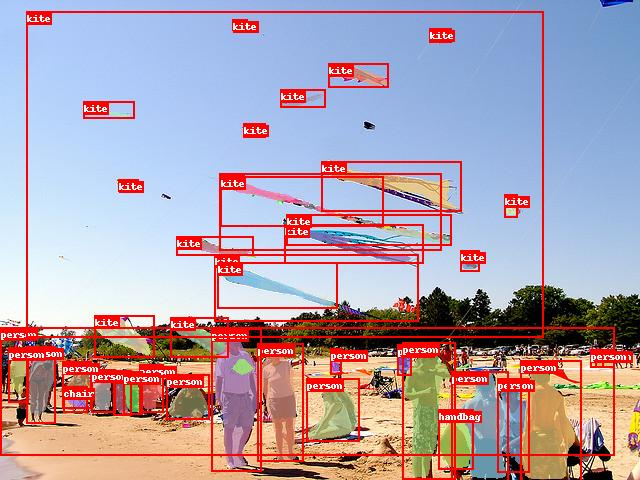

English | [简体中文](README.md)

# PaddleDetection

The goal of PaddleDetection is to provide easy access to a wide range of object
detection models in both industry and research settings. We design
PaddleDetection to be not only performant, production-ready but also highly
flexible, catering to research needs.

**Now all models in PaddleDetection require PaddlePaddle version 1.6 or higher, or suitable develop version.**

  

## Introduction

Features:

- Production Ready:

  Key operations are implemented in C++ and CUDA, together with PaddlePaddle's
highly efficient inference engine, enables easy deployment in server environments.

- Highly Flexible:

  Components are designed to be modular. Model architectures, as well as data
preprocess pipelines, can be easily customized with simple configuration
changes.

- Performance Optimized:

  With the help of the underlying PaddlePaddle framework, faster training and
reduced GPU memory footprint is achieved. Notably, YOLOv3 training is
much faster compared to other frameworks. Another example is Mask-RCNN
(ResNet50), we managed to fit up to 4 images per GPU (Tesla V100 16GB) during
multi-GPU training.

Supported Architectures:

|                     | ResNet | ResNet-vd [1](#vd) | ResNeXt-vd | SENet | MobileNet | DarkNet | VGG  | HRNet | Res2Net |
| ------------------- | :----: | ----------------------------: | :--------: | :---: | :-------: | :-----: | :--: | :--:  | :--:    |
| Faster R-CNN        |   ✓    |                             ✓ |     x      |   ✓   |     ✗     |    ✗    |  ✗   |  ✗    |  ✗      |
| Faster R-CNN + FPN  |   ✓    |                             ✓ |     ✓      |   ✓   |     ✗     |    ✗    |  ✗   |  ✓    |  ✓      |
| Mask R-CNN          |   ✓    |                             ✓ |     x      |   ✓   |     ✗     |    ✗    |  ✗   |  ✗    |  ✗      |
| Mask R-CNN + FPN    |   ✓    |                             ✓ |     ✓      |   ✓   |     ✗     |    ✗    |  ✗   |  ✗    |  ✓      |
| Cascade Faster-RCNN |   ✓    |                             ✓ |     ✓      |   ✗   |     ✗     |    ✗    |  ✗   |  ✗    |  ✗      |
| Cascade Mask-RCNN   |   ✓    |                             ✗ |     ✗      |   ✓   |     ✗     |    ✗    |  ✗   |  ✗    |  ✗      |
| RetinaNet           |   ✓    |                             ✗ |     ✗      |   ✗   |     ✗     |    ✗    |  ✗   |  ✗    |  ✗      |
| YOLOv3              |   ✓    |                             ✗ |     ✗      |   ✗   |     ✓     |    ✓    |  ✗   |  ✗    |  ✗      |
| SSD                 |   ✗    |                             ✗ |     ✗      |   ✗   |     ✓     |    ✗    |  ✓   |  ✗    |  ✗      |

<a name="vd">[1]</a> [ResNet-vd](https://arxiv.org/pdf/1812.01187) models offer much improved accuracy with negligible performance cost.

Advanced Features:

- [x] **Synchronized Batch Norm**: currently used by YOLOv3.
- [x] **Group Norm**
- [x] **Modulated Deformable Convolution**
- [x] **Deformable PSRoI Pooling**

**NOTE:** Synchronized batch normalization can only be used on multiple GPU devices, can not be used on CPU devices or single GPU device.

## Get Started

- [Installation guide](docs/INSTALL.md)
- [Quick start on small dataset](docs/QUICK_STARTED.md)
- For detailed training and evaluation workflow, please refer to [GETTING_STARTED](docs/GETTING_STARTED.md)
- [Guide to preprocess pipeline and custom dataset](docs/DATA.md)
- [Introduction to the configuration workflow](docs/CONFIG.md)
- [Examples for detailed configuration explanation](docs/config_example/)
- [IPython Notebook demo](demo/mask_rcnn_demo.ipynb)
- [Transfer learning document](docs/TRANSFER_LEARNING.md)

## Model Zoo

- Pretrained models are available in the [PaddleDetection model zoo](docs/MODEL_ZOO.md).
- [Face detection models](configs/face_detection/README.md)
- [Pretrained models for pedestrian  and vehicle detection](contrib/README.md) Models for object detection in specific scenarios.
- [YOLOv3 enhanced model](docs/YOLOv3_ENHANCEMENT.md) Compared to MAP of 33.0% in paper, enhanced YOLOv3 reaches the MAP of 41.4% and inference speed is improved as well
- [Objects365 2019 Challenge champion model](docs/CACascadeRCNN.md) One of the best single models in Objects365 Full Track of which MAP reaches 31.7%.
- [Open Images Dataset V5 and Objects365 Dataset models](docs/OIDV5_BASELINE_MODEL.md)

## Model compression

- [Quantization-aware training example](slim/quantization)
- [Model pruning example](slim/prune)

## Deployment

- [Export model for inference](docs/EXPORT_MODEL.md)
- [C++ inference](inference/README.md)

## Benchmark

- [Inference benchmark](docs/BENCHMARK_INFER_cn.md)

## Updates

#### 12/2019
- Add Res2Net model.
- Add HRNet model.
- Add GIOU loss and DIOU loss.

#### 21/11/2019
- Add CascadeClsAware RCNN model.
- Add CBNet, ResNet200 and Non-local model.
- Add SoftNMS.
- Add models of Open Images Dataset V5 and Objects365 Dataset.

#### 10/2019

- Add enhanced YOLOv3 models, box mAP up to 41.4%.
- Face detection models included: BlazeFace, Faceboxes.
- Enrich COCO models,  box mAP up to 51.9%.
- Add CACacascade RCNN, one of the best single model of Objects365 2019 challenge Full Track champion.
- Add pretrained models for pedestrian and vehicle detection.
- Support mixed-precision training.
- Add C++ inference depolyment.
- Add model compression examples.

#### 2/9/2019

- Add retrained models for GroupNorm.

- Add Cascade-Mask-RCNN+FPN.

#### 5/8/2019

- Add a series of models ralated modulated Deformable Convolution.

#### 29/7/2019

- Update Chinese docs for PaddleDetection
- Fix bug in R-CNN models when train and test at the same time
- Add ResNext101-vd + Mask R-CNN + FPN models
- Add YOLOv3 on VOC models

#### 3/7/2019

- Initial release of PaddleDetection and detection model zoo
- Models included: Faster R-CNN, Mask R-CNN, Faster R-CNN+FPN, Mask
  R-CNN+FPN, Cascade-Faster-RCNN+FPN, RetinaNet, YOLOv3, and SSD.

## Contributing

Contributions are highly welcomed and we would really appreciate your feedback!!
