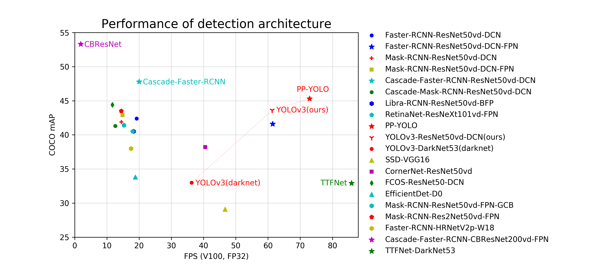

English | [简体中文](README_cn.md)

Documentation:[https://paddledetection.readthedocs.io](https://paddledetection.readthedocs.io)

# PaddleDetection

PaddleDetection is an end-to-end object detection development kit based on PaddlePaddle, which
aims to help developers in the whole development of training models, optimizing performance and
inference speed, and deploying models. PaddleDetection provides varied object detection architectures
in modular design, and wealthy data augmentation methods, network components, loss functions, etc.
PaddleDetection supported practical projects such as industrial quality inspection, remote sensing
image object detection, and automatic inspection with its practical features such as model compression
and multi-platform deployment.

[PP-YOLO](https://arxiv.org/abs/2007.12099), which is faster and has higer performance than YOLOv4,
has been released, it reached mAP(0.5:0.95) as 45.2%(newest 45.9%) on COCO test2019 dataset and
72.9 FPS on single Test V100. Please refer to [PP-YOLO](configs/ppyolo/README.md) for details.

**Now all models in PaddleDetection require PaddlePaddle version 1.8 or higher, or suitable develop version.**

  

## Introduction

Features:

- Rich models:

  PaddleDetection provides rich of models, including 100+ pre-trained models
such as object detection, instance segmentation, face detection etc. It covers
the champion models, the practical detection models for cloud and edge device.

- Production Ready:

  Key operations are implemented in C++ and CUDA, together with PaddlePaddle's
highly efficient inference engine, enables easy deployment in server environments.

- Highly Flexible:

  Components are designed to be modular. Model architectures, as well as data
preprocess pipelines, can be easily customized with simple configuration
changes.

- Performance Optimized:

  With the help of the underlying PaddlePaddle framework, faster training and
reduced GPU memory footprint is achieved. Notably, YOLOv3 training is
much faster compared to other frameworks. Another example is Mask-RCNN
(ResNet50), we managed to fit up to 4 images per GPU (Tesla V100 16GB) during
multi-GPU training.

Supported Architectures:

|                     | ResNet | ResNet-vd [1](#vd) | ResNeXt-vd | SENet | MobileNet |  HRNet | Res2Net |
| ------------------- | :----: | ----------------------------: | :--------: | :---: | :-------: |:------:|:-----:  |
| Faster R-CNN        |   ✓    |                             ✓ |     x      |   ✓   |     ✗     |   ✗    |  ✗      |
| Faster R-CNN + FPN  |   ✓    |                             ✓ |     ✓      |   ✓   |     ✗     |   ✓    |  ✓      |
| Mask R-CNN          |   ✓    |                             ✓ |     x      |   ✓   |     ✗     |   ✗    |  ✗      |
| Mask R-CNN + FPN    |   ✓    |                             ✓ |     ✓      |   ✓   |     ✗     |   ✗    |  ✓      |
| Cascade Faster-RCNN |   ✓    |                             ✓ |     ✓      |   ✗   |     ✗     |   ✗    |  ✗      |
| Cascade Mask-RCNN   |   ✓    |                             ✗ |     ✗      |   ✓   |     ✗     |   ✗    |  ✗      |
| Libra R-CNN         |   ✗    |                             ✓ |     ✗      |   ✗   |     ✗     |   ✗    |  ✗      |
| RetinaNet           |   ✓    |                             ✗ |     ✗      |   ✗   |     ✗     |   ✗    |  ✗      |
| YOLOv3              |   ✓    |                             ✓ |     ✗      |   ✗   |     ✓     |   ✗    |  ✗      |
| SSD                 |   ✗    |                             ✗ |     ✗      |   ✗   |     ✓     |   ✗    |  ✗      |
| BlazeFace           |   ✗    |                             ✗ |     ✗      |   ✗   |     ✗     |   ✗    |  ✗      |
| Faceboxes           |   ✗    |                             ✗ |     ✗      |   ✗   |     ✗     |   ✗    |  ✗      |

<a name="vd">[1]</a> [ResNet-vd](https://arxiv.org/pdf/1812.01187) models offer much improved accuracy with negligible performance cost.

**NOTE:** ✓ for config file and pretrain model provided in [Model Zoo](docs/MODEL_ZOO.md), ✗ for not provided but is supported generally.

More models:

- EfficientDet
- FCOS
- CornerNet-Squeeze
- YOLOv4
- PP-YOLO

More Backbones:

- DarkNet
- VGG
- GCNet
- CBNet

Advanced Features:

- [x] **Synchronized Batch Norm**
- [x] **Group Norm**
- [x] **Modulated Deformable Convolution**
- [x] **Deformable PSRoI Pooling**
- [x] **Non-local and GCNet**

**NOTE:** Synchronized batch normalization can only be used on multiple GPU devices, can not be used on CPU devices or single GPU device.

The following is the relationship between COCO mAP and FPS on Tesla V100 of representative models of each architectures and backbones.

  

**NOTE:**
- `CBResNet` stands for `Cascade-Faster-RCNN-CBResNet200vd-FPN`, which has highest mAP on COCO as 53.3% in PaddleDetection models
- `Cascade-Faster-RCNN` stands for `Cascade-Faster-RCNN-ResNet50vd-DCN`, which has been optimized to 20 FPS inference speed when COCO mAP as 47.8%
- The enhanced `YOLOv3-ResNet50vd-DCN` is 10.6 absolute percentage points higher than paper on COCO mAP, and inference speed is nearly 70% faster than the darknet framework
- All these models can be get in [Model Zoo](#Model-Zoo)

The following is the relationship between COCO mAP and FPS on Tesla V100 of SOTA object detecters and PP-YOLO, which is faster and has better performance than YOLOv4, and reached mAP(0.5:0.95) as 45.2% on COCO test2019 dataset and 72.9 FPS on single Test V100. Please refer to [PP-YOLO](configs/ppyolo/README.md) for details.

  

## Tutorials

### Get Started

- [Installation guide](docs/tutorials/INSTALL.md)
- [Quick start on small dataset](docs/tutorials/QUICK_STARTED.md)
- [Prepare dataset](docs/tutorials/PrepareDataSet.md)
- [Train/Evaluation/Inference/Deploy](docs/tutorials/DetectionPipeline.md)
- [How to train a custom dataset](docs/tutorials/Custom_DataSet.md)
- [FAQ](docs/FAQ.md)

### Advanced Tutorial

- [Guide to preprocess pipeline and dataset definition](docs/advanced_tutorials/READER.md)
- [Models technical](docs/advanced_tutorials/MODEL_TECHNICAL.md)
- [Transfer learning document](docs/advanced_tutorials/TRANSFER_LEARNING.md)
- [Parameter configuration](docs/advanced_tutorials/config_doc):
  - [Introduction to the configuration workflow](docs/advanced_tutorials/config_doc/CONFIG.md)
  - [Parameter configuration for RCNN model](docs/advanced_tutorials/config_doc/RCNN_PARAMS_DOC.md)
  - [Parameter configuration for YOLOv3 model](docs/advanced_tutorials/config_doc/yolov3_mobilenet_v1.md)
- [IPython Notebook demo](demo/mask_rcnn_demo.ipynb)
- [Model compression](slim)
    - [Model compression benchmark](slim)
    - [Quantization](slim/quantization)
    - [Model pruning](slim/prune)
    - [Model distillation](slim/distillation)
    - [Neural Architecture Search](slim/nas)
- [Deployment](deploy)
    - [Export model for inference](docs/advanced_tutorials/deploy/EXPORT_MODEL.md)
    - [Python inference](deploy/python)
    - [C++ inference](deploy/cpp)
    - [Mobile](https://github.com/PaddlePaddle/Paddle-Lite-Demo)
    - [Serving](deploy/serving)
    - [Inference benchmark](docs/advanced_tutorials/deploy/BENCHMARK_INFER_cn.md)

## Model Zoo

- Pretrained models are available in the [PaddleDetection model zoo](docs/MODEL_ZOO.md).
- [Mobile models](configs/mobile/README.md)
- [Anchor free models](configs/anchor_free/README.md)
- [Face detection models](docs/featured_model/FACE_DETECTION_en.md)
- [Pretrained models for pedestrian detection](docs/featured_model/CONTRIB.md)
- [Pretrained models for vehicle detection](docs/featured_model/CONTRIB.md)
- [YOLOv3 enhanced model](docs/featured_model/YOLOv3_ENHANCEMENT.md): Compared to MAP of 33.0% in paper, enhanced YOLOv3 reaches the MAP of 43.6%, and inference speed is improved as well
- [PP-YOLO](configs/ppyolo/README.md): PP-YOLO reeached mAP as 45.3% on COCO dataset，and 72.9 FPS on single Tesla V100
- [Objects365 2019 Challenge champion model](docs/featured_model/champion_model/CACascadeRCNN.md)
- [Best single model of Open Images 2019-Object Detction](docs/featured_model/champion_model/OIDV5_BASELINE_MODEL.md)
- [Practical Server-side detection method](configs/rcnn_enhance/README_en.md): Inference speed on single V100 GPU can reach 20FPS when COCO mAP is 47.8%.
- [Large-scale practical object detection models](docs/featured_model/LARGE_SCALE_DET_MODEL_en.md): Large-scale practical server-side detection pretrained models with 676 categories are provided for most application scenarios, which can be used not only for direct inference but also finetuning on other datasets.

## License
PaddleDetection is released under the [Apache 2.0 license](LICENSE).

## Updates
v0.4.0 was released at `05/2020`, add PP-YOLO, TTFNet, HTC, ACFPN, etc. And add BlaceFace face landmark detection model, add a series of optimized SSDLite models on mobile side, add data augmentations GridMask and RandomErasing, add Matrix NMS and EMA training, and improved ease of use, fix many known bugs, etc.
Please refer to [版本更新文档](docs/CHANGELOG.md) for details.

## Contributing

Contributions are highly welcomed and we would really appreciate your feedback!!
