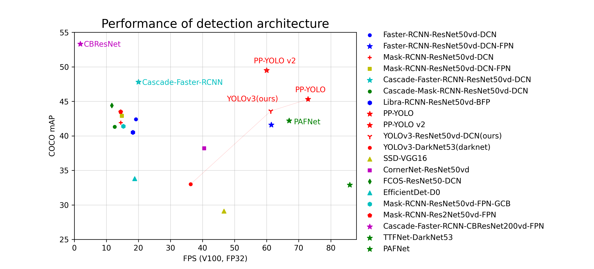

[简体中文](README_cn.md) | [English](README_en.md) | Español

<div align="center">
<p align="center">
  
</p>

**Un kit de desarrollo de detección de objetos de alta eficiencia basado en [PaddlePaddle](https://github.com/paddlepaddle/paddle)**

<p align="center">
    <a href="./LICENSE"></a>
    <a href="https://github.com/PaddlePaddle/PaddleDetection/releases"></a>
    <a href=""></a>
    <a href=""></a>
    <a href="https://github.com/PaddlePaddle/PaddleDetection/stargazers"></a>
</p>
</div>

<div align="center">
  
</div>

## 📋 Índice

- [Introducción](#introducción)
- [Novedades](#novedades)
- [Inicio Rápido](#inicio-rápido)
- [Características Principales](#características-principales)
- [Estructura del Kit](#estructura-del-kit)
- [Rendimiento de Modelos](#rendimiento-de-modelos)
- [Modelos Industriales](#modelos-industriales)
- [Instalación](#instalación)
- [Tutoriales](#tutoriales)
- [Licencia](#licencia)
- [Citas](#citas)

---

## 🌈 Introducción

**PaddleDetection** es un kit de desarrollo de detección de objetos de extremo a extremo basado en PaddlePaddle. Proporciona **más de 30 algoritmos de modelos** y **más de 300 modelos pre-entrenados**, cubriendo detección de objetos, segmentación de instancias, detección de puntos clave y seguimiento multi-objeto.

En particular, PaddleDetection ofrece modelos industriales SOTA de **alto rendimiento y ligeros** para **servidores y dispositivos móviles**, soluciones campeonas y algoritmos de vanguardia. Proporciona varios métodos de aumento de datos, componentes de red configurables, funciones de pérdida y otros esquemas avanzados de optimización y despliegue.

<div align="center">
  
</div>

---

## 📣 Novedades

- 🔥 **2024.10.1: Capacidades de desarrollo de extremo a extremo para detección de objetos e instancias**
  - La herramienta de desarrollo de bajo código PaddleX, basada en la tecnología avanzada de PaddleDetection, ahora admite capacidades de desarrollo de pipeline completo para el dominio de la detección de objetos:
    - 🎨 **Llamada con un clic de modelos ricos**: Integra **55 modelos** que cubren detección general, detección de objetos pequeños y segmentación de instancias en 3 pipelines de modelos. Llamada con una sola línea de **Python API** para experimentar rápidamente los efectos del modelo. La misma API también admite clasificación de imágenes, segmentación de imágenes, OCR general y más, formando **200+ modelos** en más de 20 módulos de funciones individuales.
    - 🚀 **Mayor eficiencia, menor barrera**: Proporciona dos formas basadas en **comandos unificados** e **interfaz gráfica** para un uso simple y eficiente de modelos. Admite **despliegue de alto rendimiento, despliegue como servicio y despliegue en dispositivos de borde**. Además, compatible con hardware mainstream como **NVIDIA GPU, Kunlunxin, Ascend, Cambricon y Hygon**.

- 🔥 **¡Superando a YOLOv8, PaddlePaddle lanza RT-DETR, el detector en tiempo real con mayor precisión!**

  <div align="center">
  
  </div>

  - `Código RT-DETR`: [RT-DETR](https://github.com/PaddlePaddle/PaddleDetection/tree/develop/configs/rtdetr)

- 🔥 **2022.11.15: Detector de objetos rotados SOTA y detector de objetos pequeños basado en PP-YOLOE**
  - Detector de objetos rotados [PP-YOLOE-R](configs/rotate/ppyoloe_r): Modelo SOTA Anchor-free con alta precisión y eficiencia, modelos s/m/l/x para nube y dispositivos de borde.
  - Detector de objetos pequeños [PP-YOLOE-SOD](configs/smalldet): Pipeline de detección basado en imágenes cortadas.

---

## ⚡ Inicio Rápido

👉 **[Inicio Rápido con PaddleX](docs/paddlex/quick_start.md)**

👉 **[Guía de Configuración en Windows (desde cero)](docs/tutorials/WINDOWS_SETUP_es.md)** ← *¡Nuevo! Guía fácil paso a paso para Windows*

---

## ✨ Características Principales

- **Biblioteca de modelos rica**: PaddleDetection proporciona más de 250 modelos pre-entrenados que incluyen **detección de objetos, segmentación de instancias, reconocimiento facial, seguimiento multi-objeto**. Cubre una variedad de **esquemas campeones de competencia global**.
- **Fácil de usar**: Diseño modular, desacopla cada componente de red, fácil para los desarrolladores construir y probar varios modelos de detección y estrategias de optimización.
- **Flujo completo de extremo a extremo**: PaddlePaddle conecta de extremo a extremo desde el aumento de datos, construcción de modelos, entrenamiento, compresión y despliegue. También admite despliegue en múltiples arquitecturas y dispositivos para **nube y borde**.
- **Alto rendimiento**: Debido al núcleo de alto rendimiento, PaddlePaddle tiene ventajas claras en velocidad de entrenamiento y ocupación de memoria. También admite entrenamiento FP16 y entrenamiento multi-máquina.

<div align="center">
  
</div>

---

## 🧩 Estructura del Kit

<table align="center">
  <tbody>
    <tr align="center" valign="bottom">
      <td><b>Arquitecturas</b></td>
      <td><b>Backbones</b></td>
      <td><b>Componentes</b></td>
      <td><b>Aumento de Datos</b></td>
    </tr>
    <tr valign="top">
      <td>
        <details><summary><b>Detección de Objetos</b></summary>
          <ul>
            <li>Faster RCNN</li>
            <li>FPN</li>
            <li>Cascade-RCNN</li>
            <li>PSS-Det</li>
            <li>RetinaNet</li>
            <li>YOLOv3</li>
            <li>YOLOF</li>
            <li>YOLOX</li>
            <li>YOLOv5</li>
            <li>YOLOv6</li>
            <li>YOLOv7</li>
            <li>YOLOv8</li>
            <li>RTMDet</li>
            <li>PP-YOLO</li>
            <li>PP-YOLO-Tiny</li>
            <li>PP-PicoDet</li>
            <li>PP-YOLOv2</li>
            <li>PP-YOLOE</li>
            <li>PP-YOLOE+</li>
            <li>PP-YOLOE-SOD</li>
            <li>PP-YOLOE-R</li>
            <li>SSD</li>
            <li>CenterNet</li>
            <li>FCOS</li>
            <li>FCOSR</li>
            <li>TTFNet</li>
            <li>TOOD</li>
            <li>GFL / GFLv2</li>
            <li>DETR</li>
            <li>Deformable DETR</li>
            <li>Swin Transformer</li>
            <li>Sparse RCNN</li>
         </ul></details>
        <details><summary><b>Segmentación de Instancias</b></summary>
         <ul>
            <li>Mask RCNN</li>
            <li>Cascade Mask RCNN</li>
            <li>SOLOv2</li>
        </ul></details>
        <details><summary><b>Detección Facial</b></summary>
        <ul>
            <li>BlazeFace</li>
        </ul></details>
        <details><summary><b>Seguimiento Multi-Objeto</b></summary>
        <ul>
            <li>JDE</li>
            <li>FairMOT</li>
            <li>DeepSORT</li>
            <li>ByteTrack</li>
            <li>OC-SORT</li>
            <li>BoT-SORT</li>
            <li>CenterTrack</li>
        </ul></details>
        <details><summary><b>Detección de Puntos Clave</b></summary>
        <ul>
            <li>HRNet</li>
            <li>HigherHRNet</li>
            <li>Lite-HRNet</li>
            <li>PP-TinyPose</li>
        </ul></details>
      </td>
      <td>
        <details><summary><b>Detalles</b></summary>
        <ul>
          <li>ResNet(&vd)</li>
          <li>Res2Net(&vd)</li>
          <li>CSPResNet</li>
          <li>SENet</li>
          <li>HRNet / Lite-HRNet</li>
          <li>DarkNet / CSPDarkNet</li>
          <li>MobileNetv1/v3</li>
          <li>ShuffleNet</li>
          <li>GhostNet</li>
          <li>BlazeNet</li>
          <li>DLA</li>
          <li>LCNet / ESNet</li>
          <li>Swin-Transformer</li>
          <li>ConvNeXt</li>
          <li>Vision Transformer</li>
        </ul></details>
      </td>
      <td>
        <details><summary><b>Comunes</b></summary>
          <ul>
            <li>Sync-BN</li>
            <li>Group Norm</li>
            <li>DCNv2</li>
            <li>EMA</li>
          </ul></details>
        <details><summary><b>FPN</b></summary>
          <ul>
            <li>BiFPN</li>
            <li>CSP-PAN</li>
            <li>Custom-PAN</li>
            <li>ES-PAN</li>
            <li>HRFPN</li>
          </ul></details>
        <details><summary><b>Pérdida (Loss)</b></summary>
          <ul>
            <li>Smooth-L1</li>
            <li>GIoU/DIoU/CIoU</li>
            <li>IoUAware</li>
            <li>Focal Loss</li>
            <li>CT Focal Loss</li>
            <li>VariFocal Loss</li>
          </ul></details>
        <details><summary><b>Post-procesamiento</b></summary>
          <ul>
            <li>SoftNMS</li>
            <li>MatrixNMS</li>
          </ul></details>
        <details><summary><b>Velocidad</b></summary>
          <ul>
            <li>Entrenamiento FP16</li>
            <li>Entrenamiento multi-máquina</li>
          </ul></details>
      </td>
      <td>
        <details><summary><b>Detalles</b></summary>
        <ul>
          <li>Redimensionado (Resize)</li>
          <li>Iluminación (Lighting)</li>
          <li>Espejado (Flipping)</li>
          <li>Expansión (Expand)</li>
          <li>Recorte (Crop)</li>
          <li>Distorsión de Color</li>
          <li>Borrado Aleatorio</li>
          <li>Mixup</li>
          <li>AugmentHSV</li>
          <li>Mosaic</li>
          <li>Cutmix</li>
          <li>Grid Mask</li>
          <li>Auto Augment</li>
          <li>Perspectiva Aleatoria</li>
        </ul></details>
      </td>
    </tr>
  </tbody>
</table>

---

## 📊 Rendimiento de Modelos

<details>
<summary><b>Comparación de rendimiento en modelos de nube</b></summary>

Comparación entre COCO mAP y FPS en Tesla V100 de modelos representativos de cada arquitectura y backbone.

<div align="center">
  
</div>

**Aclaración:**

- `ViT` representa `ViT-Cascade-Faster-RCNN`, con el mayor mAP en COCO del 55.7%
- `Cascade-Faster-RCNN` representa `Cascade-Faster-RCNN-ResNet50vd-DCN`, optimizado a 20 FPS con COCO mAP 47.8%
- `PP-YOLOE` es `PP-YOLO v2` optimizado: precisión 51.4% en COCO, velocidad 78.1 FPS en Tesla V100
- `PP-YOLOE+` es `PP-YOLOE` optimizado: precisión 53.3% en COCO, velocidad 78.1 FPS en Tesla V100

</details>

---

## 🎗️ Modelos Industriales

### 💎 PP-YOLOE — Modelo de detección de objetos de alta precisión

PP-YOLOE es un modelo de detección de objetos de alta precisión en tiempo real. Alcanzó **51.4% de mAP en el dataset COCO**, con una **velocidad de inferencia de 78.1 FPS** en una sola GPU Tesla V100.

| Modelo | mAP (COCO) | Velocidad (FPS, V100) |
|--------|-----------|----------------------|
| PP-YOLOE-s | 43.1% | 208.3 FPS |
| PP-YOLOE-m | 48.9% | 123.4 FPS |
| PP-YOLOE-l | 51.4% | 78.1 FPS |
| PP-YOLOE-x | 52.2% | 45.0 FPS |

➡️ [Ver más detalles de PP-YOLOE](configs/ppyoloe/README.md)

### 💫 PP-PicoDet — Modelo de detección ultraligero en tiempo real

PP-PicoDet logra el mejor rendimiento en dispositivos móviles. Ejecuta a **150+ FPS en CPU** con una excelente precisión.

➡️ [Ver más detalles de PP-PicoDet](configs/picodet/README.md)

### 📡 PP-Tracking — Sistema de seguimiento multi-objeto en tiempo real

Sistema de seguimiento multi-objeto que cubre escenarios industriales como monitoreo de tráfico, análisis de comportamiento de peatones y más.

➡️ [Ver más detalles de PP-Tracking](configs/mot/README.md)

### ⛷️ PP-TinyPose — Reconocimiento de puntos clave del cuerpo humano

Modelo ligero para reconocimiento de esqueleto del cuerpo humano optimizado para dispositivos de borde.

➡️ [Ver más detalles de PP-TinyPose](configs/keypoint/README.md)

### 🏃 PP-Human — Herramienta de análisis de peatones en tiempo real

PP-Human v2 admite cuatro nuevos reconocimientos de comportamiento: pelea, uso de teléfono, fumar y traspaso. Cubre tres capacidades de algoritmos principales: detección, seguimiento y atributos de peatones.

➡️ [Ver más detalles de PP-Human](deploy/pipeline/README.md)

### 🏎️ PP-Vehicle — Herramienta de análisis de vehículos en tiempo real

PP-Vehicle tiene cuatro funciones principales: reconocimiento de matrícula, análisis de atributos del vehículo (color, modelo), estadísticas de flujo de tráfico y detección de infracciones.

➡️ [Ver más detalles de PP-Vehicle](deploy/pipeline/README.md)

---

## 🍱 Instalación

Consulta la **[Guía de Instalación en Español](docs/tutorials/INSTALL_es.md)** para instrucciones detalladas.

Para configuración en **Windows**, consulta la **[Guía de Configuración en Windows](docs/tutorials/WINDOWS_SETUP_es.md)** — ¡una guía completa desde cero!

### Requisitos del sistema

- PaddlePaddle >= 2.3.2
- Python 3.7+ (64 bit)
- pip/pip3 (9.0.1+, 64 bit)
- Sistema operativo: Linux, Windows, macOS (64 bit)

### Instalación rápida

```bash
# 1. Clonar el repositorio
git clone https://github.com/PaddlePaddle/PaddleDetection.git
cd PaddleDetection

# 2. Instalar PaddlePaddle (CPU)
python -m pip install paddlepaddle==2.3.2 -i https://pypi.tuna.tsinghua.edu.cn/simple

# 3. Instalar dependencias
pip install -r requirements.txt

# 4. Compilar e instalar paddledet
python setup.py install
```

---

## 🔥 Tutoriales

| Tema | Enlace |
|------|--------|
| 📦 Instalación (ES) | [INSTALL_es.md](docs/tutorials/INSTALL_es.md) |
| 🖥️ Configuración en Windows (ES) | [WINDOWS_SETUP_es.md](docs/tutorials/WINDOWS_SETUP_es.md) |
| 🚀 Inicio Rápido (ES) | [QUICK_STARTED_es.md](docs/tutorials/QUICK_STARTED_es.md) |
| 📖 Comenzar (ES) | [GETTING_STARTED_es.md](docs/tutorials/GETTING_STARTED_es.md) |
| 📊 Preparación de Datos | [PrepareDetDataSet_en.md](docs/tutorials/data/PrepareDetDataSet_en.md) |
| 🏋️ Entrenamiento Distribuido | [DistributedTraining_en.md](docs/tutorials/DistributedTraining_en.md) |
| 🔑 FAQ | [FAQ/README.md](docs/tutorials/FAQ/README.md) |

---

## 🔑 Preguntas Frecuentes (FAQ)

Para preguntas frecuentes, consulta [docs/tutorials/FAQ/README.md](docs/tutorials/FAQ/README.md).

Para cualquier pregunta o sugerencia, por favor crea un [GitHub Issue](https://github.com/PaddlePaddle/PaddleDetection/issues).

---

## 📝 Licencia

PaddleDetection está bajo la licencia [Apache 2.0](LICENSE).

---

## 📌 Citas

Si utilizas PaddleDetection en tu investigación, por favor cita:

```
@misc{ppdet2019,
title={PaddleDetection, Object detection and instance segmentation toolkit based on PaddlePaddle.},
author={PaddlePaddle Authors},
howpublished = {\url{https://github.com/PaddlePaddle/PaddleDetection}},
year={2019}
}
```
