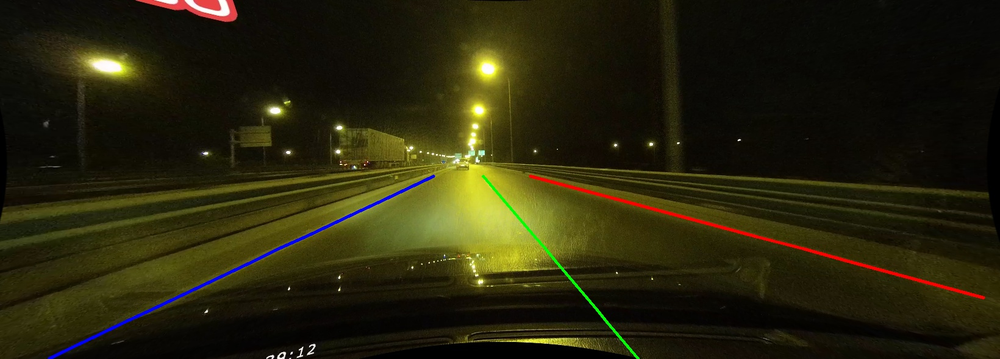

简体中文 | [English](README.md)

# CLRNet (CLRNet: Cross Layer Refinement Network for Lane Detection)

## 内容
- [简介](#简介)
- [模型库](#模型库)
- [引用](#引用)

## 内容

[CLRNet](https://arxiv.org/abs/2203.10350)是一个车道线检测模型。CLRNet模型设计了车道线检测的直线先验轨迹，车道线iou以及nms方法，融合提取车道线轨迹的上下文高层特征与底层特征，利用FPN多尺度进行refine，在车道线检测相关数据集取得了SOTA的性能。

## 模型库

### CLRNet在CUlane上结果

| 骨架网络       | mF1 | F1@50   |    F1@75    | 下载链接 | 配置文件 |
| :--------------| :------- |  :----: | :------: | :----: |:-----: |
| ResNet-18         | 54.98 |  79.46  |    62.10   | [下载链接]() | [配置文件](./clr_resnet18_culane.yml) |

### 训练
- GPU单卡训练
```shell
python tools/train.py -c configs/clrnet/clr_resnet18_culane.yml -o use_gpu=true
```
- GPU多卡训练
```shell
export CUDA_VISIBLE_DEVICES=0,1,2,3
python -m paddle.distributed.launch --gpus 0,1,2,3 tools/train.py -c configs/clrnet/clr_resnet18_culane.yml
```

### 评估
```shell
mkdir evaluation
python tools/eval.py -c configs/clrnet/clr_resnet18_culane.yml -o weights=output/clr_resnet18_culane/model_final.pdparams output_eval=evaluation/ use_gpu=true
```

### 预测
```shell
python tools/infer_culane.py -c configs/clrnet/clr_resnet18_culane.yml -o weights=output/clr_resnet18_culane/model_final.pdparams use_gpu=true --infer_img=demo/lane00000.jpg
```
结果如下图：

## 引用
```
@InProceedings{Zheng_2022_CVPR,
    author    = {Zheng, Tu and Huang, Yifei and Liu, Yang and Tang, Wenjian and Yang, Zheng and Cai, Deng and He, Xiaofei},
    title     = {CLRNet: Cross Layer Refinement Network for Lane Detection},
    booktitle = {Proceedings of the IEEE/CVF Conference on Computer Vision and Pattern Recognition (CVPR)},
    month     = {June},
    year      = {2022},
    pages     = {898-907}
}
```