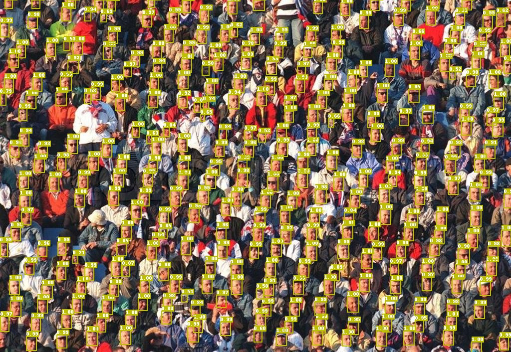

# 人脸检测模型

## 简介
`face_detection`中提供高效、高速的人脸检测解决方案，包括最先进的模型和经典模型。



## 模型库

#### WIDER-FACE数据集上的mAP

| 网络结构 | 输入尺寸 | 图片个数/GPU | 学习率策略 | Easy/Medium/Hard Set  | 预测时延（SD855）| 模型大小(MB) | 下载 | 配置文件 |
|:------------:|:--------:|:----:|:-------:|:-------:|:---------:|:----------:|:---------:|:--------:|
| BlazeFace  | 640  |    8    | 1000e     | 0.885 / 0.855 / 0.731 | - | 0.472 |[下载链接](https://paddledet.bj.bcebos.com/models/blazeface_1000e.pdparams) | [配置文件](https://github.com/PaddlePaddle/PaddleDetection/tree/release/2.6/configs/face_detection/blazeface_1000e.yml) |
| BlazeFace-FPN-SSH  | 640  |    8    | 1000e     | 0.907 / 0.883 / 0.793 | - | 0.479 |[下载链接](https://paddledet.bj.bcebos.com/models/blazeface_fpn_ssh_1000e.pdparams) | [配置文件](https://github.com/PaddlePaddle/PaddleDetection/tree/release/2.6/configs/face_detection/blazeface_fpn_ssh_1000e.yml) |

**注意:**  
- 我们使用多尺度评估策略得到`Easy/Medium/Hard Set`里的mAP。具体细节请参考[在WIDER-FACE数据集上评估](#在WIDER-FACE数据集上评估)。

## 快速开始

### 数据准备
我们使用[WIDER-FACE数据集](http://shuoyang1213.me/WIDERFACE/)进行训练和模型测试，官方网站提供了详细的数据介绍。
- WIDER-Face数据源:  
使用如下目录结构加载`wider_face`类型的数据集：

  ```
  dataset/wider_face/
  ├── wider_face_split
  │   ├── wider_face_train_bbx_gt.txt
  │   ├── wider_face_val_bbx_gt.txt
  ├── WIDER_train
  │   ├── images
  │   │   ├── 0--Parade
  │   │   │   ├── 0_Parade_marchingband_1_100.jpg
  │   │   │   ├── 0_Parade_marchingband_1_381.jpg
  │   │   │   │   ...
  │   │   ├── 10--People_Marching
  │   │   │   ...
  ├── WIDER_val
  │   ├── images
  │   │   ├── 0--Parade
  │   │   │   ├── 0_Parade_marchingband_1_1004.jpg
  │   │   │   ├── 0_Parade_marchingband_1_1045.jpg
  │   │   │   │   ...
  │   │   ├── 10--People_Marching
  │   │   │   ...
  ```

- 手动下载数据集：
要下载WIDER-FACE数据集，请运行以下命令：
```
cd dataset/wider_face && ./download_wider_face.sh
```

### 参数配置
基础模型的配置可以参考`configs/face_detection/_base_/blazeface.yml`；
改进模型增加FPN和SSH的neck结构，配置文件可以参考`configs/face_detection/_base_/blazeface_fpn.yml`，可以根据需求配置FPN和SSH，具体如下：
```yaml
BlazeNet:
   blaze_filters: [[24, 24], [24, 24], [24, 48, 2], [48, 48], [48, 48]]
   double_blaze_filters: [[48, 24, 96, 2], [96, 24, 96], [96, 24, 96],
                           [96, 24, 96, 2], [96, 24, 96], [96, 24, 96]]
   act: hard_swish #配置backbone中BlazeBlock的激活函数，基础模型为relu，增加FPN和SSH时需使用hard_swish

BlazeNeck:
   neck_type : fpn_ssh #可选only_fpn、only_ssh和fpn_ssh
   in_channel: [96,96]
```


### 训练与评估
训练流程与评估流程方法与其他算法一致，请参考[GETTING_STARTED_cn.md](../../docs/tutorials/GETTING_STARTED_cn.md)。  
**注意:** 人脸检测模型目前不支持边训练边评估。

#### 在WIDER-FACE数据集上评估
- 步骤一：评估并生成结果文件：
```shell
python -u tools/eval.py -c configs/face_detection/blazeface_1000e.yml \
       -o weights=output/blazeface_1000e/model_final \
       multi_scale=True
```
设置`multi_scale=True`进行多尺度评估，评估完成后，将在`output/pred`中生成txt格式的测试结果。

- 步骤二：下载官方评估脚本和Ground Truth文件：
```
wget http://mmlab.ie.cuhk.edu.hk/projects/WIDERFace/support/eval_script/eval_tools.zip
unzip eval_tools.zip && rm -f eval_tools.zip
```

- 步骤三：开始评估

方法一：python评估：
```
git clone https://github.com/wondervictor/WiderFace-Evaluation.git
cd WiderFace-Evaluation
# 编译
python3 setup.py build_ext --inplace
# 开始评估
python3 evaluation.py -p /path/to/PaddleDetection/output/pred -g /path/to/eval_tools/ground_truth
```

方法二：MatLab评估：
```
# 在`eval_tools/wider_eval.m`中修改保存结果路径和绘制曲线的名称：
pred_dir = './pred';  
legend_name = 'Paddle-BlazeFace';

`wider_eval.m` 是评估模块的主要执行程序。运行命令如下：
matlab -nodesktop -nosplash -nojvm -r "run wider_eval.m;quit;"
```

### Python脚本预测
为了支持二次开发，这里提供通过Python脚本使用Paddle Detection whl包来进行预测的示例。
```python
import cv2
import paddle
import numpy as np
from ppdet.core.workspace import load_config
from ppdet.engine import Trainer
from ppdet.metrics import get_infer_results
from ppdet.data.transform.operators import NormalizeImage, Permute


if __name__ == '__main__':
    # 准备基础的参数
    config_path = 'PaddleDetection/configs/face_detection/blazeface_1000e.yml'
    cfg = load_config(config_path)
    weight_path = 'PaddleDetection/output/blazeface_1000e.pdparams'
    infer_img_path = 'PaddleDetection/demo/hrnet_demo.jpg'
    cfg.weights = weight_path
    bbox_thre = 0.8
    paddle.set_device('gpu')
    # 创建所需的类
    trainer = Trainer(cfg, mode='test')
    trainer.load_weights(cfg.weights)
    trainer.model.eval()
    normaler = NormalizeImage(mean=[123, 117, 104], std=[127.502231, 127.502231, 127.502231], is_scale=False)
    permuter = Permute()
    # 进行图片读取
    im = cv2.imread(infer_img_path)
    im = cv2.cvtColor(im, cv2.COLOR_BGR2RGB)
    # 准备数据字典
    data_dict = {'image': im}
    data_dict = normaler(data_dict)
    data_dict = permuter(data_dict)
    h, w, c = im.shape
    data_dict['im_id'] = paddle.Tensor(np.array([[0]]))
    data_dict['im_shape'] = paddle.Tensor(np.array([[h, w]], dtype=np.float32))
    data_dict['scale_factor'] = paddle.Tensor(np.array([[1., 1.]], dtype=np.float32))
    data_dict['image'] = paddle.Tensor(data_dict['image'].reshape((1, c, h, w)))
    data_dict['curr_iter'] = paddle.Tensor(np.array([0]))
    # 进行预测
    outs = trainer.model(data_dict)
    # 对预测的数据进行后处理得到最终的bbox信息
    for key in ['im_shape', 'scale_factor', 'im_id']:
        outs[key] = data_dict[key]
    for key, value in outs.items():
        outs[key] = value.numpy()
    clsid2catid, catid2name = {0: 'face'}, {0: 0}
    batch_res = get_infer_results(outs, clsid2catid)
    bbox = [sub_dict for sub_dict in batch_res['bbox'] if sub_dict['score'] > bbox_thre]
    print(bbox)
```

## Citations

```
@article{bazarevsky2019blazeface,
      title={BlazeFace: Sub-millisecond Neural Face Detection on Mobile GPUs},
      author={Valentin Bazarevsky and Yury Kartynnik and Andrey Vakunov and Karthik Raveendran and Matthias Grundmann},
      year={2019},
      eprint={1907.05047},
      archivePrefix={arXiv},
```
