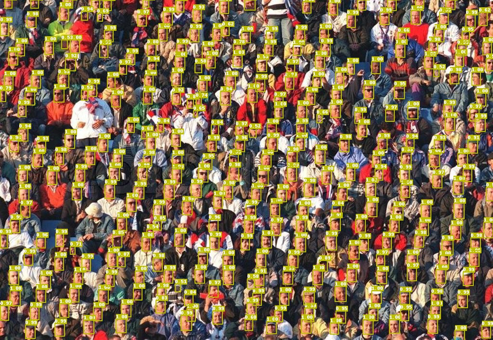

# Face Detection Model

## Introduction
`face_detection` High efficiency, high speed face detection solutions, including the most advanced models and classic models.



## Model Library

#### A mAP on the WIDERFACE dataset

| Network structure | size | images/GPUs | Learning rate strategy | Easy/Medium/Hard Set  | Prediction delay（SD855）| Model size(MB) | Download | Configuration File |
|:------------:|:--------:|:----:|:-------:|:-------:|:---------:|:----------:|:---------:|:--------:|
| BlazeFace  | 640  |    8    | 1000e     | 0.885 / 0.855 / 0.731 | - | 0.472 |[link](https://paddledet.bj.bcebos.com/models/blazeface_1000e.pdparams) | [Configuration File](https://github.com/PaddlePaddle/PaddleDetection/tree/release/2.4/configs/face_detection/blazeface_1000e.yml) |
| BlazeFace-FPN-SSH  | 640  |    8    | 1000e     | 0.907 / 0.883 / 0.793 | - | 0.479 |[link](https://paddledet.bj.bcebos.com/models/blazeface_fpn_ssh_1000e.pdparams) | [Configuration File](https://github.com/PaddlePaddle/PaddleDetection/tree/release/2.4/configs/face_detection/blazeface_fpn_ssh_1000e.yml) |

**Attention:**  
- We use a multi-scale evaluation strategy to get the mAP in `Easy/Medium/Hard Set`. Please refer to the [evaluation on the WIDER FACE dataset](#Evaluated-on-the-WIDER-FACE-Dataset) for details.

## Quick Start

### Data preparation
We use [WIDER-FACE dataset](http://shuoyang1213.me/WIDERFACE/) for training and model tests, the official web site provides detailed data is introduced.
- WIDER-Face data source:  
- Load a dataset of type `wider_face` using the following directory structure:
  ```
  dataset/wider_face/
  ├── wider_face_split
  │   ├── wider_face_train_bbx_gt.txt
  │   ├── wider_face_val_bbx_gt.txt
  ├── WIDER_train
  │   ├── images
  │   │   ├── 0--Parade
  │   │   │   ├── 0_Parade_marchingband_1_100.jpg
  │   │   │   ├── 0_Parade_marchingband_1_381.jpg
  │   │   │   │   ...
  │   │   ├── 10--People_Marching
  │   │   │   ...
  ├── WIDER_val
  │   ├── images
  │   │   ├── 0--Parade
  │   │   │   ├── 0_Parade_marchingband_1_1004.jpg
  │   │   │   ├── 0_Parade_marchingband_1_1045.jpg
  │   │   │   │   ...
  │   │   ├── 10--People_Marching
  │   │   │   ...
  ```

- Manually download the dataset:
To download the WIDER-FACE dataset, run the following command:
```
cd dataset/wider_face && ./download_wider_face.sh
```

### Parameter configuration
The configuration of the base model can be referenced to `configs/face_detection/_base_/blazeface.yml`；
Improved model to add FPN and SSH neck structure, configuration files can be referenced to `configs/face_detection/_base_/blazeface_fpn.yml`, You can configure FPN and SSH as required
```yaml
BlazeNet:
   blaze_filters: [[24, 24], [24, 24], [24, 48, 2], [48, 48], [48, 48]]
   double_blaze_filters: [[48, 24, 96, 2], [96, 24, 96], [96, 24, 96],
                           [96, 24, 96, 2], [96, 24, 96], [96, 24, 96]]
   act: hard_swish #Configure Blaze Block activation function in Backbone. The basic model is Relu. hard_swish is needed to add FPN and SSH

BlazeNeck:
   neck_type : fpn_ssh #only_fpn, only_ssh and fpn_ssh
   in_channel: [96,96]
```


### Training and Evaluation
The training process and evaluation process methods are consistent with other algorithms, please refer to [GETTING_STARTED_cn.md](../../docs/tutorials/GETTING_STARTED_cn.md)。  
**Attention:** Face detection models currently do not support training and evaluation.

#### Evaluated on the WIDER-FACE Dataset
- Step 1: Evaluate and generate a result file:
```shell
python -u tools/eval.py -c configs/face_detection/blazeface_1000e.yml \
       -o weights=output/blazeface_1000e/model_final \
       multi_scale=True
```
Set `multi_scale=True` for multi-scale evaluation. After evaluation, test results in TXT format will be generated in `output/pred`.

- Step 2: Download the official evaluation script and Ground Truth file:
```
wget http://mmlab.ie.cuhk.edu.hk/projects/WIDERFace/support/eval_script/eval_tools.zip
unzip eval_tools.zip && rm -f eval_tools.zip
```

- Step 3: Start the evaluation

Method 1: Python evaluation:
```
git clone https://github.com/wondervictor/WiderFace-Evaluation.git
cd WiderFace-Evaluation
# compile
python3 setup.py build_ext --inplace
# Begin to assess
python3 evaluation.py -p /path/to/PaddleDetection/output/pred -g /path/to/eval_tools/ground_truth
```

Method 2: MatLab evaluation:
```
# Change the name of save result path and draw curve in `eval_tools/wider_eval.m`:
pred_dir = './pred';  
legend_name = 'Paddle-BlazeFace';

`wider_eval.m` is the main implementation of the evaluation module. Run the following command:
matlab -nodesktop -nosplash -nojvm -r "run wider_eval.m;quit;"
```


## Citations

```
@article{bazarevsky2019blazeface,
      title={BlazeFace: Sub-millisecond Neural Face Detection on Mobile GPUs},
      author={Valentin Bazarevsky and Yury Kartynnik and Andrey Vakunov and Karthik Raveendran and Matthias Grundmann},
      year={2019},
      eprint={1907.05047},
      archivePrefix={arXiv},
```
