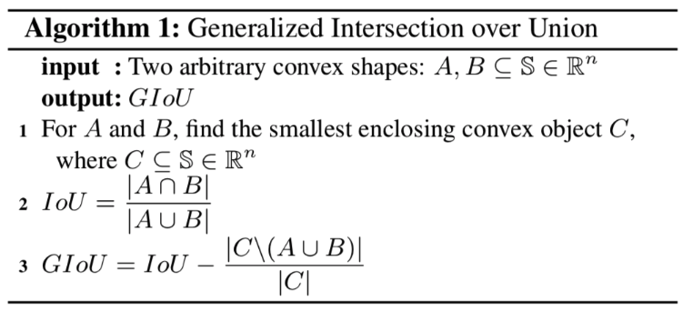
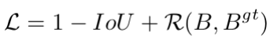
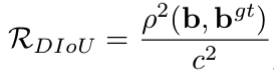
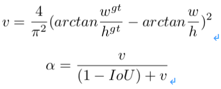
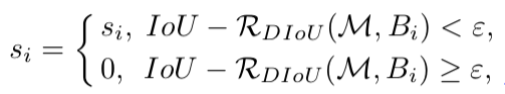

# Improvements of IOU loss

## 简介

### GIOU loss

IOU是论文中十分常用的指标，它对于物体的尺度并不敏感，在之前的检测任务中，常使用smooth l1 loss计算边框loss，但是该种方法计算出来的loss一方面无法与最终的IOU指标直接对应，同时也对检测框的尺度较为敏感，因此有学者提出将IOU loss作为回归的loss；但是如果IOU为0，则loss为0，同时IOU loss也没有考虑物体方向没有对齐时的loss，该论文基于此进行改进，计算GIOU的方法如下。


<div align="center">
    
</div>


最终GIOU loss为1-GIOU所得的值。具体来看，IOU可以直接反映边框与真值之间的交并比，C为能够包含A和B的最小封闭凸物体，因此即使A和B的交并比为0，GIOU也会随着A和B的相对距离而不断变化，因此模型参数可以继续得到优化。在A和B的长宽保持恒定的情况下，两者距离越远，GIOU越小，GIOU loss越大。

使用GIOU loss计算边框损失的流程图如下。

<div align="center">
    
</div>


PaddleDetection也开源了基于faster rcnn的GIOU loss实现。使用GIOU loss替换传统的smooth l1 loss，基于faster rcnn的resnet50-vd-fpn 1x实验，coco val mAP能由38.3%提升到39.4%（没有带来任何预测耗时的损失）


### DIOU/CIOU loss

GIOU loss解决了IOU loss中预测边框A与真值B的交并比为0时，模型无法给出优化方向的问题，但是仍然有2种情况难以解决，
1. 当边框A和边框B处于包含关系的时候，GIOU loss退化为IOU loss，此时模型收敛较慢。
2. 当A与B相交，若A和B的的x1与x2均相等或者y1与y2均相等，GIOU loss仍然会退化为IOU loss，收敛很慢。

基于此，论文提出了DIOU loss与CIOU loss，解决收敛速度慢以及部分条件下无法收敛的问题。
为加速收敛，论文在改进的loss中引入距离的概念，具体地，边框loss可以定义为如下形式：


<div align="center">
    
</div>


其中 是惩罚项，考虑预测边框与真值的距离损失时，惩罚项可以定义为


<div align="center">
    
</div>


其中分子表示预测框与真值边框中心点的欧式距离，分母的c表示预测框与真值边框的最小外包边框的对角长度。因此DIOU loss可以写为

<div align="center">
    
</div>


相对于GIOU loss，DIOU loss不仅考虑了IOU，也考虑边框之间的距离，从而加快了模型收敛的速度。但是使用DIOU loss作为边框损失函数时，只考虑了边框的交并比以及中心点的距离，没有考虑到预测边框与真值的长宽比差异的情况，因此论文中提出了CIOU loss，惩罚项添加关于长宽比的约束。具体地，惩罚项定义如下

<div align="center">
    
</div>


其中v为惩罚项，α为惩罚系数，定义分别如下

<div align="center">
    
</div>


CIOU loss使得在边框回归时，与目标框有重叠甚至包含时能够更快更准确地收敛。
在NMS阶段，一般的阈值计算为IOU，论文使用了DIOU修正后的阈值，检测框得分的更新方法如下。

<div align="center">
    
</div>


这使得模型效果有进一步的提升。


## 模型库

| 骨架网络             | 网络类型 | Loss类型 | Loss权重     | 每张GPU图片个数 | 学习率策略 |推理时间(fps) | Box AP | Mask AP |                           下载                          | 配置文件 |
| :---------------------- | :------------- | :---: | :---: | :-------: | :-----: | :------------: | :----: | :-----: | :----------------------------------------------------------: | :---: |
| ResNet50-vd-FPN            | Faster         | GIOU |   10   |    2     |   1x    |     22.94     |  39.4  |    -    | [model](https://paddlemodels.bj.bcebos.com/object_detection/faster_rcnn_r50_vd_fpn_giou_loss_1x.tar) | [config](https://github.com/PaddlePaddle/PaddleDetection/tree/master/configs/iou_loss/faster_rcnn_r50_vd_fpn_giou_loss_1x.yml) |
| ResNet50-vd-FPN            | Faster         | DIOU |   12   |    2     |   1x    |     22.94     |  39.2  |    -    | [model](https://paddlemodels.bj.bcebos.com/object_detection/faster_rcnn_r50_vd_fpn_diou_loss_1x.tar) | [config](https://github.com/PaddlePaddle/PaddleDetection/tree/master/configs/iou_loss/faster_rcnn_r50_vd_fpn_diou_loss_1x.yml) |
| ResNet50-vd-FPN            | Faster         | CIOU |   12   |    2     |   1x    |     22.95     |  39.6  |   -   | [model](https://paddlemodels.bj.bcebos.com/object_detection/faster_rcnn_r50_vd_fpn_ciou_loss_1x.tar) | [config](https://github.com/PaddlePaddle/PaddleDetection/tree/master/configs/iou_loss/faster_rcnn_r50_vd_fpn_ciou_loss_1x.yml) |


## 引用

```
@article{DBLP:journals/corr/abs-1902-09630,
  author    = {Seyed Hamid Rezatofighi and
               Nathan Tsoi and
               JunYoung Gwak and
               Amir Sadeghian and
               Ian D. Reid and
               Silvio Savarese},
  title     = {Generalized Intersection over Union: {A} Metric and {A} Loss for Bounding
               Box Regression},
  journal   = {CoRR},
  volume    = {abs/1902.09630},
  year      = {2019},
  url       = {http://arxiv.org/abs/1902.09630},
  archivePrefix = {arXiv},
  eprint    = {1902.09630},
  timestamp = {Tue, 21 May 2019 18:03:36 +0200},
  biburl    = {https://dblp.org/rec/bib/journals/corr/abs-1902-09630},
  bibsource = {dblp computer science bibliography, https://dblp.org}
}
```

- Distance-IoU Loss: Faster and Better Learning for Bounding Box Regression: [https://arxiv.org/abs/1911.08287](https://arxiv.org/abs/1911.08287)

```
@article{Zheng2019DistanceIoULF,
  title={Distance-IoU Loss: Faster and Better Learning for Bounding Box Regression},
  author={Zhaohui Zheng and Ping Wang and Wei Liu and Jinze Li and Rongguang Ye and Dongwei Ren},
  journal={ArXiv},
  year={2019},
  volume={abs/1911.08287}
}
```
