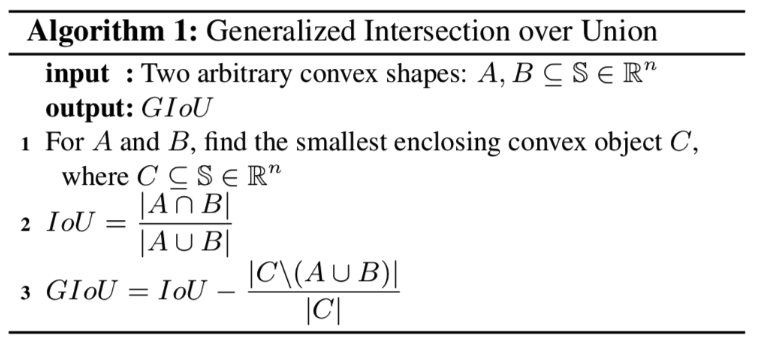
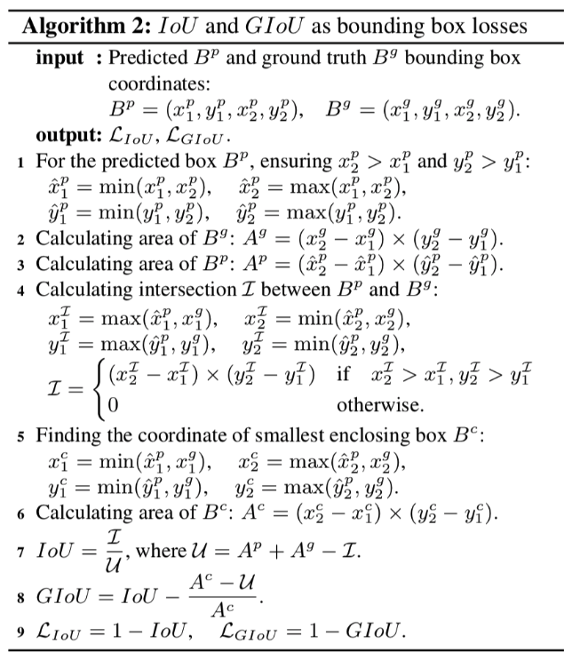

# Improvements of IOU loss

## 简介

### GIOU loss

IOU是论文中十分常用的指标，它对于物体的尺度并不敏感，在之前的检测任务中，常使用smooth l1 loss计算边框loss，但是该种方法计算出来的loss一方面无法与最终的IOU指标直接对应，同时也对检测框的尺度较为敏感，因此有学者提出将IOU loss作为回归的loss；但是如果IOU为0，则loss为0，同时IOU loss也没有考虑物体方向没有对齐时的loss，该论文基于此进行改进，计算GIOU的方法如下。



最终GIOU loss为1-GIOU所得的值。具体来看，IOU可以直接反映边框与真值之间的交并比，C为能够包含A和B的最小封闭凸物体，因此即使A和B的交并比为0，GIOU也会随着A和B的相对距离而不断变化，因此模型参数可以继续得到优化。在A和B的长宽保持恒定的情况下，两者距离越远，GIOU越小，GIOU loss越大。

使用GIOU loss计算边框损失的流程图如下。



PaddleDetection也开源了基于faster rcnn的GIOU loss实现。使用GIOU loss替换传统的smooth l1 loss，基于faster rcnn的resnet50-vd-fpn 1x实验，coco val mAP能由38.3%提升到39.4%（没有带来任何预测耗时的损失）


## 模型库

| 骨架网络             | 网络类型 | Context设置     | 每张GPU图片个数 | 学习率策略 |推理时间(fps) | Box AP | Mask AP |                           下载                          | 配置文件 |
| :---------------------- | :-------------: |  :-------------:  | :-------: | :-----: | :------------: | :----: | :-----: | :----------------------------------------------------------: | :-----: |
| ResNet50-vd-FPN         | Mask       | GC(c3-c5, r16, add)  |     2     |   2x    |     15.31     |  41.4  |    36.8    | [model](https://paddlemodels.bj.bcebos.com/object_detection/mask_rcnn_r50_vd_fpn_gcb_add_r16_2x.tar) | [config](https://github.com/PaddlePaddle/PaddleDetection/tree/master/configs/gcnet/mask_rcnn_r50_vd_fpn_gcb_add_r16_2x.yml) |
| ResNet50-vd-FPN         | Mask       | GC(c3-c5, r16, mul)  |     2     |   2x    |     15.35     |  40.7  |    36.1    | [model](https://paddlemodels.bj.bcebos.com/object_detection/mask_rcnn_r50_vd_fpn_gcb_mul_r16_2x.tar) | [config](https://github.com/PaddlePaddle/PaddleDetection/tree/master/configs/gcnet/mask_rcnn_r50_vd_fpn_gcb_mul_r16_2x.yml) |


## 引用

```
@article{DBLP:journals/corr/abs-1902-09630,
  author    = {Seyed Hamid Rezatofighi and
               Nathan Tsoi and
               JunYoung Gwak and
               Amir Sadeghian and
               Ian D. Reid and
               Silvio Savarese},
  title     = {Generalized Intersection over Union: {A} Metric and {A} Loss for Bounding
               Box Regression},
  journal   = {CoRR},
  volume    = {abs/1902.09630},
  year      = {2019},
  url       = {http://arxiv.org/abs/1902.09630},
  archivePrefix = {arXiv},
  eprint    = {1902.09630},
  timestamp = {Tue, 21 May 2019 18:03:36 +0200},
  biburl    = {https://dblp.org/rec/bib/journals/corr/abs-1902-09630},
  bibsource = {dblp computer science bibliography, https://dblp.org}
}
```

- Distance-IoU Loss: Faster and Better Learning for Bounding Box Regression: [https://arxiv.org/abs/1911.08287](https://arxiv.org/abs/1911.08287)

```
@article{Zheng2019DistanceIoULF,
  title={Distance-IoU Loss: Faster and Better Learning for Bounding Box Regression},
  author={Zhaohui Zheng and Ping Wang and Wei Liu and Jinze Li and Rongguang Ye and Dongwei Ren},
  journal={ArXiv},
  year={2019},
  volume={abs/1911.08287}
}
```
