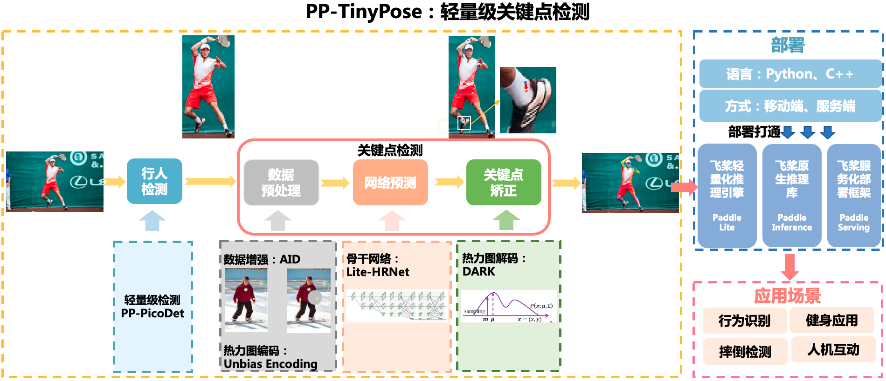

简体中文 | [English](README_en.md)

# PP-TinyPose

<div align="center">
  
  <center>图片来源：COCO2017开源数据集</center>
</div>

## 简介
PP-TinyPose是PaddleDetecion针对移动端设备优化的实时关键点检测模型，可流畅地在移动端设备上执行多人姿态估计任务。借助PaddleDetecion自研的优秀轻量级检测模型[PicoDet](../../picodet/README.md)，我们同时提供了特色的轻量级垂类行人检测模型。TinyPose的运行环境有以下依赖要求：
- [PaddlePaddle](https://github.com/PaddlePaddle/Paddle)>=2.2

如希望在移动端部署，则还需要：
- [Paddle-Lite](https://github.com/PaddlePaddle/Paddle-Lite)>=2.10


<div align="center">
  
</div>

## 部署案例

- [Android Fitness Demo](https://github.com/zhiboniu/pose_demo_android)  基于PP-TinyPose, 高效实现健身校准与计数功能。

<div align="center">
  
</div>

- 欢迎扫码快速体验
<div align="center">
  
</div>


## 模型库
### 关键点检测模型
| 模型        | 输入尺寸 | AP (COCO Val) | 单人推理耗时 (FP32) | 单人推理耗时（FP16) |             配置文件             |                           模型权重                           |                         预测部署模型                         |                  Paddle-Lite部署模型（FP32)                  |                  Paddle-Lite部署模型（FP16)                  |
| :---------- | :------: | :-----------: | :-----------------: | :-----------------: | :------------------------------: | :----------------------------------------------------------: | :----------------------------------------------------------: | :----------------------------------------------------------: | :----------------------------------------------------------: |
| PP-TinyPose |  128*96  |     58.1      |       4.57ms        |       3.27ms        | [Config](./tinypose_128x96.yml)  | [Model](https://bj.bcebos.com/v1/paddledet/models/keypoint/tinypose_128x96.pdparams) | [预测部署模型](https://bj.bcebos.com/v1/paddledet/models/keypoint/tinypose_128x96.tar) | [Lite部署模型](https://bj.bcebos.com/v1/paddledet/models/keypoint/tinypose_128x96_lite.tar) | [Lite部署模型(FP16)](https://bj.bcebos.com/v1/paddledet/models/keypoint/tinypose_128x96_fp16_lite.tar) |
| PP-TinyPose | 256*192  |     68.8      |       14.07ms       |       8.33ms        | [Config](./tinypose_256x192.yml) | [Model](https://bj.bcebos.com/v1/paddledet/models/keypoint/tinypose_256x192.pdparams) | [预测部署模型](https://bj.bcebos.com/v1/paddledet/models/keypoint/tinypose_256x192.tar) | [Lite部署模型](https://bj.bcebos.com/v1/paddledet/models/keypoint/tinypose_256x192_lite.tar) | [Lite部署模型(FP16)](https://bj.bcebos.com/v1/paddledet/models/keypoint/tinypose_256x192_fp16_lite.tar) |


### 行人检测模型
| 模型                 | 输入尺寸 | mAP (COCO Val) | 平均推理耗时 (FP32) | 平均推理耗时 (FP16) |                           配置文件                           |                           模型权重                           |                         预测部署模型                         |                  Paddle-Lite部署模型（FP32)                  |                  Paddle-Lite部署模型（FP16)                  |
| :------------------- | :------: | :------------: | :-----------------: | :-----------------: | :----------------------------------------------------------: | :----------------------------------------------------------: | :----------------------------------------------------------: | :----------------------------------------------------------: | :----------------------------------------------------------: |
| PicoDet-S-Pedestrian | 192*192  |      29.0      |       4.30ms        |       2.37ms        | [Config](../../picodet/legacy_model/application/pedestrian_detection/picodet_s_192_pedestrian.yml) | [Model](https://bj.bcebos.com/v1/paddledet/models/keypoint/picodet_s_192_pedestrian.pdparams) | [预测部署模型](https://bj.bcebos.com/v1/paddledet/models/keypoint/picodet_s_192_pedestrian.tar) | [Lite部署模型](https://bj.bcebos.com/v1/paddledet/models/keypoint/picodet_s_192_pedestrian_lite.tar) | [Lite部署模型(FP16)](https://bj.bcebos.com/v1/paddledet/models/keypoint/picodet_s_192_pedestrian_fp16_lite.tar) |
| PicoDet-S-Pedestrian | 320*320  |      38.5      |       10.26ms       |       6.30ms        | [Config](../../picodet/legacy_model/application/pedestrian_detection/picodet_s_320_pedestrian.yml) | [Model](https://bj.bcebos.com/v1/paddledet/models/keypoint/picodet_s_320_pedestrian.pdparams) | [预测部署模型](https://bj.bcebos.com/v1/paddledet/models/keypoint/picodet_s_320_pedestrian.tar) | [Lite部署模型](https://bj.bcebos.com/v1/paddledet/models/keypoint/picodet_s_320_pedestrian_lite.tar) | [Lite部署模型(FP16)](https://bj.bcebos.com/v1/paddledet/models/keypoint/picodet_s_320_pedestrian_fp16_lite.tar) |


**说明**
- 关键点检测模型与行人检测模型均使用`COCO train2017`和`AI Challenger trainset`作为训练集。关键点检测模型使用`COCO person keypoints val2017`作为测试集，行人检测模型采用`COCO instances val2017`作为测试集。
- 关键点检测模型的精度指标所依赖的检测框为ground truth标注得到。
- 关键点检测模型与行人检测模型均在4卡环境下训练，若实际训练环境需要改变GPU数量或batch size， 须参考[FAQ](../../../docs/tutorials/FAQ/README.md)对应调整学习率。
- 推理速度测试环境为 Qualcomm Snapdragon 865，采用arm8下4线程推理得到。

### Pipeline性能
| 单人模型配置 | AP (COCO Val 单人) | 单人耗时 (FP32) |  单人耗时 (FP16) |
| :------------------------ | :------: | :---: | :---: |
| PicoDet-S-Pedestrian-192\*192 + PP-TinyPose-128\*96 | 51.8 | 11.72 ms| 8.18 ms |
| 其他优秀开源模型-192\*192 | 22.3 | 12.0 ms| - |

| 多人模型配置 | AP (COCO Val 多人) | 6人耗时 (FP32) | 6人耗时 (FP16)|
| :------------------------ | :-------: | :---: | :---: |
| PicoDet-S-Pedestrian-320\*320 + PP-TinyPose-128\*96 | 50.3 | 44.0 ms| 32.57 ms |
| 其他优秀开源模型-256\*256 | 39.4 | 51.0 ms| - |

**说明**
- 关键点检测模型的精度指标是基于对应行人检测模型检测得到的检测框。
- 精度测试中去除了flip操作，且检测置信度阈值要求0.5。
- 精度测试中，为了公平比较，多人数据去除了6人以上（不含6人）的图像。
- 速度测试环境为qualcomm snapdragon 865，采用arm8下4线程、FP32推理得到。
- Pipeline速度包含模型的预处理、推理及后处理部分。
- 其他优秀开源模型的测试及部署方案，请参考[这里](https://github.com/zhiboniu/MoveNet-PaddleLite)。
- 更多环境下的性能测试结果，请参考[Keypoint Inference Benchmark](../KeypointBenchmark.md)。

## 模型训练
关键点检测模型与行人检测模型的训练集在`COCO`以外还扩充了[AI Challenger](https://arxiv.org/abs/1711.06475)数据集，各数据集关键点定义如下：
```
COCO keypoint Description:
    0: "Nose",
    1: "Left Eye",
    2: "Right Eye",
    3: "Left Ear",
    4: "Right Ear",
    5: "Left Shoulder,
    6: "Right Shoulder",
    7: "Left Elbow",
    8: "Right Elbow",
    9: "Left Wrist",
    10: "Right Wrist",
    11: "Left Hip",
    12: "Right Hip",
    13: "Left Knee",
    14: "Right Knee",
    15: "Left Ankle",
    16: "Right Ankle"

AI Challenger Description:
    0: "Right Shoulder",
    1: "Right Elbow",
    2: "Right Wrist",
    3: "Left Shoulder",
    4: "Left Elbow",
    5: "Left Wrist",
    6: "Right Hip",
    7: "Right Knee",
    8: "Right Ankle",
    9: "Left Hip",
    10: "Left Knee",
    11: "Left Ankle",
    12: "Head top",
    13: "Neck"
```

由于两个数据集的关键点标注形式不同，我们将两个数据集的标注进行了对齐，仍然沿用COCO的标注形式，您可以下载[训练的参考列表](https://bj.bcebos.com/v1/paddledet/data/keypoint/aic_coco_train_cocoformat.json)并放在`dataset/`下使用。对齐两个数据集标注文件的主要处理如下：
- `AI Challenger`关键点标注顺序调整至与COCO一致，统一是否标注/可见的标志位；
- 舍弃了`AI Challenger`中特有的点位；将`AI Challenger`数据中`COCO`特有点位标记为未标注；
- 重新排列了`image_id`与`annotation id`；
利用转换为`COCO`形式的合并数据标注，执行模型训练：
```bash
# 关键点检测模型
python3 -m paddle.distributed.launch tools/train.py -c configs/keypoint/tiny_pose/tinypose_128x96.yml

# 行人检测模型
python3 -m paddle.distributed.launch tools/train.py -c configs/picodet/application/pedestrian_detection/picodet_s_320_pedestrian.yml
```

## 部署流程
### 实现部署预测
1. 通过以下命令将训练得到的模型导出：
```bash
python3 tools/export_model.py -c configs/picodet/application/pedestrian_detection/picodet_s_192_pedestrian.yml --output_dir=outut_inference -o weights=output/picodet_s_192_pedestrian/model_final

python3 tools/export_model.py -c configs/keypoint/tiny_pose/tinypose_128x96.yml --output_dir=outut_inference -o weights=output/tinypose_128x96/model_final
```
导出后的模型如：
```
picodet_s_192_pedestrian
├── infer_cfg.yml
├── model.pdiparams
├── model.pdiparams.info
└── model.pdmodel
```
您也可以直接下载模型库中提供的对应`预测部署模型`，分别获取得到行人检测模型和关键点检测模型的预测部署模型，解压即可。

2. 执行Python联合部署预测
```bash
# 预测一张图片
python3 deploy/python/det_keypoint_unite_infer.py --det_model_dir=output_inference/picodet_s_320_pedestrian --keypoint_model_dir=output_inference/tinypose_128x96 --image_file={your image file} --device=GPU

# 预测多张图片
python3 deploy/python/det_keypoint_unite_infer.py --det_model_dir=output_inference/picodet_s_320_pedestrian --keypoint_model_dir=output_inference/tinypose_128x96 --image_dir={dir of image file} --device=GPU

# 预测一个视频
python3 deploy/python/det_keypoint_unite_infer.py --det_model_dir=output_inference/picodet_s_320_pedestrian --keypoint_model_dir=output_inference/tinypose_128x96 --video_file={your video file} --device=GPU
```

3. 执行C++联合部署预测
- 请先按照[C++端预测部署](https://github.com/PaddlePaddle/PaddleDetection/tree/release/2.3/deploy/cpp)，根据您的实际环境准备对应的`paddle_inference`库及相关依赖。
- 我们提供了[一键编译脚本](https://github.com/PaddlePaddle/PaddleDetection/blob/release/2.3/deploy/cpp/scripts/build.sh)，您可以通过该脚本填写相关环境变量的位置，编译上述代码后，得到可执行文件。该过程中请保证`WITH_KEYPOINT=ON`.
- 编译完成后，即可执行部署预测，例如：
```bash
# 预测一张图片
./build/main --model_dir=output_inference/picodet_s_320_pedestrian --model_dir_keypoint=output_inference/tinypose_128x96 --image_file={your image file} --device=GPU

# 预测多张图片
./build/main --model_dir=output_inference/picodet_s_320_pedestrian --model_dir_keypoint=output_inference/tinypose_128x96 --image_dir={dir of image file} --device=GPU

# 预测一个视频
./build/main --model_dir=output_inference/picodet_s_320_pedestrian --model_dir_keypoint=output_inference/tinypose_128x96 --video_file={your video file} --device=GPU
```

### 实现移动端部署
#### 直接使用我们提供的模型进行部署
1. 下载模型库中提供的`Paddle-Lite部署模型`，分别获取得到行人检测模型和关键点检测模型的`.nb`格式文件。
2. 准备Paddle-Lite运行环境, 可直接通过[PaddleLite预编译库下载](https://paddle-lite.readthedocs.io/zh/latest/quick_start/release_lib.html)获取预编译库，无需自行编译。如需要采用FP16推理，则需要下载[FP16的预编译库](https://github.com/PaddlePaddle/Paddle-Lite/releases/download/v2.10-rc/inference_lite_lib.android.armv8_clang_c++_static_with_extra_with_cv_with_fp16.tiny_publish_427e46.zip)
3. 编译模型运行代码，详细步骤见[Paddle-Lite端侧部署](../../../deploy/lite/README.md)。

#### 将训练的模型实现端侧部署
如果您希望将自己训练的模型应用于部署，可以参考以下步骤：
1. 将训练的模型导出
```bash
python3 tools/export_model.py -c configs/picodet/application/pedestrian_detection/picodet_s_192_pedestrian.yml --output_dir=outut_inference -o weights=output/picodet_s_192_pedestrian/model_final TestReader.fuse_normalize=true

python3 tools/export_model.py -c configs/keypoint/tiny_pose/tinypose_128x96.yml --output_dir=outut_inference -o weights=output/tinypose_128x96/model_final TestReader.fuse_normalize=true
```
2. 转换为Lite模型（依赖[Paddle-Lite](https://github.com/PaddlePaddle/Paddle-Lite))

- 安装Paddle-Lite:
```bash
pip install paddlelite
```
- 执行以下步骤，以得到对应后缀为`.nb`的Paddle-Lite模型用于端侧部署:
```
# 1. 转换行人检测模型
# FP32
paddle_lite_opt --model_dir=inference_model/picodet_s_192_pedestrian --valid_targets=arm --optimize_out=picodet_s_192_pedestrian_fp32
# FP16
paddle_lite_opt --model_dir=inference_model/picodet_s_192_pedestrian --valid_targets=arm --optimize_out=picodet_s_192_pedestrian_fp16 --enable_fp16=true

# 2. 转换关键点检测模型
# FP32
paddle_lite_opt --model_dir=inference_model/tinypose_128x96 --valid_targets=arm --optimize_out=tinypose_128x96_fp32
# FP16
paddle_lite_opt --model_dir=inference_model/tinypose_128x96 --valid_targets=arm --optimize_out=tinypose_128x96_fp16 --enable_fp16=true
```

3. 编译模型运行代码，详细步骤见[Paddle-Lite端侧部署](../../../deploy/lite/README.md)。

我们已提供包含数据预处理、模型推理及模型后处理的[全流程示例代码](../../../deploy/lite/)，可根据实际需求进行修改。

**注意**
- 在导出模型时增加`TestReader.fuse_normalize=true`参数，可以将对图像的Normalize操作合并在模型中执行，从而实现加速。
- FP16推理可实现更快的模型推理速度。若希望部署FP16模型，除模型转换步骤外，还需要编译支持FP16的Paddle-Lite预测库，详见[Paddle Lite 使用 ARM CPU 预测部署](https://paddle-lite.readthedocs.io/zh/latest/demo_guides/arm_cpu.html)。

## 优化策略
TinyPose采用了以下策略来平衡模型的速度和精度表现：
- 轻量级的姿态估计任务骨干网络，[wider naive Lite-HRNet](https://arxiv.org/abs/2104.06403)。
- 更小的输入尺寸。
- 加入Distribution-Aware coordinate Representation of Keypoints ([DARK](https://arxiv.org/abs/1910.06278))，以提升低分辨率热力图下模型的精度表现。
- Unbiased Data Processing ([UDP](https://arxiv.org/abs/1911.07524))。
- Augmentation by Information Dropping ([AID](https://arxiv.org/abs/2008.07139v2))。
- FP16 推理。
