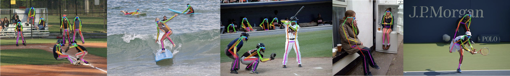
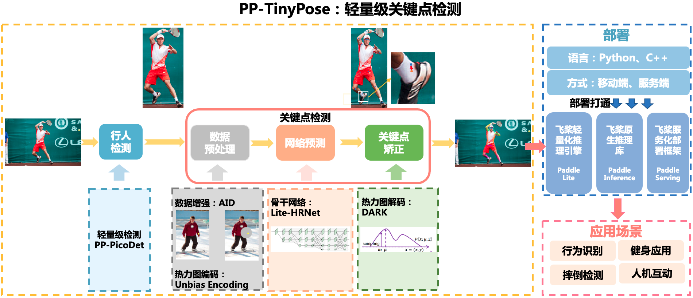

[简体中文](README.md) | English

# PP-TinyPose

<div align="center">
  
  <center>Image Source: COCO2017</center>
</div>

## Introduction
PP-TinyPose is a real-time keypoint detection model optimized by PaddleDetecion for mobile devices, which can smoothly run multi-person pose estimation tasks on mobile devices. With the excellent self-developed lightweight detection model [PicoDet](../../picodet/README.md), we also provide a lightweight pedestrian detection model. PP-TinyPose has the following dependency requirements:
- [PaddlePaddle](https://github.com/PaddlePaddle/Paddle)>=2.2

If you want to deploy it on the mobile devives, you also need:
- [Paddle-Lite](https://github.com/PaddlePaddle/Paddle-Lite)>=2.10


<div align="center">
  
</div>

## Deployment Case

- [Android Fitness Demo](https://github.com/zhiboniu/pose_demo_android) based on PP-TinyPose, which efficiently implements fitness calibration and counting.

<div align="center">
  
</div>

- Welcome to scan the QR code for quick experience.
<div align="center">
  
</div>


## Model Zoo
### Keypoint Detection Model
| Model  | Input Size | AP (COCO Val) | Inference Time for Single Person (FP32)| Inference Time for Single Person（FP16) | Config | Model Weights | Deployment Model | Paddle-Lite Model（FP32) | Paddle-Lite Model（FP16)|
| :------------------------ | :-------:  | :------: | :------: |:---: | :---: | :---: | :---: | :---: | :---: |
| PP-TinyPose | 128*96 | 58.1 | 4.57ms | 3.27ms | [Config](./tinypose_128x96.yml) |[Model](https://bj.bcebos.com/v1/paddledet/models/keypoint/tinypose_128x96.pdparams) | [Deployment Model](https://bj.bcebos.com/v1/paddledet/models/keypoint/tinypose_128x96.tar) | [Lite Model](https://bj.bcebos.com/v1/paddledet/models/keypoint/tinypose_128x96_lite.tar) | [Lite Model(FP16)](https://bj.bcebos.com/v1/paddledet/models/keypoint/tinypose_128x96_fp16_lite.tar) |
| PP-TinyPose | 256*192 | 68.8 | 14.07ms | 8.33ms | [Config](./tinypose_256x192.yml) | [Model](https://bj.bcebos.com/v1/paddledet/models/keypoint/tinypose_256x192.pdparams) | [Deployment Model](https://bj.bcebos.com/v1/paddledet/models/keypoint/tinypose_256x192.tar) | [Lite Model](https://bj.bcebos.com/v1/paddledet/models/keypoint/tinypose_256x192_lite.tar) | [Lite Model(FP16)](https://bj.bcebos.com/v1/paddledet/models/keypoint/tinypose_256x192_fp16_lite.tar) |

### Pedestrian Detection Model
| Model  | Input Size | mAP (COCO Val) | Average Inference Time (FP32)| Average Inference Time (FP16) | Config | Model Weights | Deployment Model | Paddle-Lite Model（FP32) | Paddle-Lite Model（FP16)|
| :------------------------ | :-------:  | :------: | :------: | :---: | :---: | :---: | :---: | :---: | :---: |
| PicoDet-S-Pedestrian | 192*192 | 29.0 | 4.30ms |  2.37ms | [Config](../../picodet/legacy_model/application/pedestrian_detection/picodet_s_192_pedestrian.yml) |[Model](https://bj.bcebos.com/v1/paddledet/models/keypoint/picodet_s_192_pedestrian.pdparams) | [Deployment Model](https://bj.bcebos.com/v1/paddledet/models/keypoint/picodet_s_192_pedestrian.tar) | [Lite Model](https://bj.bcebos.com/v1/paddledet/models/keypoint/picodet_s_192_pedestrian_lite.tar) | [Lite Model(FP16)](https://bj.bcebos.com/v1/paddledet/models/keypoint/picodet_s_192_pedestrian_fp16_lite.tar) |
| PicoDet-S-Pedestrian | 320*320 | 38.5 | 10.26ms |  6.30ms | [Config](../../picodet/legacy_model/application/pedestrian_detection/picodet_s_320_pedestrian.yml) | [Model](https://bj.bcebos.com/v1/paddledet/models/keypoint/picodet_s_320_pedestrian.pdparams) | [Deployment Model](https://bj.bcebos.com/v1/paddledet/models/keypoint/picodet_s_320_pedestrian.tar) | [Lite Model](https://bj.bcebos.com/v1/paddledet/models/keypoint/picodet_s_320_pedestrian_lite.tar) | [Lite Model(FP16)](https://bj.bcebos.com/v1/paddledet/models/keypoint/picodet_s_320_pedestrian_fp16_lite.tar) |


**Tips**
- The keypoint detection model and pedestrian detection model are both trained on `COCO train2017` and `AI Challenger trainset`. The keypoint detection model is evaluated on `COCO person keypoints val2017`, and the pedestrian detection model is evaluated on `COCO instances val2017`.
- The AP results of keypoint detection models are based on bounding boxes in GroundTruth.
- Both keypoint detection model and pedestrian detection model are trained in a 4-GPU environment. In practice, if number of GPUs or batch size need to be changed according to the training environment, you should refer to [FAQ](../../../docs/tutorials/FAQ/README.md) to adjust the learning rate.
- The inference time is tested on a Qualcomm Snapdragon 865, with 4 threads at arm8.

### Pipeline Performance
| Model for Single-Pose | AP (COCO Val Single-Person) | Time for Single Person(FP32) |  Time for Single Person(FP16) |
| :------------------------ | :------: | :---: | :---: |
| PicoDet-S-Pedestrian-192\*192 + PP-TinyPose-128\*96 | 51.8 | 11.72 ms| 8.18 ms |
| Other opensource model-192\*192 | 22.3 | 12.0 ms| - |

| Model for Multi-Pose | AP (COCO Val Multi-Persons) | Time for Six Persons(FP32) | Time for Six Persons(FP16)|
| :------------------------ | :-------: | :---: | :---: |
| PicoDet-S-Pedestrian-320\*320 + PP-TinyPose-128\*96 | 50.3 | 44.0 ms| 32.57 ms |
| Other opensource model-256\*256 | 39.4 | 51.0 ms| - |

**Tips**
- The AP results of keypoint detection models are based on bounding boxes detected by corresponding detection model.
- In accuracy evaluation, there is no flip, and threshold of bounding boxes is set to 0.5.
- For fairness, in multi-persons test, we remove images with more than 6 people.
- The inference time is tested on a Qualcomm Snapdragon 865, with 4 threads at arm8, FP32.
- Pipeline time includes time for preprocess, inferece and postprocess.
- About the deployment and testing for other opensource model, please refer to [Here](https://github.com/zhiboniu/MoveNet-PaddleLite).
- For more performance data in other runtime environment, please refer to [Keypoint Inference Benchmark](../KeypointBenchmark.md).

## Model Training
In addition to `COCO`, the trainset for keypoint detection model and pedestrian detection model also includes [AI Challenger](https://arxiv.org/abs/1711.06475). Keypoints of each dataset are defined as follows:
```
COCO keypoint Description:
    0: "Nose",
    1: "Left Eye",
    2: "Right Eye",
    3: "Left Ear",
    4: "Right Ear",
    5: "Left Shoulder,
    6: "Right Shoulder",
    7: "Left Elbow",
    8: "Right Elbow",
    9: "Left Wrist",
    10: "Right Wrist",
    11: "Left Hip",
    12: "Right Hip",
    13: "Left Knee",
    14: "Right Knee",
    15: "Left Ankle",
    16: "Right Ankle"

AI Challenger Description:
    0: "Right Shoulder",
    1: "Right Elbow",
    2: "Right Wrist",
    3: "Left Shoulder",
    4: "Left Elbow",
    5: "Left Wrist",
    6: "Right Hip",
    7: "Right Knee",
    8: "Right Ankle",
    9: "Left Hip",
    10: "Left Knee",
    11: "Left Ankle",
    12: "Head top",
    13: "Neck"
```

Since the annatation format of these two datasets are different, we aligned their annotations to `COCO` format. You can download [Training List](https://bj.bcebos.com/v1/paddledet/data/keypoint/aic_coco_train_cocoformat.json) and put it at `dataset/`. To align these two datasets, we mainly did the following works:
- Align the indexes of the `AI Challenger` keypoint to be consistent with `COCO` and unify the flags whether the keypoint is labeled/visible.
- Discard the unique keypoints in `AI Challenger`. For keypoints not in this dataset but in `COCO`, set it to not labeled.
- Rearranged `image_id` and `annotation id`.

Training with merged annotation file converted to `COCO` format:
```bash
# keypoint detection model
python3 -m paddle.distributed.launch tools/train.py -c configs/keypoint/tiny_pose/tinypose_128x96.yml

# pedestrian detection model
python3 -m paddle.distributed.launch tools/train.py -c configs/picodet/application/pedestrian_detection/picodet_s_320_pedestrian.yml
```

## Model Deployment
### Deploy Inference
1. Export the trained model through the following command:
```bash
python3 tools/export_model.py -c configs/picodet/application/pedestrian_detection/picodet_s_192_pedestrian.yml --output_dir=outut_inference -o weights=output/picodet_s_192_pedestrian/model_final

python3 tools/export_model.py -c configs/keypoint/tiny_pose/tinypose_128x96.yml --output_dir=outut_inference -o weights=output/tinypose_128x96/model_final
```
The exported model looks as:
```
picodet_s_192_pedestrian
├── infer_cfg.yml
├── model.pdiparams
├── model.pdiparams.info
└── model.pdmodel
```
You can also download `Deployment Model` from `Model Zoo` directly. And obtain the deployment models of pedestrian detection model and keypoint detection model, then unzip them.

2. Python joint inference by detection and keypoint
```bash
# inference for one image
python3 deploy/python/det_keypoint_unite_infer.py --det_model_dir=output_inference/picodet_s_320_pedestrian --keypoint_model_dir=output_inference/tinypose_128x96 --image_file={your image file} --device=GPU

# inference for several images
python3 deploy/python/det_keypoint_unite_infer.py --det_model_dir=output_inference/picodet_s_320_pedestrian --keypoint_model_dir=output_inference/tinypose_128x96 --image_dir={dir of image file} --device=GPU

# inference for a video
python3 deploy/python/det_keypoint_unite_infer.py --det_model_dir=output_inference/picodet_s_320_pedestrian --keypoint_model_dir=output_inference/tinypose_128x96 --video_file={your video file} --device=GPU
```

3. C++ joint inference by detection and keypoint
- First, please refer to [C++ Deploy Inference](https://github.com/PaddlePaddle/PaddleDetection/tree/release/2.3/deploy/cpp), prepare the corresponding `paddle_inference` library and related dependencies according to your environment.
- We provide [Compile Script](https://github.com/PaddlePaddle/PaddleDetection/blob/release/2.3/deploy/cpp/scripts/build.sh). You can fill the location of the relevant environment variables in this script and excute it to compile the above codes. you can get an executable file. Please ensure `WITH_KEYPOINT=ON` during this process.
- After compilation, you can do inference like:
```bash
# inference for one image
./build/main --model_dir=output_inference/picodet_s_320_pedestrian --model_dir_keypoint=output_inference/tinypose_128x96 --image_file={your image file} --device=GPU

# inference for several images
./build/main --model_dir=output_inference/picodet_s_320_pedestrian --model_dir_keypoint=output_inference/tinypose_128x96 --image_dir={dir of image file} --device=GPU

# inference for a video
./build/main --model_dir=output_inference/picodet_s_320_pedestrian --model_dir_keypoint=output_inference/tinypose_128x96 --video_file={your video file} --device=GPU
```

### Deployment on Mobile Devices
#### Deploy directly using models we provide
1. Download `Lite Model` from `Model Zoo` directly. And get the `.nb` format files of pedestrian detection model and keypoint detection model.
2. Prepare environment for Paddle-Lite, you can obtain precompiled libraries from [PaddleLite Precompiled Libraries](https://paddle-lite.readthedocs.io/zh/latest/quick_start/release_lib.html). If FP16 is needed, you should download [Precompiled Libraries for FP16](https://github.com/PaddlePaddle/Paddle-Lite/releases/download/v2.10-rc/inference_lite_lib.android.armv8_clang_c++_static_with_extra_with_cv_with_fp16.tiny_publish_427e46.zip).
3. Compile the code to run models. The detail can be seen in [Paddle-Lite Deployment on Mobile Devices](../../../deploy/lite/README.md).

#### Deployment self-trained models on Mobile Devices
If you want to deploy self-trained models, you can refer to the following steps:
1. Export the trained model
```bash
python3 tools/export_model.py -c configs/picodet/application/pedestrian_detection/picodet_s_192_pedestrian.yml --output_dir=outut_inference -o weights=output/picodet_s_192_pedestrian/model_final TestReader.fuse_normalize=true

python3 tools/export_model.py -c configs/keypoint/tiny_pose/tinypose_128x96.yml --output_dir=outut_inference -o weights=output/tinypose_128x96/model_final TestReader.fuse_normalize=true
```
2. Convert to Lite Model（rely on [Paddle-Lite](https://github.com/PaddlePaddle/Paddle-Lite))

- Install Paddle-Lite:
```bash
pip install paddlelite
```
- Run the following commands to obtain `.nb` format models of Paddle-Lite:
```
# 1. Convert pedestrian detection model
# FP32
paddle_lite_opt --model_dir=inference_model/picodet_s_192_pedestrian --valid_targets=arm --optimize_out=picodet_s_192_pedestrian_fp32
# FP16
paddle_lite_opt --model_dir=inference_model/picodet_s_192_pedestrian --valid_targets=arm --optimize_out=picodet_s_192_pedestrian_fp16 --enable_fp16=true

# 2. keypoint detection model
# FP32
paddle_lite_opt --model_dir=inference_model/tinypose_128x96 --valid_targets=arm --optimize_out=tinypose_128x96_fp32
# FP16
paddle_lite_opt --model_dir=inference_model/tinypose_128x96 --valid_targets=arm --optimize_out=tinypose_128x96_fp16 --enable_fp16=true
```

3. Compile the code to run models. The detail can be seen in [Paddle-Lite Deployment on Mobile Devices](../../../deploy/lite/README.md).

We provide [Example Code](../../../deploy/lite/) including data preprocessing, inferece and postpreocess. You can modify the codes according to your actual needs.

**Note:**
- Add `TestReader.fuse_normalize=true` during the step of exporting model. The Normalize operation for the image will be executed in the model, which can achieve acceleration.
- With FP16, we can get a faster inference speed. If you want to deploy the FP16 model, in addition to the model conversion step, you also need to compile the Paddle-Lite prediction library that supports FP16. The detail is in [Paddle Lite Deployment on ARM CPU](https://paddle-lite.readthedocs.io/zh/latest/demo_guides/arm_cpu.html).

## Optimization Strategies
TinyPose adopts the following strategies to balance the speed and accuracy of the model:
- Lightweight backbone network for pose estimation, [wider naive Lite-HRNet](https://arxiv.org/abs/2104.06403).
- Smaller input size.
- Distribution-Aware coordinate Representation of Keypoints ([DARK](https://arxiv.org/abs/1910.06278)), which can improve the accuracy of the model under the low-resolution heatmap.
- Unbiased Data Processing ([UDP](https://arxiv.org/abs/1911.07524)).
- Augmentation by Information Dropping ([AID](https://arxiv.org/abs/2008.07139v2)).
- FP16 inference.
