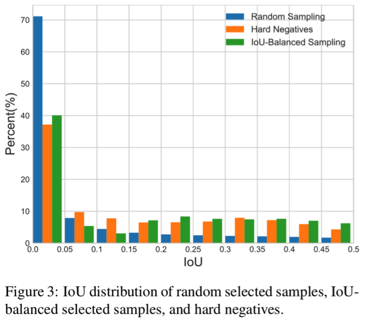
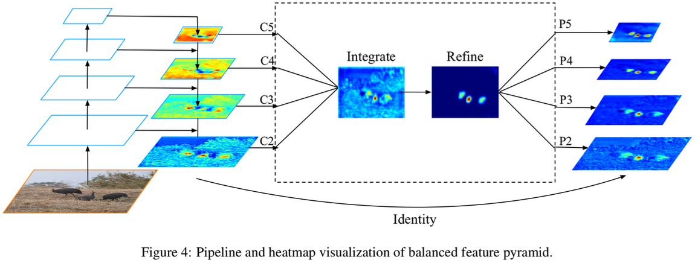
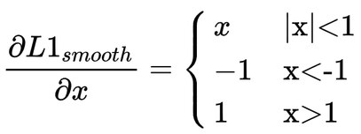
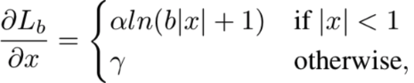
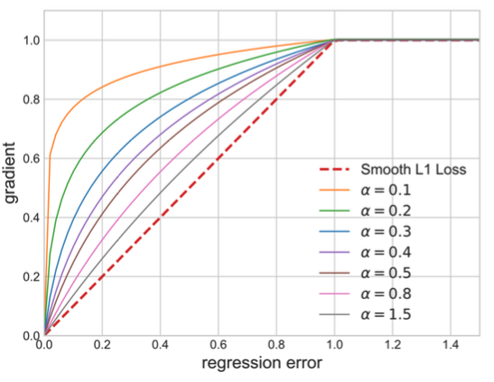

# Libra R-CNN: Towards Balanced Learning for Object Detection

## 简介

检测模型训练大多包含3个步骤：候选区域生成与选择、特征提取、类别分类和检测框回归多任务的训练与收敛。

论文主要分析了在检测任务中，三个层面的不均衡现象限制了模型的性能，分别是样本(sample level)、特征(feature level)以及目标级别(objective level)的不均衡，提出了3种方案，用于解决上述三个不均衡的现象。三个解决方法如下。

### IoU-balanced Sampling

Faster RCNN中生成许多候选框之后，使用随机的方法挑选正负样本，但是这导致了一个问题：负样本中有70%的候选框与真值的IOU都在0~0.05之间，分布如下图所示。使用在线难负样本挖掘(OHEM)的方法可以缓解这种情况，但是不同IOU区间的采样样本仍然差距仍然比较大，而且流程复杂。作者提出了均衡的负样本采样策略，即将IOU阈值区间分为K份，在每个子区间都采样相同数量的负样本（如果达不到平均数量，则取所有在该子区间的样本），最终可以保证采样得到的负样本在不同的IOU子区间达到尽量均衡的状态。这种方法思路简单，效果也比OHEM要更好一些。


<div align="center">
    
</div>


### Balanced Feature Pyramid（BFP）

之前的FPN结构中使用横向连接的操作融合骨干网络的特征，论文中提出了一个如下图，主要包括rescaling, integrating, refining and strengthening，共4个部分。首先将不同层级的特征图缩放到同一尺度，之后对特征图进行加权平均，使用Nonlocal模块进一步提炼特征，最终将提炼后的特征图进行缩放，作为残差项与不同层级的特征图相加，得到最终输出的特征图。这种平衡的特征图金字塔结构相对于标准的FPN在coco数据集上可以带来0.8%左右的精度提升。

<div align="center">
    
</div>


### Balanced L1 Loss

物体检测任务中，需要同时优化分类loss与边框的回归loss，当分类得分很高时，即使回归效果很差，也会使得模型有比较高的精度，因此可以考虑增加回归loss的权重。假设bbox loss<=1的边框为inliers（可以被视为简单的样本），bbox loss>1的边框为outliers（可以被视为难样本），假设直接调整所有边框的回归loss，这会导致模型对outliers更加敏感，而且基于smooth l1 loss的边框loss计算方法有以下缺点，当边框为inliers时，其梯度很小，当边框为outliers时，梯度幅值为1。smooth l1 loss的梯度计算方法定义如下。

<div align="center">
    
</div>


因此论文考虑增加inliers的梯度值，尽量平衡inliers与outliers的loss梯度比例。最终Libra loss的梯度计算方法如下所示。

<div align="center">
    
</div>


在不同的超参数下，梯度可视化如下图所示。


<div align="center">
    
</div>


可以看出Libra loss与smooth l1 loss对于outliers的梯度是相同的，但是在inliers中，Libra loss的梯度更大一些，从而增大了不同情况下的边框回归loss，平衡了难易边框学习的loss，同时也提升了边框回归效果对检测模型性能的影响。

论文将3个部分融合在一起，在coco两阶段目标检测任务中有1.1%~2.5%的绝对精度提升，效果十分明显。


## 模型库


| 骨架网络             | 网络类型     | 每张GPU图片个数 | 学习率策略 |推理时间(fps) | Box AP | Mask AP |                           下载                          | 配置文件 |
| :---------------------- | :-------------:  | :-------: | :-----: | :------------: | :----: | :-----: | :----------------------------------------------------------: | :-----: |
| ResNet50-vd-BFP         | Faster     |     2     |   1x    |     18.247     |  40.5  |    -    | [model](https://paddlemodels.bj.bcebos.com/object_detection/libra_rcnn_r50_vd_fpn_1x.tar) | [config](https://github.com/PaddlePaddle/PaddleDetection/tree/master/configs/libra_rcnn/libra_rcnn_r50_vd_fpn_1x.yml) |
| ResNet101-vd-BFP         | Faster     |     2     |   1x    |     14.865     |  42.5  |    -    | [model](https://paddlemodels.bj.bcebos.com/object_detection/libra_rcnn_r101_vd_fpn_1x.tar) | [config](https://github.com/PaddlePaddle/PaddleDetection/tree/master/configs/libra_rcnn/libra_rcnn_r101_vd_fpn_1x.yml) |

## 引用

```
@inproceedings{pang2019libra,
  title={Libra R-CNN: Towards Balanced Learning for Object Detection},
  author={Pang, Jiangmiao and Chen, Kai and Shi, Jianping and Feng, Huajun and Ouyang, Wanli and Dahua Lin},
  booktitle={IEEE Conference on Computer Vision and Pattern Recognition},
  year={2019}
}
```
