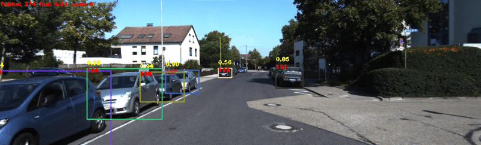

[English](README.md) | 简体中文
# 特色垂类跟踪模型

## 车辆跟踪 (Vehicle Tracking)

车辆跟踪的主要应用之一是交通监控。
[KITTI-Tracking](http://www.cvlibs.net/datasets/kitti/eval_tracking.php)是一个包含市区、乡村和高速公路等场景采集的数据集，每张图像中最多达15辆车和30个行人，还有各种程度的遮挡与截断。其中用于目标跟踪的数据集一共有50个视频序列，21个为训练集，29个为测试集，目标是估计类别“Car”和”Pedestrian“的目标轨迹，此处只使用类别“Car”。
<div align="center">
  
</div>

## 模型库

### FairMOT在KITTI tracking (2D bounding-boxes) Training Set上Car类别的结果

|    骨干网络      |  输入尺寸 |  MOTA   |   FPS   |  下载链接 | 配置文件 |
| :--------------| :------- | :-----: | :-----: | :------: | :----: |
| DLA-34         | 1088x608 |   82.7  |    -    |[下载链接](https://paddledet.bj.bcebos.com/models/mot/fairmot_dla34_30e_1088x608_kitti_vehicle.pdparams) | [配置文件](./fairmot_dla34_30e_1088x608_kitti_vehicle.yml) |

**注意:**
 FairMOT使用2个GPU进行训练，每个GPU上batch size为6，训练30个epoch。

## 快速开始

### 1. 训练
使用2个GPU通过如下命令一键式启动训练
```bash
python -m paddle.distributed.launch --log_dir=./fairmot_dla34_30e_1088x608_kitti_vehicle/ --gpus 0,1 tools/train.py -c configs/mot/vehicle/fairmot_dla34_30e_1088x608_kitti_vehicle.yml
```

### 2. 评估
使用单张GPU通过如下命令一键式启动评估
```bash
# 使用PaddleDetection发布的权重
CUDA_VISIBLE_DEVICES=0 python tools/eval_mot.py -c configs/mot/vehicle/fairmot_dla34_30e_1088x608_kitti_vehicle.yml -o weights=https://paddledet.bj.bcebos.com/models/mot/fairmot_dla34_30e_1088x608_kitti_vehicle.pdparams

# 使用训练保存的checkpoint
CUDA_VISIBLE_DEVICES=0 python tools/eval_mot.py -c configs/mot/vehicle/fairmot_dla34_30e_1088x608_kitti_vehicle.yml -o weights=output/fairmot_dla34_30e_1088x608_kitti_vehicle/model_final.pdparams
```

### 3. 预测
使用单个GPU通过如下命令预测一个视频，并保存为视频
```bash
# 预测一个视频
CUDA_VISIBLE_DEVICES=0 python tools/infer_mot.py -c configs/mot/vehicle/fairmot_dla34_30e_1088x608_kitti_vehicle.yml -o weights=https://paddledet.bj.bcebos.com/models/mot/fairmot_dla34_30e_1088x608_kitti_vehicle.pdparams --video_file={your video name}.mp4  --save_videos
```
**注意:**
 请先确保已经安装了[ffmpeg](https://ffmpeg.org/ffmpeg.html), Linux(Ubuntu)平台可以直接用以下命令安装：`apt-get update && apt-get install -y ffmpeg`。

### 4. 导出预测模型
```bash
CUDA_VISIBLE_DEVICES=0 python tools/export_model.py -c configs/mot/kitti_vehicle/fairmot_dla34_30e_1088x608_kitti_vehicle.yml -o weights=https://paddledet.bj.bcebos.com/models/mot/fairmot_dla34_30e_1088x608_kitti_vehicle.pdparams
```

### 5. 用导出的模型基于Python去预测
```bash
python deploy/python/mot_jde_infer.py --model_dir=output_inference/fairmot_dla34_30e_1088x608_kitti_vehicle --video_file={your video name}.mp4 --device=GPU --save_mot_txts
```
**注意:**
 跟踪模型是对视频进行预测，不支持单张图的预测，默认保存跟踪结果可视化后的视频，可添加`--save_mot_txts`表示保存跟踪结果的txt文件，或`--save_images`表示保存跟踪结果可视化图片。

## 引用
```
@article{zhang2020fair,
  title={FairMOT: On the Fairness of Detection and Re-Identification in Multiple Object Tracking},
  author={Zhang, Yifu and Wang, Chunyu and Wang, Xinggang and Zeng, Wenjun and Liu, Wenyu},
  journal={arXiv preprint arXiv:2004.01888},
  year={2020}
}
@INPROCEEDINGS{Geiger2012CVPR,
  author = {Andreas Geiger and Philip Lenz and Raquel Urtasun},
  title = {Are we ready for Autonomous Driving? The KITTI Vision Benchmark Suite},
  booktitle = {Conference on Computer Vision and Pattern Recognition (CVPR)},
  year = {2012}
}
```
