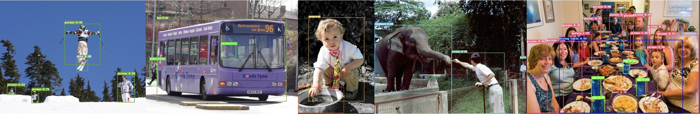

# PicoDet


## Introduction

We developed a series of lightweight models, which named `PicoDet`. Because of its excellent performance, it is very suitable for deployment on mobile or CPU.

- 🌟 Higher mAP:  The **first** model which within 1M parameter with mAP reaching 30+.
- 🚀 Faster latency: 114FPS on mobile ARM CPU.
- 😊 Deploy friendly: support PaddleLite/MNN/NCNN/OpenVINO and provide C++/Python/Android implementation.
- 😍 Advanced algorithm: use the most advanced algorithms and innovate, such as ESNet, CSP-PAN, SimOTA with VFL, etc.


## Requirements
- PaddlePaddle >= 2.1.2
- PaddleSlim >= 2.1.1

## Comming soon
- [ ] More series of model, such as Smaller or larger model.
- [ ] Pretrained models for more scenarios.
- [ ] More features in need.

## Model Zoo

| Model                  | Input size | lr schedule | Box AP(0.5:0.95) | Box AP(0.5) | FLOPS | Model Size | Inference Time |                           download                          | config |
| :------------------------ | :-------: | :-------: | :------: | :---: | :---: | :---: | :------------:  | :-------------------------------------------------: | :-----: |
| PicoDet-S    | 320*320    |   300e      |   27.1     | 41.4 | -- | 3.9M | -- | [model](https://paddledet.bj.bcebos.com/models/picodet_s_320_coco.pdparams) &#124; [log](https://paddledet.bj.bcebos.com/logs/train_picodet_s_320_coco.log) | [config](https://github.com/PaddlePaddle/PaddleDetection/tree/develop/configs/picodet/picodet_s_320_coco.yml) |
| PicoDet-S    | 416*416    |   300e      |   30.6     | 45.5 | -- | 3.9M | -- | [model](https://paddledet.bj.bcebos.com/models/picodet_s_416_coco.pdparams) &#124; [log](https://paddledet.bj.bcebos.com/logs/train_picodet_s_416_coco.log) | [config](https://github.com/PaddlePaddle/PaddleDetection/tree/develop/configs/picodet/picodet_s_416_coco.yml) |
| PicoDet-M    | 320*320   |   300e      |  -     | 41.2 |  -- | 8.4M | -- | [model](https://paddledet.bj.bcebos.com/models/picodet_m_320_coco.pdparams) &#124; [log](https://paddledet.bj.bcebos.com/logs/train_picodet_m_320_coco.log) | [config](https://github.com/PaddlePaddle/PaddleDetection/tree/develop/configs/picodet/picodet_m_320_coco.yml) |
| PicoDet-M    | 416*416   |   300e      |   34.3     | 49.8 |  -- | 8.4M | -- | [model](https://paddledet.bj.bcebos.com/models/picodet_m_416_coco.pdparams) &#124; [log](https://paddledet.bj.bcebos.com/logs/train_picodet_m_416_coco.log) | [config](https://github.com/PaddlePaddle/PaddleDetection/tree/develop/configs/picodet/picodet_m_416_coco.yml) |


**Notes:**

- PicoDet inference speed is tested on Kirin 980 with 4 threads by arm8 and with FP16.
- PicoDet is trained on COCO train2017 dataset and evaluated on val2017.
- PicoDet used 4 GPUs for training and mini-batch size as 128 or 96 on each GPU.

## Citations
```
@article{li2020generalized,
  title={Generalized Focal Loss: Learning Qualified and Distributed Bounding Boxes for Dense Object Detection},
  author={Li, Xiang and Wang, Wenhai and Wu, Lijun and Chen, Shuo and Hu, Xiaolin and Li, Jun and Tang, Jinhui and Yang, Jian},
  journal={arXiv preprint arXiv:2006.04388},
  year={2020}
}

```
