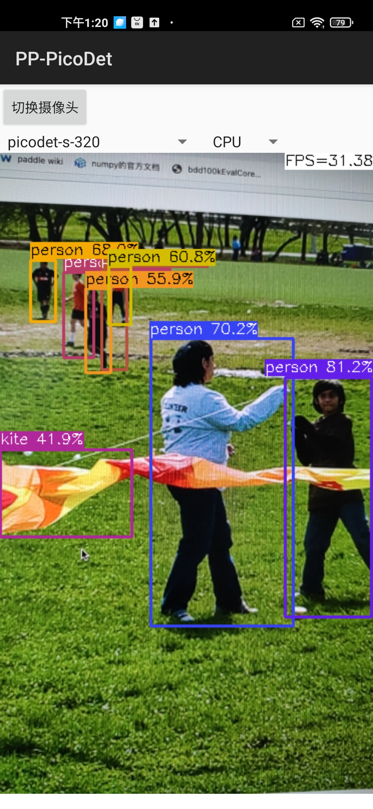
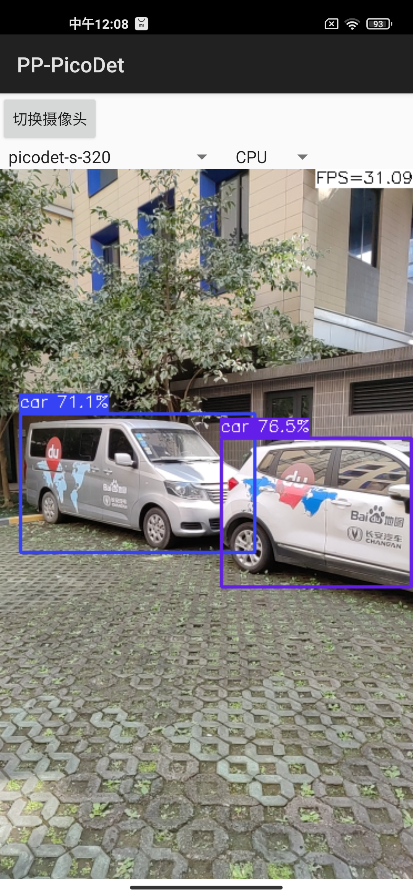

简体中文 | [English](README_en.md)

# PP-PicoDet


## 最新动态

- 发布全新系列PP-PicoDet模型：**（2022.03.20）**
  - (1)引入TAL及ETA Head，优化PAN等结构，精度提升2个点以上；
  - (2)优化CPU端预测速度，同时训练速度提升一倍；
  - (3)导出模型将后处理包含在网络中，预测直接输出box结果，无需二次开发，迁移成本更低，端到端预测速度提升10%-20%。

## 历史版本模型

- 详情请参考：[PicoDet 2021.10版本](./legacy_model/)

## 简介

PaddleDetection中提出了全新的轻量级系列模型`PP-PicoDet`，在移动端具有卓越的性能，成为全新SOTA轻量级模型。详细的技术细节可以参考我们的[arXiv技术报告](https://arxiv.org/abs/2111.00902)。

PP-PicoDet模型有如下特点：

- 🌟 更高的mAP: 第一个在1M参数量之内`mAP(0.5:0.95)`超越**30+**(输入416像素时)。
- 🚀 更快的预测速度: 网络预测在ARM CPU下可达150FPS。
- 😊 部署友好: 支持PaddleLite/MNN/NCNN/OpenVINO等预测库，支持转出ONNX，提供了C++/Python/Android的demo。
- 😍 先进的算法: 我们在现有SOTA算法中进行了创新, 包括：ESNet, CSP-PAN, SimOTA等等。


<div align="center">
  
</div>

## 基线

| 模型     | 输入尺寸 | mAP<sup>val<br>0.5:0.95 | mAP<sup>val<br>0.5 | 参数量<br><sup>(M) | FLOPS<br><sup>(G) | 预测时延<sup><small>[CPU](#latency)</small><sup><br><sup>(ms) | 预测时延<sup><small>[Lite](#latency)</small><sup><br><sup>(ms) |  权重下载  | 配置文件 | 导出模型  |
| :-------- | :--------: | :---------------------: | :----------------: | :----------------: | :---------------: | :-----------------------------: | :-----------------------------: | :----------------------------------------: | :--------------------------------------- | :--------------------------------------- |
| PicoDet-XS |  320*320   |          23.5           |        36.1       |        0.70        |       0.67        |              3.9ms              |            7.81ms             | [model](https://paddledet.bj.bcebos.com/models/picodet_xs_320_coco_lcnet.pdparams) &#124; [log](https://paddledet.bj.bcebos.com/logs/train_picodet_xs_320_coco_lcnet.log) | [config](https://github.com/PaddlePaddle/PaddleDetection/tree/release/2.4/configs/picodet/picodet_xs_320_coco_lcnet.yml) | [w/ 后处理](https://paddledet.bj.bcebos.com/deploy/Inference/picodet_xs_320_coco_lcnet.tar) &#124; [w/o 后处理](https://paddledet.bj.bcebos.com/deploy/Inference/picodet_xs_320_coco_lcnet_non_postprocess.tar) |
| PicoDet-XS |  416*416   |          26.2           |        39.3        |        0.70        |       1.13        |              6.1ms             |            12.38ms             | [model](https://paddledet.bj.bcebos.com/models/picodet_xs_416_coco_lcnet.pdparams) &#124; [log](https://paddledet.bj.bcebos.com/logs/train_picodet_xs_416_coco_lcnet.log) | [config](https://github.com/PaddlePaddle/PaddleDetection/tree/release/2.4/configs/picodet/picodet_xs_416_coco_lcnet.yml) | [w/ 后处理](https://paddledet.bj.bcebos.com/deploy/Inference/picodet_xs_416_coco_lcnet.tar) &#124; [w/o 后处理](https://paddledet.bj.bcebos.com/deploy/Inference/picodet_xs_416_coco_lcnet_non_postprocess.tar) |
| PicoDet-S |  320*320   |          29.1           |        43.4        |        1.18       |       0.97       |             4.8ms              |            9.56ms             | [model](https://paddledet.bj.bcebos.com/models/picodet_s_320_coco_lcnet.pdparams) &#124; [log](https://paddledet.bj.bcebos.com/logs/train_picodet_s_320_coco_lcnet.log) | [config](https://github.com/PaddlePaddle/PaddleDetection/tree/release/2.4/configs/picodet/picodet_s_320_coco_lcnet.yml) | [w/ 后处理](https://paddledet.bj.bcebos.com/deploy/Inference/picodet_s_320_coco_lcnet.tar) &#124; [w/o 后处理](https://paddledet.bj.bcebos.com/deploy/Inference/picodet_s_320_coco_lcnet_non_postprocess.tar) |
| PicoDet-S |  416*416   |          32.5           |        47.6        |        1.18        |       1.65       |              6.6ms              |            15.20ms             | [model](https://paddledet.bj.bcebos.com/models/picodet_s_416_coco_lcnet.pdparams) &#124; [log](https://paddledet.bj.bcebos.com/logs/train_picodet_s_416_coco_lcnet.log) | [config](https://github.com/PaddlePaddle/PaddleDetection/tree/release/2.4/configs/picodet/picodet_s_416_coco_lcnet.yml) | [w/ 后处理](https://paddledet.bj.bcebos.com/deploy/Inference/picodet_s_416_coco_lcnet.tar) &#124; [w/o 后处理](https://paddledet.bj.bcebos.com/deploy/Inference/picodet_s_416_coco_lcnet_non_postprocess.tar) |
| PicoDet-M |  320*320   |          34.4           |        50.0        |        3.46        |       2.57       |             8.2ms              |            17.68ms             | [model](https://paddledet.bj.bcebos.com/models/picodet_m_320_coco_lcnet.pdparams) &#124; [log](https://paddledet.bj.bcebos.com/logs/train_picodet_m_320_coco_lcnet.log) | [config](https://github.com/PaddlePaddle/PaddleDetection/tree/release/2.4/configs/picodet/picodet_m_320_coco_lcnet.yml) | [w/ 后处理](https://paddledet.bj.bcebos.com/deploy/Inference/picodet_m_320_coco_lcnet.tar) &#124; [w/o 后处理](https://paddledet.bj.bcebos.com/deploy/Inference/picodet_m_320_coco_lcnet_non_postprocess.tar) |
| PicoDet-M |  416*416   |          37.5           |        53.4       |        3.46        |       4.34        |              12.7ms              |            28.39ms            | [model](https://paddledet.bj.bcebos.com/models/picodet_m_416_coco_lcnet.pdparams) &#124; [log](https://paddledet.bj.bcebos.com/logs/train_picodet_m_416_coco_lcnet.log) | [config](https://github.com/PaddlePaddle/PaddleDetection/tree/release/2.4/configs/picodet/picodet_m_416_coco_lcnet.yml) | [w/ 后处理](https://paddledet.bj.bcebos.com/deploy/Inference/picodet_m_416_coco_lcnet.tar) &#124; [w/o 后处理](https://paddledet.bj.bcebos.com/deploy/Inference/picodet_m_416_coco_lcnet_non_postprocess.tar) |
| PicoDet-L |  320*320   |          36.1           |        52.0        |        5.80       |       4.20        |              11.5ms             |            25.21ms           | [model](https://paddledet.bj.bcebos.com/models/picodet_l_320_coco_lcnet.pdparams) &#124; [log](https://paddledet.bj.bcebos.com/logs/train_picodet_l_320_coco_lcnet.log) | [config](https://github.com/PaddlePaddle/PaddleDetection/tree/release/2.4/configs/picodet/picodet_l_320_coco_lcnet.yml) | [w/ 后处理](https://paddledet.bj.bcebos.com/deploy/Inference/picodet_l_320_coco_lcnet.tar) &#124; [w/o 后处理](https://paddledet.bj.bcebos.com/deploy/Inference/picodet_l_320_coco_lcnet_non_postprocess.tar) |
| PicoDet-L |  416*416   |          39.4           |        55.7        |        5.80        |       7.10       |              20.7ms              |            42.23ms            | [model](https://paddledet.bj.bcebos.com/models/picodet_l_416_coco_lcnet.pdparams) &#124; [log](https://paddledet.bj.bcebos.com/logs/train_picodet_l_416_coco_lcnet.log) | [config](https://github.com/PaddlePaddle/PaddleDetection/tree/release/2.4/configs/picodet/picodet_l_416_coco_lcnet.yml) | [w/ 后处理](https://paddledet.bj.bcebos.com/deploy/Inference/picodet_l_416_coco_lcnet.tar) &#124; [w/o 后处理](https://paddledet.bj.bcebos.com/deploy/Inference/picodet_l_416_coco_lcnet_non_postprocess.tar) |
| PicoDet-L |  640*640   |          42.6           |        59.2        |        5.80        |       16.81        |              62.5ms              |            108.1ms          | [model](https://paddledet.bj.bcebos.com/models/picodet_l_640_coco_lcnet.pdparams) &#124; [log](https://paddledet.bj.bcebos.com/logs/train_picodet_l_640_coco_lcnet.log) | [config](https://github.com/PaddlePaddle/PaddleDetection/tree/release/2.4/configs/picodet/picodet_l_640_coco_lcnet.yml) | [w/ 后处理](https://paddledet.bj.bcebos.com/deploy/Inference/picodet_l_640_coco_lcnet.tar) &#124; [w/o 后处理](https://paddledet.bj.bcebos.com/deploy/Inference/picodet_l_640_coco_lcnet_non_postprocess.tar) |

<details open>
<summary><b>注意事项:</b></summary>

- <a name="latency">时延测试：</a> 我们所有的模型都在`英特尔酷睿i7 10750H`的CPU 和`骁龙865(4xA77+4xA55)`的ARM CPU上测试(4线程，FP16预测)。上面表格中标有`CPU`的是使用OpenVINO测试，标有`Lite`的是使用[Paddle Lite](https://github.com/PaddlePaddle/Paddle-Lite)进行测试。
- PicoDet在COCO train2017上训练，并且在COCO val2017上进行验证。使用4卡GPU训练，并且上表所有的预训练模型都是通过发布的默认配置训练得到。
- Benchmark测试：测试速度benchmark性能时，导出模型后处理不包含在网络中，需要设置`-o export.benchmark=True` 或手动修改[runtime.yml](https://github.com/PaddlePaddle/PaddleDetection/blob/release/2.4/configs/runtime.yml#L12)。

</details>

#### 其他模型的基线

| 模型     | 输入尺寸 | mAP<sup>val<br>0.5:0.95 | mAP<sup>val<br>0.5 | 参数量<br><sup>(M) | FLOPS<br><sup>(G) | 预测时延<sup><small>[NCNN](#latency)</small><sup><br><sup>(ms) |
| :-------- | :--------: | :---------------------: | :----------------: | :----------------: | :---------------: | :-----------------------------: |
| YOLOv3-Tiny |  416*416   |          16.6           |        33.1      |        8.86        |       5.62        |             25.42               |
| YOLOv4-Tiny |  416*416   |          21.7           |        40.2        |        6.06           |       6.96           |             23.69               |
| PP-YOLO-Tiny |  320*320       |          20.6         |        -              |   1.08             |    0.58             |    6.75                           |  
| PP-YOLO-Tiny |  416*416   |          22.7          |    -               |    1.08               |    1.02             |    10.48                          |  
| Nanodet-M |  320*320      |          20.6            |    -               |    0.95               |    0.72             |    8.71                           |  
| Nanodet-M |  416*416   |          23.5             |    -               |    0.95               |    1.2              |  13.35                          |
| Nanodet-M 1.5x |  416*416   |          26.8        |    -                  | 2.08               |    2.42             |    15.83                          |
| YOLOX-Nano     |  416*416   |          25.8          |    -               |    0.91               |    1.08             |    19.23                          |
| YOLOX-Tiny     |  416*416   |          32.8          |    -               |    5.06               |    6.45             |    32.77                          |
| YOLOv5n |  640*640       |          28.4             |    46.0            |    1.9                |    4.5              |    40.35                          |
| YOLOv5s |  640*640       |          37.2             |    56.0            |    7.2                |    16.5             |    78.05                          |

- ARM测试的benchmark脚本来自: [MobileDetBenchmark](https://github.com/JiweiMaster/MobileDetBenchmark)。

## 快速开始

<details open>
<summary>依赖包:</summary>

- PaddlePaddle == 2.2.2

</details>

<details>
<summary>安装</summary>

- [安装指导文档](https://github.com/PaddlePaddle/PaddleDetection/blob/release/2.4/docs/tutorials/INSTALL.md)
- [准备数据文档](https://github.com/PaddlePaddle/PaddleDetection/blob/release/2.4/docs/tutorials/PrepareDataSet_en.md)

</details>

<details>
<summary>训练&评估</summary>

- 单卡GPU上训练:

```shell
# training on single-GPU
export CUDA_VISIBLE_DEVICES=0
python tools/train.py -c configs/picodet/picodet_s_320_coco_lcnet.yml --eval
```

**注意：**如果训练时显存out memory，将TrainReader中batch_size调小，同时LearningRate中base_lr等比例减小。同时我们发布的config均由4卡训练得到，如果改变GPU卡数为1，那么base_lr需要减小4倍。

- 多卡GPU上训练:


```shell
# training on multi-GPU
export CUDA_VISIBLE_DEVICES=0,1,2,3
python -m paddle.distributed.launch --gpus 0,1,2,3 tools/train.py -c configs/picodet/picodet_s_320_coco_lcnet.yml --eval
```

**注意：**PicoDet所有模型均由4卡GPU训练得到，如果改变训练GPU卡数，需要按线性比例缩放学习率base_lr。

- 评估:

```shell
python tools/eval.py -c configs/picodet/picodet_s_320_coco_lcnet.yml \
              -o weights=https://paddledet.bj.bcebos.com/models/picodet_s_320_coco_lcnet.pdparams
```

- 测试:

```shell
python tools/infer.py -c configs/picodet/picodet_s_320_coco_lcnet.yml \
              -o weights=https://paddledet.bj.bcebos.com/models/picodet_s_320_coco_lcnet.pdparams
```

详情请参考[快速开始文档](https://github.com/PaddlePaddle/PaddleDetection/blob/release/2.4/docs/tutorials/GETTING_STARTED.md).

</details>


## 部署

### 导出及转换模型

<details open>
<summary>1. 导出模型</summary>

```shell
cd PaddleDetection
python tools/export_model.py -c configs/picodet/picodet_s_320_coco_lcnet.yml \
              -o weights=https://paddledet.bj.bcebos.com/models/picodet_s_320_coco_lcnet.pdparams \
              --output_dir=output_inference
```

- 如无需导出后处理，请指定：`-o export.benchmark=True`（如果-o已出现过，此处删掉-o）或者手动修改[runtime.yml](https://github.com/PaddlePaddle/PaddleDetection/blob/release/2.4/configs/runtime.yml) 中相应字段。
- 如无需导出NMS，请指定：`-o export.nms=False`或者手动修改[runtime.yml](https://github.com/PaddlePaddle/PaddleDetection/blob/release/2.4/configs/runtime.yml) 中相应字段。许多导出至ONNX场景只支持单输入及固定shape输出，所以如果导出至ONNX，推荐不导出NMS。

</details>

<details>
<summary>2. 转换模型至Paddle Lite (点击展开)</summary>

- 安装Paddlelite>=2.10:

```shell
pip install paddlelite
```

- 转换模型至Paddle Lite格式：

```shell
# FP32
paddle_lite_opt --model_dir=output_inference/picodet_s_320_coco_lcnet --valid_targets=arm --optimize_out=picodet_s_320_coco_fp32
# FP16
paddle_lite_opt --model_dir=output_inference/picodet_s_320_coco_lcnet --valid_targets=arm --optimize_out=picodet_s_320_coco_fp16 --enable_fp16=true
```

</details>

<details>
<summary>3. 转换模型至ONNX (点击展开)</summary>

- 安装[Paddle2ONNX](https://github.com/PaddlePaddle/Paddle2ONNX) >= 0.7 并且 ONNX > 1.10.1, 细节请参考[导出ONNX模型教程](../../deploy/EXPORT_ONNX_MODEL.md)

```shell
pip install onnx
pip install paddle2onnx==0.9.2
```

- 转换模型:

```shell
paddle2onnx --model_dir output_inference/picodet_s_320_coco_lcnet/ \
            --model_filename model.pdmodel  \
            --params_filename model.pdiparams \
            --opset_version 11 \
            --save_file picodet_s_320_coco.onnx
```

- 简化ONNX模型: 使用`onnx-simplifier`库来简化ONNX模型。

  - 安装 onnx-simplifier >= 0.3.6:
  ```shell
  pip install onnx-simplifier
  ```
  - 简化ONNX模型:
  ```shell
  python -m onnxsim picodet_s_320_coco.onnx picodet_s_processed.onnx
  ```

  如果模型包含所有后处理，简化模型时需要指定`dynamic-input-shape`：
  ```shell
  python -m onnxsim picodet_s_320_coco.onnx picodet_s_processed.onnx --dynamic-input-shape --input-shape image:1,3,320,320
  ```

</details>

- 部署用的模型

| 模型     | 输入尺寸 | ONNX( w/o 后处理)  | Paddle Lite(fp32) | Paddle Lite(fp16) |
| :-------- | :--------: | :---------------------: | :----------------: | :----------------: |
| PicoDet-XS |  320*320   | [( w/ 后处理)](https://paddledet.bj.bcebos.com/deploy/third_engine/picodet_xs_320_lcnet_postprocessed.onnx) &#124; [( w/o 后处理)](https://paddledet.bj.bcebos.com/deploy/third_engine/picodet_xs_320_coco_lcnet.onnx) | [model](https://paddledet.bj.bcebos.com/deploy/paddlelite/picodet_xs_320_coco_lcnet.tar) | [model](https://paddledet.bj.bcebos.com/deploy/paddlelite/picodet_xs_320_coco_lcnet_fp16.tar) |
| PicoDet-XS |  416*416   | [( w/ 后处理)](https://paddledet.bj.bcebos.com/deploy/third_engine/picodet_xs_416_lcnet_postprocessed.onnx) &#124; [( w/o 后处理)](https://paddledet.bj.bcebos.com/deploy/third_engine/picodet_xs_416_coco_lcnet.onnx) | [model](https://paddledet.bj.bcebos.com/deploy/paddlelite/picodet_xs_416_coco_lcnet.tar) | [model](https://paddledet.bj.bcebos.com/deploy/paddlelite/picodet_xs_416_coco_lcnet_fp16.tar) |
| PicoDet-S |  320*320   | [( w/ 后处理)](https://paddledet.bj.bcebos.com/deploy/third_engine/picodet_s_320_lcnet_postprocessed.onnx) &#124; [( w/o 后处理)](https://paddledet.bj.bcebos.com/deploy/third_engine/picodet_s_320_coco_lcnet.onnx) | [model](https://paddledet.bj.bcebos.com/deploy/paddlelite/picodet_s_320_coco_lcnet.tar) | [model](https://paddledet.bj.bcebos.com/deploy/paddlelite/picodet_s_320_coco_lcnet_fp16.tar) |
| PicoDet-S |  416*416   |  [( w/ 后处理)](https://paddledet.bj.bcebos.com/deploy/third_engine/picodet_s_416_lcnet_postprocessed.onnx) &#124; [( w/o 后处理)](https://paddledet.bj.bcebos.com/deploy/third_engine/picodet_s_416_coco_lcnet.onnx) | [model](https://paddledet.bj.bcebos.com/deploy/paddlelite/picodet_s_416_coco_lcnet.tar) | [model](https://paddledet.bj.bcebos.com/deploy/paddlelite/picodet_s_416_coco_lcnet_fp16.tar) |
| PicoDet-M |  320*320   | [( w/ 后处理)](https://paddledet.bj.bcebos.com/deploy/third_engine/picodet_m_320_lcnet_postprocessed.onnx) &#124; [( w/o 后处理)](https://paddledet.bj.bcebos.com/deploy/third_engine/picodet_m_320_coco_lcnet.onnx) | [model](https://paddledet.bj.bcebos.com/deploy/paddlelite/picodet_m_320_coco_lcnet.tar) | [model](https://paddledet.bj.bcebos.com/deploy/paddlelite/picodet_m_320_coco_lcnet_fp16.tar) |
| PicoDet-M |  416*416   | [( w/ 后处理)](https://paddledet.bj.bcebos.com/deploy/third_engine/picodet_m_416_lcnet_postprocessed.onnx) &#124; [( w/o 后处理)](https://paddledet.bj.bcebos.com/deploy/third_engine/picodet_m_416_coco_lcnet.onnx) | [model](https://paddledet.bj.bcebos.com/deploy/paddlelite/picodet_m_416_coco_lcnet.tar) | [model](https://paddledet.bj.bcebos.com/deploy/paddlelite/picodet_m_416_coco_lcnet_fp16.tar) |
| PicoDet-L |  320*320   | [( w/ 后处理)](https://paddledet.bj.bcebos.com/deploy/third_engine/picodet_l_320_lcnet_postprocessed.onnx) &#124; [( w/o 后处理)](https://paddledet.bj.bcebos.com/deploy/third_engine/picodet_l_320_coco_lcnet.onnx) | [model](https://paddledet.bj.bcebos.com/deploy/paddlelite/picodet_l_320_coco_lcnet.tar) | [model](https://paddledet.bj.bcebos.com/deploy/paddlelite/picodet_l_320_coco_lcnet_fp16.tar) |
| PicoDet-L |  416*416   | [( w/ 后处理)](https://paddledet.bj.bcebos.com/deploy/third_engine/picodet_l_416_lcnet_postprocessed.onnx) &#124; [( w/o 后处理)](https://paddledet.bj.bcebos.com/deploy/third_engine/picodet_l_416_coco_lcnet.onnx) | [model](https://paddledet.bj.bcebos.com/deploy/paddlelite/picodet_l_416_coco_lcnet.tar) | [model](https://paddledet.bj.bcebos.com/deploy/paddlelite/picodet_l_416_coco_lcnet_fp16.tar) |
| PicoDet-L |  640*640   | [( w/ 后处理)](https://paddledet.bj.bcebos.com/deploy/third_engine/picodet_l_640_lcnet_postprocessed.onnx) &#124; [( w/o 后处理)](https://paddledet.bj.bcebos.com/deploy/third_engine/picodet_l_640_coco_lcnet.onnx) | [model](https://paddledet.bj.bcebos.com/deploy/paddlelite/picodet_l_640_coco_lcnet.tar) | [model](https://paddledet.bj.bcebos.com/deploy/paddlelite/picodet_l_640_coco_lcnet_fp16.tar) |


### 部署

| 预测库     | Python | C++  | 带后处理预测 |
| :-------- | :--------: | :---------------------: | :----------------: |
| OpenVINO | [Python](../../deploy/third_engine/demo_openvino/python) | [C++](../../deploy/third_engine/demo_openvino)（带后处理开发中） |  ✔︎ |
| Paddle Lite |  -    |  [C++](../../deploy/lite) | ✔︎ |
| Android Demo |  -  |  [Paddle Lite](https://github.com/PaddlePaddle/Paddle-Lite-Demo/tree/develop/object_detection/android/app/cxx/picodet_detection_demo) | ✔︎ |
| PaddleInference | [Python](../../deploy/python) |  [C++](../../deploy/cpp) | ✔︎ |
| ONNXRuntime  | [Python](../../deploy/third_engine/demo_onnxruntime) | Comming soon | ✔︎ |
| NCNN |  Comming soon  | [C++](../../deploy/third_engine/demo_ncnn) | ✘ |
| MNN  | Comming soon | [C++](../../deploy/third_engine/demo_mnn) |  ✘ |


Android demo可视化：
<div align="center">
  
</div>


## 量化

<details open>
<summary>依赖包:</summary>

- PaddlePaddle >= 2.2.2
- PaddleSlim >= 2.2.2

**安装:**

```shell
pip install paddleslim==2.2.2
```

</details>

<details open>
<summary>量化训练</summary>

开始量化训练:

```shell
python tools/train.py -c configs/picodet/picodet_s_416_coco_lcnet.yml \
          --slim_config configs/slim/quant/picodet_s_416_lcnet_quant.yml --eval
```

- 更多细节请参考[slim文档](https://github.com/PaddlePaddle/PaddleDetection/tree/release/2.4/configs/slim)

</details>

- 量化训练Model ZOO：

| 量化模型     | 输入尺寸 | mAP<sup>val<br>0.5:0.95  | Configs | Weight | Inference Model | Paddle Lite(INT8) |
| :-------- | :--------: | :--------------------: | :-------: | :----------------: | :----------------: | :----------------: |
| PicoDet-S |  416*416   |  31.5  | [config](./picodet_s_416_coco_lcnet.yml) &#124; [slim config](../slim/quant/picodet_s_416_lcnet_quant.yml) | [model](https://paddledet.bj.bcebos.com/models/picodet_s_416_coco_lcnet_quant.pdparams)  | [w/ 后处理](https://paddledet.bj.bcebos.com/deploy/Inference/picodet_s_416_coco_lcnet_quant.tar) &#124; [w/o 后处理](https://paddledet.bj.bcebos.com/deploy/Inference/picodet_s_416_coco_lcnet_quant_non_postprocess.tar) |  [w/ 后处理](https://paddledet.bj.bcebos.com/deploy/paddlelite/picodet_s_416_coco_lcnet_quant.nb) &#124; [w/o 后处理](https://paddledet.bj.bcebos.com/deploy/paddlelite/picodet_s_416_coco_lcnet_quant_non_postprocess.nb) |

## 非结构化剪枝

<details open>
<summary>教程:</summary>

训练及部署细节请参考[非结构化剪枝文档](https://github.com/PaddlePaddle/PaddleDetection/tree/release/2.4/configs/picodet/legacy_model/pruner/README.md)。

</details>

## 应用

- **行人检测：** `PicoDet-S-Pedestrian`行人检测模型请参考[PP-TinyPose](https://github.com/PaddlePaddle/PaddleDetection/tree/release/2.4/configs/keypoint/tiny_pose#%E8%A1%8C%E4%BA%BA%E6%A3%80%E6%B5%8B%E6%A8%A1%E5%9E%8B)

- **主体检测：** `PicoDet-L-Mainbody`主体检测模型请参考[主体检测文档](./legacy_model/application/mainbody_detection/README.md)

## FAQ

<details>
<summary>显存爆炸(Out of memory error)</summary>

请减小配置文件中`TrainReader`的`batch_size`。

</details>

<details>
<summary>如何迁移学习</summary>

请重新设置配置文件中的`pretrain_weights`字段，比如利用COCO上训好的模型在自己的数据上继续训练：
```yaml
pretrain_weights: https://paddledet.bj.bcebos.com/models/picodet_l_640_coco_lcnet.pdparams
```

</details>

<details>
<summary>`transpose`算子在某些硬件上耗时验证</summary>

请使用`PicoDet-LCNet`模型，`transpose`较少。

</details>


<details>
<summary>如何计算模型参数量。</summary>

可以将以下代码插入：[trainer.py](https://github.com/PaddlePaddle/PaddleDetection/blob/release/2.4/ppdet/engine/trainer.py#L141) 来计算参数量。

```python
params = sum([
    p.numel() for n, p in self.model. named_parameters()
    if all([x not in n for x in ['_mean', '_variance']])
]) # exclude BatchNorm running status
print('params: ', params)
```

</details>

## 引用PP-PicoDet
如果需要在你的研究中使用PP-PicoDet，请通过一下方式引用我们的技术报告：
```
@misc{yu2021pppicodet,
      title={PP-PicoDet: A Better Real-Time Object Detector on Mobile Devices},
      author={Guanghua Yu and Qinyao Chang and Wenyu Lv and Chang Xu and Cheng Cui and Wei Ji and Qingqing Dang and Kaipeng Deng and Guanzhong Wang and Yuning Du and Baohua Lai and Qiwen Liu and Xiaoguang Hu and Dianhai Yu and Yanjun Ma},
      year={2021},
      eprint={2111.00902},
      archivePrefix={arXiv},
      primaryClass={cs.CV}
}

```
