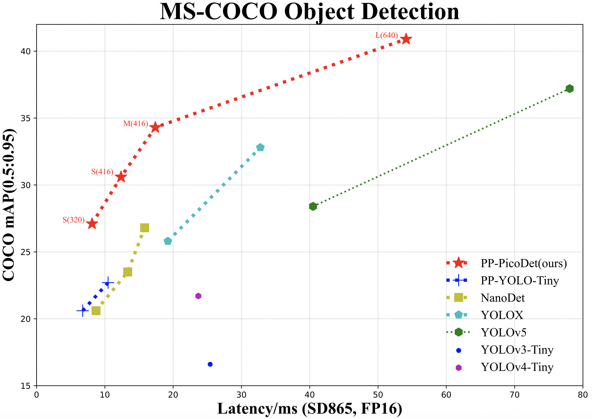
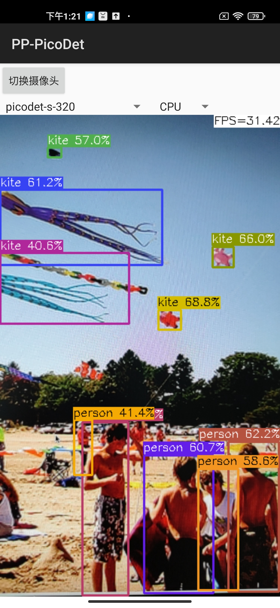

English | [简体中文](README_cn.md)

# PP-PicoDet


## Introduction

We developed a series of lightweight models, named `PP-PicoDet`. Because of the excellent performance, our models are very suitable for deployment on mobile or CPU. For more details, please refer to our [report on arXiv](https://arxiv.org/abs/2111.00902).

- 🌟 Higher mAP: the **first** object detectors that surpass mAP(0.5:0.95) **30+** within 1M parameters when the input size is 416.
- 🚀 Faster latency: 150FPS on mobile ARM CPU.
- 😊 Deploy friendly: support PaddleLite/MNN/NCNN/OpenVINO and provide C++/Python/Android implementation.
- 😍 Advanced algorithm: use the most advanced algorithms and offer innovation, such as ESNet, CSP-PAN, SimOTA with VFL, etc.


<div align="center">
  
</div>

### Comming Soon
- [ ] More series of model, such as smaller or larger model.
- [ ] Pretrained models for more scenarios.
- [ ] More features in need.

## Benchmark

| Model     | Input size | mAP<sup>val<br>0.5:0.95 | mAP<sup>val<br>0.5 | Params<br><sup>(M) | FLOPS<br><sup>(G) | Latency<sup><small>[NCNN](#latency)</small><sup><br><sup>(ms) | Latency<sup><small>[Lite](#latency)</small><sup><br><sup>(ms) |  Download  | Config |
| :-------- | :--------: | :---------------------: | :----------------: | :----------------: | :---------------: | :-----------------------------: | :-----------------------------: | :----------------------------------------: | :--------------------------------------- |
| PicoDet-S |  320*320   |          27.1           |        41.4        |        0.99        |       0.73        |              8.13               |            **6.65**             | [model](https://paddledet.bj.bcebos.com/models/picodet_s_320_coco.pdparams) &#124; [log](https://paddledet.bj.bcebos.com/logs/train_picodet_s_320_coco.log) | [config](https://github.com/PaddlePaddle/PaddleDetection/tree/release/2.3/configs/picodet/picodet_s_320_coco.yml) |
| PicoDet-S |  416*416   |          30.7           |        45.8        |        0.99        |       1.24        |              12.37              |            **9.82**             | [model](https://paddledet.bj.bcebos.com/models/picodet_s_416_coco.pdparams) &#124; [log](https://paddledet.bj.bcebos.com/logs/train_picodet_s_416_coco.log) | [config](https://github.com/PaddlePaddle/PaddleDetection/tree/release/2.3/configs/picodet/picodet_s_416_coco.yml) |
| PicoDet-M |  320*320   |          30.9           |        45.7        |        2.15        |       1.48        |              11.27              |            **9.61**             | [model](https://paddledet.bj.bcebos.com/models/picodet_m_320_coco.pdparams) &#124; [log](https://paddledet.bj.bcebos.com/logs/train_picodet_m_320_coco.log) | [config](https://github.com/PaddlePaddle/PaddleDetection/tree/release/2.3/configs/picodet/picodet_m_320_coco.yml) |
| PicoDet-M |  416*416   |          34.8           |        50.5        |        2.15        |       2.50        |              17.39              |            **15.88**            | [model](https://paddledet.bj.bcebos.com/models/picodet_m_416_coco.pdparams) &#124; [log](https://paddledet.bj.bcebos.com/logs/train_picodet_m_416_coco.log) | [config](https://github.com/PaddlePaddle/PaddleDetection/tree/release/2.3/configs/picodet/picodet_m_416_coco.yml) |
| PicoDet-L |  320*320   |          32.9           |        48.2        |        3.30        |       2.23        |              15.26              |            **13.42**            | [model](https://paddledet.bj.bcebos.com/models/picodet_l_320_coco.pdparams) &#124; [log](https://paddledet.bj.bcebos.com/logs/train_picodet_l_320_coco.log) | [config](https://github.com/PaddlePaddle/PaddleDetection/tree/release/2.3/configs/picodet/picodet_l_320_coco.yml) |
| PicoDet-L |  416*416   |          36.6           |        52.5        |        3.30        |       3.76        |              23.36              |            **21.85**            | [model](https://paddledet.bj.bcebos.com/models/picodet_l_416_coco.pdparams) &#124; [log](https://paddledet.bj.bcebos.com/logs/train_picodet_l_416_coco.log) | [config](https://github.com/PaddlePaddle/PaddleDetection/tree/release/2.3/configs/picodet/picodet_l_416_coco.yml) |
| PicoDet-L |  640*640   |          40.9           |        57.6        |        3.30        |       8.91        |              54.11              |            **50.55**            | [model](https://paddledet.bj.bcebos.com/models/picodet_l_640_coco.pdparams) &#124; [log](https://paddledet.bj.bcebos.com/logs/train_picodet_l_640_coco.log) | [config](https://github.com/PaddlePaddle/PaddleDetection/tree/release/2.3/configs/picodet/picodet_l_640_coco.yml) |

#### More Configs

| Model     | Input size | mAP<sup>val<br>0.5:0.95 | mAP<sup>val<br>0.5 | Params<br><sup>(M) | FLOPS<br><sup>(G) | Latency<sup><small>[NCNN](#latency)</small><sup><br><sup>(ms) | Latency<sup><small>[Lite](#latency)</small><sup><br><sup>(ms) |  Download  | Config |
| :-------- | :--------: | :---------------------: | :----------------: | :----------------: | :---------------: | :-----------------------------: | :-----------------------------: | :----------------------------------------: | :--------------------------------------- |
| PicoDet-Shufflenetv2 1x      |  416*416   |          30.0           |        44.6        |        1.17        |       1.53        |              15.06              |            **10.63**            |      [model](https://paddledet.bj.bcebos.com/models/picodet_shufflenetv2_1x_416_coco.pdparams) &#124; [log](https://paddledet.bj.bcebos.com/logs/train_picodet_shufflenetv2_1x_416_coco.log)      | [config](https://github.com/PaddlePaddle/PaddleDetection/tree/release/2.3/configs/picodet/more_config/picodet_shufflenetv2_1x_416_coco.yml)      |
| PicoDet-MobileNetv3-large 1x |  416*416   |          35.6           |        52.0        |        3.55        |       2.80        |              20.71              |            **17.88**            | [model](https://paddledet.bj.bcebos.com/models/picodet_mobilenetv3_large_1x_416_coco.pdparams) &#124; [log](https://paddledet.bj.bcebos.com/logs/train_picodet_mobilenetv3_large_1x_416_coco.log) | [config](https://github.com/PaddlePaddle/PaddleDetection/tree/release/2.3/configs/picodet/more_config/picodet_mobilenetv3_large_1x_416_coco.yml) |
| PicoDet-LCNet 1.5x           |  416*416   |          36.3           |        52.2        |        3.10        |       3.85        |              21.29              |            **20.8**             |           [model](https://paddledet.bj.bcebos.com/models/picodet_lcnet_1_5x_416_coco.pdparams) &#124; [log](https://paddledet.bj.bcebos.com/logs/train_picodet_lcnet_1_5x_416_coco.log)           | [config](https://github.com/PaddlePaddle/PaddleDetection/tree/release/2.3/configs/picodet/more_config/picodet_lcnet_1_5x_416_coco.yml)           |
| PicoDet-LCNet 1.5x           |  640*640   |          40.6           |        57.4        |        3.10        |       -        |              -              |            -             |           [model](https://paddledet.bj.bcebos.com/models/picodet_lcnet_1_5x_640_coco.pdparams) &#124; [log](https://paddledet.bj.bcebos.com/logs/train_picodet_lcnet_1_5x_640_coco.log)           | [config](https://github.com/PaddlePaddle/PaddleDetection/tree/release/2.3/configs/picodet/more_config/picodet_lcnet_1_5x_640_coco.yml)           |
| PicoDet-R18           |  640*640   |          40.7           |        57.2        |        11.10        |       -        |              -              |            -             |           [model](https://paddledet.bj.bcebos.com/models/picodet_r18_640_coco.pdparams) &#124; [log](https://paddledet.bj.bcebos.com/logs/train_picodet_r18_640_coco.log)           | [config](https://github.com/PaddlePaddle/PaddleDetection/tree/release/2.3/configs/picodet/more_config/picodet_r18_640_coco.yml)           |


<details open>
<summary><b>Table Notes:</b></summary>

- <a name="latency">Latency:</a> All our models test on `Qualcomm Snapdragon 865(4xA77+4xA55)` with 4 threads by arm8 and with FP16. In the above table, test latency on [NCNN](https://github.com/Tencent/ncnn) and `Lite`->[Paddle-Lite](https://github.com/PaddlePaddle/Paddle-Lite).  And testing latency with code: [MobileDetBenchmark](https://github.com/JiweiMaster/MobileDetBenchmark).
- PicoDet is trained on COCO train2017 dataset and evaluated on COCO val2017.
- PicoDet used 4 or 8 GPUs for training and all checkpoints are trained with default settings and hyperparameters.

</details>

#### Benchmark of Other Models

| Model     | Input size | mAP<sup>val<br>0.5:0.95 | mAP<sup>val<br>0.5 | Params<br><sup>(M) | FLOPS<br><sup>(G) | Latency<sup><small>[NCNN](#latency)</small><sup><br><sup>(ms) |
| :-------- | :--------: | :---------------------: | :----------------: | :----------------: | :---------------: | :-----------------------------: |
| YOLOv3-Tiny |  416*416   |          16.6           |        33.1      |        8.86        |       5.62        |             25.42               |
| YOLOv4-Tiny |  416*416   |          21.7           |        40.2        |        6.06           |       6.96           |             23.69               |
| PP-YOLO-Tiny |  320*320       |          20.6         |        -              |   1.08             |    0.58             |    6.75                           |  
| PP-YOLO-Tiny |  416*416   |          22.7          |    -               |    1.08               |    1.02             |    10.48                          |  
| Nanodet-M |  320*320      |          20.6            |    -               |    0.95               |    0.72             |    8.71                           |  
| Nanodet-M |  416*416   |          23.5             |    -               |    0.95               |    1.2              |  13.35                          |
| Nanodet-M 1.5x |  416*416   |          26.8        |    -                  | 2.08               |    2.42             |    15.83                          |
| YOLOX-Nano     |  416*416   |          25.8          |    -               |    0.91               |    1.08             |    19.23                          |
| YOLOX-Tiny     |  416*416   |          32.8          |    -               |    5.06               |    6.45             |    32.77                          |
| YOLOv5n |  640*640       |          28.4             |    46.0            |    1.9                |    4.5              |    40.35                          |
| YOLOv5s |  640*640       |          37.2             |    56.0            |    7.2                |    16.5             |    78.05                          |


## Quick Start

<details open>
<summary>Requirements:</summary>

- PaddlePaddle >= 2.1.2

</details>

<details>
<summary>Installation</summary>

- [Installation guide](https://github.com/PaddlePaddle/PaddleDetection/blob/release/2.3/docs/tutorials/INSTALL.md)
- [Prepare dataset](https://github.com/PaddlePaddle/PaddleDetection/blob/release/2.3/docs/tutorials/PrepareDataSet_en.md)

</details>

<details>
<summary>Training and Evaluation</summary>

- Training model on single-GPU:

```shell
# training on single-GPU
export CUDA_VISIBLE_DEVICES=0
python tools/train.py -c configs/picodet/picodet_s_320_coco.yml --eval
```

- Training model on multi-GPU:


```shell
# training on single-GPU
export CUDA_VISIBLE_DEVICES=0,1,2,3,4,5,6,7
python -m paddle.distributed.launch --gpus 0,1,2,3,4,5,6,7 tools/train.py -c configs/picodet/picodet_s_320_coco.yml --eval
```

- Evaluation:

```shell
python tools/eval.py -c configs/picodet/picodet_s_320_coco.yml \
              -o weights=https://paddledet.bj.bcebos.com/models/picodet_s_320_coco.pdparams
```

- Infer:

```shell
python tools/infer.py -c configs/picodet/picodet_s_320_coco.yml \
              -o weights=https://paddledet.bj.bcebos.com/models/picodet_s_320_coco.pdparams
```

Detail also can refer to [Quick start guide](https://github.com/PaddlePaddle/PaddleDetection/blob/release/2.3/docs/tutorials/GETTING_STARTED.md).

</details>


## Deployment

### Export and Convert Model

<details>
<summary>1. Export model (click to expand)</summary>

```shell
cd PaddleDetection
python tools/export_model.py -c configs/picodet/picodet_s_320_coco.yml \
              -o weights=https://paddledet.bj.bcebos.com/models/picodet_s_320_coco.pdparams --output_dir=inference_model
```

</details>

<details>
<summary>2. Convert to PaddleLite (click to expand)</summary>

- Install Paddlelite>=2.10.rc:

```shell
pip install paddlelite
```

- Convert model:

```shell
# FP32
paddle_lite_opt --model_dir=inference_model/picodet_s_320_coco --valid_targets=arm --optimize_out=picodet_s_320_coco_fp32
# FP16
paddle_lite_opt --model_dir=inference_model/picodet_s_320_coco --valid_targets=arm --optimize_out=picodet_s_320_coco_fp16 --enable_fp16=true
```

</details>

<details>
<summary>3. Convert to ONNX (click to expand)</summary>

- Install [Paddle2ONNX](https://github.com/PaddlePaddle/Paddle2ONNX) >= 0.7 and ONNX > 1.10.1, for details, please refer to [Tutorials of Export ONNX Model](../../deploy/EXPORT_ONNX_MODEL.md)

```shell
pip install onnx
pip install paddle2onnx
```

- Convert model:

```shell
paddle2onnx --model_dir output_inference/picodet_s_320_coco/ \
            --model_filename model.pdmodel  \
            --params_filename model.pdiparams \
            --opset_version 11 \
            --save_file picodet_s_320_coco.onnx
```

- Simplify ONNX model: use onnx-simplifier to simplify onnx model.

  - Install onnx-simplifier >= 0.3.6:
  ```shell
  pip install onnx-simplifier
  ```
  - simplify onnx model:
  ```shell
  python -m onnxsim picodet_s_320_coco.onnx picodet_s_processed.onnx
  ```

</details>

- Deploy models

| Model     | Input size | ONNX  | Paddle Lite(fp32) | Paddle Lite(fp16) |
| :-------- | :--------: | :---------------------: | :----------------: | :----------------: |
| PicoDet-S |  320*320   | [model](https://paddledet.bj.bcebos.com/deploy/third_engine/picodet_s_320_coco.onnx) | [model](https://paddledet.bj.bcebos.com/deploy/paddlelite/picodet_s_320.tar) | [model](https://paddledet.bj.bcebos.com/deploy/paddlelite/picodet_s_320_fp16.tar) |
| PicoDet-S |  416*416   |  [model](https://paddledet.bj.bcebos.com/deploy/third_engine/picodet_s_416_coco.onnx) | [model](https://paddledet.bj.bcebos.com/deploy/paddlelite/picodet_s_416.tar) | [model](https://paddledet.bj.bcebos.com/deploy/paddlelite/picodet_s_416_fp16.tar) |
| PicoDet-M |  320*320   | [model](https://paddledet.bj.bcebos.com/deploy/third_engine/picodet_m_320_coco.onnx) | [model](https://paddledet.bj.bcebos.com/deploy/paddlelite/picodet_m_320.tar) | [model](https://paddledet.bj.bcebos.com/deploy/paddlelite/picodet_m_320_fp16.tar) |
| PicoDet-M |  416*416   | [model](https://paddledet.bj.bcebos.com/deploy/third_engine/picodet_m_416_coco.onnx) | [model](https://paddledet.bj.bcebos.com/deploy/paddlelite/picodet_m_416.tar) | [model](https://paddledet.bj.bcebos.com/deploy/paddlelite/picodet_m_416_fp16.tar) |
| PicoDet-L |  320*320   | [model](https://paddledet.bj.bcebos.com/deploy/third_engine/picodet_l_320_coco.onnx) | [model](https://paddledet.bj.bcebos.com/deploy/paddlelite/picodet_l_320.tar) | [model](https://paddledet.bj.bcebos.com/deploy/paddlelite/picodet_l_320_fp16.tar) |
| PicoDet-L |  416*416   | [model](https://paddledet.bj.bcebos.com/deploy/third_engine/picodet_l_416_coco.onnx) | [model](https://paddledet.bj.bcebos.com/deploy/paddlelite/picodet_l_416.tar) | [model](https://paddledet.bj.bcebos.com/deploy/paddlelite/picodet_l_416_fp16.tar) |
| PicoDet-L |  640*640   | [model](https://paddledet.bj.bcebos.com/deploy/third_engine/picodet_l_640_coco.onnx) | [model](https://paddledet.bj.bcebos.com/deploy/paddlelite/picodet_l_640.tar) | [model](https://paddledet.bj.bcebos.com/deploy/paddlelite/picodet_l_640_fp16.tar) |
| PicoDet-Shufflenetv2 1x      |  416*416   | [model](https://paddledet.bj.bcebos.com/deploy/third_engine/picodet_shufflenetv2_1x_416_coco.onnx) | [model](https://paddledet.bj.bcebos.com/deploy/paddlelite/picodet_shufflenetv2_1x.tar) | [model](https://paddledet.bj.bcebos.com/deploy/paddlelite/picodet_shufflenetv2_1x_fp16.tar) |
| PicoDet-MobileNetv3-large 1x |  416*416   | [model](https://paddledet.bj.bcebos.com/deploy/third_engine/picodet_mobilenetv3_large_1x_416_coco.onnx) | [model](https://paddledet.bj.bcebos.com/deploy/paddlelite/picodet_mobilenetv3_large_1x.tar) | [model](https://paddledet.bj.bcebos.com/deploy/paddlelite/picodet_mobilenetv3_large_1x_fp16.tar) |
| PicoDet-LCNet 1.5x           |  416*416   | [model](https://paddledet.bj.bcebos.com/deploy/third_engine/picodet_lcnet_1_5x_416_coco.onnx) | [model](https://paddledet.bj.bcebos.com/deploy/paddlelite/picodet_lcnet_1_5x.tar) | [model](https://paddledet.bj.bcebos.com/deploy/paddlelite/picodet_lcnet_1_5x_fp16.tar) |


### Deploy

- PaddleInference demo [Python](../../deploy/python) & [C++](../../deploy/cpp)
- [PaddleLite C++ demo](../../deploy/lite)
- [NCNN C++/Python demo](../../deploy/third_engine/demo_ncnn)
- [MNN C++/Python demo](../../deploy/third_engine/demo_mnn)
- [OpenVINO C++ demo](../../deploy/third_engine/demo_openvino)
- [Android demo(NCNN)](https://github.com/JiweiMaster/PP-PicoDet-Android-Demo) Thank @[JiweiMaster](https://github.com/JiweiMaster) for his contribution to PaddleDetection）
- [Android demo(Paddle Lite)](https://github.com/marsplus-wjh/Picodet-PaddleLite-AndroidDemo) （Thank @[marsplus-wjh](https://github.com/marsplus-wjh) for his contribution to PaddleDetection）


Android demo visualization:
<div align="center">
  
</div>


## Quantization

<details open>
<summary>Requirements:</summary>

- PaddlePaddle >= 2.2.0rc0
- PaddleSlim >= 2.2.0rc0

**Install:**

```shell
pip install paddleslim==2.2.0rc0
```

</details>

<details>
<summary>Quant aware (click to expand)</summary>

Configure the quant config and start training:

```shell
python tools/train.py -c configs/picodet/picodet_s_320_coco.yml \
          --slim_config configs/slim/quant/picodet_s_quant.yml --eval
```

- More detail can refer to [slim document](https://github.com/PaddlePaddle/PaddleDetection/tree/develop/configs/slim)

</details>

<details>
<summary>Post quant (click to expand)</summary>

Configure the post quant config and start calibrate model:

```shell
python tools/post_quant.py -c configs/picodet/picodet_s_320_coco.yml \
          --slim_config configs/slim/post_quant/picodet_s_ptq.yml
```

- Notes: Now the accuracy of post quant is abnormal and this problem is being solved.

</details>

## Unstructured Pruning

<details open>
<summary>Toturial:</summary>

Please refer this [documentation](https://github.com/PaddlePaddle/PaddleDetection/tree/release/2.3/configs/picodet/pruner/README.md) for details such as requirements, training and deployment.

</details>

## Application

- **Pedestrian detection:** model zoo of `PicoDet-S-Pedestrian` please refer to [PP-TinyPose](https://github.com/PaddlePaddle/PaddleDetection/tree/release/2.3/configs/keypoint/tiny_pose#%E8%A1%8C%E4%BA%BA%E6%A3%80%E6%B5%8B%E6%A8%A1%E5%9E%8B)

- **Mainbody detection:** model zoo of `PicoDet-L-Mainbody` please refer to [mainbody detection](./application/mainbody_detection/README.md)

## FAQ

<details>
<summary>Out of memory error.</summary>

Please reduce the `batch_size` of `TrainReader` in config.

</details>

<details>
<summary>How to transfer learning.</summary>

Please reset `pretrain_weights` in config, which trained on coco. Such as:
```yaml
pretrain_weights: https://paddledet.bj.bcebos.com/models/picodet_l_640_coco.pdparams
```

</details>

<details>
<summary>The transpose operator is time-consuming on some hardware.</summary>

Please use `PicoDet-LCNet` model, which has fewer `transpose` operators.

</details>


<details>
<summary>How to count model parameters.</summary>

You can insert below code at [here](https://github.com/PaddlePaddle/PaddleDetection/blob/develop/ppdet/engine/trainer.py#L141) to count learnable parameters.

```python
params = sum([
    p.numel() for n, p in self.model. named_parameters()
    if all([x not in n for x in ['_mean', '_variance']])
]) # exclude BatchNorm running status
print('params: ', params)
```

</details>

## Cite PP-PicoDet
If you use PicoDet in your research, please cite our work by using the following BibTeX entry:
```
@misc{yu2021pppicodet,
      title={PP-PicoDet: A Better Real-Time Object Detector on Mobile Devices},
      author={Guanghua Yu and Qinyao Chang and Wenyu Lv and Chang Xu and Cheng Cui and Wei Ji and Qingqing Dang and Kaipeng Deng and Guanzhong Wang and Yuning Du and Baohua Lai and Qiwen Liu and Xiaoguang Hu and Dianhai Yu and Yanjun Ma},
      year={2021},
      eprint={2111.00902},
      archivePrefix={arXiv},
      primaryClass={cs.CV}
}

```
