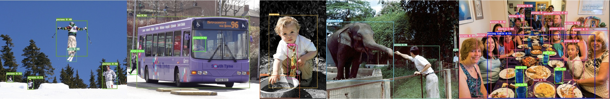
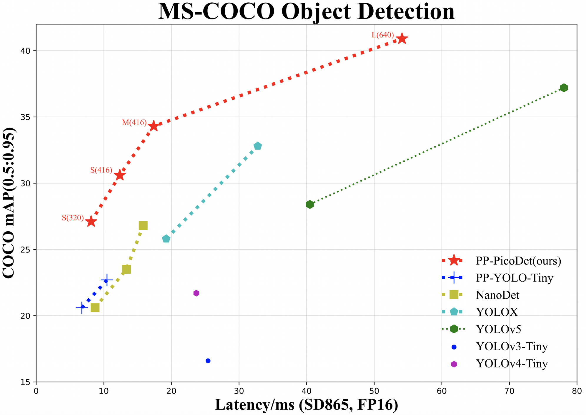
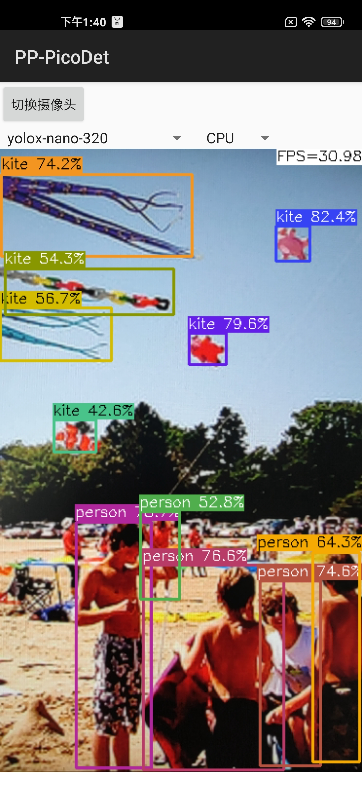
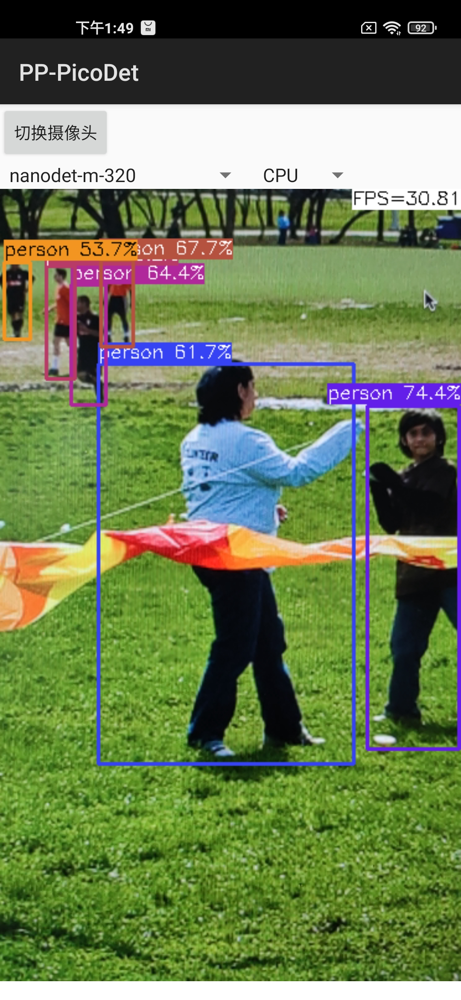
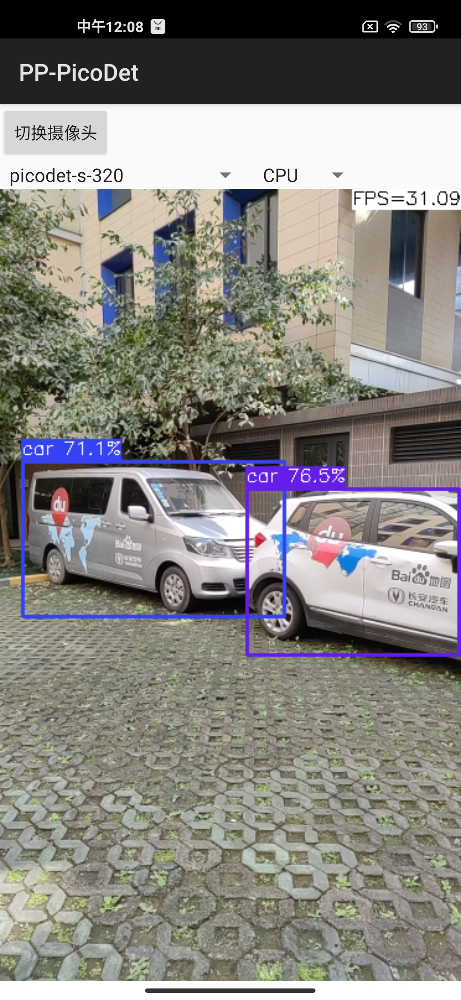
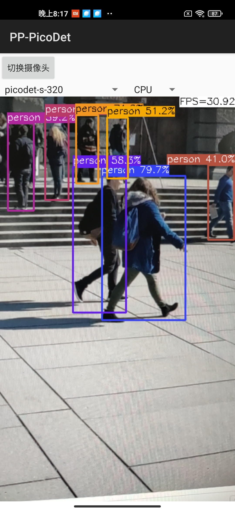

English | [简体中文](README.md)

# PP-PicoDet



## News

- Released a new series of PP-PicoDet models: **(2022.03.20)**
  - (1) It was used TAL/ETA Head and optimized PAN, which greatly improved the accuracy;
  - (2) Moreover optimized CPU prediction speed, and the training speed is greatly improved;
  - (3) The export model includes post-processing, and the prediction directly outputs the result, without secondary development, and the migration cost is lower.

### Legacy Model

- Please refer to: [PicoDet 2021.10](./legacy_model/)

## Introduction

We developed a series of lightweight models, named `PP-PicoDet`. Because of the excellent performance, our models are very suitable for deployment on mobile or CPU. For more details, please refer to our [report on arXiv](https://arxiv.org/abs/2111.00902).

- 🌟 Higher mAP: the **first** object detectors that surpass mAP(0.5:0.95) **30+** within 1M parameters when the input size is 416.
- 🚀 Faster latency: 150FPS on mobile ARM CPU.
- 😊 Deploy friendly: support PaddleLite/MNN/NCNN/OpenVINO and provide C++/Python/Android implementation.
- 😍 Advanced algorithm: use the most advanced algorithms and offer innovation, such as ESNet, CSP-PAN, SimOTA with VFL, etc.


<div align="center">
  
</div>

## Benchmark

| Model     | Input size | mAP<sup>val<br>0.5:0.95 | mAP<sup>val<br>0.5 | Params<br><sup>(M) | FLOPS<br><sup>(G) | Latency<sup><small>[CPU](#latency)</small><sup><br><sup>(ms) | Latency<sup><small>[Lite](#latency)</small><sup><br><sup>(ms) |  Weight  | Config | Inference Model |
| :-------- | :--------: | :---------------------: | :----------------: | :----------------: | :---------------: | :-----------------------------: | :-----------------------------: | :----------------------------------------: | :--------------------------------------- | :--------------------------------------- |
| PicoDet-XS |  320*320   |          23.5           |        36.1       |        0.70        |       0.67        |              3.9ms              |            7.81ms             | [model](https://paddledet.bj.bcebos.com/models/picodet_xs_320_coco_lcnet.pdparams) &#124; [log](https://paddledet.bj.bcebos.com/logs/train_picodet_xs_320_coco_lcnet.log) | [config](https://github.com/PaddlePaddle/PaddleDetection/tree/release/2.6/configs/picodet/picodet_xs_320_coco_lcnet.yml) | [w/ postprocess](https://paddledet.bj.bcebos.com/deploy/Inference/picodet_xs_320_coco_lcnet.tar) &#124; [w/o postprocess](https://paddledet.bj.bcebos.com/deploy/Inference/picodet_xs_320_coco_lcnet_non_postprocess.tar) |
| PicoDet-XS |  416*416   |          26.2           |        39.3        |        0.70        |       1.13        |              6.1ms             |            12.38ms             | [model](https://paddledet.bj.bcebos.com/models/picodet_xs_416_coco_lcnet.pdparams) &#124; [log](https://paddledet.bj.bcebos.com/logs/train_picodet_xs_416_coco_lcnet.log) | [config](https://github.com/PaddlePaddle/PaddleDetection/tree/release/2.6/configs/picodet/picodet_xs_416_coco_lcnet.yml) | [w/ postprocess](https://paddledet.bj.bcebos.com/deploy/Inference/picodet_xs_416_coco_lcnet.tar) &#124; [w/o postprocess](https://paddledet.bj.bcebos.com/deploy/Inference/picodet_xs_416_coco_lcnet_non_postprocess.tar) |
| PicoDet-S |  320*320   |          29.1           |        43.4        |        1.18       |       0.97       |             4.8ms              |            9.56ms             | [model](https://paddledet.bj.bcebos.com/models/picodet_s_320_coco_lcnet.pdparams) &#124; [log](https://paddledet.bj.bcebos.com/logs/train_picodet_s_320_coco_lcnet.log) | [config](https://github.com/PaddlePaddle/PaddleDetection/tree/release/2.6/configs/picodet/picodet_s_320_coco_lcnet.yml) | [w/ postprocess](https://paddledet.bj.bcebos.com/deploy/Inference/picodet_s_320_coco_lcnet.tar) &#124; [w/o postprocess](https://paddledet.bj.bcebos.com/deploy/Inference/picodet_s_320_coco_lcnet_non_postprocess.tar) |
| PicoDet-S |  416*416   |          32.5           |        47.6        |        1.18        |       1.65       |              6.6ms              |            15.20ms             | [model](https://paddledet.bj.bcebos.com/models/picodet_s_416_coco_lcnet.pdparams) &#124; [log](https://paddledet.bj.bcebos.com/logs/train_picodet_s_416_coco_lcnet.log) | [config](https://github.com/PaddlePaddle/PaddleDetection/tree/release/2.6/configs/picodet/picodet_s_416_coco_lcnet.yml) | [w/ postprocess](https://paddledet.bj.bcebos.com/deploy/Inference/picodet_s_416_coco_lcnet.tar) &#124; [w/o postprocess](https://paddledet.bj.bcebos.com/deploy/Inference/picodet_s_416_coco_lcnet_non_postprocess.tar) |
| PicoDet-M |  320*320   |          34.4           |        50.0        |        3.46        |       2.57       |             8.2ms              |            17.68ms             | [model](https://paddledet.bj.bcebos.com/models/picodet_m_320_coco_lcnet.pdparams) &#124; [log](https://paddledet.bj.bcebos.com/logs/train_picodet_m_320_coco_lcnet.log) | [config](https://github.com/PaddlePaddle/PaddleDetection/tree/release/2.6/configs/picodet/picodet_m_320_coco_lcnet.yml) | [w/ postprocess](https://paddledet.bj.bcebos.com/deploy/Inference/picodet_m_320_coco_lcnet.tar) &#124; [w/o postprocess](https://paddledet.bj.bcebos.com/deploy/Inference/picodet_m_320_coco_lcnet_non_postprocess.tar) |
| PicoDet-M |  416*416   |          37.5           |        53.4       |        3.46        |       4.34        |              12.7ms              |            28.39ms            | [model](https://paddledet.bj.bcebos.com/models/picodet_m_416_coco_lcnet.pdparams) &#124; [log](https://paddledet.bj.bcebos.com/logs/train_picodet_m_416_coco_lcnet.log) | [config](https://github.com/PaddlePaddle/PaddleDetection/tree/release/2.6/configs/picodet/picodet_m_416_coco_lcnet.yml) | [w/ postprocess](https://paddledet.bj.bcebos.com/deploy/Inference/picodet_m_416_coco_lcnet.tar) &#124; [w/o postprocess](https://paddledet.bj.bcebos.com/deploy/Inference/picodet_m_416_coco_lcnet_non_postprocess.tar) |
| PicoDet-L |  320*320   |          36.1           |        52.0        |        5.80       |       4.20        |              11.5ms             |            25.21ms           | [model](https://paddledet.bj.bcebos.com/models/picodet_l_320_coco_lcnet.pdparams) &#124; [log](https://paddledet.bj.bcebos.com/logs/train_picodet_l_320_coco_lcnet.log) | [config](https://github.com/PaddlePaddle/PaddleDetection/tree/release/2.6/configs/picodet/picodet_l_320_coco_lcnet.yml) | [w/ postprocess](https://paddledet.bj.bcebos.com/deploy/Inference/picodet_l_320_coco_lcnet.tar) &#124; [w/o postprocess](https://paddledet.bj.bcebos.com/deploy/Inference/picodet_l_320_coco_lcnet_non_postprocess.tar) |
| PicoDet-L |  416*416   |          39.4           |        55.7        |        5.80        |       7.10       |              20.7ms              |            42.23ms            | [model](https://paddledet.bj.bcebos.com/models/picodet_l_416_coco_lcnet.pdparams) &#124; [log](https://paddledet.bj.bcebos.com/logs/train_picodet_l_416_coco_lcnet.log) | [config](https://github.com/PaddlePaddle/PaddleDetection/tree/release/2.6/configs/picodet/picodet_l_416_coco_lcnet.yml) | [w/ postprocess](https://paddledet.bj.bcebos.com/deploy/Inference/picodet_l_416_coco_lcnet.tar) &#124; [w/o postprocess](https://paddledet.bj.bcebos.com/deploy/Inference/picodet_l_416_coco_lcnet_non_postprocess.tar) |
| PicoDet-L |  640*640   |          42.6           |        59.2        |        5.80        |       16.81        |              62.5ms              |            108.1ms          | [model](https://paddledet.bj.bcebos.com/models/picodet_l_640_coco_lcnet.pdparams) &#124; [log](https://paddledet.bj.bcebos.com/logs/train_picodet_l_640_coco_lcnet.log) | [config](https://github.com/PaddlePaddle/PaddleDetection/tree/release/2.6/configs/picodet/picodet_l_640_coco_lcnet.yml) | [w/ postprocess](https://paddledet.bj.bcebos.com/deploy/Inference/picodet_l_640_coco_lcnet.tar) &#124; [w/o postprocess](https://paddledet.bj.bcebos.com/deploy/Inference/picodet_l_640_coco_lcnet_non_postprocess.tar) |

<details open>
<summary><b>Table Notes:</b></summary>

- <a name="latency">Latency:</a> All our models test on `Intel core i7 10750H` CPU with MKLDNN by 12 threads and `Qualcomm Snapdragon 865(4xA77+4xA55)` with 4 threads by arm8 and with FP16. In the above table, test CPU latency on Paddle-Inference and testing Mobile latency with `Lite`->[Paddle-Lite](https://github.com/PaddlePaddle/Paddle-Lite).
- PicoDet is trained on COCO train2017 dataset and evaluated on COCO val2017. And PicoDet used 4 GPUs for training and all checkpoints are trained with default settings and hyperparameters.
- Benchmark test: When testing the speed benchmark, the post-processing is not included in the exported model, you need to set `-o export.benchmark=True` or manually modify [runtime.yml](https://github.com/PaddlePaddle/PaddleDetection/blob/release/2.6/configs/runtime.yml#L12).

</details>

#### Benchmark of Other Models

| Model     | Input size | mAP<sup>val<br>0.5:0.95 | mAP<sup>val<br>0.5 | Params<br><sup>(M) | FLOPS<br><sup>(G) | Latency<sup><small>[NCNN](#latency)</small><sup><br><sup>(ms) |
| :-------- | :--------: | :---------------------: | :----------------: | :----------------: | :---------------: | :-----------------------------: |
| YOLOv3-Tiny |  416*416   |          16.6           |        33.1      |        8.86        |       5.62        |             25.42               |
| YOLOv4-Tiny |  416*416   |          21.7           |        40.2        |        6.06           |       6.96           |             23.69               |
| PP-YOLO-Tiny |  320*320       |          20.6         |        -              |   1.08             |    0.58             |    6.75                           |  
| PP-YOLO-Tiny |  416*416   |          22.7          |    -               |    1.08               |    1.02             |    10.48                          |  
| Nanodet-M |  320*320      |          20.6            |    -               |    0.95               |    0.72             |    8.71                           |  
| Nanodet-M |  416*416   |          23.5             |    -               |    0.95               |    1.2              |  13.35                          |
| Nanodet-M 1.5x |  416*416   |          26.8        |    -                  | 2.08               |    2.42             |    15.83                          |
| YOLOX-Nano     |  416*416   |          25.8          |    -               |    0.91               |    1.08             |    19.23                          |
| YOLOX-Tiny     |  416*416   |          32.8          |    -               |    5.06               |    6.45             |    32.77                          |
| YOLOv5n |  640*640       |          28.4             |    46.0            |    1.9                |    4.5              |    40.35                          |
| YOLOv5s |  640*640       |          37.2             |    56.0            |    7.2                |    16.5             |    78.05                          |

- Testing Mobile latency with code: [MobileDetBenchmark](https://github.com/JiweiMaster/MobileDetBenchmark).

## Quick Start

<details open>
<summary>Requirements:</summary>

- PaddlePaddle >= 2.2.2

</details>

<details>
<summary>Installation</summary>

- [Installation guide](https://github.com/PaddlePaddle/PaddleDetection/blob/release/2.6/docs/tutorials/INSTALL.md)
- [Prepare dataset](https://github.com/PaddlePaddle/PaddleDetection/blob/release/2.6/docs/tutorials/data/PrepareDataSet_en.md)

</details>

<details>
<summary>Training and Evaluation</summary>

- Training model on single-GPU:

```shell
# training on single-GPU
export CUDA_VISIBLE_DEVICES=0
python tools/train.py -c configs/picodet/picodet_s_320_coco_lcnet.yml --eval
```
If the GPU is out of memory during training, reduce the batch_size in TrainReader, and reduce the base_lr in LearningRate proportionally. At the same time, the configs we published are all trained with 4 GPUs. If the number of GPUs is changed to 1, the base_lr needs to be reduced by a factor of 4.

- Training model on multi-GPU:


```shell
# training on multi-GPU
export CUDA_VISIBLE_DEVICES=0,1,2,3,4,5,6,7
python -m paddle.distributed.launch --gpus 0,1,2,3,4,5,6,7 tools/train.py -c configs/picodet/picodet_s_320_coco_lcnet.yml --eval
```

- Evaluation:

```shell
python tools/eval.py -c configs/picodet/picodet_s_320_coco_lcnet.yml \
              -o weights=https://paddledet.bj.bcebos.com/models/picodet_s_320_coco_lcnet.pdparams
```

- Infer:

```shell
python tools/infer.py -c configs/picodet/picodet_s_320_coco_lcnet.yml \
              -o weights=https://paddledet.bj.bcebos.com/models/picodet_s_320_coco_lcnet.pdparams
```

Detail also can refer to [Quick start guide](https://github.com/PaddlePaddle/PaddleDetection/blob/release/2.6/docs/tutorials/GETTING_STARTED.md).

</details>


## Deployment

### Export and Convert Model

<details open>
<summary>1. Export model</summary>

```shell
cd PaddleDetection
python tools/export_model.py -c configs/picodet/picodet_s_320_coco_lcnet.yml \
              -o weights=https://paddledet.bj.bcebos.com/models/picodet_s_320_coco_lcnet.pdparams \
              --output_dir=output_inference
```

- If no post processing is required, please specify: `-o export.benchmark=True` (if -o has already appeared, delete -o here) or manually modify corresponding fields in [runtime.yml](https://github.com/PaddlePaddle/PaddleDetection/blob/release/2.6/configs/runtime.yml).
- If no NMS is required, please specify: `-o export.nms=True` or manually modify corresponding fields in [runtime.yml](https://github.com/PaddlePaddle/PaddleDetection/blob/release/2.6/configs/runtime.yml). Many scenes exported to ONNX only support single input and fixed shape output, so if exporting to ONNX, it is recommended not to export NMS.


</details>

<details>
<summary>2. Convert to PaddleLite (click to expand)</summary>

- Install Paddlelite>=2.10:

```shell
pip install paddlelite
```

- Convert model:

```shell
# FP32
paddle_lite_opt --model_dir=output_inference/picodet_s_320_coco_lcnet --valid_targets=arm --optimize_out=picodet_s_320_coco_fp32
# FP16
paddle_lite_opt --model_dir=output_inference/picodet_s_320_coco_lcnet --valid_targets=arm --optimize_out=picodet_s_320_coco_fp16 --enable_fp16=true
```

</details>

<details>
<summary>3. Convert to ONNX (click to expand)</summary>

- Install [Paddle2ONNX](https://github.com/PaddlePaddle/Paddle2ONNX) >= 0.7 and ONNX > 1.10.1, for details, please refer to [Tutorials of Export ONNX Model](../../deploy/EXPORT_ONNX_MODEL.md)

```shell
pip install onnx
pip install paddle2onnx==0.9.2
```

- Convert model:

```shell
paddle2onnx --model_dir output_inference/picodet_s_320_coco_lcnet/ \
            --model_filename model.pdmodel  \
            --params_filename model.pdiparams \
            --opset_version 11 \
            --save_file picodet_s_320_coco.onnx
```

- Simplify ONNX model: use onnx-simplifier to simplify onnx model.

  - Install onnxsim >= 0.4.1:
  ```shell
  pip install onnxsim
  ```
  - simplify onnx model:
  ```shell
  onnxsim picodet_s_320_coco.onnx picodet_s_processed.onnx
  ```

</details>

- Deploy models

| Model     | Input size | ONNX(w/o postprocess)  | Paddle Lite(fp32) | Paddle Lite(fp16) |
| :-------- | :--------: | :---------------------: | :----------------: | :----------------: |
| PicoDet-XS |  320*320   | [( w/ postprocess)](https://paddledet.bj.bcebos.com/deploy/third_engine/picodet_xs_320_lcnet_postprocessed.onnx) &#124; [( w/o postprocess)](https://paddledet.bj.bcebos.com/deploy/third_engine/picodet_xs_320_coco_lcnet.onnx) | [model](https://paddledet.bj.bcebos.com/deploy/paddlelite/picodet_xs_320_coco_lcnet.tar) | [model](https://paddledet.bj.bcebos.com/deploy/paddlelite/picodet_xs_320_coco_lcnet_fp16.tar) |
| PicoDet-XS |  416*416   | [( w/ postprocess)](https://paddledet.bj.bcebos.com/deploy/third_engine/picodet_xs_416_lcnet_postprocessed.onnx) &#124; [( w/o postprocess)](https://paddledet.bj.bcebos.com/deploy/third_engine/picodet_xs_416_coco_lcnet.onnx) | [model](https://paddledet.bj.bcebos.com/deploy/paddlelite/picodet_xs_416_coco_lcnet.tar) | [model](https://paddledet.bj.bcebos.com/deploy/paddlelite/picodet_xs_416_coco_lcnet_fp16.tar) |
| PicoDet-S |  320*320   | [( w/ postprocess)](https://paddledet.bj.bcebos.com/deploy/third_engine/picodet_s_320_lcnet_postprocessed.onnx) &#124; [( w/o postprocess)](https://paddledet.bj.bcebos.com/deploy/third_engine/picodet_s_320_coco_lcnet.onnx) | [model](https://paddledet.bj.bcebos.com/deploy/paddlelite/picodet_s_320_coco_lcnet.tar) | [model](https://paddledet.bj.bcebos.com/deploy/paddlelite/picodet_s_320_coco_lcnet_fp16.tar) |
| PicoDet-S |  416*416   |  [( w/ postprocess)](https://paddledet.bj.bcebos.com/deploy/third_engine/picodet_s_416_lcnet_postprocessed.onnx) &#124; [( w/o postprocess)](https://paddledet.bj.bcebos.com/deploy/third_engine/picodet_s_416_coco_lcnet.onnx) | [model](https://paddledet.bj.bcebos.com/deploy/paddlelite/picodet_s_416_coco_lcnet.tar) | [model](https://paddledet.bj.bcebos.com/deploy/paddlelite/picodet_s_416_coco_lcnet_fp16.tar) |
| PicoDet-M |  320*320   | [( w/ postprocess)](https://paddledet.bj.bcebos.com/deploy/third_engine/picodet_m_320_lcnet_postprocessed.onnx) &#124; [( w/o postprocess)](https://paddledet.bj.bcebos.com/deploy/third_engine/picodet_m_320_coco_lcnet.onnx) | [model](https://paddledet.bj.bcebos.com/deploy/paddlelite/picodet_m_320_coco_lcnet.tar) | [model](https://paddledet.bj.bcebos.com/deploy/paddlelite/picodet_m_320_coco_lcnet_fp16.tar) |
| PicoDet-M |  416*416   | [( w/ postprocess)](https://paddledet.bj.bcebos.com/deploy/third_engine/picodet_m_416_lcnet_postprocessed.onnx) &#124; [( w/o postprocess)](https://paddledet.bj.bcebos.com/deploy/third_engine/picodet_m_416_coco_lcnet.onnx) | [model](https://paddledet.bj.bcebos.com/deploy/paddlelite/picodet_m_416_coco_lcnet.tar) | [model](https://paddledet.bj.bcebos.com/deploy/paddlelite/picodet_m_416_coco_lcnet_fp16.tar) |
| PicoDet-L |  320*320   | [( w/ postprocess)](https://paddledet.bj.bcebos.com/deploy/third_engine/picodet_l_320_lcnet_postprocessed.onnx) &#124; [( w/o postprocess)](https://paddledet.bj.bcebos.com/deploy/third_engine/picodet_l_320_coco_lcnet.onnx) | [model](https://paddledet.bj.bcebos.com/deploy/paddlelite/picodet_l_320_coco_lcnet.tar) | [model](https://paddledet.bj.bcebos.com/deploy/paddlelite/picodet_l_320_coco_lcnet_fp16.tar) |
| PicoDet-L |  416*416   | [( w/ postprocess)](https://paddledet.bj.bcebos.com/deploy/third_engine/picodet_l_416_lcnet_postprocessed.onnx) &#124; [( w/o postprocess)](https://paddledet.bj.bcebos.com/deploy/third_engine/picodet_l_416_coco_lcnet.onnx) | [model](https://paddledet.bj.bcebos.com/deploy/paddlelite/picodet_l_416_coco_lcnet.tar) | [model](https://paddledet.bj.bcebos.com/deploy/paddlelite/picodet_l_416_coco_lcnet_fp16.tar) |
| PicoDet-L |  640*640   | [( w/ postprocess)](https://paddledet.bj.bcebos.com/deploy/third_engine/picodet_l_640_lcnet_postprocessed.onnx) &#124; [( w/o postprocess)](https://paddledet.bj.bcebos.com/deploy/third_engine/picodet_l_640_coco_lcnet.onnx)  [model](https://paddledet.bj.bcebos.com/deploy/paddlelite/picodet_l_640_coco_lcnet.tar) | [model](https://paddledet.bj.bcebos.com/deploy/paddlelite/picodet_l_640_coco_lcnet_fp16.tar) |


### Deploy

| Infer Engine     | Python | C++  | Predict With Postprocess |
| :-------- | :--------: | :---------------------: | :----------------: |
| OpenVINO | [Python](../../deploy/third_engine/demo_openvino/python) | [C++](../../deploy/third_engine/demo_openvino)（postprocess coming soon） |  ✔︎ |
| Paddle Lite |  -    |  [C++](../../deploy/lite) | ✔︎ |
| Android Demo |  -  |  [Paddle Lite](https://github.com/PaddlePaddle/Paddle-Lite-Demo/tree/develop/object_detection/android/app/cxx/picodet_detection_demo) | ✔︎ |
| PaddleInference | [Python](../../deploy/python) |  [C++](../../deploy/cpp) | ✔︎ |
| ONNXRuntime  | [Python](../../deploy/third_engine/demo_onnxruntime) | Coming soon | ✔︎ |
| NCNN |  Coming soon  | [C++](../../deploy/third_engine/demo_ncnn) | ✘ |
| MNN  | Coming soon | [C++](../../deploy/third_engine/demo_mnn) |  ✘ |


Android demo visualization:
<div align="center">
  
</div>


## Quantization

<details open>
<summary>Requirements:</summary>

- PaddlePaddle >= 2.2.2
- PaddleSlim >= 2.2.2

**Install:**

```shell
pip install paddleslim==2.2.2
```

</details>

<details open>
<summary>Quant aware</summary>

Configure the quant config and start training:

```shell
python tools/train.py -c configs/picodet/picodet_s_416_coco_lcnet.yml \
          --slim_config configs/slim/quant/picodet_s_416_lcnet_quant.yml --eval
```

- More detail can refer to [slim document](https://github.com/PaddlePaddle/PaddleDetection/tree/release/2.6/configs/slim)

</details>

- Quant Aware Model ZOO：

| Quant Model     | Input size | mAP<sup>val<br>0.5:0.95  | Configs | Weight | Inference Model | Paddle Lite(INT8) |
| :-------- | :--------: | :--------------------: | :-------: | :----------------: | :----------------: | :----------------: |
| PicoDet-S |  416*416   |  31.5  | [config](./picodet_s_416_coco_lcnet.yml) &#124; [slim config](../slim/quant/picodet_s_416_lcnet_quant.yml)  | [model](https://paddledet.bj.bcebos.com/models/picodet_s_416_coco_lcnet_quant.pdparams)  | [w/ postprocess](https://paddledet.bj.bcebos.com/deploy/Inference/picodet_s_416_coco_lcnet_quant.tar) &#124; [w/o postprocess](https://paddledet.bj.bcebos.com/deploy/Inference/picodet_s_416_coco_lcnet_quant_non_postprocess.tar) |  [w/ postprocess](https://paddledet.bj.bcebos.com/deploy/paddlelite/picodet_s_416_coco_lcnet_quant.nb) &#124; [w/o postprocess](https://paddledet.bj.bcebos.com/deploy/paddlelite/picodet_s_416_coco_lcnet_quant_non_postprocess.nb) |

## Unstructured Pruning

<details open>
<summary>Tutorial:</summary>

Please refer this [documentation](https://github.com/PaddlePaddle/PaddleDetection/tree/release/2.6/configs/picodet/legacy_model/pruner/README.md) for details such as requirements, training and deployment.

</details>

## Application

- **Pedestrian detection:** model zoo of `PicoDet-S-Pedestrian` please refer to [PP-TinyPose](https://github.com/PaddlePaddle/PaddleDetection/tree/release/2.6/configs/keypoint/tiny_pose#%E8%A1%8C%E4%BA%BA%E6%A3%80%E6%B5%8B%E6%A8%A1%E5%9E%8B)

- **Mainbody detection:** model zoo of `PicoDet-L-Mainbody` please refer to [mainbody detection](./legacy_model/application/mainbody_detection/README.md)

## FAQ

<details>
<summary>Out of memory error.</summary>

Please reduce the `batch_size` of `TrainReader` in config.

</details>

<details>
<summary>How to transfer learning.</summary>

Please reset `pretrain_weights` in config, which trained on coco. Such as:
```yaml
pretrain_weights: https://paddledet.bj.bcebos.com/models/picodet_l_640_coco_lcnet.pdparams
```

</details>

<details>
<summary>The transpose operator is time-consuming on some hardware.</summary>

Please use `PicoDet-LCNet` model, which has fewer `transpose` operators.

</details>


<details>
<summary>How to count model parameters.</summary>

You can insert below code at [here](https://github.com/PaddlePaddle/PaddleDetection/blob/release/2.6/ppdet/engine/trainer.py#L141) to count learnable parameters.

```python
params = sum([
    p.numel() for n, p in self.model. named_parameters()
    if all([x not in n for x in ['_mean', '_variance']])
]) # exclude BatchNorm running status
print('params: ', params)
```

</details>

## Cite PP-PicoDet
If you use PicoDet in your research, please cite our work by using the following BibTeX entry:
```
@misc{yu2021pppicodet,
      title={PP-PicoDet: A Better Real-Time Object Detector on Mobile Devices},
      author={Guanghua Yu and Qinyao Chang and Wenyu Lv and Chang Xu and Cheng Cui and Wei Ji and Qingqing Dang and Kaipeng Deng and Guanzhong Wang and Yuning Du and Baohua Lai and Qiwen Liu and Xiaoguang Hu and Dianhai Yu and Yanjun Ma},
      year={2021},
      eprint={2111.00902},
      archivePrefix={arXiv},
      primaryClass={cs.CV}
}

```
