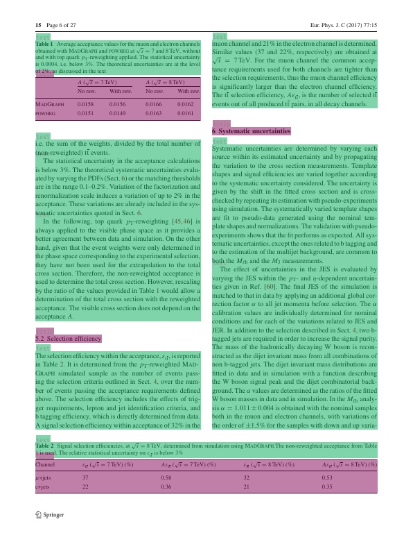

# 更多应用


## 1. 版面分析任务

版面分析指的是对图片形式的文档进行区域划分，定位其中的关键区域，如文字、标题、表格、图片等。版面分析示意图如下图所示。

<div align="center">
    
</div>

### 1.1 数据集

使用[PubLayNet](https://github.com/ibm-aur-nlp/PubLayNet)训练英文文档版面分析模型，该数据面向英文文献类（论文）场景，分别训练集(333,703张标注图片)、验证集(11,245张标注图片)和测试集(11,405张图片)，包含5类：Table、Figure、Title、Text、List，更多[版面分析数据集](https://github.com/PaddlePaddle/PaddleOCR/blob/dygraph/ppstructure/layout/README.md#32)

### 1.2 模型库

使用PicoDet模型在PubLayNet数据集进行训练，同时采用FGD蒸馏，预训练模型如下:

| 模型     | 图像输入尺寸 | mAP<sup>val<br/>0.5 |  下载地址  |  配置文件  |
| :-------- | :--------: |  :----------------: | :---------------: | ----------------- |
| PicoDet-LCNet_x1_0 |  800*608   |   93.5% | [trained model](https://paddleocr.bj.bcebos.com/ppstructure/models/layout/picodet_lcnet_x1_0_layout.pdparams) &#124; [inference model](https://paddleocr.bj.bcebos.com/ppstructure/models/layout/picodet_lcnet_x1_0_layout_infer.tar) | [config](./picodet_lcnet_x1_0_layout.yml) |
| PicoDet-LCNet_x1_0 + FGD |  800*608   |   94.0%     | [trained model](https://paddleocr.bj.bcebos.com/ppstructure/models/layout/picodet_lcnet_x1_0_fgd_layout.pdparams) &#124; [inference model](https://paddleocr.bj.bcebos.com/ppstructure/models/layout/picodet_lcnet_x1_0_fgd_layout_infer.tar) | [teacher config](./picodet_lcnet_x2_5_layout.yml)&#124;[student config](./picodet_lcnet_x1_0_layout.yml) |

 [FGD蒸馏介绍](https://github.com/PaddlePaddle/PaddleDetection/blob/release/2.6/configs/slim/distill/README.md)

### 1.3 模型推理

了解版面分析整个流程(数据准备、模型训练、评估等)，请参考[版面分析](https://github.com/PaddlePaddle/PaddleOCR/blob/dygraph/ppstructure/layout/README.md)，这里仅展示模型推理过程。首先下载模型库中的inference_model模型。

```
mkdir inference_model
cd inference_model
# 下载并解压PubLayNet推理模型
wget https://paddleocr.bj.bcebos.com/ppstructure/models/layout/picodet_lcnet_x1_0_fgd_layout_infer.tar && tar xf picodet_lcnet_x1_0_fgd_layout_infer.tar
cd ..
```

版面恢复任务进行推理，可以执行如下命令：

```bash
python3 deploy/python/infer.py \
    --model_dir=inference_model/picodet_lcnet_x1_0_fgd_layout_infer/ \
    --image_file=docs/images/layout.jpg \
    --device=CPU
```

可视化版面结果如下图所示：

<div align="center">
    
</div>

## 2 Reference

[1] Zhong X, Tang J, Yepes A J. Publaynet: largest dataset ever for document layout analysis[C]//2019 International Conference on Document Analysis and Recognition (ICDAR). IEEE, 2019: 1015-1022.
