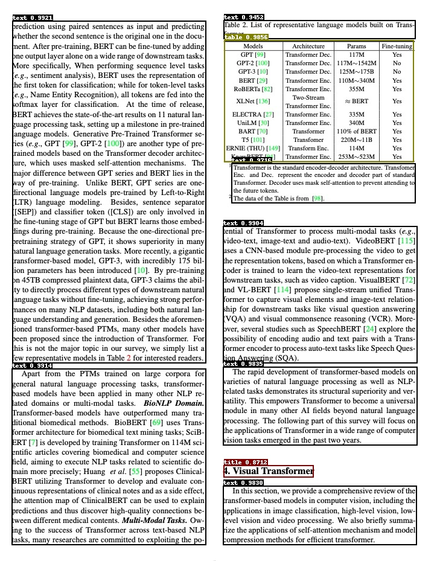

# 更多应用


## 1. 版面分析任务

版面分析指的是对图片形式的文档进行区域划分，定位其中的关键区域，如文字、标题、表格、图片等。版面分析示意图如下图所示。

<div align="center">
    
</div>

### 1.1 数据集

整理的版面分析模型数据集如下：

| dataset     | 简介                 |
| ------------------------------------------------------------ | ------------------------------------------------------------ |
| [PubLayNet](https://github.com/ibm-aur-nlp/PubLayNet) | 英文文档版面分析数据集，面向英文文献类（论文）场景，包含5类：Table、Figure、Title、Text、List |
| [cTDaR2019_cTDaR](https://cndplab-founder.github.io/cTDaR2019/) | 用于表格检测(TRACKA)和表格识别(TRACKB)。图片类型包含历史数据集(以cTDaR_t0开头，如cTDaR_t00872.jpg)和现代数据集(以cTDaR_t1开头，cTDaR_t10482.jpg) |
| [IIIT-AR-13K](http://cvit.iiit.ac.in/usodi/iiitar13k.php)    | 手动注释公开的年度报告中的图形或页面而构建的数据集，包含5类：table, figure, natural image, logo, and signature |
| [CDLA](https://github.com/buptlihang/CDLA)                   | 中文文档版面分析数据集，面向中文文献类（论文）场景，包含10类：Table、Figure、Figure caption、Table、Table caption、Header、Footer、Reference、Equation |
| [TableBank](https://github.com/doc-analysis/TableBank)       | 用于表格检测和识别大型数据集，包含Word和Latex2种文档格式 |
| [DocBank](https://github.com/doc-analysis/DocBank)           | 使用弱监督方法构建的大规模数据集(500K文档页面)，用于文档布局分析，包含12类：Author、Caption、Date、Equation、Figure、Footer、List、Paragraph、Reference、Section、Table、Title |


### 1.2 模型库

使用PicoDet模型在PubLayNet数据集进行训练，同时采用FGD蒸馏，预训练模型如下:

| 模型     | 图像输入尺寸 | mAP<sup>val<br/>0.5 |  下载地址  |  配置文件  |
| :-------- | :--------: |  :----------------: | :---------------: | ----------------- |
| PicoDet-LCNet_x1_0 |  800*608   |   93.5 | [trained model](https://paddleocr.bj.bcebos.com/ppstructure/models/layout/picodet_lcnet_x1_0_layout.pdparams) &#124; [inference model](https://paddleocr.bj.bcebos.com/ppstructure/models/layout/picodet_lcnet_x1_0_layout_infer.tar) | [config](./picodet_lcnet_x1_0_layout.yml) |
| PicoDet-LCNet_x1_0 + FGD |  800*608   |   94     | [trained model](https://paddleocr.bj.bcebos.com/ppstructure/models/layout/picodet_lcnet_x1_0_fgd_layout.pdparams) &#124; [inference model](https://paddleocr.bj.bcebos.com/ppstructure/models/layout/picodet_lcnet_x1_0_fgd_layout_infer.tar) | [teacher config](./picodet_lcnet_x2_5_layout.yml)&#124;[student config](./picodet_lcnet_x1_0_layout.yml) |

 [FGD蒸馏介绍](https://github.com/PaddlePaddle/PaddleDetection/blob/develop/configs/slim/distill/README.md)

### 1.3 模型推理

了解版面分析整个流程(数据准备、模型训练、评估等)，请参考[版面分析](https://github.com/PaddlePaddle/PaddleOCR/blob/dygraph/ppstructure/layout/README.md)，这里仅展示模型推理过程。首先下载模型库中的inference_model模型。

```
mkdir inference_model
cd inference_model
# 下载并解压PubLayNet推理模型
wget https://paddleocr.bj.bcebos.com/ppstructure/models/layout/picodet_lcnet_x1_0_fgd_layout_infer.tar && tar xf picodet_lcnet_x1_0_fgd_layout_infer.tar
cd ..
```

版面恢复任务进行推理，可以执行如下命令：

```bash
python3 deploy/python/infer.py \
    --model_dir=inference_model/picodet_lcnet_x1_0_fgd_layout_infer/ \
    --image_file=docs/images/layout.jpg \
    --device=CPU
```

可视化版面结果如下图所示：

<div align="center">
    
</div>
## 2 Inference

[1] Zhong X, Tang J, Yepes A J. Publaynet: largest dataset ever for document layout analysis[C]//2019 International Conference on Document Analysis and Recognition (ICDAR). IEEE, 2019: 1015-1022.

[2]Gao L, Huang Y, Déjean H, et al. ICDAR 2019 competition on table detection and recognition (cTDaR)[C]//2019 International Conference on Document Analysis and Recognition (ICDAR). IEEE, 2019: 1510-1515.

[3] Mondal A, Lipps P, Jawahar C V. IIIT-AR-13K: a new dataset for graphical object detection in documents[C]//International Workshop on Document Analysis Systems. Springer, Cham, 2020: 216-230.

[4] CDLA：https://github.com/buptlihang/CDLA

[5] Li M, Cui L, Huang S, et al. Tablebank: A benchmark dataset for table detection and recognition[J]. arXiv preprint arXiv:1903.01949, 2019.

[6]Li M, Xu Y, Cui L, et al. DocBank: A benchmark dataset for document layout analysis[J]. arXiv preprint arXiv:2006.01038, 2020.
