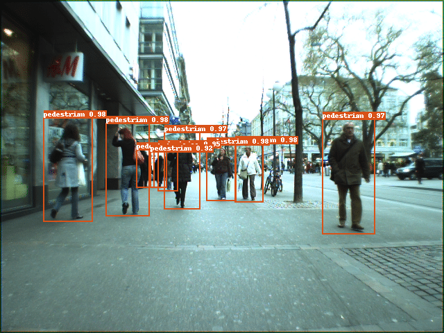

[English](README.md) | 简体中文
# 特色垂类检测模型

我们提供了针对不同场景的基于PaddlePaddle的检测模型，用户可以下载模型进行使用。

| 任务                 | 算法 | 精度(Box AP) | 下载                                                                                | 配置文件 |
|:---------------------|:---------:|:------:| :---------------------------------------------------------------------------------: | :------:|
| 行人检测 |  YOLOv3  |  51.8  | [下载链接](https://paddledet.bj.bcebos.com/models/pedestrian_yolov3_darknet.pdparams) | [配置文件](https://github.com/PaddlePaddle/PaddleDetection/tree/release/2.6/configs/pphuman/pedestrian_yolov3/pedestrian_yolov3_darknet.yml) |

## 行人检测（Pedestrian Detection）

行人检测的主要应用有智能监控。在监控场景中，大多是从公共区域的监控摄像头视角拍摄行人，获取图像后再进行行人检测。

### 1. 模型结构

Backbone为Dacknet53的YOLOv3。


### 2. 训练参数配置

PaddleDetection提供了使用COCO数据集对YOLOv3进行训练的参数配置文件[yolov3_darknet53_270e_coco.yml](https://github.com/PaddlePaddle/PaddleDetection/blob/release/2.6/configs/yolov3/yolov3_darknet53_270e_coco.yml)，与之相比，在进行行人检测的模型训练时，我们对以下参数进行了修改：

* num_classes: 1
* dataset_dir: dataset/pedestrian

### 2. 精度指标

模型在我们针对监控场景的内部数据上精度指标为：

IOU=.5时的AP为 0.792。

IOU=.5-.95时的AP为 0.518。

### 3. 预测

用户可以使用我们训练好的模型进行行人检测：

```
export CUDA_VISIBLE_DEVICES=0
python -u tools/infer.py -c configs/pphuman/pedestrian_yolov3/pedestrian_yolov3_darknet.yml \
                         -o weights=https://paddledet.bj.bcebos.com/models/pedestrian_yolov3_darknet.pdparams \
                         --infer_dir configs/pphuman/pedestrian_yolov3/demo \
                         --draw_threshold 0.3 \
                         --output_dir configs/pphuman/pedestrian_yolov3/demo/output
```

预测结果示例：



