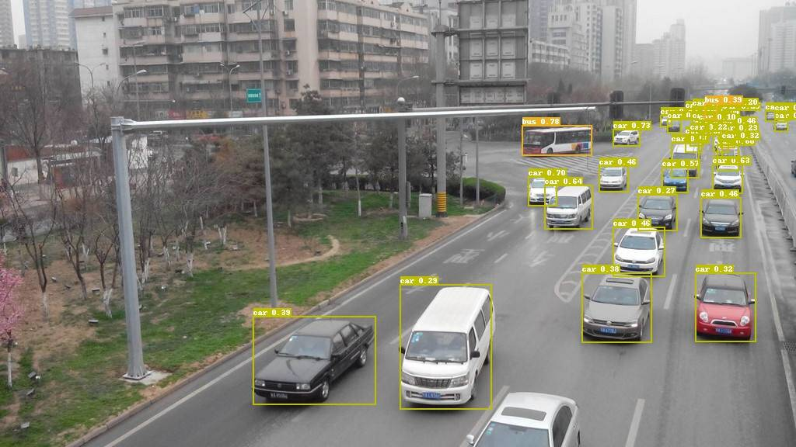
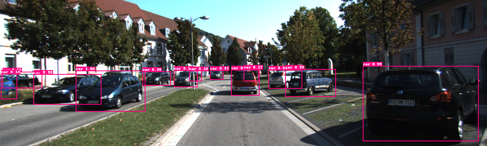

[English](README.md) | 简体中文
# 特色垂类检测模型

我们提供了针对不同场景的基于PaddlePaddle的检测模型，用户可以下载模型进行使用。

| 任务                 | 算法 | 精度(Box AP) | 下载                                                                                | 配置文件 |
|:---------------------|:---------:|:------:| :---------------------------------------------------------------------------------: | :------:|
| 车辆检测    |  YOLOv3  |  54.5  | [下载链接](https://paddledet.bj.bcebos.com/models/vehicle_yolov3_darknet.pdparams) | [配置文件](./vehicle_yolov3_darknet.yml) |


## 车辆检测（Vehicle Detection）

车辆检测的主要应用之一是交通监控。在这样的监控场景中，待检测的车辆多为道路红绿灯柱上的摄像头拍摄所得。

### 1. 模型结构

Backbone为Dacknet53的YOLOv3。

### 2. 训练参数配置

PaddleDetection提供了使用COCO数据集对YOLOv3进行训练的参数配置文件[yolov3_darknet53_270e_coco.yml](https://github.com/PaddlePaddle/PaddleDetection/blob/release/2.6/configs/yolov3/yolov3_darknet53_270e_coco.yml)，与之相比，在进行车辆检测的模型训练时，我们对以下参数进行了修改：

* num_classes: 6
* anchors: [[8, 9], [10, 23], [19, 15], [23, 33], [40, 25], [54, 50], [101, 80], [139, 145], [253, 224]]
* nms/nms_top_k: 400
* nms/score_threshold: 0.005
* dataset_dir: dataset/vehicle

### 3. 精度指标

模型在我们内部数据上的精度指标为：

IOU=.50:.05:.95时的AP为 0.545。

IOU=.5时的AP为 0.764。

### 4. 预测

用户可以使用我们训练好的模型进行车辆检测：

```
export CUDA_VISIBLE_DEVICES=0
python -u tools/infer.py -c configs/ppvehicle/vehicle_yolov3/vehicle_yolov3_darknet.yml \
                         -o weights=https://paddledet.bj.bcebos.com/models/vehicle_yolov3_darknet.pdparams \
                         --infer_dir configs/ppvehicle/vehicle_yolov3/demo \
                         --draw_threshold 0.2 \
                         --output_dir configs/ppvehicle/vehicle_yolov3/demo/output
```

预测结果示例：




