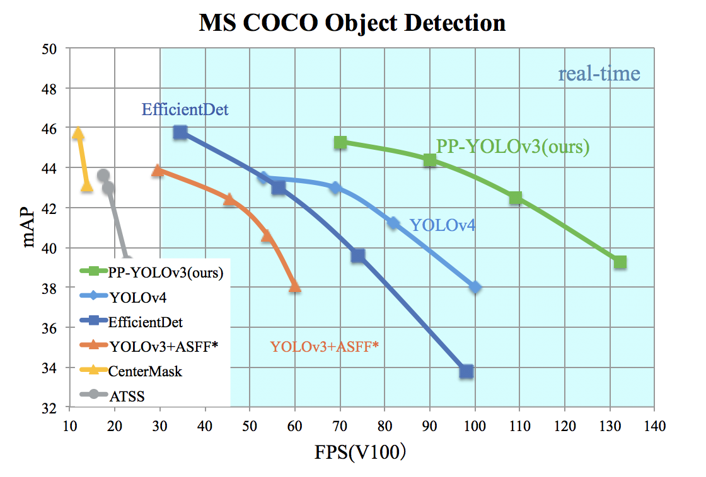

English | [简体中文](README_cn.md)

# PP-YOLO

## Table of Contents
- [Introduction](#Introduction)
- [Model Zoo](#Model_Zoo)
- [Getting Start](#Getting_Start)
- [Future Work](#Future_Work)
- [Appendix](#Appendix)

## Introduction

[PP-YOLO](https://arxiv.org/abs/2007.12099) is a optimized model based on YOLOv3 in PaddleDetection，whose performance(mAP on COCO) and inference spped are better than [YOLOv4](https://arxiv.org/abs/2004.10934)，PaddlePaddle 2.0.2(available on pip now) or [Daily Version](https://www.paddlepaddle.org.cn/documentation/docs/zh/develop/install/Tables.html#whl-develop) is required to run this PP-YOLO。

PP-YOLO reached mmAP(IoU=0.5:0.95) as 45.9% on COCO test-dev2017 dataset, and inference speed of FP32 on single V100 is 72.9 FPS, inference speed of FP16 with TensorRT on single V100 is 155.6 FPS.

<div align="center">
  
</div>

PP-YOLO and PP-YOLOv2 improved performance and speed of YOLOv3 with following methods:

- Better backbone: ResNet50vd-DCN
- Larger training batch size: 8 GPUs and mini-batch size as 24 on each GPU
- [Drop Block](https://arxiv.org/abs/1810.12890)
- [Exponential Moving Average](https://www.investopedia.com/terms/e/ema.asp)
- [IoU Loss](https://arxiv.org/pdf/1902.09630.pdf)
- [Grid Sensitive](https://arxiv.org/abs/2004.10934)
- [Matrix NMS](https://arxiv.org/pdf/2003.10152.pdf)
- [CoordConv](https://arxiv.org/abs/1807.03247)
- [Spatial Pyramid Pooling](https://arxiv.org/abs/1406.4729)
- Better ImageNet pretrain weights
- [PAN](https://arxiv.org/abs/1803.01534)
- Iou aware Loss
- larger input size

## Model Zoo

### PP-YOLO

|          Model           | GPU number | images/GPU |  backbone  | input shape | Box AP<sup>val</sup> | Box AP<sup>test</sup> | V100 FP32(FPS) | V100 TensorRT FP16(FPS) | download | config  |
|:------------------------:|:-------:|:-------------:|:----------:| :-------:| :------------------: | :-------------------: | :------------: | :---------------------: | :------: | :------: |
| PP-YOLO                  |     8      |     24     | ResNet50vd |     608     |         44.8         |         45.2          |      72.9      |          155.6          | [model](https://paddledet.bj.bcebos.com/models/ppyolo_r50vd_dcn_1x_coco.pdparams) | [config](https://github.com/PaddlePaddle/PaddleDetection/tree/release/2.4/configs/ppyolo/ppyolo_r50vd_dcn_1x_coco.yml)                   |
| PP-YOLO                  |     8      |     24     | ResNet50vd |     512     |         43.9         |         44.4          |      89.9      |          188.4          | [model](https://paddledet.bj.bcebos.com/models/ppyolo_r50vd_dcn_1x_coco.pdparams) | [config](https://github.com/PaddlePaddle/PaddleDetection/tree/release/2.4/configs/ppyolo/ppyolo_r50vd_dcn_1x_coco.yml)                   |
| PP-YOLO                  |     8      |     24     | ResNet50vd |     416     |         42.1         |         42.5          |      109.1      |          215.4          | [model](https://paddledet.bj.bcebos.com/models/ppyolo_r50vd_dcn_1x_coco.pdparams) | [config](https://github.com/PaddlePaddle/PaddleDetection/tree/release/2.4/configs/ppyolo/ppyolo_r50vd_dcn_1x_coco.yml)                   |
| PP-YOLO                  |     8      |     24     | ResNet50vd |     320     |         38.9         |         39.3          |      132.2      |          242.2          | [model](https://paddledet.bj.bcebos.com/models/ppyolo_r50vd_dcn_1x_coco.pdparams) | [config](https://github.com/PaddlePaddle/PaddleDetection/tree/release/2.4/configs/ppyolo/ppyolo_r50vd_dcn_1x_coco.yml)                   |
| PP-YOLO_2x               |     8      |     24     | ResNet50vd |     608     |         45.3         |         45.9          |      72.9      |          155.6          | [model](https://paddledet.bj.bcebos.com/models/ppyolo_r50vd_dcn_2x_coco.pdparams) | [config](https://github.com/PaddlePaddle/PaddleDetection/tree/release/2.4/configs/ppyolo/ppyolo_r50vd_dcn_2x_coco.yml)                   |
| PP-YOLO_2x               |     8      |     24     | ResNet50vd |     512     |         44.4         |         45.0          |      89.9      |          188.4          | [model](https://paddledet.bj.bcebos.com/models/ppyolo_r50vd_dcn_2x_coco.pdparams) | [config](https://github.com/PaddlePaddle/PaddleDetection/tree/release/2.4/configs/ppyolo/ppyolo_r50vd_dcn_2x_coco.yml)                   |
| PP-YOLO_2x               |     8      |     24     | ResNet50vd |     416     |         42.7         |         43.2          |      109.1      |          215.4          | [model](https://paddledet.bj.bcebos.com/models/ppyolo_r50vd_dcn_2x_coco.pdparams) | [config](https://github.com/PaddlePaddle/PaddleDetection/tree/release/2.4/configs/ppyolo/ppyolo_r50vd_dcn_2x_coco.yml)                   |
| PP-YOLO_2x               |     8      |     24     | ResNet50vd |     320     |         39.5         |         40.1          |      132.2      |          242.2          | [model](https://paddledet.bj.bcebos.com/models/ppyolo_r50vd_dcn_2x_coco.pdparams) | [config](https://github.com/PaddlePaddle/PaddleDetection/tree/release/2.4/configs/ppyolo/ppyolo_r50vd_dcn_2x_coco.yml)                   |
| PP-YOLO               |     4      |     32     | ResNet18vd |     512     |         29.2         |         29.5          |      357.1      |          657.9          | [model](https://paddledet.bj.bcebos.com/models/ppyolo_r18vd_coco.pdparams) | [config](https://github.com/PaddlePaddle/PaddleDetection/tree/release/2.4/configs/ppyolo/ppyolo_r18vd_coco.yml)                   |
| PP-YOLO               |     4      |     32     | ResNet18vd |     416     |         28.6         |         28.9          |      409.8      |          719.4          | [model](https://paddledet.bj.bcebos.com/models/ppyolo_r18vd_coco.pdparams) | [config](https://github.com/PaddlePaddle/PaddleDetection/tree/release/2.4/configs/ppyolo/ppyolo_r18vd_coco.yml)                   |
| PP-YOLO               |     4      |     32     | ResNet18vd |     320     |         26.2         |         26.4          |      480.7      |          763.4          | [model](https://paddledet.bj.bcebos.com/models/ppyolo_r18vd_coco.pdparams) | [config](https://github.com/PaddlePaddle/PaddleDetection/tree/release/2.4/configs/ppyolo/ppyolo_r18vd_coco.yml)                   |
| PP-YOLOv2               |     8      |     12     | ResNet50vd |     640     |         49.1         |         49.5          |      68.9      |          106.5          | [model](https://paddledet.bj.bcebos.com/models/ppyolov2_r50vd_dcn_365e_coco.pdparams) | [config](https://github.com/PaddlePaddle/PaddleDetection/tree/release/2.4/configs/ppyolo/ppyolov2_r50vd_dcn_365e_coco.yml)                   |
| PP-YOLOv2               |     8      |     12     | ResNet101vd |     640     |         49.7         |         50.3          |     49.5     |         87.0         | [model](https://paddledet.bj.bcebos.com/models/ppyolov2_r101vd_dcn_365e_coco.pdparams) | [config](https://github.com/PaddlePaddle/PaddleDetection/tree/release/2.4/configs/ppyolo/ppyolov2_r101vd_dcn_365e_coco.yml)                   |


**Notes:**

- PP-YOLO is trained on COCO train2017 dataset and evaluated on val2017 & test-dev2017 dataset，Box AP<sup>test</sup> is evaluation results of `mAP(IoU=0.5:0.95)`.
- PP-YOLO used 8 GPUs for training and mini-batch size as 24 on each GPU, if GPU number and mini-batch size is changed, learning rate and iteration times should be adjusted according [FAQ](https://github.com/PaddlePaddle/PaddleDetection/blob/release/2.4/docs/tutorials/FAQ).
- PP-YOLO inference speed is tesed on single Tesla V100 with batch size as 1, CUDA 10.2, CUDNN 7.5.1, TensorRT 5.1.2.2 in TensorRT mode.
- PP-YOLO FP32 inference speed testing uses inference model exported by `tools/export_model.py` and benchmarked by running `depoly/python/infer.py` with `--run_benchmark`. All testing results do not contains the time cost of data reading and post-processing(NMS), which is same as [YOLOv4(AlexyAB)](https://github.com/AlexeyAB/darknet) in testing method.
- TensorRT FP16 inference speed testing exclude the time cost of bounding-box decoding(`yolo_box`) part comparing with FP32 testing above, which means that data reading, bounding-box decoding and post-processing(NMS) is excluded(test method same as [YOLOv4(AlexyAB)](https://github.com/AlexeyAB/darknet) too)
- If you set `--run_benchmark=True`，you should install these dependencies at first, `pip install pynvml psutil GPUtil`.

### PP-YOLO for mobile

|            Model             | GPU number | images/GPU | Model Size | input shape | Box AP<sup>val</sup> |  Box AP50<sup>val</sup> | Kirin 990 1xCore(FPS) | download | config  |
|:----------------------------:|:-------:|:-------------:|:----------:| :-------:| :------------------: |  :--------------------: | :--------------------: | :------: | :------: |
| PP-YOLO_MobileNetV3_large    |    4    |      32       |    28MB    |   320    |         23.2         |           42.6          |           14.1         | [model](https://paddledet.bj.bcebos.com/models/ppyolo_mbv3_large_coco.pdparams) | [config](https://github.com/PaddlePaddle/PaddleDetection/tree/release/2.4/configs/ppyolo/ppyolo_mbv3_large_coco.yml)                   |
| PP-YOLO_MobileNetV3_small    |    4    |      32       |    16MB    |   320    |         17.2         |           33.8          |           21.5         | [model](https://paddledet.bj.bcebos.com/models/ppyolo_mbv3_small_coco.pdparams) | [config](https://github.com/PaddlePaddle/PaddleDetection/tree/release/2.4/configs/ppyolo/ppyolo_mbv3_small_coco.yml)                   |

**Notes:**

- PP-YOLO_MobileNetV3 is trained on COCO train2017 datast and evaluated on val2017 dataset，Box AP<sup>val</sup> is evaluation results of `mAP(IoU=0.5:0.95)`, Box AP<sup>val</sup> is evaluation results of `mAP(IoU=0.5)`.
- PP-YOLO_MobileNetV3 used 4 GPUs for training and mini-batch size as 32 on each GPU, if GPU number and mini-batch size is changed, learning rate and iteration times should be adjusted according [FAQ](https://github.com/PaddlePaddle/PaddleDetection/blob/release/2.4/docs/tutorials/FAQ).
- PP-YOLO_MobileNetV3 inference speed is tested on Kirin 990 with 1 thread.

### PP-YOLO tiny

|            Model             | GPU number | images/GPU | Model Size | Post Quant Model Size | input shape | Box AP<sup>val</sup> | Kirin 990 4xCore(FPS) | download | config | post quant model |
|:----------------------------:|:-------:|:-------------:|:----------:| :-------------------: | :---------: | :------------------: | :-------------------: | :------: | :----: | :--------------: |
| PP-YOLO tiny                 |    8    |      32       |   4.2MB    |       **1.3M**        |     320     |         20.6         |          92.3         | [model](https://paddledet.bj.bcebos.com/models/ppyolo_tiny_650e_coco.pdparams) | [config](https://github.com/PaddlePaddle/PaddleDetection/tree/release/2.4/configs/ppyolo/ppyolo_tiny_650e_coco.yml)  | [inference model](https://paddledet.bj.bcebos.com/models/ppyolo_tiny_quant.tar) |
| PP-YOLO tiny                 |    8    |      32       |   4.2MB    |       **1.3M**        |     416     |         22.7         |          65.4         | [model](https://paddledet.bj.bcebos.com/models/ppyolo_tiny_650e_coco.pdparams) | [config](https://github.com/PaddlePaddle/PaddleDetection/tree/release/2.4/configs/ppyolo/ppyolo_tiny_650e_coco.yml)  | [inference model](https://paddledet.bj.bcebos.com/models/ppyolo_tiny_quant.tar) |

**Notes:**

- PP-YOLO-tiny is trained on COCO train2017 datast and evaluated on val2017 dataset，Box AP<sup>val</sup> is evaluation results of `mAP(IoU=0.5:0.95)`, Box AP<sup>val</sup> is evaluation results of `mAP(IoU=0.5)`.
- PP-YOLO-tiny used 8 GPUs for training and mini-batch size as 32 on each GPU, if GPU number and mini-batch size is changed, learning rate and iteration times should be adjusted according [FAQ](https://github.com/PaddlePaddle/PaddleDetection/blob/release/2.4/docs/tutorials/FAQ/README.md).
- PP-YOLO-tiny inference speed is tested on Kirin 990 with 4 threads by arm8
- we alse provide PP-YOLO-tiny post quant inference model, which can compress model to **1.3MB** with nearly no inference on inference speed and performance

### PP-YOLO on Pascal VOC

PP-YOLO trained on Pascal VOC dataset as follows:

|       Model        | GPU number | images/GPU |  backbone  | input shape | Box AP50<sup>val</sup> | download | config  |
|:------------------:|:----------:|:----------:|:----------:| :----------:| :--------------------: | :------: | :-----: |
| PP-YOLO            |    8    |       12      | ResNet50vd |     608     |          84.9          | [model](https://paddledet.bj.bcebos.com/models/ppyolo_r50vd_dcn_voc.pdparams) | [config](https://github.com/PaddlePaddle/PaddleDetection/tree/release/2.4/configs/ppyolo/ppyolo_r50vd_dcn_voc.yml)                   |
| PP-YOLO            |    8    |       12      | ResNet50vd |     416     |          84.3          | [model](https://paddledet.bj.bcebos.com/models/ppyolo_r50vd_dcn_voc.pdparams) | [config](https://github.com/PaddlePaddle/PaddleDetection/tree/release/2.4/configs/ppyolo/ppyolo_r50vd_dcn_voc.yml)                   |
| PP-YOLO            |    8    |       12      | ResNet50vd |     320     |          82.2          | [model](https://paddledet.bj.bcebos.com/models/ppyolo_r50vd_dcn_voc.pdparams) | [config](https://github.com/PaddlePaddle/PaddleDetection/tree/release/2.4/configs/ppyolo/ppyolo_r50vd_dcn_voc.yml)                   |

## Getting Start

### 1. Training

Training PP-YOLO on 8 GPUs with following command(all commands should be run under PaddleDetection dygraph directory as default)

```bash
python -m paddle.distributed.launch --log_dir=./ppyolo_dygraph/ --gpus 0,1,2,3,4,5,6,7 tools/train.py -c configs/ppyolo/ppyolo_r50vd_dcn_1x_coco.yml &>ppyolo_dygraph.log 2>&1 &
```

optional: Run `tools/anchor_cluster.py` to get anchors suitable for your dataset, and modify the anchor setting in model configuration file and reader configuration file, such as `configs/ppyolo/_base_/ppyolo_tiny.yml` and `configs/ppyolo/_base_/ppyolo_tiny_reader.yml`.

``` bash
python tools/anchor_cluster.py -c configs/ppyolo/ppyolo_tiny_650e_coco.yml -n 9 -s 320 -m v2 -i 1000
```

### 2. Evaluation

Evaluating PP-YOLO on COCO val2017 dataset in single GPU with following commands:

```bash
# use weights released in PaddleDetection model zoo
CUDA_VISIBLE_DEVICES=0 python tools/eval.py -c configs/ppyolo/ppyolo_r50vd_dcn_1x_coco.yml -o weights=https://paddledet.bj.bcebos.com/models/ppyolo_r50vd_dcn_1x_coco.pdparams

# use saved checkpoint in training
CUDA_VISIBLE_DEVICES=0 python tools/eval.py -c configs/ppyolo/ppyolo_r50vd_dcn_1x_coco.yml -o weights=output/ppyolo_r50vd_dcn_1x_coco/model_final
```

For evaluation on COCO test-dev2017 dataset, `configs/ppyolo/ppyolo_test.yml` should be used, please download COCO test-dev2017 dataset from [COCO dataset download](https://cocodataset.org/#download) and decompress to pathes configured by `EvalReader.dataset` in `configs/ppyolo/ppyolo_test.yml` and run evaluation by following command:

```bash
# use weights released in PaddleDetection model zoo
CUDA_VISIBLE_DEVICES=0 python tools/eval.py -c configs/ppyolo/ppyolo_test.yml -o weights=https://paddledet.bj.bcebos.com/models/ppyolo_r50vd_dcn_1x_coco.pdparams

# use saved checkpoint in training
CUDA_VISIBLE_DEVICES=0 python tools/eval.py -c configs/ppyolo/ppyolo_test.yml -o weights=output/ppyolo_r50vd_dcn_1x_coco/model_final
```

Evaluation results will be saved in `bbox.json`, compress it into a `zip` package and upload to [COCO dataset evaluation](https://competitions.codalab.org/competitions/20794#participate) to evaluate.

**NOTE 1:** `configs/ppyolo/ppyolo_test.yml` is only used for evaluation on COCO test-dev2017 dataset, could not be used for training or COCO val2017 dataset evaluating.

**NOTE 2:** Due to the overall upgrade of the dynamic graph framework, the following weight models published by paddledetection need to be evaluated by adding the -- bias field, such as

```bash
# use weights released in PaddleDetection model zoo
CUDA_VISIBLE_DEVICES=0 python tools/eval.py -c configs/ppyolo/ppyolo_r50vd_dcn_1x_coco.yml -o weights=https://paddledet.bj.bcebos.com/models/ppyolo_r50vd_dcn_1x_coco.pdparams --bias
```
These models are:

1.ppyolo_r50vd_dcn_1x_coco

2.ppyolo_r50vd_dcn_voc

3.ppyolo_r18vd_coco

4.ppyolo_mbv3_large_coco

5.ppyolo_mbv3_small_coco

6.ppyolo_tiny_650e_coco

### 3. Inference

Inference images in single GPU with following commands, use `--infer_img` to inference a single image and `--infer_dir` to inference all images in the directory.

```bash
# inference single image
CUDA_VISIBLE_DEVICES=0 python tools/infer.py -c configs/ppyolo/ppyolo_r50vd_dcn_1x_coco.yml -o weights=https://paddledet.bj.bcebos.com/models/ppyolo_r50vd_dcn_1x_coco.pdparams --infer_img=demo/000000014439_640x640.jpg

# inference all images in the directory
CUDA_VISIBLE_DEVICES=0 python tools/infer.py -c configs/ppyolo/ppyolo_r50vd_dcn_1x_coco.yml -o weights=https://paddledet.bj.bcebos.com/models/ppyolo_r50vd_dcn_1x_coco.pdparams --infer_dir=demo
```

### 4. Inferece deployment

For inference deployment or benchmard, model exported with `tools/export_model.py` should be used and perform inference with Paddle inference library with following commands:

```bash
# export model, model will be save in output/ppyolo as default
python tools/export_model.py -c configs/ppyolo/ppyolo_r50vd_dcn_1x_coco.yml -o weights=https://paddledet.bj.bcebos.com/models/ppyolo_r50vd_dcn_1x_coco.pdparams

# inference with Paddle Inference library
CUDA_VISIBLE_DEVICES=0 python deploy/python/infer.py --model_dir=output_inference/ppyolo_r50vd_dcn_1x_coco --image_file=demo/000000014439_640x640.jpg --device=GPU
```


## Appendix

Optimizing method and ablation experiments of PP-YOLO compared with YOLOv3.

| NO.  |        Model                 | Box AP<sup>val</sup> | Box AP<sup>test</sup> | Params(M) | FLOPs(G) | V100 FP32 FPS |
| :--: | :--------------------------- | :------------------: |:--------------------: | :-------: | :------: | :-----------: |
|  A   | YOLOv3-DarkNet53             |         38.9         |           -           |   59.13   |  65.52   |      58.2     |
|  B   | YOLOv3-ResNet50vd-DCN        |         39.1         |           -           |   43.89   |  44.71   |      79.2     |
|  C   | B + LB + EMA + DropBlock     |         41.4         |           -           |   43.89   |  44.71   |      79.2     |
|  D   | C + IoU Loss                 |         41.9         |           -           |   43.89   |  44.71   |      79.2     |
|  E   | D + IoU Aware                |         42.5         |           -           |   43.90   |  44.71   |      74.9     |
|  F   | E + Grid Sensitive           |         42.8         |           -           |   43.90   |  44.71   |      74.8     |
|  G   | F + Matrix NMS               |         43.5         |           -           |   43.90   |  44.71   |      74.8     |
|  H   | G + CoordConv                |         44.0         |           -           |   43.93   |  44.76   |      74.1     |
|  I   | H + SPP                      |         44.3         |         45.2          |   44.93   |  45.12   |      72.9     |
|  J   | I + Better ImageNet Pretrain |         44.8         |         45.2          |   44.93   |  45.12   |      72.9     |
|  K   | J + 2x Scheduler             |         45.3         |         45.9          |   44.93   |  45.12   |      72.9     |

**Notes:**

- Performance and inference spedd are measure with input shape as 608
- All models are trained on COCO train2017 datast and evaluated on val2017 & test-dev2017 dataset，`Box AP` is evaluation results as `mAP(IoU=0.5:0.95)`.
- Inference speed is tested on single Tesla V100 with batch size as 1 following test method and environment configuration in benchmark above.
- [YOLOv3-DarkNet53](https://github.com/PaddlePaddle/PaddleDetection/tree/release/2.4/configs/yolov3/yolov3_darknet53_270e_coco.yml) with mAP as 39.0 is optimized YOLOv3 model in PaddleDetection，see [YOLOv3](https://github.com/PaddlePaddle/PaddleDetection/blob/release/2.4/configs/yolov3/README.md) for details.

## Citation

```
@article{huang2021pp,
  title={PP-YOLOv2: A Practical Object Detector},
  author={Huang, Xin and Wang, Xinxin and Lv, Wenyu and Bai, Xiaying and Long, Xiang and Deng, Kaipeng and Dang, Qingqing and Han, Shumin and Liu, Qiwen and Hu, Xiaoguang and others},
  journal={arXiv preprint arXiv:2104.10419},
  year={2021}
}
@misc{long2020ppyolo,
title={PP-YOLO: An Effective and Efficient Implementation of Object Detector},
author={Xiang Long and Kaipeng Deng and Guanzhong Wang and Yang Zhang and Qingqing Dang and Yuan Gao and Hui Shen and Jianguo Ren and Shumin Han and Errui Ding and Shilei Wen},
year={2020},
eprint={2007.12099},
archivePrefix={arXiv},
primaryClass={cs.CV}
}
@misc{ppdet2019,
title={PaddleDetection, Object detection and instance segmentation toolkit based on PaddlePaddle.},
author={PaddlePaddle Authors},
howpublished = {\url{https://github.com/PaddlePaddle/PaddleDetection}},
year={2019}
}
```
