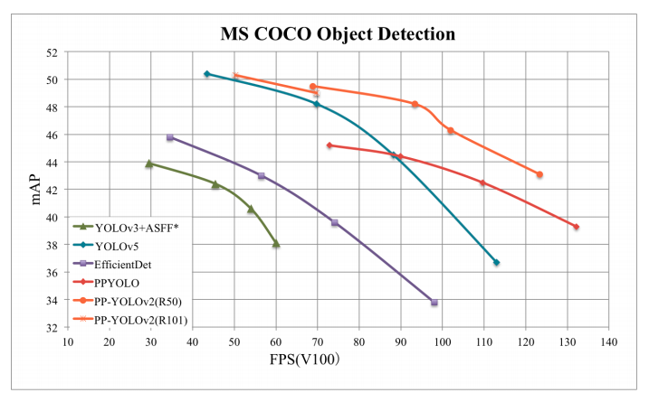

简体中文 | [English](README.md)

# PP-YOLO 模型

## 内容
- [简介](#简介)
- [模型库与基线](#模型库与基线)
- [使用说明](#使用说明)
- [未来工作](#未来工作)
- [附录](#附录)

## 简介

[PP-YOLO](https://arxiv.org/abs/2007.12099)是PaddleDetection优化和改进的YOLOv3的模型，其精度(COCO数据集mAP)和推理速度均优于[YOLOv4](https://arxiv.org/abs/2004.10934)模型，要求使用PaddlePaddle 1.8.4(可使用pip安装) 或适当的[develop版本](https://www.paddlepaddle.org.cn/documentation/docs/zh/install/Tables.html#whl-dev)。

PP-YOLO在[COCO](http://cocodataset.org) test-dev2017数据集上精度达到45.9%，在单卡V100上FP32推理速度为72.9 FPS, V100上开启TensorRT下FP16推理速度为155.6 FPS。

<div align="center">
  
</div>

PP-YOLO从如下方面优化和提升YOLOv3模型的精度和速度：

- 更优的骨干网络: ResNet50vd-DCN
- 更大的训练batch size: 8 GPUs，每GPU batch_size=24，对应调整学习率和迭代轮数
- [Drop Block](https://arxiv.org/abs/1810.12890)
- [Exponential Moving Average](https://www.investopedia.com/terms/e/ema.asp)
- [IoU Loss](https://arxiv.org/pdf/1902.09630.pdf)
- [Grid Sensitive](https://arxiv.org/abs/2004.10934)
- [Matrix NMS](https://arxiv.org/pdf/2003.10152.pdf)
- [CoordConv](https://arxiv.org/abs/1807.03247)
- [Spatial Pyramid Pooling](https://arxiv.org/abs/1406.4729)
- 更优的预训练模型

## 模型库

### PP-YOLO模型

|          模型            | GPU个数 | 每GPU图片个数 |  骨干网络  | 输入尺寸 | Box AP<sup>val</sup> | Box AP<sup>test</sup> | V100 FP32(FPS) | V100 TensorRT FP16(FPS) | 模型下载 | 配置文件 |
|:------------------------:|:-------:|:-------------:|:----------:| :-------:| :------------------: | :-------------------: | :------------: | :---------------------: | :------: | :------: |
| YOLOv4(AlexyAB)          |    -    |       -       | CSPDarknet |   608    |           -          |         43.5          |       62       |          105.5           | [下载链接](https://paddlemodels.bj.bcebos.com/object_detection/yolov4_cspdarknet.pdparams) |  [配置文件](https://github.com/PaddlePaddle/PaddleDetection/tree/master/configs/yolov4/yolov4_csdarknet.yml)                   |
| YOLOv4(AlexyAB)          |    -    |       -       | CSPDarknet |   512    |           -          |         43.0          |       83       |          138.4           | [下载链接](https://paddlemodels.bj.bcebos.com/object_detection/yolov4_cspdarknet.pdparams) |  [配置文件](https://github.com/PaddlePaddle/PaddleDetection/tree/master/configs/yolov4/yolov4_csdarknet.yml)                   |
| YOLOv4(AlexyAB)          |    -    |       -       | CSPDarknet |   416    |           -          |         41.2          |       96       |          164.0           | [下载链接](https://paddlemodels.bj.bcebos.com/object_detection/yolov4_cspdarknet.pdparams) |  [配置文件](https://github.com/PaddlePaddle/PaddleDetection/tree/master/configs/yolov4/yolov4_csdarknet.yml)                   |
| YOLOv4(AlexyAB)          |    -    |       -       | CSPDarknet |   320    |           -          |         38.0          |      123       |          199.0           | [下载链接](https://paddlemodels.bj.bcebos.com/object_detection/yolov4_cspdarknet.pdparams) |  [配置文件](https://github.com/PaddlePaddle/PaddleDetection/tree/master/configs/yolov4/yolov4_csdarknet.yml)                   |
| PP-YOLO                   |    8    |      24      | ResNet50vd |   608    |         44.8         |         45.2          |      72.9      |          155.6          | [下载链接](https://paddlemodels.bj.bcebos.com/object_detection/ppyolo.pdparams) |  [配置文件](https://github.com/PaddlePaddle/PaddleDetection/tree/master/configs/ppyolo/ppyolo.yml)                   |
| PP-YOLO                   |    8    |      24      | ResNet50vd |   512    |         43.9         |         44.4          |      89.9      |          188.4          | [下载链接](https://paddlemodels.bj.bcebos.com/object_detection/ppyolo.pdparams) |  [配置文件](https://github.com/PaddlePaddle/PaddleDetection/tree/master/configs/ppyolo/ppyolo.yml)                   |
| PP-YOLO                   |    8    |      24      | ResNet50vd |   416    |         42.1         |         42.5          |     109.1      |          215.4          | [下载链接](https://paddlemodels.bj.bcebos.com/object_detection/ppyolo.pdparams) |  [配置文件](https://github.com/PaddlePaddle/PaddleDetection/tree/master/configs/ppyolo/ppyolo.yml)                   |
| PP-YOLO                   |    8    |      24      | ResNet50vd |   320    |         38.9         |         39.3          |     132.2      |          242.2          | [下载链接](https://paddlemodels.bj.bcebos.com/object_detection/ppyolo.pdparams) |  [配置文件](https://github.com/PaddlePaddle/PaddleDetection/tree/master/configs/ppyolo/ppyolo.yml)                   |
| PP-YOLO_2x                |    8    |      24      | ResNet50vd |   608    |         45.3         |         45.9          |      72.9      |          155.6          | [下载链接](https://paddlemodels.bj.bcebos.com/object_detection/ppyolo.pdparams) |  [配置文件](https://github.com/PaddlePaddle/PaddleDetection/tree/master/configs/ppyolo/ppyolo.yml)                   |
| PP-YOLO_2x                |    8    |      24      | ResNet50vd |   512    |         44.4         |         45.0          |      89.9      |          188.4          | [下载链接](https://paddlemodels.bj.bcebos.com/object_detection/ppyolo.pdparams) |  [配置文件](https://github.com/PaddlePaddle/PaddleDetection/tree/master/configs/ppyolo/ppyolo.yml)                   |
| PP-YOLO_2x                |    8    |      24      | ResNet50vd |   416    |         42.7         |         43.2          |     109.1      |          215.4          | [下载链接](https://paddlemodels.bj.bcebos.com/object_detection/ppyolo.pdparams) |  [配置文件](https://github.com/PaddlePaddle/PaddleDetection/tree/master/configs/ppyolo/ppyolo.yml)                   |
| PP-YOLO_2x                |    8    |      24      | ResNet50vd |   320    |         39.5         |         40.1          |     132.2      |          242.2          | [下载链接](https://paddlemodels.bj.bcebos.com/object_detection/ppyolo.pdparams) |  [配置文件](https://github.com/PaddlePaddle/PaddleDetection/tree/master/configs/ppyolo/ppyolo.yml)                   |
| PP-YOLO_ResNet18vd        |    4    |      32      | ResNet18vd |   512    |         29.3         |         29.5          |     357.1      |          657.9          | [下载链接](https://paddlemodels.bj.bcebos.com/object_detection/ppyolo_r18vd.pdparams) | [配置文件](https://github.com/PaddlePaddle/PaddleDetection/tree/master/configs/ppyolo/ppyolo_r18vd.yml)                  |
| PP-YOLO_ResNet18vd        |    4    |      32      | ResNet18vd |   416    |         28.6         |         28.9          |     409.8      |          719.4          | [下载链接](https://paddlemodels.bj.bcebos.com/object_detection/ppyolo_r18vd.pdparams) | [配置文件](https://github.com/PaddlePaddle/PaddleDetection/tree/master/configs/ppyolo/ppyolo_r18vd.yml)                  |
| PP-YOLO_ResNet18vd        |    4    |      32      | ResNet18vd |   320    |         26.2         |         26.4          |     480.7      |          763.4          | [下载链接](https://paddlemodels.bj.bcebos.com/object_detection/ppyolo_r18vd.pdparams) | [配置文件](https://github.com/PaddlePaddle/PaddleDetection/tree/master/configs/ppyolo/ppyolo_r18vd.yml)                   |

**注意:**

- PP-YOLO模型使用COCO数据集中train2017作为训练集，使用val2017和test-dev2017作为测试集，Box AP<sup>test</sup>为`mAP(IoU=0.5:0.95)`评估结果。
- PP-YOLO模型训练过程中使用8 GPUs，每GPU batch size为24进行训练，如训练GPU数和batch size不使用上述配置，须参考[FAQ](../../docs/FAQ.md)调整学习率和迭代次数。
- PP-YOLO模型推理速度测试采用单卡V100，batch size=1进行测试，使用CUDA 10.2, CUDNN 7.5.1，TensorRT推理速度测试使用TensorRT 5.1.2.2。
- PP-YOLO模型FP32的推理速度测试数据为使用`tools/export_model.py`脚本导出模型后，使用`deploy/python/infer.py`脚本中的`--run_benchnark`参数使用Paddle预测库进行推理速度benchmark测试结果, 且测试的均为不包含数据预处理和模型输出后处理(NMS)的数据(与[YOLOv4(AlexyAB)](https://github.com/AlexeyAB/darknet)测试方法一致)。
- TensorRT FP16的速度测试相比于FP32去除了`yolo_box`(bbox解码)部分耗时，即不包含数据预处理，bbox解码和NMS(与[YOLOv4(AlexyAB)](https://github.com/AlexeyAB/darknet)测试方法一致)。
- YOLOv4(AlexyAB)模型精度和V100 FP32推理速度数据使用[YOLOv4 github库](https://github.com/AlexeyAB/darknet)提供的单卡V100上精度速度测试数据，V100 TensorRT FP16推理速度为使用[AlexyAB/darknet](https://github.com/AlexeyAB/darknet)库中tkDNN配置于单卡V100，TensorRT 5.1.2.2的测试结果。
- PP-YOLO模型推理速度测试采用单卡V100，batch size=1进行测试，使用CUDA 10.2, CUDNN 7.5.1，TensorRT推理速度测试使用TensorRT 5.1.2.2。
- YOLOv4(AlexyAB)行`模型下载`和`配置文件`为PaddleDetection复现的YOLOv4模型，目前评估精度已对齐，支持finetune，训练精度对齐中，可参见[PaddleDetection YOLOv4 模型](../yolov4/README.md)
- PP-YOLO使用每GPU `batch_size=24`训练，需要使用显存为32G的GPU，我们也提供了`batch_size=12`的可以在显存为16G的GPU上训练的配置文件`ppyolo_2x_bs12.yml`，使用这个配置文件训练在COCO val2017数据集上评估结果为`mAP(IoU=0.5:0.95) = 45.1%`，可通过[ppyolo_2x_bs12模型](https://paddlemodels.bj.bcebos.com/object_detection/ppyolo_2x_bs12.pdparams)下载权重。

### PP-YOLO 轻量级模型

|          模型                | GPU个数 | 每GPU图片个数 |  模型体积  | 输入尺寸 | Box AP<sup>val</sup> |  Box AP50<sup>val</sup> | Kirin 990 1xCore (FPS) | 模型下载 | 预测模型下载 | 配置文件 |
|:----------------------------:|:-------:|:-------------:|:----------:| :-------:| :------------------: |  :--------------------: | :--------------------: | :------: | :----------: | :------: |
| PP-YOLO_MobileNetV3_large    |    4    |      32       |    18MB    |   320    |         23.2         |           42.6          |           14.1         | [下载链接](https://paddlemodels.bj.bcebos.com/object_detection/ppyolo_mobilenet_v3_large.pdparams) | [下载链接](https://paddlemodels.bj.bcebos.com/object_detection/ppyolo_mobilenet_v3_large.tar) | [配置文件](https://github.com/PaddlePaddle/PaddleDetection/tree/master/configs/ppyolo/ppyolo_mobilenet_v3_large.yml)                   |
| PP-YOLO_MobileNetV3_small    |    4    |      32       |    11MB    |   320    |         17.2         |           33.8          |           21.5         | [下载链接](https://paddlemodels.bj.bcebos.com/object_detection/ppyolo_mobilenet_v3_small.pdparams) | [下载链接](https://paddlemodels.bj.bcebos.com/object_detection/ppyolo_mobilenet_v3_large.tar) | [配置文件](https://github.com/PaddlePaddle/PaddleDetection/tree/master/configs/ppyolo/ppyolo_mobilenet_v3_small.yml)                   |

- PP-YOLO_MobileNetV3 模型使用COCO数据集中train2017作为训练集，使用val2017作为测试集，Box AP<sup>val</sup>为`mAP(IoU=0.5:0.95)`评估结果, Box AP50<sup>val</sup>为`mAP(IoU=0.5)`评估结果。
- PP-YOLO_MobileNetV3 模型训练过程中使用4GPU，每GPU batch size为32进行训练，如训练GPU数和batch size不使用上述配置，须参考[FAQ](../../docs/FAQ.md)调整学习率和迭代次数。
- PP-YOLO_MobileNetV3 模型推理速度测试环境配置为麒麟990芯片单线程。

### PP-YOLO 轻量级裁剪模型

|            模型              |  GPU 个数  | 每GPU图片个数 |   裁剪率    |         Teacher模型       |  模型体积  |   输入尺寸  | Box AP<sup>val</sup> | Kirin 990 1xCore (FPS) | 模型下载 | 预测模型下载 | 配置文件 |
|:----------------------------:|:----------:|:-------------:| :---------: | :-----------------------: | :--------: | :----------:| :------------------: | :--------------------: | :------: | :----------: | :------: |
| PP-YOLO_MobileNetV3_small    |     4      |       32      |     75%     | PP-YOLO_MobileNetV3_large |   4.2MB    |     320     |         16.2         |          39.8          | [下载链接](https://paddlemodels.bj.bcebos.com/object_detection/ppyolo_mobilenet_v3_small_prune75_distillby_mobilenet_v3_large.pdparams) | [下载链接](https://paddlemodels.bj.bcebos.com/object_detection/ppyolo_mobilenet_v3_small_prune75_distillby_mobilenet_v3_large.tar) | [配置文件](https://github.com/PaddlePaddle/PaddleDetection/tree/master/configs/ppyolo/ppyolo_mobilenet_v3_small.yml)                   |

- PP-YOLO 轻量级裁剪模型采用[蒸馏通道剪裁模型](../../slim/extentions/distill_pruned_model/README.md) 的方式训练得到，基于 PP-YOLO_MobileNetV3_small 模型对Head部分做卷积通道剪裁后使用 PP-YOLO_MobileNetV3_large 模型进行蒸馏训练
- 卷积通道检测对Head部分剪裁掉75%的通道数，及剪裁参数为`--pruned_params="yolo_block.0.2.conv.weights,yolo_block.0.tip.conv.weights,yolo_block.1.2.conv.weights,yolo_block.1.tip.conv.weights" --pruned_ratios="0.75,0.75,0.75,0.75"`
- PP-YOLO 轻量级裁剪模型的训练、评估、预测及模型导出方法见[蒸馏通道剪裁模型](../../slim/extentions/distill_pruned_model/README.md)

### Pascal VOC数据集上的PP-YOLO

PP-YOLO在Pascal VOC数据集上训练模型如下:

|       模型         | GPU个数 | 每GPU图片个数 |  骨干网络  |   输入尺寸  | Box AP50<sup>val</sup> | 模型下载 | 配置文件 |
|:------------------:|:-------:|:-------------:|:----------:| :----------:| :--------------------: | :------: | :-----: |
| PP-YOLO            |    8    |       12      | ResNet50vd |     608     |          84.9          | [model](https://paddlemodels.bj.bcebos.com/object_detection/ppyolo_voc.pdparams) | [config](https://github.com/PaddlePaddle/PaddleDetection/tree/master/configs/ppyolo/ppyolo_voc.yml)                   |
| PP-YOLO            |    8    |       12      | ResNet50vd |     416     |          84.3          | [model](https://paddlemodels.bj.bcebos.com/object_detection/ppyolo_voc.pdparams) | [config](https://github.com/PaddlePaddle/PaddleDetection/tree/master/configs/ppyolo/ppyolo_voc.yml)                   |
| PP-YOLO            |    8    |       12      | ResNet50vd |     320     |          82.2          | [model](https://paddlemodels.bj.bcebos.com/object_detection/ppyolo_voc.pdparams) | [config](https://github.com/PaddlePaddle/PaddleDetection/tree/master/configs/ppyolo/ppyolo_voc.yml)                   |

## 使用说明

### 1. 训练

使用8GPU通过如下命令一键式启动训练(以下命令均默认在PaddleDetection根目录运行), 通过`--eval`参数开启训练中交替评估。

```bash
CUDA_VISIBLE_DEVICES=0,1,2,3,4,5,6,7 python tools/train.py -c configs/ppyolo/ppyolo.yml --eval
```
可选：在训练之前使用`tools/anchor_cluster.py`得到适用于你的数据集的anchor，并修改`configs/ppyolo/ppyolo.yml`中的anchor设置
```bash
python tools/anchor_cluster.py -c configs/ppyolo/ppyolo.yml -n 9 -s 608 -m v2 -i 1000
```

### 2. 评估

使用单GPU通过如下命令一键式评估模型在COCO val2017数据集效果

```bash
# 使用PaddleDetection发布的权重
CUDA_VISIBLE_DEVICES=0 python tools/eval.py -c configs/ppyolo/ppyolo.yml -o weights=https://paddlemodels.bj.bcebos.com/object_detection/ppyolo.pdparams

# 使用训练保存的checkpoint
CUDA_VISIBLE_DEVICES=0 python tools/eval.py -c configs/ppyolo/ppyolo.yml -o weights=output/ppyolo/best_model
```

我们提供了`configs/ppyolo/ppyolo_test.yml`用于评估COCO test-dev2017数据集的效果，评估COCO test-dev2017数据集的效果须先从[COCO数据集下载页](https://cocodataset.org/#download)下载test-dev2017数据集，解压到`configs/ppyolo/ppyolo_test.yml`中`EvalReader.dataset`中配置的路径，并使用如下命令进行评估

```bash
# 使用PaddleDetection发布的权重
CUDA_VISIBLE_DEVICES=0 python tools/eval.py -c configs/ppyolo/ppyolo_test.yml -o weights=https://paddlemodels.bj.bcebos.com/object_detection/ppyolo.pdparams

# 使用训练保存的checkpoint
CUDA_VISIBLE_DEVICES=0 python tools/eval.py -c configs/ppyolo/ppyolo_test.yml -o weights=output/ppyolo/best_model
```

评估结果保存于`bbox.json`中，将其压缩为zip包后通过[COCO数据集评估页](https://competitions.codalab.org/competitions/20794#participate)提交评估。

**注意:** `configs/ppyolo/ppyolo_test.yml`仅用于评估COCO test-dev数据集，不用于训练和评估COCO val2017数据集。

### 3. 推理

使用单GPU通过如下命令一键式推理图像，通过`--infer_img`指定图像路径，或通过`--infer_dir`指定目录并推理目录下所有图像

```bash
# 推理单张图像
CUDA_VISIBLE_DEVICES=0 python tools/infer.py -c configs/ppyolo/ppyolo.yml -o weights=https://paddlemodels.bj.bcebos.com/object_detection/ppyolo.pdparams --infer_img=demo/000000014439_640x640.jpg

# 推理目录下所有图像
CUDA_VISIBLE_DEVICES=0 python tools/infer.py -c configs/ppyolo/ppyolo.yml -o weights=https://paddlemodels.bj.bcebos.com/object_detection/ppyolo.pdparams --infer_dir=demo
```

### 4. 推理部署与benchmark

PP-YOLO模型部署及推理benchmark需要通过`tools/export_model.py`导出模型后使用Paddle预测库进行部署和推理，可通过如下命令一键式启动。

```bash
# 导出模型，默认存储于output/ppyolo目录
python tools/export_model.py -c configs/ppyolo/ppyolo.yml -o weights=https://paddlemodels.bj.bcebos.com/object_detection/ppyolo.pdparams

# 预测库推理
CUDA_VISIBLE_DEVICES=0 python deploy/python/infer.py --model_dir=output/ppyolo --image_file=demo/000000014439_640x640.jpg --use_gpu=True
```

PP-YOLO模型benchmark测试为不包含数据预处理和网络输出后处理(NMS)的网络结构部分数据，导出模型时须指定`--exlcude_nms`来裁剪掉模型中后处理的NMS部分，通过如下命令进行模型导出和benchmark测试。

```bash
# 导出模型，通过--exclude_nms参数裁剪掉模型中的NMS部分，默认存储于output/ppyolo目录
python tools/export_model.py -c configs/ppyolo/ppyolo.yml -o weights=https://paddlemodels.bj.bcebos.com/object_detection/ppyolo.pdparams --exclude_nms

# FP32 benchmark测试
CUDA_VISIBLE_DEVICES=0 python deploy/python/infer.py --model_dir=output/ppyolo --image_file=demo/000000014439_640x640.jpg --use_gpu=True --run_benchmark=True

# TensorRT FP16 benchmark测试
CUDA_VISIBLE_DEVICES=0 python deploy/python/infer.py --model_dir=output/ppyolo --image_file=demo/000000014439_640x640.jpg --use_gpu=True --run_benchmark=True --run_mode=trt_fp16
```

## 未来工作

1. 发布PP-YOLO-tiny模型
2. 发布更多骨干网络的PP-YOLO模型

## 附录

PP-YOLO模型相对于YOLOv3模型优化项消融实验数据如下表所示。

| 序号 |        模型                  | Box AP<sup>val</sup> | Box AP<sup>test</sup> | 参数量(M) | FLOPs(G) | V100 FP32 FPS |
| :--: | :--------------------------- | :------------------: | :-------------------: | :-------: | :------: | :-----------: |
|  A   | YOLOv3-DarkNet53             |         38.9         |            -          |   59.13   |  65.52   |      58.2     |
|  B   | YOLOv3-ResNet50vd-DCN        |         39.1         |            -          |   43.89   |  44.71   |      79.2     |
|  C   | B + LB + EMA + DropBlock     |         41.4         |            -          |   43.89   |  44.71   |      79.2     |
|  D   | C + IoU Loss                 |         41.9         |            -          |   43.89   |  44.71   |      79.2     |
|  E   | D + IoU Aware                |         42.5         |            -          |   43.90   |  44.71   |      74.9     |
|  F   | E + Grid Sensitive           |         42.8         |            -          |   43.90   |  44.71   |      74.8     |
|  G   | F + Matrix NMS               |         43.5         |            -          |   43.90   |  44.71   |      74.8     |
|  H   | G + CoordConv                |         44.0         |            -          |   43.93   |  44.76   |      74.1     |
|  I   | H + SPP                      |         44.3         |          45.2         |   44.93   |  45.12   |      72.9     |
|  J   | I + Better ImageNet Pretrain |         44.8         |          45.2         |   44.93   |  45.12   |      72.9     |
|  K   | J + 2x Scheduler             |         45.3         |          45.9         |   44.93   |  45.12   |      72.9     |

**注意:**

- 精度与推理速度数据均为使用输入图像尺寸为608的测试结果
- Box AP为在COCO train2017数据集训练，val2017和test-dev2017数据集上评估`mAP(IoU=0.5:0.95)`数据
- 推理速度为单卡V100上，batch size=1, 使用上述benchmark测试方法的测试结果，测试环境配置为CUDA 10.2，CUDNN 7.5.1
- [YOLOv3-DarkNet53](../yolov3_darknet.yml)精度38.9为PaddleDetection优化后的YOLOv3模型，可参见[模型库](../../docs/MODEL_ZOO_cn.md)
