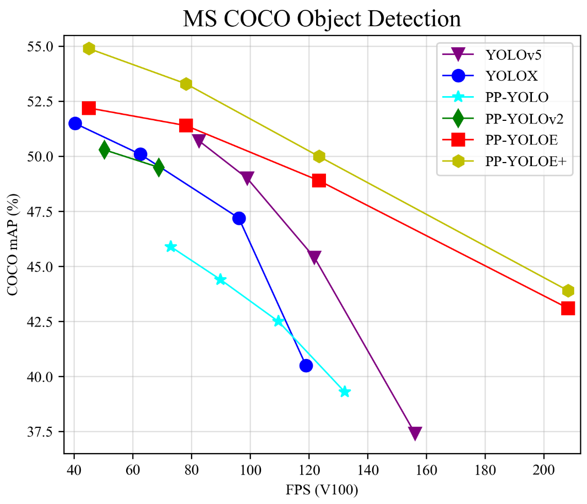

简体中文 | [English](README.md)

# PP-YOLOE

## 最新动态
- 发布PP-YOLOE+模型: **(2022.08)**
  - 使用大规模数据集obj365预训练模型
  - 在backbone中block分支中增加alpha参数
  - 优化端到端推理速度，提升训练收敛速度

## 历史版本模型
- 详情请参考：[PP-YOLOE 2022.03版本](./README_legacy.md)

## 内容
- [简介](#简介)
- [模型库](#模型库)
- [使用说明](#使用说明)
- [附录](#附录)

## 简介
PP-YOLOE是基于PP-YOLOv2的卓越的单阶段Anchor-free模型，超越了多种流行的YOLO模型。PP-YOLOE有一系列的模型，即s/m/l/x，可以通过width multiplier和depth multiplier配置。PP-YOLOE避免了使用诸如Deformable Convolution或者Matrix NMS之类的特殊算子，以使其能轻松地部署在多种多样的硬件上。更多细节可以参考我们的[report](https://arxiv.org/abs/2203.16250)。

<div align="center">
  
</div>

PP-YOLOE+_l在COCO test-dev2017达到了53.3的mAP, 同时其速度在Tesla V100上达到了78.1 FPS。PP-YOLOE+_s/m/x同样具有卓越的精度速度性价比, 其精度速度可以在[模型库](#模型库)中找到。

PP-YOLOE由以下方法组成
- 可扩展的backbone和neck
- [Task Alignment Learning](https://arxiv.org/abs/2108.07755)
- Efficient Task-aligned head with [DFL](https://arxiv.org/abs/2006.04388)和[VFL](https://arxiv.org/abs/2008.13367)
- [SiLU(Swish)激活函数](https://arxiv.org/abs/1710.05941)

## 模型库

### COCO数据集模型库

|       模型        | Epoch |   GPU个数   | 每GPU图片个数 |  骨干网络  |    输入尺寸    | Box AP<sup>val<br>0.5:0.95 | Box AP<sup>test<br>0.5:0.95 | Params(M) | FLOPs(G) | V100 FP32(FPS) | V100 TensorRT FP16(FPS) |                                         模型下载                                         |                    配置文件                     |
|:---------------:|:-----:|:---------:|:--------:|:----------:|:----------:|:--------------------------:|:---------------------------:|:---------:|:--------:|:---------------:| :---------------------: |:------------------------------------------------------------------------------------:|:-------------------------------------------:|
|   PP-YOLOE+_s   |  80   |     8     |    8     | cspresnet-s |    640     |            43.7            |            43.9             |   7.93    |  17.36   |   208.3   |  333.3   | [model](https://paddledet.bj.bcebos.com/models/ppyoloe_plus_crn_s_80e_coco.pdparams) | [config](./ppyoloe_plus_crn_s_80e_coco.yml) |
|   PP-YOLOE+_m   |  80   |     8     |    8     | cspresnet-m |    640     |            49.8            |            50.0             |   23.43   |  49.91   |   123.4   |  208.3   | [model](https://paddledet.bj.bcebos.com/models/ppyoloe_plus_crn_m_80e_coco.pdparams) | [config](./ppyoloe_plus_crn_m_80e_coco.yml) |
|   PP-YOLOE+_l   |  80   |     8     |    8     | cspresnet-l |    640     |            52.9            |            53.3             |   52.20   |  110.07  |   78.1    |  149.2   | [model](https://paddledet.bj.bcebos.com/models/ppyoloe_plus_crn_l_80e_coco.pdparams) | [config](./ppyoloe_plus_crn_l_80e_coco.yml) |
|   PP-YOLOE+_x   |  80   |     8     |    8     | cspresnet-x |    640     |            54.7            |            54.9             |   98.42   |  206.59  |   45.0    |   95.2   | [model](https://paddledet.bj.bcebos.com/models/ppyoloe_plus_crn_x_80e_coco.pdparams) | [config](./ppyoloe_plus_crn_x_80e_coco.yml) |

#### Tiny模型

|    模型    | Epoch |  GPU个数  | 每GPU图片个数 |  骨干网络  |  输入尺寸  | Box AP<sup>val<br>0.5:0.95 | Box AP<sup>test<br>0.5:0.95 | Params(M) | FLOPs(G) | T4 TensorRT FP16(FPS) |  模型下载 |  配置文件 |
|:----------:|:-----:|:--------:|:-----------:|:---------:|:--------:|:--------------------------:|:---------------------------:|:---------:|:--------:|:---------------------:| :------: |:--------:|
|   PP-YOLOE+_t-aux(640) |  300   |     8     |    8     | cspresnet-t  |    640  |            39.9       |            56.6             |   4.85   |  19.15 |  344.8   | [model](https://paddledet.bj.bcebos.com/models/ppyoloe_plus_crn_t_auxhead_300e_coco.pdparams) | [config](./ppyoloe_plus_crn_t_auxhead_300e_coco.yml) |
|   PP-YOLOE+_t-aux(640)-relu |  300   |     8     |    8     | cspresnet-t  |    640  |            36.4       |            53.0        |   3.60   |  12.17 |   476.2   | [model](https://paddledet.bj.bcebos.com/models/ppyoloe_plus_crn_t_auxhead_relu_300e_coco.pdparams) | [config](./ppyoloe_plus_crn_t_auxhead_relu_300e_coco.yml) |
|   PP-YOLOE+_t-aux(320) |  300   |     8     |    8     | cspresnet-t  |    320  |            33.3       |            48.5             |   4.85   |  4.80 |   729.9   | [model](https://paddledet.bj.bcebos.com/models/ppyoloe_plus_crn_t_auxhead_320_300e_coco.pdparams) | [config](./ppyoloe_plus_crn_t_auxhead_320_300e_coco.yml) |
|   PP-YOLOE+_t-aux(320)-relu |  300   |     8     |    8     | cspresnet-t  |    320  |            30.1       |            44.7        |   3.60   |  3.04 |   984.8   | [model](https://paddledet.bj.bcebos.com/models/ppyoloe_plus_crn_t_auxhead_relu_320_300e_coco.pdparams) | [config](./ppyoloe_plus_crn_t_auxhead_relu_320_300e_coco.yml) |


### 综合指标
|            模型            | Epoch | AP<sup>0.5:0.95 | AP<sup>0.5 | AP<sup>0.75 | AP<sup>small | AP<sup>medium | AP<sup>large | AR<sup>small | AR<sup>medium | AR<sup>large |
|:------------------------:|:-----:|:---------------:|:----------:|:-----------:|:------------:|:-------------:|:------------:|:------------:|:-------------:|:------------:|
|       PP-YOLOE+_s        |  80   |      43.7       |    60.6    |    47.9     |     26.5     |     47.5      |     59.0     |     46.7     |     71.4      |     81.7     |
|       PP-YOLOE+_m        |  80   |      49.8       |    67.1    |    54.5     |     31.8     |     53.9      |     66.2     |     53.3     |     75.0      |     84.6     |
|       PP-YOLOE+_l        |  80   |      52.9       |    70.1    |    57.9     |     35.2     |     57.5      |     69.1     |     56.0     |     77.9      |     86.9     |
|       PP-YOLOE+_x        |  80   |      54.7       |    72.0    |    59.9     |     37.9     |     59.3      |     70.4     |     57.0     |     78.7      |     87.2     |


### 端到端速度
|            模型            | AP<sup>0.5:0.95 | TRT-FP32(fps) | TRT-FP16(fps) |
|:------------------------:|:---------------:|:-------------:|:-------------:|
|       PP-YOLOE+_s        |      43.7       |     44.44     |     47.85     |
|       PP-YOLOE+_m        |      49.8       |     39.06     |     43.86     |
|       PP-YOLOE+_l        |      52.9       |     34.01     |     42.02     |
|       PP-YOLOE+_x        |      54.7       |     26.88     |     36.76     |

**注意:**

- PP-YOLOE模型使用COCO数据集中train2017作为训练集，使用val2017和test-dev2017作为测试集。
- 综合指标的表格与模型库的表格里的模型权重是**同一个权重**，综合指标是使用**val2017**作为验证精度的。
- PP-YOLOE模型训练过程中使用8 GPUs进行混合精度训练，如果**GPU卡数**或者**batch size**发生了改变，你需要按照公式 **lr<sub>new</sub> = lr<sub>default</sub> * (batch_size<sub>new</sub> * GPU_number<sub>new</sub>) / (batch_size<sub>default</sub> * GPU_number<sub>default</sub>)** 调整学习率。
- PP-YOLOE模型推理速度测试采用单卡V100，batch size=1进行测试，使用**CUDA 10.2**, **CUDNN 7.6.5**，TensorRT推理速度测试使用**TensorRT 6.0.1.8**。
- 参考[速度测试](#速度测试)以复现PP-YOLOE推理速度测试结果。
- 如果你设置了`--run_benchmark=True`, 你首先需要安装以下依赖`pip install pynvml psutil GPUtil`。
- 端到端速度测试包含模型前处理 + 模型推理 + 模型后处理及NMS的时间，测试使用**Intel(R) Xeon(R) Gold 5117 CPU @ 2.00GHz**, **单卡V100**, **CUDA 11.2**, **CUDNN 8.2.0**, **TensorRT 8.0.1.6**。

### Objects365数据集模型库
|       模型       | Epoch |  机器个数 | GPU个数   | 每GPU图片个数 |  骨干网络  |   输入尺寸   | Box AP<sup>0.5 | Params(M) | FLOPs(G) | V100 FP32(FPS) | V100 TensorRT FP16(FPS) |  模型下载  | 配置文件 |
|:---------------:|:-----:|:-----------:|:-----------:|:-----------:|:---------:|:----------:|:--------------:|:---------:|:---------:|:-------------:|:-----------------------:| :--------:|:--------:|
|   PP-YOLOE+_s   |  60   |  3 |  8     |    8     | cspresnet-s |    640     |   18.1  |  7.93  |  17.36   |   208.3   |  333.3   | [model](https://bj.bcebos.com/v1/paddledet/models/pretrained/ppyoloe_crn_s_obj365_pretrained.pdparams) | [config](./objects365/ppyoloe_plus_crn_s_60e_objects365.yml) |
|   PP-YOLOE+_m   |  60   |   4 |  8     |    8     | cspresnet-m |    640     |   25.0  |  23.43  |  49.91   |   123.4       |  208.3  | [model](https://bj.bcebos.com/v1/paddledet/models/pretrained/ppyoloe_crn_m_obj365_pretrained.pdparams) | [config](./objects365/ppyoloe_plus_crn_m_60e_objects365.yml) |
|   PP-YOLOE+_l   |  60   |   3 |  8     |    8     | cspresnet-l |    640     |   30.8  |  52.20 |  110.07  |   78.1    |  149.2   | [model](https://bj.bcebos.com/v1/paddledet/models/pretrained/ppyoloe_crn_l_obj365_pretrained.pdparams) | [config](./objects365/ppyoloe_plus_crn_l_60e_objects365.yml) |
|   PP-YOLOE+_x   |  60   |  4 |   8     |    8     | cspresnet-x |    640     |   32.7  |  98.42 |  206.59      |   45.0        |  95.2  | [model](https://bj.bcebos.com/v1/paddledet/models/pretrained/ppyoloe_crn_x_obj365_pretrained.pdparams) | [config](./objects365/ppyoloe_plus_crn_x_60e_objects365.yml) |


**注意:**
- 多机训练细节见[文档](../../docs/tutorials/DistributedTraining_cn.md)


### VOC数据集模型库
|       模型       | Epoch |   GPU个数   | 每GPU图片个数 |  骨干网络  |   输入尺寸   | Box AP<sup>0.5 | Params(M) | FLOPs(G) | V100 FP32(FPS) | V100 TensorRT FP16(FPS) |  模型下载  |  配置文件 |
|:---------------:|:-----:|:-----------:|:-----------:|:---------:|:----------:|:--------------:|:---------:|:---------:|:-------------:|:-----------------------:| :-------: |:--------:|
|   PP-YOLOE+_s   |  30   |     8     |    8     | cspresnet-s |    640     |   86.7  |  7.93  |  17.36   |   208.3   |  333.3   | [model](https://paddledet.bj.bcebos.com/models/ppyoloe_plus_crn_s_30e_voc.pdparams) | [config](./voc/ppyoloe_plus_crn_s_30e_voc.yml) |
|   PP-YOLOE+_l   |  30   |     8     |    8     | cspresnet-l |    640     |   89.0  |  52.20 |  110.07  |   78.1    |  149.2   | [model](https://paddledet.bj.bcebos.com/models/ppyoloe_plus_crn_l_30e_voc.pdparams) | [config](./voc/ppyoloe_plus_crn_l_30e_voc.yml) |


### 垂类应用模型

PaddleDetection团队提供了基于PP-YOLOE的各种垂类检测模型的配置文件和权重，用户可以下载进行使用：

|     场景    |    相关数据集    |    链接   |
| :--------: | :---------: | :------: |
|  行人检测   | CrowdHuman  |   [pphuman](../pphuman)  |
|  车辆检测   | BDD100K、UA-DETRAC  |  [ppvehicle](../ppvehicle)   |
|  小目标检测 | VisDrone、DOTA、xView |  [smalldet](../smalldet)   |
| 密集目标检测 | SKU110k | [application](./application) |
| 旋转框检测 | DOTA | [PP-YOLOE-R](../rotate/ppyoloe_r/) |


## 使用说明

### 数据集和评价指标

下载PaddleDetection团队提供的**COCO和VOC数据**，并解压放置于`PaddleDetection/dataset/`下：

```
wget https://bj.bcebos.com/v1/paddledet/data/coco.tar
# tar -xvf coco.tar

wget https://bj.bcebos.com/v1/paddledet/data/voc.zip
# unzip voc.zip
```

**注意:**
 - COCO风格格式，请参考 [format-data](https://cocodataset.org/#format-data) 和 [format-results](https://cocodataset.org/#format-results)。
 - COCO风格评测指标，请参考 [detection-eval](https://cocodataset.org/#detection-eval) ，并首先安装 [cocoapi](https://github.com/cocodataset/cocoapi)。
 - VOC风格格式和评测指标，请参考 [VOC2012](http://host.robots.ox.ac.uk/pascal/VOC/voc2012/index.html)。

### 自定义数据集

1.自定义数据集的标注制作，请参考 [DetAnnoTools](https://github.com/PaddlePaddle/PaddleDetection/blob/release/2.5/docs/tutorials/data/DetAnnoTools.md);
2.自定义数据集的训练准备，请参考 [PrepareDataSet](https://github.com/PaddlePaddle/PaddleDetection/blob/release/2.5/docs/tutorials/data/PrepareDetDataSet.md).


### 训练

请执行以下指令训练PP-YOLOE+

```bash
python -m paddle.distributed.launch --gpus 0,1,2,3,4,5,6,7 tools/train.py -c configs/ppyoloe/ppyoloe_plus_crn_l_80e_coco.yml --eval --amp
```
**注意:**
- 如果需要边训练边评估，请添加`--eval`.
- PP-YOLOE+支持混合精度训练，请添加`--amp`.
- PaddleDetection支持多机训练，可以参考[多机训练教程](../../docs/tutorials/DistributedTraining_cn.md).

### 评估

执行以下命令在单个GPU上评估COCO val2017数据集

```bash
CUDA_VISIBLE_DEVICES=0 python tools/eval.py -c configs/ppyoloe/ppyoloe_plus_crn_l_80e_coco.yml -o weights=https://paddledet.bj.bcebos.com/models/ppyoloe_plus_crn_l_80e_coco.pdparams
```

在coco test-dev2017上评估，请先从[COCO数据集下载](https://cocodataset.org/#download)下载COCO test-dev2017数据集，然后解压到COCO数据集文件夹并像`configs/ppyolo/ppyolo_test.yml`一样配置`EvalDataset`。

### 推理

使用以下命令在单张GPU上预测图片，使用`--infer_img`推理单张图片以及使用`--infer_dir`推理文件中的所有图片。


```bash
# 推理单张图片
CUDA_VISIBLE_DEVICES=0 python tools/infer.py -c configs/ppyoloe/ppyoloe_plus_crn_l_80e_coco.yml -o weights=https://paddledet.bj.bcebos.com/models/ppyoloe_plus_crn_l_80e_coco.pdparams --infer_img=demo/000000014439_640x640.jpg

# 推理文件中的所有图片
CUDA_VISIBLE_DEVICES=0 python tools/infer.py -c configs/ppyoloe/ppyoloe_plus_crn_l_80e_coco.yml -o weights=https://paddledet.bj.bcebos.com/models/ppyoloe_plus_crn_l_80e_coco.pdparams --infer_dir=demo
```

### 模型导出

PP-YOLOE+在GPU上部署或者速度测试需要通过`tools/export_model.py`导出模型。

当你**使用Paddle Inference但不使用TensorRT**时，运行以下的命令导出模型

```bash
python tools/export_model.py -c configs/ppyoloe/ppyoloe_plus_crn_l_80e_coco.yml -o weights=https://paddledet.bj.bcebos.com/models/ppyoloe_plus_crn_l_80e_coco.pdparams
```

当你**使用Paddle Inference且使用TensorRT**时，需要指定`-o trt=True`来导出模型。

```bash
python tools/export_model.py -c configs/ppyoloe/ppyoloe_plus_crn_l_80e_coco.yml -o weights=https://paddledet.bj.bcebos.com/models/ppyoloe_plus_crn_l_80e_coco.pdparams trt=True
```

如果你想将PP-YOLOE模型导出为**ONNX格式**，参考
[PaddleDetection模型导出为ONNX格式教程](../../deploy/EXPORT_ONNX_MODEL.md)，运行以下命令：

```bash

# 导出推理模型
python tools/export_model.py -c configs/ppyoloe/ppyoloe_plus_crn_l_80e_coco.yml --output_dir=output_inference -o weights=https://paddledet.bj.bcebos.com/models/ppyoloe_plus_crn_l_80e_coco.pdparams trt=True

# 安装paddle2onnx
pip install paddle2onnx

# 转换成onnx格式
paddle2onnx --model_dir output_inference/ppyoloe_plus_crn_l_80e_coco --model_filename model.pdmodel --params_filename model.pdiparams --opset_version 11 --save_file ppyoloe_plus_crn_l_80e_coco.onnx
```

**注意：** ONNX模型目前只支持batch_size=1

### 速度测试

为了公平起见，在[模型库](#模型库)中的速度测试结果均为不包含数据预处理和模型输出后处理(NMS)的数据(与[YOLOv4(AlexyAB)](https://github.com/AlexeyAB/darknet)测试方法一致)，需要在导出模型时指定`-o exclude_nms=True`.

**使用Paddle Inference但不使用TensorRT**进行测速，执行以下命令：

```bash
# 导出模型
python tools/export_model.py -c configs/ppyoloe/ppyoloe_plus_crn_l_80e_coco.yml -o weights=https://paddledet.bj.bcebos.com/models/ppyoloe_plus_crn_l_80e_coco.pdparams exclude_nms=True

# 速度测试，使用run_benchmark=True
CUDA_VISIBLE_DEVICES=0 python deploy/python/infer.py --model_dir=output_inference/ppyoloe_plus_crn_l_80e_coco --image_file=demo/000000014439_640x640.jpg --run_mode=paddle --device=gpu --run_benchmark=True
```

**使用Paddle Inference且使用TensorRT**进行测速，执行以下命令：

```bash
# 导出模型，使用trt=True
python tools/export_model.py -c configs/ppyoloe/ppyoloe_plus_crn_l_80e_coco.yml -o weights=https://paddledet.bj.bcebos.com/models/ppyoloe_plus_crn_l_80e_coco.pdparams exclude_nms=True trt=True

# 速度测试，使用run_benchmark=True, run_mode=trt_fp32/trt_fp16
CUDA_VISIBLE_DEVICES=0 python deploy/python/infer.py --model_dir=output_inference/ppyoloe_plus_crn_l_80e_coco --image_file=demo/000000014439_640x640.jpg --run_mode=trt_fp16 --device=gpu --run_benchmark=True

```


**使用 ONNX 和 TensorRT** 进行测速，执行以下命令：

```bash
# 导出模型
python tools/export_model.py -c configs/ppyoloe/ppyoloe_plus_crn_s_80e_coco.yml -o weights=https://paddledet.bj.bcebos.com/models/ppyoloe_plus_crn_s_80e_coco.pdparams exclude_nms=True trt=True

# 转化成ONNX格式
paddle2onnx --model_dir output_inference/ppyoloe_plus_crn_s_80e_coco --model_filename model.pdmodel --params_filename model.pdiparams --opset_version 12 --save_file ppyoloe_plus_crn_s_80e_coco.onnx

# 测试速度，半精度，batch_size=1
trtexec --onnx=./ppyoloe_plus_crn_s_80e_coco.onnx --saveEngine=./ppyoloe_s_bs1.engine --workspace=1024 --avgRuns=1000 --shapes=image:1x3x640x640,scale_factor:1x2 --fp16

# 测试速度，半精度，batch_size=32
trtexec --onnx=./ppyoloe_plus_crn_s_80e_coco.onnx --saveEngine=./ppyoloe_s_bs32.engine --workspace=1024 --avgRuns=1000 --shapes=image:32x3x640x640,scale_factor:32x2 --fp16

# 使用上边的脚本, 在T4 和 TensorRT 7.2的环境下，PPYOLOE-plus-s模型速度如下
# batch_size=1, 2.80ms, 357fps
# batch_size=32, 67.69ms, 472fps
```


### 部署

PP-YOLOE可以使用以下方式进行部署：
  - Paddle Inference [Python](../../deploy/python) & [C++](../../deploy/cpp)
  - [Paddle-TensorRT](../../deploy/TENSOR_RT.md)
  - [PaddleServing](https://github.com/PaddlePaddle/Serving)
  - [PaddleSlim模型量化](../slim)

接下来，我们将介绍PP-YOLOE如何使用Paddle Inference在TensorRT FP16模式下部署

首先，参考[Paddle Inference文档](https://www.paddlepaddle.org.cn/inference/master/user_guides/download_lib.html#python)，下载并安装与你的CUDA, CUDNN和TensorRT相应的wheel包。

然后，运行以下命令导出模型

```bash
python tools/export_model.py -c configs/ppyoloe/ppyoloe_plus_crn_l_80e_coco.yml -o weights=https://paddledet.bj.bcebos.com/models/ppyoloe_plus_crn_l_80e_coco.pdparams trt=True
```

最后，使用TensorRT FP16进行推理

```bash
# 推理单张图片
CUDA_VISIBLE_DEVICES=0 python deploy/python/infer.py --model_dir=output_inference/ppyoloe_plus_crn_l_80e_coco --image_file=demo/000000014439_640x640.jpg --device=gpu --run_mode=trt_fp16

# 推理文件夹下的所有图片
CUDA_VISIBLE_DEVICES=0 python deploy/python/infer.py --model_dir=output_inference/ppyoloe_plus_crn_l_80e_coco --image_dir=demo/ --device=gpu  --run_mode=trt_fp16

```

**注意：**
- TensorRT会根据网络的定义，执行针对当前硬件平台的优化，生成推理引擎并序列化为文件。该推理引擎只适用于当前软硬件平台。如果你的软硬件平台没有发生变化，你可以设置[enable_tensorrt_engine](https://github.com/PaddlePaddle/PaddleDetection/blob/release/2.4/deploy/python/infer.py#L660)的参数`use_static=True`，这样生成的序列化文件将会保存在`output_inference`文件夹下，下次执行TensorRT时将加载保存的序列化文件。
- PaddleDetection release/2.4及其之后的版本将支持NMS调用TensorRT，需要依赖PaddlePaddle release/2.3及其之后的版本

### 泛化性验证

模型 | AP | AP<sub>50</sub>
---|---|---
[YOLOX](https://github.com/Megvii-BaseDetection/YOLOX) | 22.6 | 37.5
[YOLOv5](https://github.com/ultralytics/yolov5) | 26.0 | 42.7
**PP-YOLOE** | **30.5** | **46.4**

**注意**
- 试验使用[VisDrone](https://github.com/VisDrone/VisDrone-Dataset)数据集, 并且检测其中的9类，包括 `person, bicycles, car, van, truck, tricyle, awning-tricyle, bus, motor`.
- 以上模型训练均采用官方提供的默认参数，并且加载COCO预训练参数
- *由于人力/时间有限，后续将会持续补充更多验证结果，也欢迎各位开源用户贡献，共同优化PP-YOLOE*


## 附录

PP-YOLOE消融实验

| 序号 |        模型                  | Box AP<sup>val</sup> | 参数量(M) | FLOPs(G) | V100 FP32 FPS |
| :--: | :---------------------------: | :-------------------: | :-------: | :------: | :-----------: |
|  A   | PP-YOLOv2          |         49.1         |   54.58   |  115.77   |     68.9     |
|  B   | A + Anchor-free    |         48.8         |   54.27   |  114.78   |     69.8     |
|  C   | B + CSPRepResNet   |         49.5         |   47.42   |  101.87   |     85.5     |
|  D   | C + TAL            |         50.4         |   48.32   |  104.75   |     84.0     |
|  E   | D + ET-Head        |         50.9         |   52.20   |  110.07   |     78.1     |
