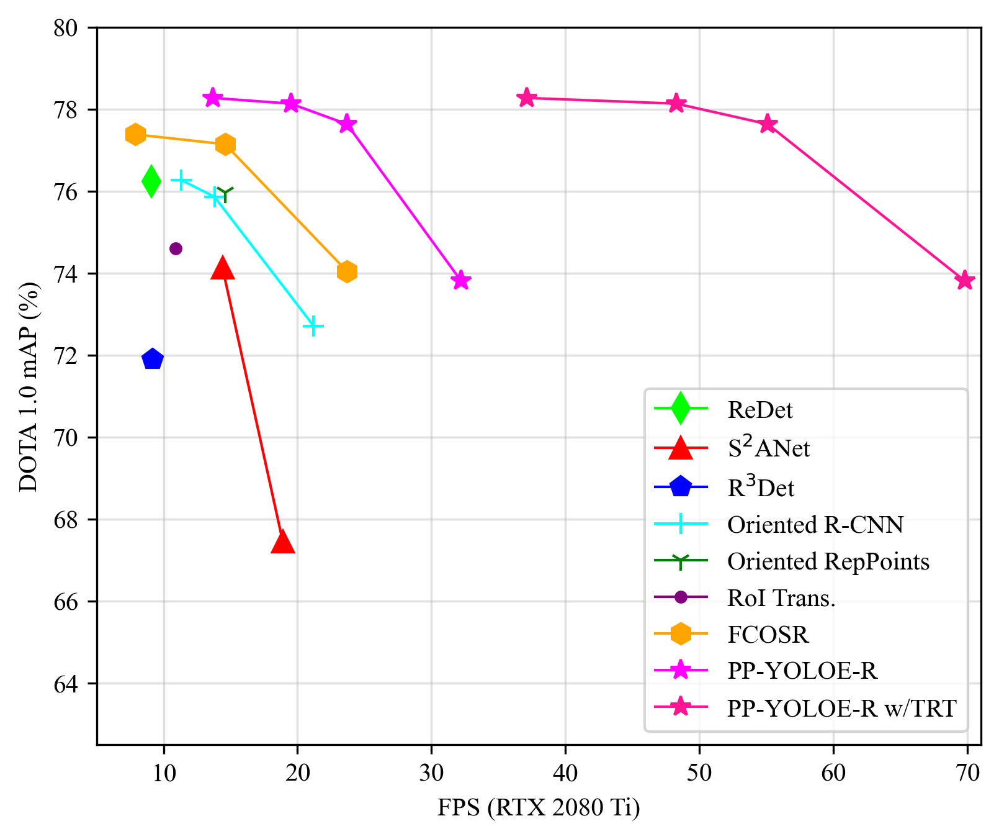

English | [简体中文](README.md)

# PP-YOLOE-R

## Content
- [Introduction](#Introduction)
- [Model Zoo](#Model-Zoo)
- [Getting Start](#Getting-Start)
- [Deployment](#Deployment)
- [Appendix](#Appendix)
- [Citations](#Citations)

## Introduction
PP-YOLOE-R is an efficient anchor-free rotated object detector. Based on PP-YOLOE, PP-YOLOE-R introduces a bag of useful tricks to improve detection precision at the expense of marginal parameters and computations.PP-YOLOE-R-l and PP-YOLOE-R-x achieve 78.14 and 78.27 mAP respectively on DOTA 1.0 dataset with single-scale training and testing, which outperform almost all other rotated object detectors. With multi-scale training and testing, the detection precision of PP-YOLOE-R-l and PP-YOLOE-R-x is further improved to 80.02 and 80.73 mAP. In this case, PP-YOLOE-R-x surpasses all anchor-free methods and demonstrates competitive performance to state-of-the-art anchor-based two-stage model. Moreover, PP-YOLOE-R-s and PP-YOLOE-R-m can achieve 79.42 and 79.71 mAP with multi-scale training and testing, which is an excellent result considering the parameters and GLOPS of these two models. While maintaining high precision, PP-YOLOE-R avoids using special operators, such as Deformable Convolution or Rotated RoI Align, to be deployed friendly on various hardware. At the input resolution of 1024$\times$1024, PP-YOLOE-R-s/m/l/x can reach 69.8/55.1/48.3/37.1 FPS on RTX 2080 Ti and 114.5/86.8/69.7/50.7 FPS on Tesla V100 GPU with TensorRT and FP16-precision. For more details, please refer to our [**technical report**](https://arxiv.org/abs/2211.02386).

<div align="center">
  
</div>

Compared with PP-YOLOE, PP-YOLOE-R has made the following changes:
- Rotated Task Alignment Learning
- Decoupled Angle Prediction Head
- Angle Prediction with DFL
- Learnable Gating Unit for RepVGG
- [ProbIoU Loss](https://arxiv.org/abs/2106.06072)

## Model Zoo
| Model | Backbone | mAP  | V100 TRT FP16 (FPS) | RTX 2080 Ti TRT FP16 (FPS) | Params (M) | FLOPs (G) | Lr Scheduler | Angle | Aug | GPU Number | images/GPU | download | config |
|:-----:|:--------:|:----:|:-------------------:|:--------------------------:|:-----------:|:---------:|:--------:|:-----:|:---:|:----------:|:----------:|:--------:|:------:|
| PP-YOLOE-R-s | CRN-s | 73.82 | 114.5 | 69.8 | 8.09 | 43.46 | 3x | oc | RR | 4 | 2 | [model](https://paddledet.bj.bcebos.com/models/ppyoloe_r_crn_s_3x_dota.pdparams) | [config](https://github.com/PaddlePaddle/PaddleDetection/tree/release/2.6/configs/rotate/ppyoloe_r/ppyoloe_r_crn_s_3x_dota.yml) |
| PP-YOLOE-R-s | CRN-s | 79.42 | 114.5 | 69.8 | 8.09 | 43.46 | 3x | oc | MS+RR | 4 | 2 | [model](https://paddledet.bj.bcebos.com/models/ppyoloe_r_crn_s_3x_dota_ms.pdparams) | [config](https://github.com/PaddlePaddle/PaddleDetection/tree/release/2.6/configs/rotate/ppyoloe_r/ppyoloe_r_crn_s_3x_dota_ms.yml) |
| PP-YOLOE-R-m | CRN-m | 77.64 | 86.8  | 55.1 | 23.96 |127.00 | 3x | oc | RR | 4 | 2 | [model](https://paddledet.bj.bcebos.com/models/ppyoloe_r_crn_m_3x_dota.pdparams) | [config](https://github.com/PaddlePaddle/PaddleDetection/tree/release/2.6/configs/rotate/ppyoloe_r/ppyoloe_r_crn_m_3x_dota.yml) |
| PP-YOLOE-R-m | CRN-m | 79.71 | 86.8  | 55.1 | 23.96 |127.00 | 3x | oc | MS+RR | 4 | 2 | [model](https://paddledet.bj.bcebos.com/models/ppyoloe_r_crn_m_3x_dota_ms.pdparams) | [config](https://github.com/PaddlePaddle/PaddleDetection/tree/release/2.6/configs/rotate/ppyoloe_r/ppyoloe_r_crn_m_3x_dota_ms.yml) |
| PP-YOLOE-R-l | CRN-l | 78.14 | 69.7  | 48.3 | 53.29 |281.65 | 3x | oc | RR | 4 | 2 | [model](https://paddledet.bj.bcebos.com/models/ppyoloe_r_crn_l_3x_dota.pdparams) | [config](https://github.com/PaddlePaddle/PaddleDetection/tree/release/2.6/configs/rotate/ppyoloe_r/ppyoloe_r_crn_l_3x_dota.yml) |
| PP-YOLOE-R-l | CRN-l | 80.02 | 69.7  | 48.3 | 53.29 |281.65 | 3x | oc | MS+RR | 4 | 2 | [model](https://paddledet.bj.bcebos.com/models/ppyoloe_r_crn_l_3x_dota_ms.pdparams) | [config](https://github.com/PaddlePaddle/PaddleDetection/tree/release/2.6/configs/rotate/ppyoloe_r/ppyoloe_r_crn_l_3x_dota_ms.yml) |
| PP-YOLOE-R-x | CRN-x | 78.28 | 50.7  | 37.1 | 100.27|529.82 | 3x | oc | RR | 4 | 2 | [model](https://paddledet.bj.bcebos.com/models/ppyoloe_r_crn_x_3x_dota.pdparams) | [config](https://github.com/PaddlePaddle/PaddleDetection/tree/release/2.6/configs/rotate/ppyoloe_r/ppyoloe_r_crn_x_3x_dota.yml) |
| PP-YOLOE-R-x | CRN-x | 80.73 | 50.7  | 37.1 | 100.27|529.82 | 3x | oc | MS+RR | 4 | 2 | [model](https://paddledet.bj.bcebos.com/models/ppyoloe_r_crn_x_3x_dota_ms.pdparams) | [config](https://github.com/PaddlePaddle/PaddleDetection/tree/release/2.6/configs/rotate/ppyoloe_r/ppyoloe_r_crn_x_3x_dota_ms.yml) |

**Notes:**

- if **GPU number** or **mini-batch size** is changed, **learning rate** should be adjusted according to the formula **lr<sub>new</sub> = lr<sub>default</sub> * (batch_size<sub>new</sub> * GPU_number<sub>new</sub>) / (batch_size<sub>default</sub> * GPU_number<sub>default</sub>)**.
- Models in model zoo is trained and tested with single scale by default. If `MS` is indicated in the data augmentation column, it means that multi-scale training and multi-scale testing are used. If `RR` is indicated in the data augmentation column, it means that RandomRotate data augmentation is used for training.
- CRN denotes CSPRepResNet proposed in PP-YOLOE
- The parameters and GLOPs of PP-YOLOE-R are calculated after re-parameterization, and the resolution of the input image is 1024x1024
- Speed ​​is calculated and averaged by testing 2000 images on the DOTA test dataset. Refer to [Speed testing](#Speed-testing) to reproduce the results.

## Getting Start

Refer to [Data-Preparation](../README_en.md#Data-Preparation) to prepare data.

### Training

Single GPU Training
``` bash
CUDA_VISIBLE_DEVICES=0 python tools/train.py -c configs/rotate/ppyoloe_r/ppyoloe_r_crn_l_3x_dota.yml
```

Multiple GPUs Training
``` bash
CUDA_VISIBLE_DEVICES=0,1,2,3 python -m paddle.distributed.launch --gpus 0,1,2,3 tools/train.py -c configs/rotate/ppyoloe_r/ppyoloe_r_crn_l_3x_dota.yml
```

### Inference

Run the follow command to infer single image, the result of inference will be saved in `output` directory by default.

``` bash
python tools/infer.py -c configs/rotate/ppyoloe_r/ppyoloe_r_crn_l_3x_dota.yml -o weights=https://paddledet.bj.bcebos.com/models/ppyoloe_r_crn_l_3x_dota.pdparams --infer_img=demo/P0861__1.0__1154___824.png --draw_threshold=0.5
```

### Evaluation on DOTA Dataset
Refering to [DOTA Task](https://captain-whu.github.io/DOTA/tasks.html), You need to submit a zip file containing results for all test images for evaluation. The detection results of each category are stored in a txt file, each line of which is in the following format
`image_id score x1 y1 x2 y2 x3 y3 x4 y4`. To evaluate, you should submit the generated zip file to the Task1 of [DOTA Evaluation](https://captain-whu.github.io/DOTA/evaluation.html). You can run the following command to get the inference results of test dataset:
``` bash
python tools/infer.py -c configs/rotate/ppyoloe_r/ppyoloe_r_crn_l_3x_dota.yml -o weights=https://paddledet.bj.bcebos.com/models/ppyoloe_r_crn_l_3x_dota.pdparams --infer_dir=/path/to/test/images --output_dir=output_ppyoloe_r --visualize=False --save_results=True
```
Process the prediction results into the format required for the official website evaluation:
``` bash
python configs/rotate/tools/generate_result.py --pred_txt_dir=output_ppyoloe_r/ --output_dir=submit/ --data_type=dota10

zip -r submit.zip submit
```

### Speed testing

You can use Paddle mode or Paddle-TRT mode for speed testing. When using Paddle-TRT for speed testing, make sure that **the version of TensorRT is larger than 8.2 and the version of PaddlePaddle is the develop version**. Using Paddle-TRT to test speed, run following command

``` bash
# export inference model
python tools/export_model.py -c configs/rotate/ppyoloe_r/ppyoloe_r_crn_l_3x_dota.yml -o weights=https://paddledet.bj.bcebos.com/models/ppyoloe_r_crn_l_3x_dota.pdparams trt=True

# speed testing
CUDA_VISIBLE_DEVICES=0 python configs/rotate/tools/inference_benchmark.py --model_dir output_inference/ppyoloe_r_crn_l_3x_dota/ --image_dir /path/to/dota/test/dir --run_mode trt_fp16
```
Using Paddle to test speed, run following command
``` bash
# export inference model
python tools/export_model.py -c configs/rotate/ppyoloe_r/ppyoloe_r_crn_l_3x_dota.yml -o weights=https://paddledet.bj.bcebos.com/models/ppyoloe_r_crn_l_3x_dota.pdparams

# speed testing
CUDA_VISIBLE_DEVICES=0 python configs/rotate/tools/inference_benchmark.py --model_dir output_inference/ppyoloe_r_crn_l_3x_dota/ --image_dir /path/to/dota/test/dir --run_mode paddle

```

## Deployment

**Using Paddle** to for deployment, run following command

``` bash
# export inference model
python tools/export_model.py -c configs/rotate/ppyoloe_r/ppyoloe_r_crn_l_3x_dota.yml -o weights=https://paddledet.bj.bcebos.com/models/ppyoloe_r_crn_l_3x_dota.pdparams

# inference single image
python deploy/python/infer.py --image_file demo/P0072__1.0__0___0.png --model_dir=output_inference/ppyoloe_r_crn_l_3x_dota --run_mode=paddle --device=gpu
```

**Using Paddle-TRT** for deployment, run following command

``` bash
# export inference model
python tools/export_model.py -c configs/rotate/ppyoloe_r/ppyoloe_r_crn_l_3x_dota.yml -o weights=https://paddledet.bj.bcebos.com/models/ppyoloe_r_crn_l_3x_dota.pdparams trt=True

# inference single image
python deploy/python/infer.py --image_file demo/P0072__1.0__0___0.png --model_dir=output_inference/ppyoloe_r_crn_l_3x_dota --run_mode=trt_fp16 --device=gpu
```
**Notes:**
- When using Paddle-TRT for speed testing, make sure that **the version of TensorRT is larger than 8.2 and the version of PaddlePaddle is the develop version**

**Using ONNX Runtime** for deployment, run following command

``` bash
# export inference model
python tools/export_model.py -c configs/rotate/ppyoloe_r/ppyoloe_r_crn_l_3x_dota.yml -o weights=https://paddledet.bj.bcebos.com/models/ppyoloe_r_crn_l_3x_dota.pdparams export_onnx=True

# install paddle2onnx
pip install paddle2onnx

# convert to onnx model
paddle2onnx --model_dir output_inference/ppyoloe_r_crn_l_3x_dota --model_filename model.pdmodel --params_filename model.pdiparams --opset_version 11 --save_file ppyoloe_r_crn_l_3x_dota.onnx

# inference single image
python configs/rotate/tools/onnx_infer.py --infer_cfg output_inference/ppyoloe_r_crn_l_3x_dota/infer_cfg.yml --onnx_file ppyoloe_r_crn_l_3x_dota.onnx --image_file demo/P0072__1.0__0___0.png
```

## Appendix

Ablation experiments of PP-YOLOE-R

| Model | mAP | Params(M) | FLOPs(G) |
| :-: | :-: | :------: | :------: |
| Baseline | 75.61 | 50.65 | 269.09 |
| +Rotated Task Alignment Learning | 77.24 | 50.65 | 269.09 |
| +Decoupled Angle Prediction Head | 77.78 | 52.20 | 272.72 |
| +Angle Prediction with DFL | 78.01 | 53.29 | 281.65 |
| +Learnable Gating Unit for RepVGG | 78.14 | 53.29 | 281.65 |

## Citations

```
@article{wang2022pp,
  title={PP-YOLOE-R: An Efficient Anchor-Free Rotated Object Detector},
  author={Wang, Xinxin and Wang, Guanzhong and Dang, Qingqing and Liu, Yi and Hu, Xiaoguang and Yu, Dianhai},
  journal={arXiv preprint arXiv:2211.02386},
  year={2022}
}

@article{xu2022pp,
  title={PP-YOLOE: An evolved version of YOLO},
  author={Xu, Shangliang and Wang, Xinxin and Lv, Wenyu and Chang, Qinyao and Cui, Cheng and Deng, Kaipeng and Wang, Guanzhong and Dang, Qingqing and Wei, Shengyu and Du, Yuning and others},
  journal={arXiv preprint arXiv:2203.16250},
  year={2022}
}

@article{llerena2021gaussian,
  title={Gaussian Bounding Boxes and Probabilistic Intersection-over-Union for Object Detection},
  author={Llerena, Jeffri M and Zeni, Luis Felipe and Kristen, Lucas N and Jung, Claudio},
  journal={arXiv preprint arXiv:2106.06072},
  year={2021}
}
```
