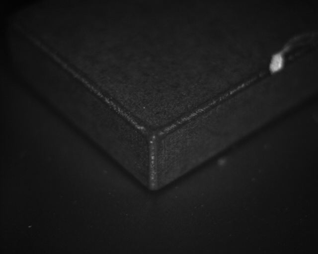
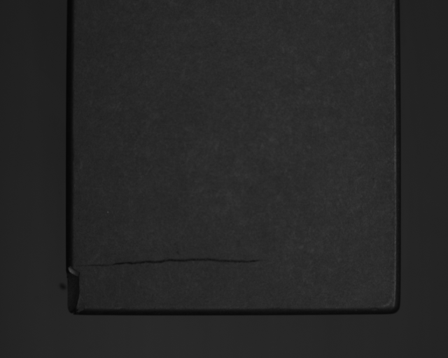
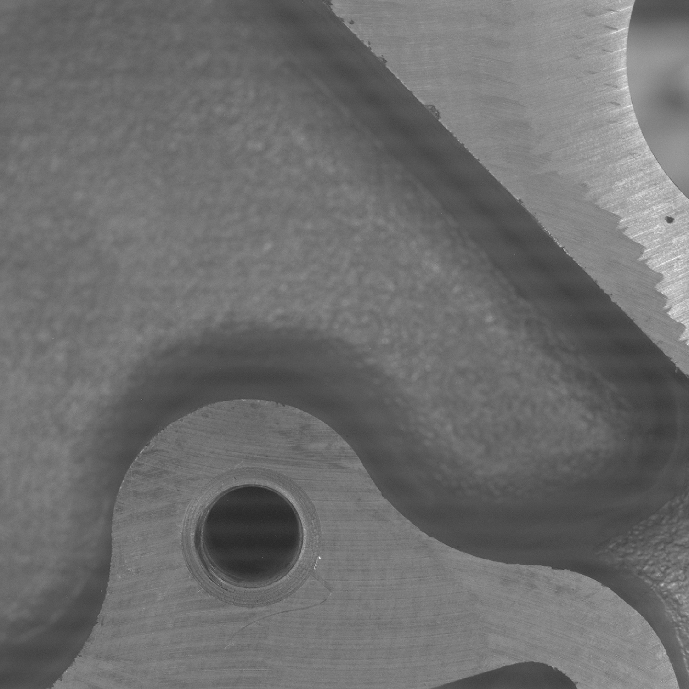
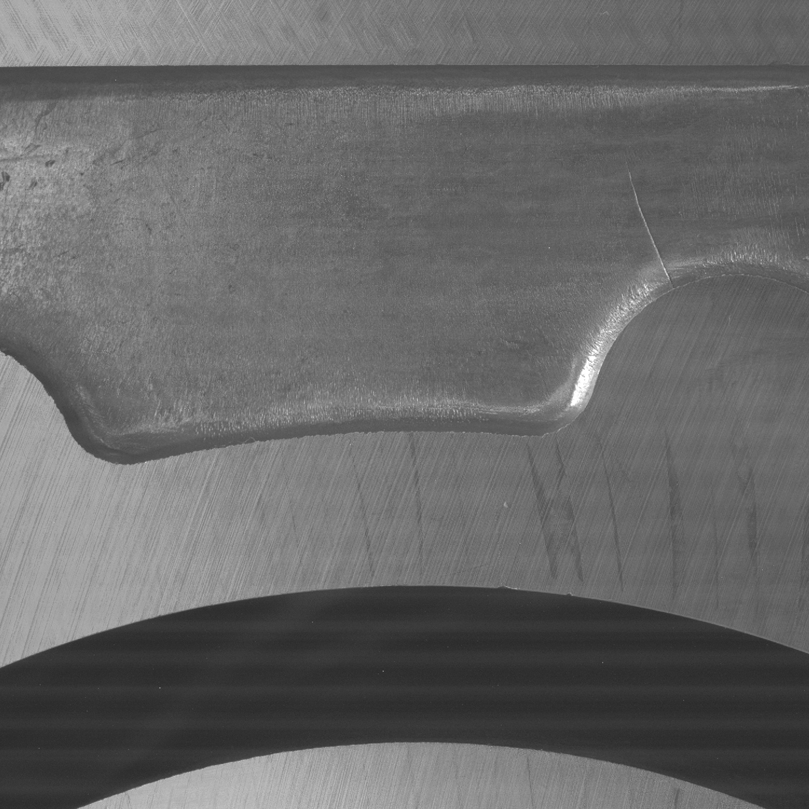
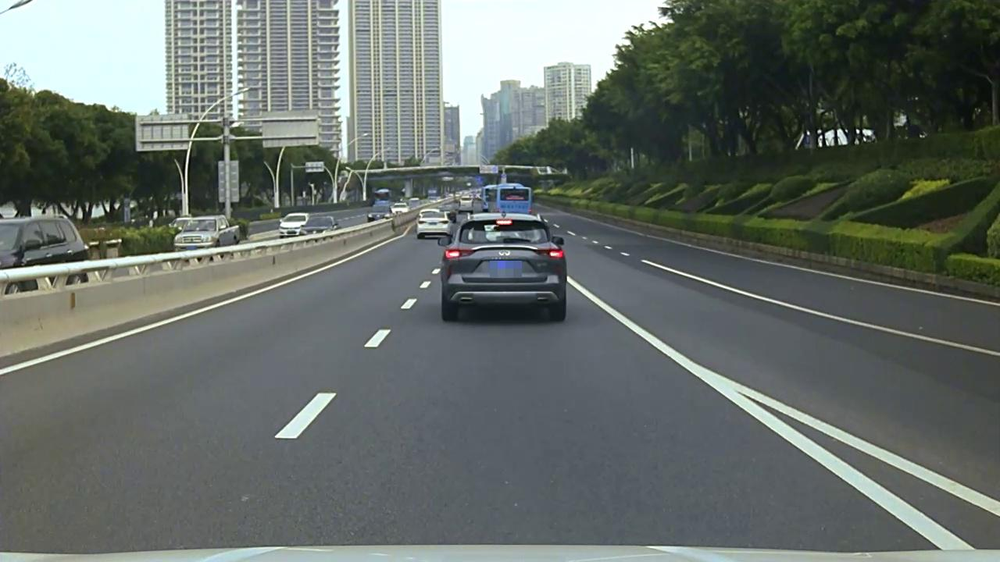
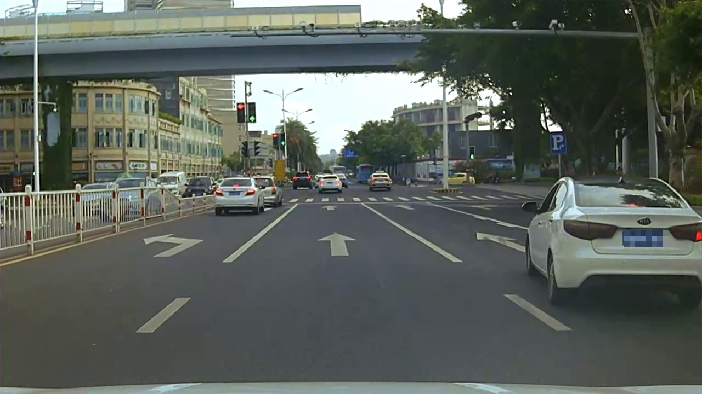

# 飞桨产业模型选型工具PaddleSMRT

## 一、项目介绍

PaddleSMRT (Paddle Sense Model Recommend Tool) 是飞桨结合产业落地经验推出的产业模型选型工具，在项目落地过程中，用户根据自身的实际情况，输入自己的需求，即可以得到对应在算法模型、部署硬件以及教程文档的信息。同时为了更加精准的推荐，增加了数据分析功能，用户上传自己的标注文件，系统可以自动分析数据特点，例如数据分布不均衡、小目标、密集型等，从而提供更加精准的模型以及优化策略，更好的符合场景的需求。

飞桨官网使用[链接](https://www.paddlepaddle.org.cn/smrt)

本文档主要介绍PaddleSMRT在检测方向上是如何进行模型选型推荐，以及推荐模型的使用方法。分割方向模型介绍请参考[文档](https://github.com/PaddlePaddle/PaddleSeg/tree/release/2.5/configs/smrt)

## 二、数据介绍

PaddleSMRT结合产业真实场景，通过比较检测算法效果，向用户推荐最适合的模型。目前PaddleSMRT覆盖工业质检、城市安防两大场景，下面介绍PaddleSMRT进行算法对比所使用的数据集

### 1. 新能源电池质检数据集

数据集为新能源电池电池组件质检数据集，包含15021张图片，包含22045个标注框，覆盖45种缺陷类型，例如掉胶，裂纹，划痕等。

新能源电池数据展示图:

<div align="center">
    
    
</div>

数据集特点为：

1. 类别分布均衡
2. 属于小目标数据
3. 非密集型数据

### 2. 铝件质检数据集

数据集为铝件生产过程中的质检数据集，包含11293张图片，包含43157个标注框，覆盖5种缺陷类型，例如划伤，压伤，起皮等。

铝件质检数据展示图:

<div align="center">
    
    
</div>


数据集特点为：

1. 类别分布不均衡
2. 属于小目标数据
3. 非密集型数据


### 3. 人车数据集

数据集包含2600张人工标注的两点anchor box标签。标签包括以下人和车的类别共22种：
其中行人包括普通行人、3D 假人、坐着的人、骑车的人；车辆包括两厢车、三厢车、小型客车、小货车、皮卡车、轻卡、厢式货车、牵引车、水泥车、工程车辆、校车、中小型客车、大型单层客车、小型电动车、摩托车、自行车、三轮车以及其它特殊车辆。

人车数据展示图:

<div align="center">
    
    
</div>


数据集特点为：

1. 类别分布不均衡
2. 属于小目标数据
3. 非密集型数据

**说明：**

数据集特点判断依据如下：

- 数据分布不均衡：采样1000张图片，不同类别样本个数标准差大于400
- 小目标数据集：相对大小小于0.1或绝对大小小于32像素的样本个数比例大于30%
- 密集型数据集：

```
    密集目标定义：周围目标距离小于自身大小两倍的个数大于2；

    密集图片定义：密集目标个数占图片目标总数50%以上；

    密集数据集定义：密集图片个数占总个数30%以上

```

为了更好的帮助用户选择模型，我们也提供了丰富的数据分析功能，用户只需要上传标注文件（不需要原图）即可了解数据特点分布和模型优化建议

<div align="center">
    
</div>

## 三、推荐模型使用全流程

通过模型选型工具会得到对应场景和数据特点的检测模型配置，例如[PP-YOLOE](./ppyoloe/ppyoloe_crn_m_300e_battery_1024.yml)

该配置文件的使用方法如下

### 1. 环境配置

首先需要安装PaddlePaddle

```bash
# CUDA10.2
pip install paddlepaddle-gpu==2.2.2 -i https://mirror.baidu.com/pypi/simple

# CPU
pip install paddlepaddle==2.2.2 -i https://mirror.baidu.com/pypi/simple
```

然后安装PaddleDetection和相关依赖

```bash
# 克隆PaddleDetection仓库
cd <path/to/clone/PaddleDetection>
git clone https://github.com/PaddlePaddle/PaddleDetection.git

# 安装其他依赖
cd PaddleDetection
pip install -r requirements.txt
```

详细安装文档请参考[文档](../../docs/tutorials/INSTALL_cn.md)

### 2. 数据准备

用户需要准备训练数据集，建议标注文件使用COCO数据格式。如果使用lableme或者VOC数据格式，先使用[格式转换脚本](../../tools/x2coco.py)将标注格式转化为COCO，详细数据准备文档请参考[文档](../../docs/tutorials/data/PrepareDataSet.md)

本文档以新能源电池工业质检子数据集为例展开，数据下载[链接](https://bj.bcebos.com/v1/paddle-smrt/data/battery_mini.zip)

数据储存格式如下：

```
battery_mini
├── annotations
│   ├── test.json
│   └── train.json
└── images
    ├── Board_daowen_101.png
    ├── Board_daowen_109.png
    ├── Board_daowen_117.png
    ...
```


### 3. 模型训练/评估/预测

使用经过模型选型工具推荐的模型进行训练，目前所推荐的模型均使用**单卡训练**，可以在训练的过程中进行评估，模型默认保存在`./output`下

```bash
python tools/train.py -c configs/smrt/ppyoloe/ppyoloe_crn_m_300e_battery_1024.yml  --eval
```

如果训练过程出现中断，可以使用-r命令恢复训练

```bash
python tools/train.py -c configs/smrt/ppyoloe/ppyoloe_crn_m_300e_battery_1024.yml  --eval -r output/ppyoloe_crn_m_300e_battery_1024/9.pdparams
```

如果期望单独评估模型训练精度，可以使用`tools/eval.py`

```bash
python tools/eval.py -c configs/smrt/ppyoloe/ppyoloe_crn_m_300e_battery_1024.yml -o weights=output/ppyoloe_crn_m_300e_battery_1024/model_final.pdparams
```

完成训练后，可以使用`tools/infer.py`可视化训练效果

```bash
python tools/infer.py -c configs/smrt/ppyoloe/ppyoloe_crn_m_300e_battery_1024.yml -o weights=output/ppyoloe_crn_m_300e_battery_1024/model_final.pdparams --infer_img=images/Board_diaojiao_1591.png
```

更多模型训练参数请参考[文档](../../docs/tutorials/GETTING_STARTED_cn.md)

### 4. 模型导出部署

完成模型训练后，需要将模型部署到1080Ti，2080Ti或其他服务器设备上，使用Paddle Inference完成C++部署

首先需要将模型导出为部署时使用的模型和配置文件

```bash
python tools/export_model.py -c configs/smrt/ppyoloe/ppyoloe_crn_m_300e_battery_1024.yml -o weights=output/ppyoloe_crn_m_300e_battery_1024/model_final.pdparams
```

接下来可以使用PaddleDetection中的部署代码实现C++部署，详细步骤请参考[文档](../../deploy/cpp/README.md)

如果期望使用可视化界面的方式进行部署，可以参考下面部分的内容。

## 四、部署demo

为了更方便大家部署，我们也提供了完备的可视化部署Demo，欢迎尝试使用

* [Windows Demo下载地址](https://github.com/PaddlePaddle/PaddleX/tree/develop/deploy/cpp/docs/csharp_deploy)

<div align="center">
    
</div>

* [Linux Demo下载地址](https://github.com/cjh3020889729/The-PaddleX-QT-Visualize-GUI)

<div align="center">
    
</div>

## 五、场景范例

为了更方便大家更好的进行产业落地，PaddleSMRT也提供了详细的应用范例，欢迎大家使用。

* 工业视觉
  * [工业缺陷检测](https://aistudio.baidu.com/aistudio/projectdetail/2598319)
  * [表计读数](https://aistudio.baidu.com/aistudio/projectdetail/2598327)
  * [钢筋计数](https://aistudio.baidu.com/aistudio/projectdetail/2404188)
* 城市  
  * [行人计数](https://aistudio.baidu.com/aistudio/projectdetail/2421822)
  * [车辆计数](https://aistudio.baidu.com/aistudio/projectdetail/3391734?contributionType=1)
  * [安全帽检测](https://aistudio.baidu.com/aistudio/projectdetail/3944737?contributionType=1)
