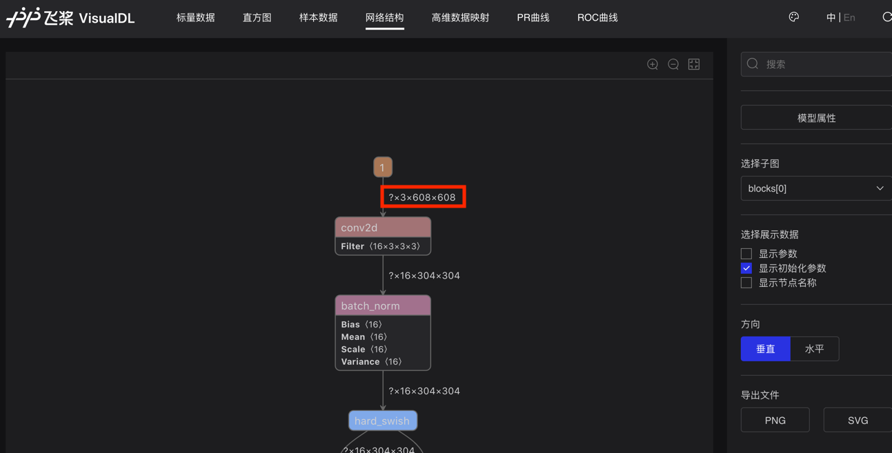

# TensorRT预测部署教程
TensorRT是NVIDIA提出的用于统一模型部署的加速库，可以应用于V100、JETSON Xavier等硬件，它可以极大提高预测速度。Paddle TensorRT教程请参考文档[使用Paddle-TensorRT库预测](https://www.paddlepaddle.org.cn/inference/optimize/paddle_trt.html)

## 1. 安装PaddleInference预测库
- Python安装包，请从[这里](https://paddleinference.paddlepaddle.org.cn/user_guides/download_lib.html#python) 下载带有tensorrt的安装包进行安装

- CPP预测库，请从[这里](https://www.paddlepaddle.org.cn/documentation/docs/zh/guides/05_inference_deployment/inference/build_and_install_lib_cn.html) 下载带有TensorRT编译的预测库

- 如果Python和CPP官网没有提供已编译好的安装包或预测库，请参考[源码安装](https://www.paddlepaddle.org.cn/documentation/docs/zh/install/compile/linux-compile.html) 自行编译

**注意：**
- 您的机器上TensorRT的版本需要跟您使用的预测库中TensorRT版本保持一致。
- PaddleDetection中部署预测要求TensorRT版本 > 6.0。

## 2. 导出模型
模型导出具体请参考文档[PaddleDetection模型导出教程](./EXPORT_MODEL.md)。

## 3. 开启TensorRT加速
### 3.1 配置TensorRT
在使用Paddle预测库构建预测器配置config时，打开TensorRT引擎就可以了：

```
config->EnableUseGpu(100, 0); // 初始化100M显存，使用GPU ID为0
config->GpuDeviceId();        // 返回正在使用的GPU ID
// 开启TensorRT预测，可提升GPU预测性能，需要使用带TensorRT的预测库
config->EnableTensorRtEngine(1 << 20             /*workspace_size*/,
                             batch_size        /*max_batch_size*/,
                             3                 /*min_subgraph_size*/,
                             AnalysisConfig::Precision::kFloat32 /*precision*/,
                             false             /*use_static*/,
                             false             /*use_calib_mode*/);

```
**注意:**
  --run_benchmark如果设置为True，则需要安装依赖`pip install pynvml psutil GPUtil`。

### 3.2 TensorRT固定尺寸预测

例如在模型Reader配置文件中设置：
```yaml
TestReader:
  inputs_def:
    image_shape: [3,608,608]
  ...
```
或者在导出模型时设置`-o TestReader.inputs_def.image_shape=[3,608,608]`，模型将会进行固定尺寸预测，具体请参考[PaddleDetection模型导出教程](./EXPORT_MODEL.md) 。

可以通过[visualdl](https://www.paddlepaddle.org.cn/paddle/visualdl/demo/graph) 打开`model.pdmodel`文件，查看输入的第一个Tensor尺寸是否是固定的，如果不指定，尺寸会用`？`表示，如下图所示：



注意：由于TesnorRT不支持在batch维度进行slice操作，Faster RCNN 和 Mask RCNN不能使用固定尺寸输入预测，所以不能设置`TestReader.inputs_def.image_shape`字段。

以`YOLOv3`为例，使用固定尺寸输入预测：
```
python python/infer.py --model_dir=./output_inference/yolov3_darknet53_270e_coco/ --image_file=./demo/000000014439.jpg --device=GPU --run_mode=trt_fp32 --run_benchmark=True
```

### 3.3 TensorRT动态尺寸预测

TensorRT版本>=6时，使用TensorRT预测时，可以支持动态尺寸输入。如果模型Reader配置文件中没有设置例如`TestReader.inputs_def.image_shape=[3,608,608]`的字段，或者`image_shape=[3.-1,-1]`，导出模型将以动态尺寸进行预测。一般RCNN系列模型使用动态图尺寸预测。
Paddle预测库关于动态尺寸输入请查看[Paddle CPP预测](https://www.paddlepaddle.org.cn/documentation/docs/zh/guides/05_inference_deployment/inference/native_infer.html) 的`SetTRTDynamicShapeInfo`函数说明。

`python/infer.py`设置动态尺寸输入参数说明：

- trt_min_shape 用于设定TensorRT的输入图像height、width中的最小尺寸，默认值：1

- trt_max_shape 用于设定TensorRT的输入图像height、width中的最大尺寸，默认值：1280

- trt_opt_shape 用于设定TensorRT的输入图像height、width中的最优尺寸，默认值：640

**注意：`TensorRT`中动态尺寸设置是4维的，这里只设置输入图像的尺寸。**

以`Faster RCNN`为例，使用动态尺寸输入预测：
```
python python/infer.py --model_dir=./output_inference/faster_rcnn_r50_fpn_1x_coco/ --image_file=./demo/000000014439.jpg --device=GPU --run_mode=trt_fp16 --run_benchmark=True --trt_max_shape=1280 --trt_min_shape=800 --trt_opt_shape=960
```

## 4、常见问题QA
**Q:** 提示没有`tensorrt_op`</br>
**A:** 请检查是否使用带有TensorRT的Paddle Python包或预测库。

**Q:** 提示`op out of memory`</br>
**A:** 检查GPU是否是别人也在使用，请尝试使用空闲GPU

**Q:** 提示`some trt inputs dynamic shape info not set`</br>
**A:** 这是由于`TensorRT`会把网络结果划分成多个子图，我们只设置了输入数据的动态尺寸，划分的其他子图的输入并未设置动态尺寸。有两个解决方法：

- 方法一：通过增大`min_subgraph_size`，跳过对这些子图的优化。根据提示，设置min_subgraph_size大于并未设置动态尺寸输入的子图中OP个数即可。
`min_subgraph_size`的意思是，在加载TensorRT引擎的时候，大于`min_subgraph_size`的OP才会被优化，并且这些OP是连续的且是TensorRT可以优化的。

- 方法二：找到子图的这些输入，按照上面方式也设置子图的输入动态尺寸。

**Q:** 如何打开日志</br>
**A:** 预测库默认是打开日志的，只要注释掉`config.disable_glog_info()`就可以打开日志

**Q:** 开启TensorRT，预测时提示Slice on batch axis is not supported in TensorRT</br>
**A:** 请尝试使用动态尺寸输入
