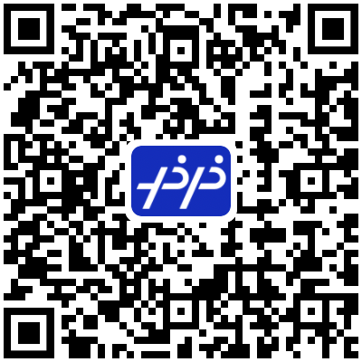
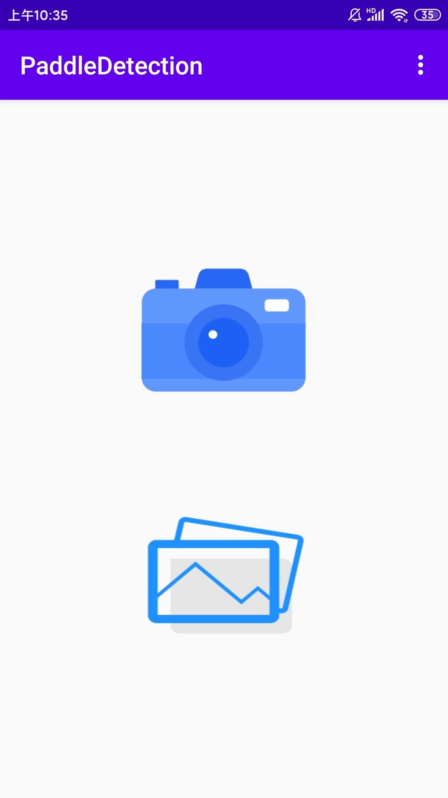
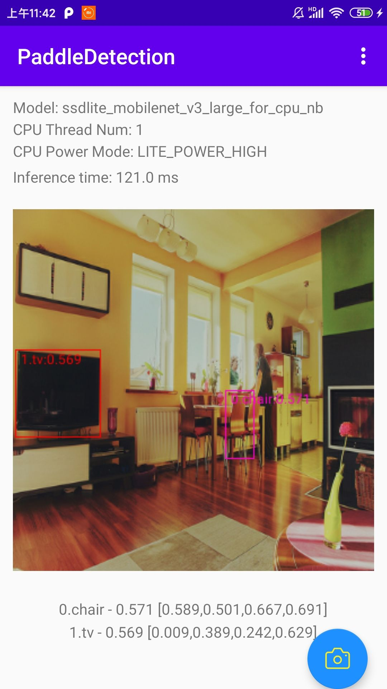
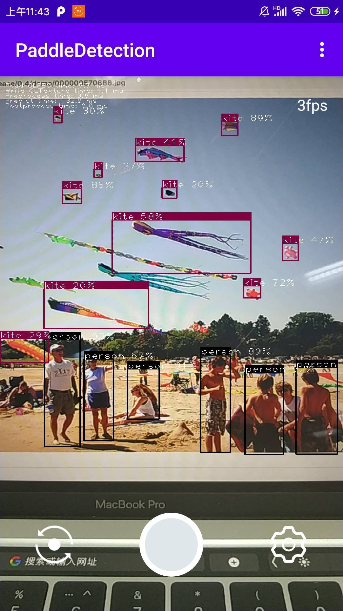

# PaddleDetection安卓端demo

### 下载试用
可通过[下载链接](https://paddlemodels.bj.bcebos.com/object_detection/lite/paddledetection_app.apk)直接下载，或直接使用手机浏览器扫描二维码下载安装：

  

### 环境搭建与代码运行
- 安装最新版本的Android Studio，可以从https://developer.android.com/studio 下载。本demo使用是4.0版本Android Studio编写。
- 下载NDK 20 以上版本，NDK 20版本以上均可以编译成功。可以用以下方式安装和测试NDK编译环境：点击 File -> New ->New Project，新建  "Native C++" project。
- 导入项目：点击 File->New->Import Project...， 跟随Android Studio的引导导入项目即可。
- 首先打开`app/build.gradle`文件，运行`downloadAndExtractArchives`函数，完成PaddleLite预测库与模型的下载与压缩。
- 连接并选择设备，编译app并运行。

### 效果展示

  

### 更新预测库与模型

#### 更新预测库

- 参考[ Paddle-Lite文档](https://github.com/PaddlePaddle/Paddle-Lite/wiki)，编译Android等预测库，或直接下载最新[Paddle Lite预编译库](https://paddle-lite.readthedocs.io/zh/latest/quick_start/release_lib.html)。
- 更新`app/libs`下`PaddlePredictor.jar`包，更新`app/src/main/jniLibs/arm64-v8a/libpaddle_lite_jni.so`包，更新`app/src/main/jniLibs/armeabi-v7a/libpaddle_lite_jni.so`包。

#### 更新模型

- 本demo中支持SSD与YOLO系列模型，如想更新模型，请替换`app/src/main/assets/models`下相关`model.nb`权重文件。
- 如果想要加入新的算法模型，如人脸检测、实例分割等，需要在`app/src/main/assets/models`下放入新模型，并修改`app/src/main/cpp`下的数据预处理代码以适配新的模型算法。
- 如更新的模型是非COCO数据集模型，请更新`app/src/main/assets/labels`下的类别标签文件。

### 获取更多支持
- 本demo依赖[Paddle-Lite](https://github.com/PaddlePaddle/Paddle-Lite)，Android工程开发可参考[Paddle-Lite Android 工程示例教程](https://paddle-lite.readthedocs.io/zh/latest/demo_guides/android_app_demo.html#android-demo)。
- 更多Paddle-Lite的demo请参考[Paddle-Lite-Demo](https://github.com/PaddlePaddle/Paddle-Lite-Demo)。
- 前往[端计算模型生成平台EasyEdge](https://ai.baidu.com/easyedge/app/open_source_demo?referrerUrl=paddlelite)，获得更多开发支持。
