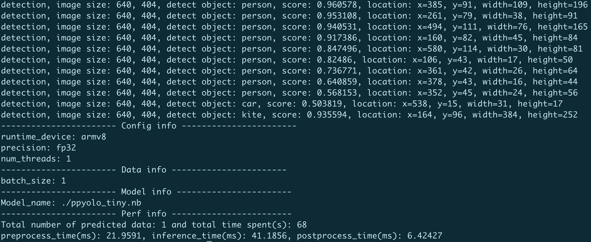

# Paddle-Lite端侧部署

本教程将介绍基于[Paddle Lite](https://github.com/PaddlePaddle/Paddle-Lite) 在移动端部署PaddleDetection模型的详细步骤。

Paddle Lite是飞桨轻量化推理引擎，为手机、IOT端提供高效推理能力，并广泛整合跨平台硬件，为端侧部署及应用落地问题提供轻量化的部署方案。

## 1. 准备环境

### 运行准备
- 电脑（编译Paddle Lite）
- 安卓手机（armv7或armv8）

### 1.1 准备交叉编译环境
交叉编译环境用于编译 Paddle Lite 和 PaddleDetection 的C++ demo。
支持多种开发环境，不同开发环境的编译流程请参考对应文档，请确保安装完成Java jdk、Android NDK(R17 < version < R21，其他版本以上未做测试)。
设置NDK_ROOT命令：
```shell
export NDK_ROOT=[YOUR_NDK_PATH]/android-ndk-r17c
```


1. [Docker](https://paddle-lite.readthedocs.io/zh/latest/source_compile/compile_env.html#docker)
2. [Linux](https://paddle-lite.readthedocs.io/zh/latest/source_compile/compile_env.html#linux)
3. [MAC OS](https://paddle-lite.readthedocs.io/zh/latest/source_compile/compile_env.html#mac-os)

### 1.2 准备预测库

预测库有两种获取方式：
1. [**建议**]直接下载，预测库下载链接如下：(请注意使用模型FP32/16版本需要与库相对应)
      |平台| 架构 | 预测库下载链接|
      |-|-|-|
      |Android| arm7 | [inference_lite_lib](https://github.com/PaddlePaddle/Paddle-Lite/releases/download/v2.10-rc/inference_lite_lib.android.armv7.clang.c++_static.with_extra.with_cv.tar.gz) |
      | Android | arm8 | [inference_lite_lib](https://github.com/PaddlePaddle/Paddle-Lite/releases/download/v2.10-rc/inference_lite_lib.android.armv8.clang.c++_static.with_extra.with_cv.tar.gz)  |
      | Android | arm8(FP16) | [inference_lite_lib](https://github.com/PaddlePaddle/Paddle-Lite/releases/download/v2.10-rc/inference_lite_lib.android.armv8_clang_c++_static_with_extra_with_cv_with_fp16.tiny_publish_427e46.zip)  |

**注意**：（1） 如果是从 Paddle-Lite [官方文档](https://paddle-lite.readthedocs.io/zh/latest/quick_start/release_lib.html#android-toolchain-gcc)下载的预测库，注意选择`with_extra=ON，with_cv=ON`的下载链接。2. 目前只提供Android端demo，IOS端demo可以参考[Paddle-Lite IOS demo](https://github.com/PaddlePaddle/Paddle-Lite-Demo/tree/master/PaddleLite-ios-demo)
（2）PP-PicoDet部署需要Paddle Lite 2.11以上版本，建议选择从源码编译的方式。


2. 编译Paddle-Lite得到预测库，Paddle-Lite的编译方式如下(Lite库在不断更新，如若下列命令无效，请以Lite官方repo为主)：
```shell
git clone https://github.com/PaddlePaddle/Paddle-Lite.git
cd Paddle-Lite
# 如果使用编译方式，建议使用develop分支编译预测库
git checkout develop
# FP32
./lite/tools/build_android.sh --arch=armv8 --toolchain=clang --with_cv=ON --with_extra=ON
# FP16
./lite/tools/build_android.sh --arch=armv8 --toolchain=clang --with_cv=ON --with_extra=ON --with_arm82_fp16=ON
```

**注意**：编译Paddle-Lite获得预测库时，需要打开`--with_cv=ON --with_extra=ON`两个选项，`--arch`表示`arm`版本，这里指定为armv8，更多编译命令介绍请参考[链接](https://paddle-lite.readthedocs.io/zh/latest/source_compile/compile_andriod.html#id2)。

直接下载预测库并解压后，可以得到`inference_lite_lib.android.armv8.clang.c++_static.with_extra.with_cv/`文件夹，通过编译Paddle-Lite得到的预测库位于`Paddle-Lite/build.lite.android.armv8.gcc/inference_lite_lib.android.armv8/`文件夹下。
预测库的文件目录如下：

```
inference_lite_lib.android.armv8/
|-- cxx                                        C++ 预测库和头文件
|   |-- include                                C++ 头文件
|   |   |-- paddle_api.h
|   |   |-- paddle_image_preprocess.h
|   |   |-- paddle_lite_factory_helper.h
|   |   |-- paddle_place.h
|   |   |-- paddle_use_kernels.h
|   |   |-- paddle_use_ops.h
|   |   `-- paddle_use_passes.h
|   `-- lib                                           C++预测库
|       |-- libpaddle_api_light_bundled.a             C++静态库
|       `-- libpaddle_light_api_shared.so             C++动态库
|-- java                                     Java预测库
|   |-- jar
|   |   `-- PaddlePredictor.jar
|   |-- so
|   |   `-- libpaddle_lite_jni.so
|   `-- src
|-- demo                                     C++和Java示例代码
|   |-- cxx                                  C++  预测库demo
|   `-- java                                 Java 预测库demo
```

## 2 开始运行

### 2.1 模型优化

Paddle-Lite 提供了多种策略来自动优化原始的模型，其中包括量化、子图融合、混合调度、Kernel优选等方法，使用Paddle-Lite的`opt`工具可以自动对inference模型进行优化，目前支持两种优化方式，优化后的模型更轻量，模型运行速度更快。

**注意**：如果已经准备好了 `.nb` 结尾的模型文件，可以跳过此步骤。

#### 2.1.1 安装paddle_lite_opt工具
安装`paddle_lite_opt`工具有如下两种方法：
1. [**建议**]pip安装paddlelite并进行转换
    ```shell
    pip install paddlelite==2.10rc
    ```

2. 源码编译Paddle-Lite生成`paddle_lite_opt`工具

    模型优化需要Paddle-Lite的`opt`可执行文件，可以通过编译Paddle-Lite源码获得，编译步骤如下：
    ```shell
    # 如果准备环境时已经clone了Paddle-Lite，则不用重新clone Paddle-Lite
    git clone https://github.com/PaddlePaddle/Paddle-Lite.git
    cd Paddle-Lite
    git checkout develop
    # 启动编译
    ./lite/tools/build.sh build_optimize_tool
    ```

    编译完成后，`opt`文件位于`build.opt/lite/api/`下，可通过如下方式查看`opt`的运行选项和使用方式；
    ```shell
    cd build.opt/lite/api/
    ./opt
    ```

    `opt`的使用方式与参数与上面的`paddle_lite_opt`完全一致。

之后使用`paddle_lite_opt`工具可以进行inference模型的转换。`paddle_lite_opt`的部分参数如下：

|选项|说明|
|-|-|
|--model_file|待优化的PaddlePaddle模型（combined形式）的网络结构文件路径|
|--param_file|待优化的PaddlePaddle模型（combined形式）的权重文件路径|
|--optimize_out_type|输出模型类型，目前支持两种类型：protobuf和naive_buffer，其中naive_buffer是一种更轻量级的序列化/反序列化实现，默认为naive_buffer|
|--optimize_out|优化模型的输出路径|
|--valid_targets|指定模型可执行的backend，默认为arm。目前可支持x86、arm、opencl、npu、xpu，可以同时指定多个backend(以空格分隔)，Model Optimize Tool将会自动选择最佳方式。如果需要支持华为NPU（Kirin 810/990 Soc搭载的达芬奇架构NPU），应当设置为npu, arm|

更详细的`paddle_lite_opt`工具使用说明请参考[使用opt转化模型文档](https://paddle-lite.readthedocs.io/zh/latest/user_guides/opt/opt_bin.html)

`--model_file`表示inference模型的model文件地址，`--param_file`表示inference模型的param文件地址；`optimize_out`用于指定输出文件的名称（不需要添加`.nb`的后缀）。直接在命令行中运行`paddle_lite_opt`，也可以查看所有参数及其说明。


#### 2.1.3 转换示例

下面以PaddleDetection中的 `PicoDet` 模型为例，介绍使用`paddle_lite_opt`完成预训练模型到inference模型，再到Paddle-Lite优化模型的转换。

```shell
# 进入PaddleDetection根目录
cd PaddleDetection_root_path

# 将预训练模型导出为inference模型
python tools/export_model.py -c configs/picodet/picodet_s_320_coco.yml \
              -o weights=https://paddledet.bj.bcebos.com/models/picodet_s_320_coco.pdparams --output_dir=output_inference

# 将inference模型转化为Paddle-Lite优化模型
# FP32
paddle_lite_opt  --valid_targets=arm --model_file=output_inference/picodet_s_320_coco/model.pdmodel --param_file=output_inference/picodet_s_320_coco/model.pdiparams --optimize_out=output_inference/picodet_s_320_coco/model
# FP16
paddle_lite_opt  --valid_targets=arm --model_file=output_inference/picodet_s_320_coco/model.pdmodel --param_file=output_inference/picodet_s_320_coco/model.pdiparams --optimize_out=output_inference/picodet_s_320_coco/model --enable_fp16=true

# 将inference模型配置转化为json格式
python deploy/lite/convert_yml_to_json.py output_inference/picodet_s_320_coco/infer_cfg.yml
```

最终在output_inference/picodet_s_320_coco/文件夹下生成`model.nb` 和 `infer_cfg.json`的文件。

**注意**：`--optimize_out` 参数为优化后模型的保存路径，无需加后缀`.nb`；`--model_file` 参数为模型结构信息文件的路径，`--param_file` 参数为模型权重信息文件的路径，请注意文件名。

### 2.2 与手机联调

首先需要进行一些准备工作。
1. 准备一台arm8的安卓手机，如果编译的预测库是armv7，则需要arm7的手机，并修改Makefile中`ARM_ABI=arm7`。
2. 电脑上安装ADB工具，用于调试。 ADB安装方式如下：

    2.1. MAC电脑安装ADB:

    ```shell
    brew cask install android-platform-tools
    ```
    2.2. Linux安装ADB
    ```shell
    sudo apt update
    sudo apt install -y wget adb
    ```
    2.3. Window安装ADB

    win上安装需要去谷歌的安卓平台下载ADB软件包进行安装：[链接](https://developer.android.com/studio)

3. 手机连接电脑后，开启手机`USB调试`选项，选择`文件传输`模式，在电脑终端中输入：

```shell
adb devices
```
如果有device输出，则表示安装成功，如下所示：
```
List of devices attached
744be294    device
```

4. 编译lite部署代码生成移动端可执行文件

```shell
cd {PadddleDetection_Root}
cd deploy/lite/

inference_lite_path=/{lite prediction library path}/inference_lite_lib.android.armv8.gcc.c++_static.with_extra.with_cv/
mkdir $inference_lite_path/demo/cxx/lite

cp -r Makefile src/ include/ *runtime_config.json $inference_lite_path/demo/cxx/lite

cd $inference_lite_path/demo/cxx/lite

# 执行编译，等待完成后得到可执行文件main
make ARM_ABI=arm8
#如果是arm7，则执行 make ARM_ABI = arm7 (或者在Makefile中修改该项)

```

5. 准备优化后的模型、预测库文件、测试图像。

```shell
mkdir deploy
cp main *runtime_config.json deploy/
cd deploy
mkdir model_det
mkdir model_keypoint

# 将优化后的模型、预测库文件、测试图像放置在预测库中的demo/cxx/detection文件夹下
cp {PadddleDetection_Root}/output_inference/picodet_s_320_coco/model.nb ./model_det/
cp {PadddleDetection_Root}/output_inference/picodet_s_320_coco/infer_cfg.json ./model_det/

# 如果需要关键点模型，则只需操作：
cp {PadddleDetection_Root}/output_inference/hrnet_w32_256x192/model.nb ./model_keypoint/
cp {PadddleDetection_Root}/output_inference/hrnet_w32_256x192/infer_cfg.json ./model_keypoint/

# 将测试图像复制到deploy文件夹中
cp [your_test_img].jpg ./demo.jpg

# 将C++预测动态库so文件复制到deploy文件夹中
cp ../../../cxx/lib/libpaddle_light_api_shared.so ./
```

执行完成后，deploy文件夹下将有如下文件格式：

```
deploy/
|-- model_det/
|   |--model.nb                    优化后的检测模型文件
|   |--infer_cfg.json              检测器模型配置文件
|-- model_keypoint/
|   |--model.nb                    优化后的关键点模型文件
|   |--infer_cfg.json              关键点模型配置文件
|-- main                           生成的移动端执行文件
|-- det_runtime_config.json        目标检测执行时参数配置文件
|-- keypoint_runtime_config.json   关键点检测执行时参数配置文件
|-- libpaddle_light_api_shared.so  Paddle-Lite库文件
```

**注意：**
*  `det_runtime_config.json` 包含了目标检测的超参数，请按需进行修改：

```shell
{
  "model_dir_det": "./model_det/",              #检测器模型路径
  "batch_size_det": 1,                          #检测预测时batchsize
  "threshold_det": 0.5,                         #检测器输出阈值
  "image_file": "demo.jpg",                     #测试图片
  "image_dir": "",                              #测试图片文件夹
  "run_benchmark": true,                       #性能测试开关
  "cpu_threads": 4                              #线程数
}
```

*  `keypoint_runtime_config.json` 包含了关键点检测的超参数，请按需进行修改：
```shell
{
  "model_dir_keypoint": "./model_keypoint/",    #关键点模型路径（不使用需为空字符）
  "batch_size_keypoint": 8,                     #关键点预测时batchsize
  "threshold_keypoint": 0.5,                    #关键点输出阈值
  "image_file": "demo.jpg",                     #测试图片
  "image_dir": "",                              #测试图片文件夹
  "run_benchmark": true,                       #性能测试开关
  "cpu_threads": 4                              #线程数
}
```

6. 启动调试，上述步骤完成后就可以使用ADB将文件夹 `deploy/` push到手机上运行，步骤如下：

```shell
# 将上述deploy文件夹push到手机上
adb push deploy /data/local/tmp/

adb shell
cd /data/local/tmp/deploy
export LD_LIBRARY_PATH=/data/local/tmp/deploy:$LD_LIBRARY_PATH

# 修改权限为可执行
chmod 777 main
# 以检测为例，执行程序
./main det_runtime_config.json
```

如果对代码做了修改，则需要重新编译并push到手机上。

运行效果如下：

<div align="center">
    
</div>


## FAQ
Q1：如果想更换模型怎么办，需要重新按照流程走一遍吗？  
A1：如果已经走通了上述步骤，更换模型只需要替换 `.nb` 模型文件即可，同时要注意修改下配置文件中的 `.nb` 文件路径以及类别映射文件（如有必要）。

Q2：换一个图测试怎么做？  
A2：替换 deploy 下的测试图像为你想要测试的图像，使用 ADB 再次 push 到手机上即可。
