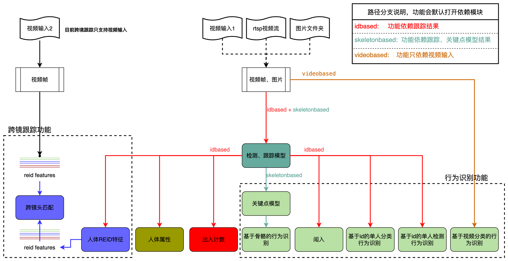

# 快速开始

## 目录

- [环境准备](#环境准备)
- [模型下载](#模型下载)
- [配置文件说明](#配置文件说明)
- [预测部署](#预测部署)
  - [参数说明](#参数说明)
- [方案介绍](#方案介绍)
  - [行人检测](#行人检测)
  - [行人跟踪](#行人跟踪)
  - [跨镜行人跟踪](#跨镜行人跟踪)
  - [属性识别](#属性识别)
  - [行为识别](#行为识别)

## 环境准备

环境要求： PaddleDetection版本 >= release/2.4 或 develop版本

PaddlePaddle和PaddleDetection安装

```
# PaddlePaddle CUDA10.1
python -m pip install paddlepaddle-gpu==2.2.2.post101 -f https://www.paddlepaddle.org.cn/whl/linux/mkl/avx/stable.html

# PaddlePaddle CPU
python -m pip install paddlepaddle -i https://mirror.baidu.com/pypi/simple

# 克隆PaddleDetection仓库
cd <path/to/clone/PaddleDetection>
git clone https://github.com/PaddlePaddle/PaddleDetection.git

# 安装其他依赖
cd PaddleDetection
pip install -r requirements.txt
```

1. 详细安装文档参考[文档](../../../../docs/tutorials/INSTALL_cn.md)
2. 如果需要TensorRT推理加速（测速方式），请安装带`TensorRT版本Paddle`。您可以从[Paddle安装包](https://paddleinference.paddlepaddle.org.cn/v2.2/user_guides/download_lib.html#python)下载安装，或者按照[指导文档](https://www.paddlepaddle.org.cn/inference/master/optimize/paddle_trt.html)使用docker或自编译方式准备Paddle环境。

## 模型下载

PP-Human提供了目标检测、属性识别、行为识别、ReID预训练模型，以实现不同使用场景，用户可以直接下载使用

| 任务            | 端到端速度（ms）|  模型方案  |  模型体积 |
| :---------:     | :-------:  |  :------: |:------: |
|  行人检测（高精度）  | 25.1ms  |  [多目标跟踪](https://bj.bcebos.com/v1/paddledet/models/pipeline/mot_ppyoloe_l_36e_pipeline.zip) | 182M |  
|  行人检测（轻量级）  | 16.2ms  |  [多目标跟踪](https://bj.bcebos.com/v1/paddledet/models/pipeline/mot_ppyoloe_s_36e_pipeline.zip) | 27M |
|  行人跟踪（高精度）  | 31.8ms  |  [多目标跟踪](https://bj.bcebos.com/v1/paddledet/models/pipeline/mot_ppyoloe_l_36e_pipeline.zip) | 182M |
|  行人跟踪（轻量级）  | 21.0ms  |  [多目标跟踪](https://bj.bcebos.com/v1/paddledet/models/pipeline/mot_ppyoloe_s_36e_pipeline.zip) | 27M |
|  属性识别（高精度）  |   单人8.5ms | [目标检测](https://bj.bcebos.com/v1/paddledet/models/pipeline/mot_ppyoloe_l_36e_pipeline.zip)<br> [属性识别](https://bj.bcebos.com/v1/paddledet/models/pipeline/PPHGNet_small_person_attribute_954_infer.zip) | 目标检测：182M<br>属性识别：86M |
|  属性识别（轻量级）  |   单人7.1ms | [目标检测](https://bj.bcebos.com/v1/paddledet/models/pipeline/mot_ppyoloe_l_36e_pipeline.zip)<br> [属性识别](https://bj.bcebos.com/v1/paddledet/models/pipeline/PPLCNet_x1_0_person_attribute_945_infer.zip) | 目标检测：182M<br>属性识别：86M |
|  摔倒识别  |   单人10ms | [多目标跟踪](https://bj.bcebos.com/v1/paddledet/models/pipeline/mot_ppyoloe_l_36e_pipeline.zip) <br> [关键点检测](https://bj.bcebos.com/v1/paddledet/models/pipeline/dark_hrnet_w32_256x192.zip) <br> [基于关键点行为识别](https://bj.bcebos.com/v1/paddledet/models/pipeline/STGCN.zip) | 多目标跟踪：182M<br>关键点检测：101M<br>基于关键点行为识别：21.8M |
|  闯入识别  |   31.8ms | [多目标跟踪](https://bj.bcebos.com/v1/paddledet/models/pipeline/mot_ppyoloe_l_36e_pipeline.zip) | 多目标跟踪：182M |
|  打架识别  |   19.7ms | [视频分类](https://bj.bcebos.com/v1/paddledet/models/pipeline/mot_ppyoloe_l_36e_pipeline.zip) | 90M |
|  抽烟识别  |   单人15.1ms | [目标检测](https://bj.bcebos.com/v1/paddledet/models/pipeline/mot_ppyoloe_l_36e_pipeline.zip)<br>[基于人体id的目标检测](https://bj.bcebos.com/v1/paddledet/models/pipeline/ppyoloe_crn_s_80e_smoking_visdrone.zip) | 目标检测：182M<br>基于人体id的目标检测：27M |
|  打电话识别  |   单人ms | [目标检测](https://bj.bcebos.com/v1/paddledet/models/pipeline/mot_ppyoloe_l_36e_pipeline.zip)<br>[基于人体id的图像分类](https://bj.bcebos.com/v1/paddledet/models/pipeline/PPHGNet_tiny_calling_halfbody.zip) | 目标检测：182M<br>基于人体id的图像分类：45M |

下载模型后，解压至`./output_inference`文件夹。

在配置文件中，模型路径默认为模型的下载路径，如果用户不修改，则在推理时会自动下载对应的模型。

**注意：**

- 模型精度为融合数据集结果，数据集包含开源数据集和企业数据集
- ReID模型精度为Market1501数据集测试结果
- 预测速度为T4下，开启TensorRT FP16的效果, 模型预测速度包含数据预处理、模型预测、后处理全流程

## 配置文件说明

PP-Human相关配置位于```deploy/pipeline/config/infer_cfg_pphuman.yml```中，存放模型路径，该配置文件中包含了目前PP-Human支持的所有功能。如果想要查看某个单一功能的配置，请参见```deploy/pipeline/config/examples/```中相关配置。此外，配置文件中的内容可以通过```-o```命令行参数修改，如修改属性的模型目录，则可通过```-o ATTR.model_dir="DIR_PATH"```进行设置。

功能及任务类型对应表单如下：

| 输入类型 | 功能 | 任务类型 | 配置项 |
|-------|-------|----------|-----|
| 图片 | 属性识别 | 目标检测 属性识别 | DET ATTR |
| 单镜头视频 | 属性识别 | 多目标跟踪 属性识别 | MOT ATTR |
| 单镜头视频 | 行为识别 | 多目标跟踪 关键点检测 摔倒识别 | MOT KPT SKELETON_ACTION |

例如基于视频输入的属性识别，任务类型包含多目标跟踪和属性识别，具体配置如下：

```
crop_thresh: 0.5
attr_thresh: 0.5
visual: True

MOT:
  model_dir: https://bj.bcebos.com/v1/paddledet/models/pipeline/mot_ppyoloe_l_36e_pipeline.zip
  tracker_config: deploy/pipeline/config/tracker_config.yml
  batch_size: 1
  enable: True

ATTR:
  model_dir:  https://bj.bcebos.com/v1/paddledet/models/pipeline/PPLCNet_x1_0_person_attribute_945_infer.zip
  batch_size: 8
  enable: True
```

**注意：**

- 如果用户需要实现不同任务，可以在配置文件对应enable选项设置为True。


## 预测部署

```
# 行人检测，指定配置文件路径和测试图片
python deploy/pipeline/pipeline.py --config deploy/pipeline/config/infer_cfg_pphuman.yml --image_file=test_image.jpg --device=gpu [--run_mode trt_fp16]

# 行人跟踪，指定配置文件路径和测试视频，在配置文件```deploy/pipeline/config/infer_cfg_pphuman.yml```中的MOT部分enable设置为```True```
python deploy/pipeline/pipeline.py --config deploy/pipeline/config/infer_cfg_pphuman.yml --video_file=test_video.mp4 --device=gpu [--run_mode trt_fp16]

# 行人跟踪，指定配置文件路径，模型路径和测试视频，在配置文件```deploy/pipeline/config/infer_cfg_pphuman.yml```中的MOT部分enable设置为```True```
# 命令行中指定的模型路径优先级高于配置文件
python deploy/pipeline/pipeline.py --config deploy/pipeline/config/infer_cfg_pphuman.yml --video_file=test_video.mp4 --device=gpu [--run_mode trt_fp16]

# 行人属性识别，指定配置文件路径和测试视频，在配置文件```deploy/pipeline/config/infer_cfg_pphuman.yml```中的ATTR部分enable设置为```True```
python deploy/pipeline/pipeline.py --config deploy/pipeline/config/infer_cfg_pphuman.yml --video_file=test_video.mp4 --device=gpu [--run_mode trt_fp16]

# 行为识别，以摔倒识别为例，指定配置文件路径和测试视频，在配置文件```deploy/pipeline/config/infer_cfg_pphuman.yml```中的SKELETON_ACTION部分enable设置为```True```
python deploy/pipeline/pipeline.py --config deploy/pipeline/config/infer_cfg_pphuman.yml --video_file=test_video.mp4 --device=gpu [--run_mode trt_fp16]

# 行人跨境跟踪，指定配置文件路径和测试视频列表文件夹，在配置文件```deploy/pipeline/config/infer_cfg_pphuman.yml```中的REID部分enable设置为```True```
python deploy/pipeline/pipeline.py --config deploy/pipeline/config/infer_cfg_pphuman.yml --video_dir=mtmct_dir/ --device=gpu [--run_mode trt_fp16]

# 行人跨境跟踪，指定配置文件路径和测试视频列表文件夹，直接使用```deploy/pipeline/config/examples/infer_cfg_reid.yml```配置文件，并利用```-o```命令修改跟踪模型路径
python deploy/pipeline/pipeline.py --config deploy/pipeline/config/examples/infer_cfg_reid.yml --video_dir=mtmct_dir/ -o MOT.model_dir="mot_model_dir" --device=gpu [--run_mode trt_fp16]

```

对rtsp流的支持，video_file后面的视频地址更换为rtsp流地址，示例如下：
```
# 行人属性识别，指定配置文件路径和测试视频，在配置文件```deploy/pipeline/config/infer_cfg_pphuman.yml```中的ATTR部分enable设置为```True```
python deploy/pipeline/pipeline.py --config deploy/pipeline/config/infer_cfg_pphuman.yml -o visual=False --video_file=rtsp://[YOUR_RTSP_SITE] --device=gpu [--run_mode trt_fp16]
```

### 参数说明

| 参数 | 是否必须|含义 |
|-------|-------|----------|
| --config | Yes | 配置文件路径 |
| -o | Option | 覆盖配置文件中对应的配置  |
| --image_file | Option | 需要预测的图片 |
| --image_dir  | Option |  要预测的图片文件夹路径   |
| --video_file | Option | 需要预测的视频，或者rtsp流地址 |
| --camera_id | Option | 用来预测的摄像头ID，默认为-1(表示不使用摄像头预测，可设置为：0 - (摄像头数目-1) )，预测过程中在可视化界面按`q`退出输出预测结果到：output/output.mp4|
| --device | Option | 运行时的设备，可选择`CPU/GPU/XPU`，默认为`CPU`|
| --output_dir | Option|可视化结果保存的根目录，默认为output/|
| --run_mode | Option |使用GPU时，默认为paddle, 可选（paddle/trt_fp32/trt_fp16/trt_int8）|
| --enable_mkldnn | Option | CPU预测中是否开启MKLDNN加速，默认为False |
| --cpu_threads | Option| 设置cpu线程数，默认为1 |
| --trt_calib_mode | Option| TensorRT是否使用校准功能，默认为False。使用TensorRT的int8功能时，需设置为True，使用PaddleSlim量化后的模型时需要设置为False |
| --do_entrance_counting | Option | 是否统计出入口流量，默认为False |
| --draw_center_traj | Option | 是否绘制跟踪轨迹，默认为False |

## 方案介绍

PP-Human v2整体方案如下图所示:

<div width="1000" align="center">
  
</div>


### 行人检测
- 采用PP-YOLOE L 作为目标检测模型
- 详细文档参考[PP-YOLOE](../../../../configs/ppyoloe/)和[检测跟踪文档](pphuman_mot.md)

### 行人跟踪
- 采用SDE方案完成行人跟踪
- 检测模型使用PP-YOLOE L(高精度)和S(轻量级)
- 跟踪模块采用OC-SORT方案
- 详细文档参考[OC-SORT](../../../../configs/mot/ocsort)和[检测跟踪文档](pphuman_mot.md)

### 跨镜行人跟踪
- 使用PP-YOLOE + OC-SORT得到单镜头多目标跟踪轨迹
- 使用ReID（StrongBaseline网络）对每一帧的检测结果提取特征
- 多镜头轨迹特征进行匹配，得到跨镜头跟踪结果
- 详细文档参考[跨镜跟踪](pphuman_mtmct.md)

### 属性识别
- 使用PP-YOLOE + OC-SORT跟踪人体
- 使用StrongBaseline（多分类模型）完成识别属性，主要属性包括年龄、性别、帽子、眼睛、上衣下衣款式、背包等
- 详细文档参考[属性识别](pphuman_attribute.md)

### 行为识别：
- 提供四种行为识别方案
- 1. 基于骨骼点的行为识别，例如摔倒识别
- 2. 基于图像分类的行为识别，例如打电话识别
- 3. 基于检测的行为识别，例如吸烟识别
- 4. 基于视频分类的行为识别，例如打架识别
- 详细文档参考[行为识别](pphuman_action.md)
