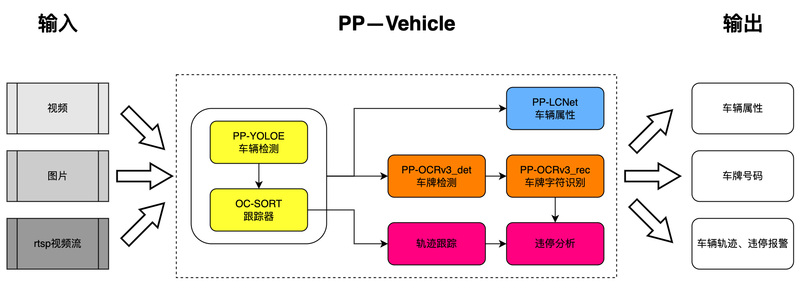

# 快速开始

## 目录

- [环境准备](#环境准备)
- [模型下载](#模型下载)
- [配置文件说明](#配置文件说明)
- [预测部署](#预测部署)
  - [参数说明](#参数说明)
- [方案介绍](#方案介绍)
  - [车辆检测](#车辆检测)
  - [车辆跟踪](#车辆跟踪)
  - [车牌识别](#车牌识别)
  - [属性识别](#属性识别)


## 环境准备

环境要求： PaddleDetection版本 >= release/2.4 或 develop版本

PaddlePaddle和PaddleDetection安装

```
# PaddlePaddle CUDA10.1
python -m pip install paddlepaddle-gpu==2.2.2.post101 -f https://www.paddlepaddle.org.cn/whl/linux/mkl/avx/stable.html

# PaddlePaddle CPU
python -m pip install paddlepaddle -i https://mirror.baidu.com/pypi/simple

# 克隆PaddleDetection仓库
cd <path/to/clone/PaddleDetection>
git clone https://github.com/PaddlePaddle/PaddleDetection.git

# 安装其他依赖
cd PaddleDetection
pip install -r requirements.txt
```

1. 详细安装文档参考[文档](../../../../docs/tutorials/INSTALL_cn.md)
2. 如果需要TensorRT推理加速（测速方式），请安装带`TensorRT版本Paddle`。您可以从[Paddle安装包](https://paddleinference.paddlepaddle.org.cn/v2.2/user_guides/download_lib.html#python)下载安装，或者按照[指导文档](https://www.paddlepaddle.org.cn/inference/master/optimize/paddle_trt.html)使用docker或自编译方式准备Paddle环境。

## 模型下载


## 配置文件说明

PP-Vehicle相关配置位于```deploy/pipeline/config/infer_cfg_ppvehicle.yml```中，存放模型路径，完成不同功能需要设置不同的任务类型

功能及任务类型对应表单如下：

| 输入类型 | 功能 | 任务类型 | 配置项 |
|-------|-------|----------|-----|
| 图片 | 属性识别 | 目标检测 属性识别 | DET ATTR |
| 单镜头视频 | 属性识别 | 多目标跟踪 属性识别 | MOT ATTR |
| 单镜头视频 | 属性识别 | 多目标跟踪 属性识别 | MOT VEHICLEPLATE |

例如基于视频输入的属性识别，任务类型包含多目标跟踪和属性识别，具体配置如下：

```

```

**注意：**

- 如果用户需要实现不同任务，可以在配置文件对应enable选项设置为True, 其basemode类型会在代码中开启依赖的基础能力模型，比如跟踪模型。
- 如果用户仅需要修改模型文件路径，可以在命令行中加入 `--model_dir det=ppyoloe/` 即可，也可以手动修改配置文件中的相应模型路径，详细说明参考下方参数说明文档。


## 预测部署

```
# 车辆检测，指定配置文件路径和测试图片
python deploy/pipeline/pipeline.py --config deploy/pipeline/config/infer_cfg_ppvehicle.yml --image_file=test_image.jpg --device=gpu [--run_mode trt_fp16]

# 车辆跟踪，指定配置文件路径和测试视频，在配置文件```deploy/pipeline/config/infer_cfg_ppvehicle.yml```中的MOT部分enable设置为```True```
python deploy/pipeline/pipeline.py --config deploy/pipeline/config/infer_cfg_ppvehicle.yml --video_file=test_video.mp4 --device=gpu [--run_mode trt_fp16]

# 车辆跟踪，指定配置文件路径，模型路径和测试视频，在配置文件```deploy/pipeline/config/infer_cfg_ppvehicle.yml```中的MOT部分enable设置为```True```
# 命令行中指定的模型路径优先级高于配置文件
python deploy/pipeline/pipeline.py --config deploy/pipeline/config/infer_cfg_ppvehicle.yml --video_file=test_video.mp4 --device=gpu --model_dir det=ppyoloe/ [--run_mode trt_fp16]

# 车辆属性识别，指定配置文件路径和测试视频，在配置文件```deploy/pipeline/config/infer_cfg_ppvehicle.yml```中的ATTR部分enable设置为```True```
python deploy/pipeline/pipeline.py --config deploy/pipeline/config/infer_cfg_ppvehicle.yml --video_file=test_video.mp4 --device=gpu [--run_mode trt_fp16]

```

### 参数说明

| 参数 | 是否必须|含义 |
|-------|-------|----------|
| --config | Yes | 配置文件路径 |
| --model_dir | Option | 各任务模型路径，优先级高于配置文件, 例如`--model_dir det=better_det/ attr=better_attr/`|
| --image_file | Option | 需要预测的图片 |
| --image_dir  | Option |  要预测的图片文件夹路径   |
| --video_file | Option | 需要预测的视频 |
| --camera_id | Option | 用来预测的摄像头ID，默认为-1(表示不使用摄像头预测，可设置为：0 - (摄像头数目-1) )，预测过程中在可视化界面按`q`退出输出预测结果到：output/output.mp4|
| --device | Option | 运行时的设备，可选择`CPU/GPU/XPU`，默认为`CPU`|
| --output_dir | Option|可视化结果保存的根目录，默认为output/|
| --run_mode | Option |使用GPU时，默认为paddle, 可选（paddle/trt_fp32/trt_fp16/trt_int8）|
| --enable_mkldnn | Option | CPU预测中是否开启MKLDNN加速，默认为False |
| --cpu_threads | Option| 设置cpu线程数，默认为1 |
| --trt_calib_mode | Option| TensorRT是否使用校准功能，默认为False。使用TensorRT的int8功能时，需设置为True，使用PaddleSlim量化后的模型时需要设置为False |
| --do_entrance_counting | Option | 是否统计出入口流量，默认为False |
| --draw_center_traj | Option | 是否绘制跟踪轨迹，默认为False |

## 方案介绍

PP-Vehicle v2整体方案如下图所示:

<div width="1000" align="center">
  
</div>


### 车辆检测
- 采用PP-YOLOE L 作为目标检测模型
- 详细文档参考[PP-YOLOE](../../../../configs/ppyoloe/)和[检测跟踪文档](ppvehicle_mot.md)

### 车辆跟踪
- 采用SDE方案完成车辆跟踪
- 检测模型使用PP-YOLOE L(高精度)和S(轻量级)
- 跟踪模块采用OC-SORT方案
- 详细文档参考[OC-SORT](../../../../configs/mot/ocsort)和[检测跟踪文档](ppvehicle_mot.md)

### 属性识别
- 使用PP-YOLOE + OC-SORT跟踪车辆
- 详细文档参考[属性识别](ppvehicle_attribute.md)

### 车牌识别
- 使用PaddleOCR特色模型ch_PP-OCRv3_det+ch_PP-OCRv3_rec模型，识别车牌号码
- 详细文档参考[属性识别](ppvehicle_plate.md)
