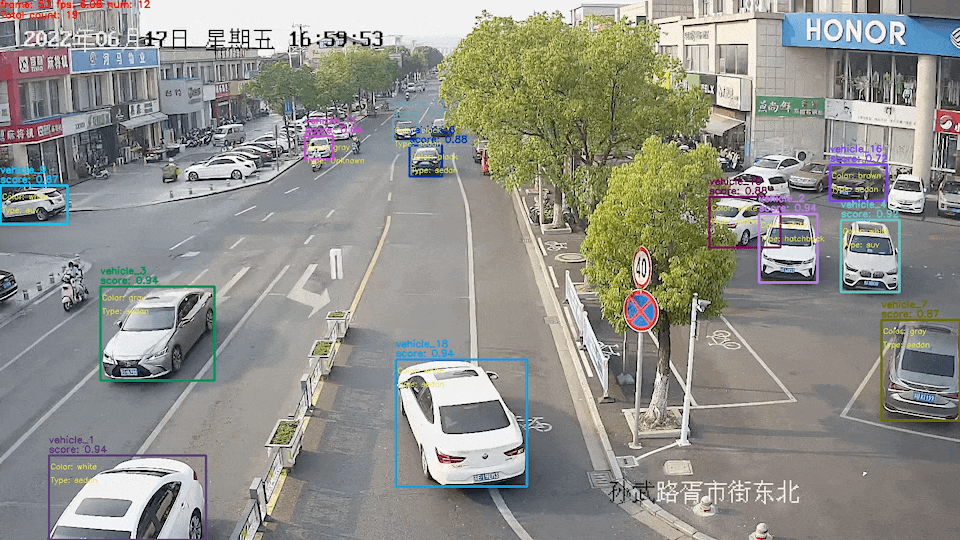

English | [简体中文](ppvehicle_attribute.md)

# Attribute Recognition Module of PP-Vehicle

Vehicle attribute recognition is widely used in smart cities, smart transportation and other scenarios. In PP-Vehicle, a vehicle attribute recognition module is integrated, which can identify vehicle color and model.

| Task | Algorithm | Precision | Inference Speed | Download |
|-----------|------|-----------|----------|---------------------|
| Vehicle Detection/Tracking | PP-YOLOE | - | - | [Inference and Deployment Model](https://bj.bcebos.com/v1/paddledet/models/pipeline/mot_ppyoloe_l_36e_ppvehicle.zip) |
| Vehicle Attribute Recognition | PPLCNet | 90.81 | 2.36 ms | [Inference and Deployment Model](https://bj.bcebos.com/v1/paddledet/models/pipeline/vehicle_attribute_model.zip) |


Note:
1. The prediction speed of the attribute model is based on the test of Intel(R) Xeon(R) Gold 6148 CPU @ 2.40GHz, the MKLDNN acceleration strategy is enabled, and the number of threads is 10.
2. About the model PPLCNet, Please refer to [PP-LCNet Series](https://github.com/PaddlePaddle/PaddleClas/blob/release/2.4/docs/en/models/PP-LCNet_en.md).
3. The training and test phase of vehicle attribute recognition model are both based on [VeRi dataset](https://www.v7labs.com/open-datasets/veri-dataset).


- The published pretrained model support the recognition of 10 colors and 9 models, same with VeRi dataset. The detail are:

```yaml
# Vehicle Colors
- "yellow"
- "orange"
- "green"
- "gray"
- "red"
- "blue"
- "white"
- "golden"
- "brown"
- "black"

# Vehicle Models
- "sedan"
- "suv"
- "van"
- "hatchback"
- "mpv"
- "pickup"
- "bus"
- "truck"
- "estate"
```

## Instructions

### Description of Configuration

Parameters related to vehicle attribute recognition in the [config file](../../config/infer_cfg_ppvehicle.yml) are as follow:

```yaml
VEHICLE_ATTR:
  model_dir: output_inference/vehicle_attribute_infer/ # Path of the model
  batch_size: 8     # The size of the inference batch
  color_threshold: 0.5  # Threshold of color. Confidence is required to reach this threshold to determine the specific attribute, otherwise it will be 'Unknown‘.
  type_threshold: 0.5   # Threshold of vehicle model. Confidence is required to reach this threshold to determine the specific attribute, otherwise it will be 'Unknown‘.
  enable: False         # Whether to enable this function
```

### How to Use
1. Download models `Vehicle Detection/Tracking` and `Vehicle Attribute Recognition` from the links in `Model Zoo` and unzip them to ```./output_inference```. The models are automatically downloaded by default. If you download them manually, you need to modify the `model_dir` as the model storage path.

2. Set the "enable: True" of `VEHICLE_ATTR` in infer_cfg_ppvehicle.yml.

3. For image input, please run these commands. (Description of more parameters, please refer [QUICK_STARTED - Parameter_Description](./PPVehicle_QUICK_STARTED.md).

```bash
# For single image
python deploy/pipeline/pipeline.py --config deploy/pipeline/config/infer_cfg_ppvehicle.yml \
                                                   --image_file=test_image.jpg \
                                                   --device=gpu

# For folder contains one or multiple images
python deploy/pipeline/pipeline.py --config deploy/pipeline/config/infer_cfg_ppvehicle.yml \
                                                   --image_dir=images/ \
                                                   --device=gpu
```

4. For video input, please run these commands.

```bash
# For single video
python deploy/pipeline/pipeline.py --config deploy/pipeline/config/infer_cfg_ppvehicle.yml \
                                                   --video_file=test_video.mp4 \
                                                   --device=gpu

# For folder contains one or multiple videos
python deploy/pipeline/pipeline.py --config deploy/pipeline/config/infer_cfg_ppvehicle.yml \
                                                   --video_dir=test_videos/ \
                                                   --device=gpu
```

5. There are two ways to modify the model path:

    - Method 1：Convfigure different model paths in `./deploy/pipeline/config/infer_cfg_ppvehicle.yml`. For vehicle attribute recognition, the path should be modified under the `VEHICLE_ATTR` field.
    - Method 2: Directly add --model_dir in command line：

```bash
python deploy/pipeline/pipeline.py --config deploy/pipeline/config/infer_cfg_ppvehicle.yml \
                                                   --video_file=test_video.mp4 \
                                                   --device=gpu \
                                                   --model_dir vehicle_attr=output_inference/vehicle_attribute_infer
```

The result is shown as follow:

<div width="1000" align="center">
  
</div>


### Introduction to the Solution

The vehicle attribute recognition model is from ultra-lightweight image classification scheme (PULC, Practical Ultra Lightweight image Classification), which provided by [PaddleClas](https://github.com/PaddlePaddle/PaddleClas). For details on data preparation, training, and testing of the model, please refer to [PULC Recognition Model of Vehicle Attribute](https://github.com/PaddlePaddle/PaddleClas/blob/release/2.4/docs/en/PULC/PULC_vehicle_attribute_en.md).

The vehicle attribute recognition model adopts the lightweight and high-precision PPLCNet. And on the basis of this model, the following optimization scheme is further used:

- By using the SSLD pre-trained model, the accuracy can be improved by about 0.5 percentage points without changing the inference speed.
- Integrating the EDA data enhancement strategy, the accuracy can be improved by another 0.52 percentage points.
- Using SKL-UGI knowledge distillation, the accuracy can continue to improve by 0.23 percentage points.
