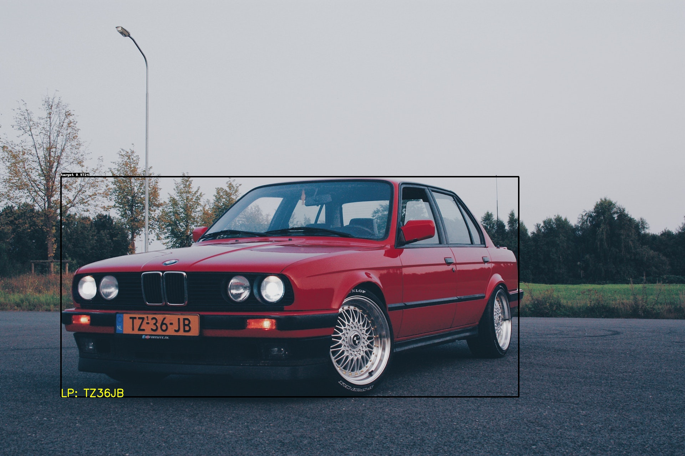

[English](ppvehicle_plate_en.md) | 简体中文

# PP-Vehicle车牌识别模块

车牌识别，在车辆应用场景中有着非常广泛的应用，起到车辆身份识别的作用，比如车辆出入口自动闸机。PP-Vehicle中提供了车辆的跟踪及其车牌识别的功能，并提供模型下载：

| 任务                 | 算法 | 精度 | 预测速度(ms) |预测模型下载链接                                                                               |
|:---------------------|:---------:|:------:|:------:| :---------------------------------------------------------------------------------: |
| 车辆检测/跟踪 |  PP-YOLOE-l | mAP: 63.9 | - |[下载链接](https://bj.bcebos.com/v1/paddledet/models/pipeline/mot_ppyoloe_l_36e_ppvehicle.zip) |
| 车牌检测模型    |  ch_PP-OCRv3_det  |  hmean: 0.979  | - | [下载链接](https://bj.bcebos.com/v1/paddledet/models/pipeline/ch_PP-OCRv3_det_infer.tar.gz) |
| 车牌识别模型    |  ch_PP-OCRv3_rec  |  acc: 0.773  | - | [下载链接](https://bj.bcebos.com/v1/paddledet/models/pipeline/ch_PP-OCRv3_rec_infer.tar.gz) |
1. 跟踪模型使用PPVehicle数据集（整合了BDD100K-MOT和UA-DETRAC），是将BDD100K-MOT中的car, truck, bus, van和UA-DETRAC中的car, bus, van都合并为1类vehicle(1)后的数据集。
2. 车牌检测、识别模型使用PP-OCRv3模型在CCPD2019、CCPD2020混合车牌数据集上fine-tune得到。

## 使用方法

1. 从上表链接中下载模型并解压到```PaddleDetection/output_inference```路径下，并修改配置文件中模型路径，也可默认自动下载模型。设置```deploy/pipeline/config/infer_cfg_ppvehicle.yml```中`VEHICLE_PLATE`的enable: True

`infer_cfg_ppvehicle.yml`中配置项说明：
```
VEHICLE_PLATE:                                                            #模块名称
  det_model_dir: output_inference/ch_PP-OCRv3_det_infer/                  #车牌检测模型路径
  det_limit_side_len: 480                                                 #检测模型单边输入尺寸
  det_limit_type: "max"                                                   #检测模型输入尺寸长短边选择，"max"表示长边
  rec_model_dir: output_inference/ch_PP-OCRv3_rec_infer/                  #车牌识别模型路径
  rec_image_shape: [3, 48, 320]                                           #车牌识别模型输入尺寸
  rec_batch_num: 6                                                        #车牌识别batchsize
  word_dict_path: deploy/pipeline/ppvehicle/rec_word_dict.txt             #OCR模型查询字典
  basemode: "idbased"                                                     #流程类型，'idbased'表示基于跟踪模型
  enable: False                                                           #功能是否开启
```

2. 图片输入时，启动命令如下(更多命令参数说明，请参考[快速开始-参数说明](./PPVehicle_QUICK_STARTED.md#41-参数说明))。
```python
#单张图片
python deploy/pipeline/pipeline.py --config deploy/pipeline/config/infer_cfg_ppvehicle.yml \
                                                   --image_file=test_image.jpg \
                                                   --device=gpu \

#图片文件夹
python deploy/pipeline/pipeline.py --config deploy/pipeline/config/infer_cfg_ppvehicle.yml \
                                                   --image_dir=images/ \
                                                   --device=gpu \

```

3. 视频输入时，启动命令如下
```python
#单个视频文件
python deploy/pipeline/pipeline.py --config deploy/pipeline/config/infer_cfg_ppvehicle.yml \
                                                   --video_file=test_video.mp4 \
                                                   --device=gpu \

#视频文件夹
python deploy/pipeline/pipeline.py --config deploy/pipeline/config/infer_cfg_ppvehicle.yml \
                                                   --video_dir=test_videos/ \
                                                   --device=gpu \
```

4. 若修改模型路径，有以下两种方式：

    - 方法一：```./deploy/pipeline/config/infer_cfg_ppvehicle.yml```下可以配置不同模型路径，车牌识别模型修改`VEHICLE_PLATE`字段下配置
    - 方法二：命令行中--config配置项后面增加`-o VEHICLE_PLATE.det_model_dir=[YOUR_DETMODEL_PATH] VEHICLE_PLATE.rec_model_dir=[YOUR_RECMODEL_PATH]`修改模型路径。


测试效果如下：

<div width="600" align="center">
  
</div>


## 方案说明

1. 目标检测/多目标跟踪获取图片/视频输入中的车辆检测框，模型方案为PP-YOLOE，详细文档参考[PP-YOLOE](../../../configs/ppyoloe/README_cn.md)
2. 通过车辆检测框的坐标在输入图像中截取每个车辆
3. 使用车牌检测模型在每张车辆截图中识别车牌所在位置，同理截取车牌区域，模型方案为PP-OCRv3_det模型，经CCPD数据集在车牌场景fine-tune得到。
4. 使用字符识别模型识别车牌中的字符。模型方案为PP-OCRv3_rec模型，经CCPD数据集在车牌场景fine-tune得到。

**性能优化措施：**

1. 使用跳帧策略，每10帧做一次车牌检测，避免每帧做车牌检测的算力消耗。
2. 车牌结果稳定策略，避免单帧结果的波动，利用同一个id的历史所有车牌识别结果进行投票，得到该id最大可能的正确结果。

## 参考资料

1. PaddeDetection特色检测模型[PP-YOLOE](../../../../configs/ppyoloe)。
2. Paddle字符识别模型库[PaddleOCR](https://github.com/PaddlePaddle/PaddleOCR)。
