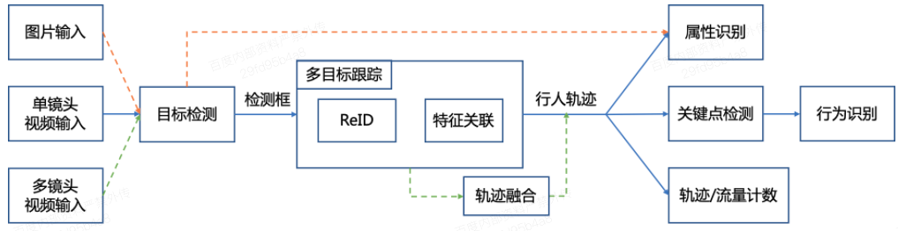

[English](README_en.md) | 简体中文

# 实时行人分析 PP-Human

PP-Human是基于飞桨深度学习框架的业界首个开源的实时行人分析工具，具有功能丰富，应用广泛和部署高效三大优势。PP-Human
支持图片/单镜头视频/多镜头视频多种输入方式，功能覆盖多目标跟踪、属性识别和行为分析。能够广泛应用于智慧交通、智慧社区、工业巡检等领域。支持服务器端部署及TensorRT加速，T4服务器上可达到实时。

PP-Human赋能社区智能精细化管理, AIStudio快速上手教程[链接](https://aistudio.baidu.com/aistudio/projectdetail/3679564)

实时行人分析全流程实战, 覆盖训练、部署、动作类型扩展等内容，AIStudio项目请见[链接](https://aistudio.baidu.com/aistudio/projectdetail/3842982)

## 一、环境准备

环境要求： PaddleDetection版本 >= release/2.4 或 develop版本

PaddlePaddle和PaddleDetection安装

```
# PaddlePaddle CUDA10.1
python -m pip install paddlepaddle-gpu==2.2.2.post101 -f https://www.paddlepaddle.org.cn/whl/linux/mkl/avx/stable.html

# PaddlePaddle CPU
python -m pip install paddlepaddle -i https://mirror.baidu.com/pypi/simple

# 克隆PaddleDetection仓库
cd <path/to/clone/PaddleDetection>
git clone https://github.com/PaddlePaddle/PaddleDetection.git

# 安装其他依赖
cd PaddleDetection
pip install -r requirements.txt
```

1. 详细安装文档参考[文档](../../docs/tutorials/INSTALL_cn.md)
2. 如果需要TensorRT推理加速（测速方式），请安装带`TensorRT版本Paddle`。您可以从[Paddle安装包](https://paddleinference.paddlepaddle.org.cn/v2.2/user_guides/download_lib.html#python)下载安装，或者按照[指导文档](https://www.paddlepaddle.org.cn/inference/master/optimize/paddle_trt.html)使用docker或自编译方式准备Paddle环境。

## 二、快速开始

### 1. 模型下载

PP-Human提供了目标检测、属性识别、行为识别、ReID预训练模型，以实现不同使用场景，用户可以直接下载使用

| 任务            | 适用场景 | 精度 | 预测速度（ms） | 预测部署模型 |
| :---------:     |:---------:     |:---------------     | :-------:  | :------:      |
| 目标检测        | 图片输入 | mAP: 56.3  | 28.0ms          | [下载链接](https://bj.bcebos.com/v1/paddledet/models/pipeline/mot_ppyoloe_l_36e_pipeline.zip) |
| 目标跟踪        | 视频输入 | MOTA: 72.0  | 33.1ms           | [下载链接](https://bj.bcebos.com/v1/paddledet/models/pipeline/mot_ppyoloe_l_36e_pipeline.zip) |
| 属性识别    | 图片/视频输入 属性识别  | mA: 94.86 |  单人2ms     | [下载链接](https://bj.bcebos.com/v1/paddledet/models/pipeline/strongbaseline_r50_30e_pa100k.zip) |
| 关键点检测    | 视频输入 行为识别 | AP: 87.1 | 单人2.9ms        | [下载链接](https://bj.bcebos.com/v1/paddledet/models/pipeline/dark_hrnet_w32_256x192.zip)
| 行为识别   |  视频输入 行为识别  | 准确率: 96.43 |  单人2.7ms      | [下载链接](https://bj.bcebos.com/v1/paddledet/models/pipeline/STGCN.zip) |
| ReID         | 视频输入 跨镜跟踪   | mAP: 98.8 | 单人1.5ms        | [下载链接](https://bj.bcebos.com/v1/paddledet/models/pipeline/reid_model.zip) |

下载模型后，解压至`./output_inference`文件夹

**注意：**

- 模型精度为融合数据集结果，数据集包含开源数据集和企业数据集
- ReID模型精度为Market1501数据集测试结果
- 预测速度为T4下，开启TensorRT FP16的效果, 模型预测速度包含数据预处理、模型预测、后处理全流程

### 2. 配置文件说明

PP-Human相关配置位于```deploy/pphuman/config/infer_cfg.yml```中，存放模型路径，完成不同功能需要设置不同的任务类型

功能及任务类型对应表单如下：

| 输入类型 | 功能 | 任务类型 | 配置项 |
|-------|-------|----------|-----|
| 图片 | 属性识别 | 目标检测 属性识别 | DET ATTR |
| 单镜头视频 | 属性识别 | 多目标跟踪 属性识别 | MOT ATTR |
| 单镜头视频 | 行为识别 | 多目标跟踪 关键点检测 行为识别 | MOT KPT ACTION |

例如基于视频输入的属性识别，任务类型包含多目标跟踪和属性识别，具体配置如下：

```
crop_thresh: 0.5
attr_thresh: 0.5
visual: True

MOT:
  model_dir: output_inference/mot_ppyoloe_l_36e_pipeline/
  tracker_config: deploy/pphuman/config/tracker_config.yml
  batch_size: 1

ATTR:
  model_dir: output_inference/strongbaseline_r50_30e_pa100k/
  batch_size: 8
```

**注意：**

- 如果用户仅需要实现不同任务，可以在命令行中加入 `--enable_attr=True` 或 `--enable_action=True`即可，无需修改配置文件
- 如果用户仅需要修改模型文件路径，可以在命令行中加入 `--model_dir det=ppyoloe/` 即可，无需修改配置文件，详细说明参考下方参数说明文档


### 3. 预测部署

```
# 行人检测，指定配置文件路径和测试图片
python deploy/pphuman/pipeline.py --config deploy/pphuman/config/infer_cfg.yml --image_file=test_image.jpg --device=gpu [--run_mode trt_fp16]

# 行人跟踪，指定配置文件路径和测试视频
python deploy/pphuman/pipeline.py --config deploy/pphuman/config/infer_cfg.yml --video_file=test_video.mp4 --device=gpu [--run_mode trt_fp16]

# 行人跟踪，指定配置文件路径，模型路径和测试视频
# 命令行中指定的模型路径优先级高于配置文件
python deploy/pphuman/pipeline.py --config deploy/pphuman/config/infer_cfg.yml --video_file=test_video.mp4 --device=gpu --model_dir det=ppyoloe/ [--run_mode trt_fp16]

# 行人属性识别，指定配置文件路径和测试视频
python deploy/pphuman/pipeline.py --config deploy/pphuman/config/infer_cfg.yml --video_file=test_video.mp4 --device=gpu --enable_attr=True [--run_mode trt_fp16]

# 行为识别，指定配置文件路径和测试视频
python deploy/pphuman/pipeline.py --config deploy/pphuman/config/infer_cfg.yml --video_file=test_video.mp4 --device=gpu --enable_action=True [--run_mode trt_fp16]

# 行人跨境跟踪，指定配置文件路径和测试视频列表文件夹
python deploy/pphuman/pipeline.py --config deploy/pphuman/config/infer_cfg.yml --video_dir=mtmct_dir/ --device=gpu [--run_mode trt_fp16]
```

其他用法请参考[子任务文档](./docs)

#### 3.1 参数说明

| 参数 | 是否必须|含义 |
|-------|-------|----------|
| --config | Yes | 配置文件路径 |
| --model_dir | Option | PP-Human中各任务模型路径，优先级高于配置文件, 例如`--model_dir det=better_det/ attr=better_attr/`|
| --image_file | Option | 需要预测的图片 |
| --image_dir  | Option |  要预测的图片文件夹路径   |
| --video_file | Option | 需要预测的视频 |
| --camera_id | Option | 用来预测的摄像头ID，默认为-1(表示不使用摄像头预测，可设置为：0 - (摄像头数目-1) )，预测过程中在可视化界面按`q`退出输出预测结果到：output/output.mp4|
| --enable_attr| Option | 是否进行属性识别, 默认为False，即不开启属性识别 |
| --enable_action| Option | 是否进行行为识别，默认为False，即不开启行为识别 |
| --device | Option | 运行时的设备，可选择`CPU/GPU/XPU`，默认为`CPU`|
| --output_dir | Option|可视化结果保存的根目录，默认为output/|
| --run_mode | Option |使用GPU时，默认为paddle, 可选（paddle/trt_fp32/trt_fp16/trt_int8）|
| --enable_mkldnn | Option | CPU预测中是否开启MKLDNN加速，默认为False |
| --cpu_threads | Option| 设置cpu线程数，默认为1 |
| --trt_calib_mode | Option| TensorRT是否使用校准功能，默认为False。使用TensorRT的int8功能时，需设置为True，使用PaddleSlim量化后的模型时需要设置为False |
| --do_entrance_counting | Option | 是否统计出入口流量，默认为False |
| --draw_center_traj | Option | 是否绘制跟踪轨迹，默认为False |

## 三、方案介绍

PP-Human整体方案如下图所示

<div width="1000" align="center">
  
</div>


### 1. 行人检测
- 采用PP-YOLOE L 作为目标检测模型
- 详细文档参考[PP-YOLOE](../../configs/ppyoloe/)和[检测跟踪文档](docs/mot.md)

### 2. 行人跟踪
- 采用SDE方案完成行人跟踪
- 检测模型使用PP-YOLOE L
- 跟踪模块采用Bytetrack方案
- 详细文档参考[Bytetrack](../../configs/mot/bytetrack)和[检测跟踪文档](docs/mot.md)

### 3. 跨镜行人跟踪
- 使用PP-YOLOE + Bytetrack得到单镜头多目标跟踪轨迹
- 使用ReID（centroid网络）对每一帧的检测结果提取特征
- 多镜头轨迹特征进行匹配，得到跨镜头跟踪结果
- 详细文档参考[跨镜跟踪](docs/mtmct.md)

### 4. 属性识别
- 使用PP-YOLOE + Bytetrack跟踪人体
- 使用StrongBaseline（多分类模型）完成识别属性，主要属性包括年龄、性别、帽子、眼睛、上衣下衣款式、背包等
- 详细文档参考[属性识别](docs/attribute.md)

### 5. 行为识别：
- 使用PP-YOLOE + Bytetrack跟踪人体
- 使用HRNet进行关键点检测得到人体17个骨骼点
- 结合50帧内同一个人骨骼点的变化，通过ST-GCN判断50帧内发生的动作是否为摔倒
- 详细文档参考[行为识别](docs/action.md)
