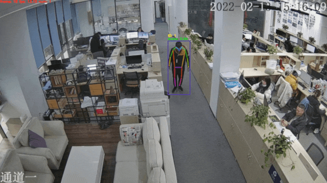

# PP-Human行为识别模块

行为识别在智慧社区，安防监控等方向具有广泛应用，PP-Human中集成了基于骨骼点的行为识别模块。

<div align="center">
  
  <center>数据来源及版权归属：天覆科技，感谢提供并开源实际场景数据，仅限学术研究使用</center>
</div>

## 模型库
在这里，我们提供了检测/跟踪、关键点识别以及识别摔倒动作的预训练模型，用户可以直接下载使用。

| 任务 | 算法 | 精度 | 预测速度(ms) | 下载链接 |
|:---------------------|:---------:|:------:|:------:| :---------------------------------------------------------------------------------: |
| 行人检测/跟踪 |  PP-YOLOE | mAP: 56.3 <br> MOTA: 72.0 | 检测: 28ms <br> 跟踪：33.1ms | [下载链接](https://bj.bcebos.com/v1/paddledet/models/pipeline/mot_ppyoloe_l_36e_pipeline.zip) |
| 关键点识别 | HRNet | AP: 87.1 | 单人 2.9ms | [下载链接](https://bj.bcebos.com/v1/paddledet/models/pipeline/dark_hrnet_w32_256x192.zip)|
| 行为识别 |  ST-GCN  | 准确率: 96.43 | 单人 2.7ms | [下载链接](https://bj.bcebos.com/v1/paddledet/models/pipeline/STGCN.zip) |


注：
1. 检测/跟踪模型精度为[MOT17](https://motchallenge.net/)，[CrowdHuman](http://www.crowdhuman.org/)，[HIEVE](http://humaninevents.org/)和部分业务数据融合训练测试得到。
2. 关键点模型使用[COCO](https://cocodataset.org/)，[UAV-Human](https://github.com/SUTDCV/UAV-Human)和部分业务数据融合训练, 精度在业务数据测试集上得到。
3. 行为识别模型使用[NTU-RGB+D](https://rose1.ntu.edu.sg/dataset/actionRecognition/)，[UR Fall Detection Dataset](http://fenix.univ.rzeszow.pl/~mkepski/ds/uf.html)和部分业务数据融合训练，精度在业务数据测试集上得到。
4. 预测速度为NVIDIA T4 机器上使用TensorRT FP16时的速度, 速度包含数据预处理、模型预测、后处理全流程。

## 配置说明
[配置文件](../config/infer_cfg.yml)中与行为识别相关的参数如下：
```
ACTION:
  model_dir: output_inference/STGCN  # 模型所在路径
  batch_size: 1 # 预测批大小。 当前仅支持为1进行推理
  max_frames: 50 # 动作片段对应的帧数。在行人ID对应时序骨骼点结果时达到该帧数后，会通过行为识别模型判断该段序列的动作类型。与训练设置一致时效果最佳。
  display_frames: 80 # 显示帧数。当预测结果为摔倒时，在对应人物ID中显示状态的持续时间。
  coord_size: [384, 512] # 坐标统一缩放到的尺度大小。与训练设置一致时效果最佳。
```

## 使用方法
1. 从上表链接中下载模型并解压到```./output_inference```路径下。
2. 目前行为识别模块仅支持视频输入，启动命令如下：
```python
python deploy/pphuman/pipeline.py --config deploy/pphuman/config/infer_cfg.yml \
                                                   --video_file=test_video.mp4 \
                                                   --device=gpu \
                                                   --enable_action=True
```
3. 若修改模型路径，有以下两种方式：

    - ```./deploy/pphuman/config/infer_cfg.yml```下可以配置不同模型路径，关键点模型和行为识别模型分别对应`KPT`和`ACTION`字段，修改对应字段下的路径为实际期望的路径即可。
    - 命令行中增加`--model_dir`修改模型路径：
```python
python deploy/pphuman/pipeline.py --config deploy/pphuman/config/infer_cfg.yml \
                                                   --video_file=test_video.mp4 \
                                                   --device=gpu \
                                                   --enable_action=True \
                                                   --model_dir kpt=./dark_hrnet_w32_256x192 action=./STGCN
```

## 方案说明
1. 使用目标检测与多目标跟踪获取视频输入中的行人检测框及跟踪ID序号，模型方案为PP-YOLOE，详细文档参考[PP-YOLOE](../../../configs/ppyoloe/README_cn.md)。
2. 通过行人检测框的坐标在输入视频的对应帧中截取每个行人，并使用[关键点识别模型](../../../configs/keypoint/hrnet/dark_hrnet_w32_256x192.yml)得到对应的17个骨骼特征点。骨骼特征点的顺序及类型与COCO一致，详见[如何准备关键点数据集](../../../docs/tutorials/PrepareKeypointDataSet_cn.md)中的`COCO数据集`部分。
3. 每个跟踪ID对应的目标行人各自累计骨骼特征点结果，组成该人物的时序关键点序列。当累计到预定帧数或跟踪丢失后，使用行为识别模型判断时序关键点序列的动作类型。当前版本模型支持摔倒行为的识别，预测得到的`class id`对应关系为：
```
0: 摔倒，
1: 其他
```
4. 行为识别模型使用了[ST-GCN](https://arxiv.org/abs/1801.07455)，并基于[PaddleVideo](https://github.com/PaddlePaddle/PaddleVideo/blob/develop/docs/zh-CN/model_zoo/recognition/stgcn.md)套件完成模型训练。

## 自定义模型训练
我们已经提供了检测/跟踪、关键点识别以及识别摔倒动作的预训练模型，可直接下载使用。如果希望使用自定义场景数据训练，或是对模型进行优化，根据具体模型，分别参考下面的链接：
| 任务 | 算法 | 模型训练及导出文档 |
| ---- | ---- | -------- |
| 行人检测/跟踪 | PP-YOLOE | [使用教程](../../../configs/ppyoloe/README_cn.md#使用教程) |
| 关键点识别 | HRNet | [使用教程](../../../configs/keypoint#3训练与测试) |
| 行为识别 |  ST-GCN  | [使用教程](https://github.com/PaddlePaddle/PaddleVideo/tree/develop/applications/PPHuman) |

## 参考文献
```
@inproceedings{stgcn2018aaai,
  title     = {Spatial Temporal Graph Convolutional Networks for Skeleton-Based Action Recognition},
  author    = {Sijie Yan and Yuanjun Xiong and Dahua Lin},
  booktitle = {AAAI},
  year      = {2018},
}
```
