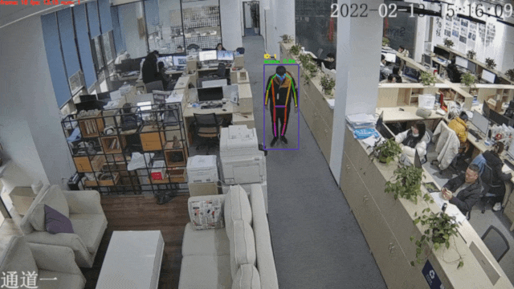

# Action Recognition Module of PP-Human

Action Recognition is widely used in the intelligent community/smart city, and security monitoring. PP-Human provides the module of skeleton-based action recognition.

<div align="center">   <center>Data source and copyright owner：Skyinfor
Technology. Thanks for the provision of actual scenario data, which are only
used for academic research here. </center>

</div>

## Model Zoo

There are multiple available pretrained models including pedestrian detection/tracking, keypoint detection, and fall detection models. Users can download and use them directly.

| Task                          | Algorithm | Precision                 | Inference Speed(ms)                 | Download Link                                                                             |
|:----------------------------- |:---------:|:-------------------------:|:-----------------------------------:|:-----------------------------------------------------------------------------------------:|
| Pedestrian Detection/Tracking | PP-YOLOE  | mAP: 56.3 <br> MOTA: 72.0 | Detection: 28ms <br>Tracking：33.1ms | [Link](https://bj.bcebos.com/v1/paddledet/models/pipeline/mot_ppyoloe_l_36e_pipeline.zip) |
| Keypoint Detection            | HRNet     | AP: 87.1                  | Single Person 2.9ms                 | [Link](https://bj.bcebos.com/v1/paddledet/models/pipeline/dark_hrnet_w32_256x192.zip)     |
| Action Recognition            | ST-GCN    | Precision Rate: 96.43     | Single Person 2.7ms                 | [Link](https://bj.bcebos.com/v1/paddledet/models/pipeline/STGCN.zip)                      |

Note:

1. The precision of the pedestrian detection/ tracking model is obtained by trainning and testing on [MOT17](https://motchallenge.net/), [CrowdHuman](http://www.crowdhuman.org/), [HIEVE](http://humaninevents.org/) and some business data.

2. The keypoint detection model is trained on [COCO](https://cocodataset.org/), [UAV-Human](https://github.com/SUTDCV/UAV-Human), and some business data, and the precision is obtained on test sets of business data.

3. The action recognition model is trained on [NTU-RGB+D](https://rose1.ntu.edu.sg/dataset/actionRecognition/), [UR Fall Detection Dataset](http://fenix.univ.rzeszow.pl/~mkepski/ds/uf.html), and some business data, and the precision is obtained on the testing set of business data.

4. The inference speed is the speed of using TensorRT FP16 on NVIDIA T4, including the total time of data pre-training, model inference, and post-processing.

## Description of Configuration

Parameters related to action recognition in the [config file](../config/infer_cfg.yml) are as follow:

```
ACTION:
  model_dir: output_inference/STGCN  # Path of the model
  batch_size: 1 # The size of the inference batch. The only avilable size for inference is 1.
  max_frames: 50 # The number of frames of action segments. When frames of time-ordered skeleton keypoints of each pedestrian ID achieve the max value,the action type will be judged by the action recognition model. If the setting is the same as the training, there will be an ideal inference result.
  display_frames: 80 # The number of display frames. When the inferred action type is falling down, the time length of the act will be displayed in the ID.
  coord_size: [384, 512] # The unified size of the coordinate, which is the best when it is the same as the training setting.
```


## How to Use

- Download models from the links of the above table and unzip them to ```./output_inference```.

- Now the only available input is the video input in the action recognition module. The start command is:

  ```python
  python deploy/pphuman/pipeline.py --config deploy/pphuman/config/infer_cfg.yml \
                                                     --video_file=test_video.mp4 \
                                                     --device=gpu \
                                                     --enable_action=True
  ```

- There are two ways to modify the model path:

  - In ```./deploy/pphuman/config/infer_cfg.yml```, you can configurate different model paths，which is proper only if you match keypoint models and action recognition models with the fields of `KPT` and `ACTION`respectively, and modify the corresponding path of each field into the expected path.

  - Add `--model_dir` in the command line to revise the model path：

    ```python
    python deploy/pphuman/pipeline.py --config deploy/pphuman/config/infer_cfg.yml \
                                                       --video_file=test_video.mp4 \
                                                       --device=gpu \
                                                       --enable_action=True \
                                                       --model_dir kpt=./dark_hrnet_w32_256x192 action=./STGCN
    ```

## Introduction to the Solution

1. Get the pedestrian detection box and the tracking ID number of the video input through object detection and multi-object tracking. The adopted model is PP-YOLOE, and for details, please refer to [PP-YOLOE](../../../configs/ppyoloe).

2. Capture every pedestrian in frames of the input video accordingly by using the coordinate of the detection box, and employ the [keypoint detection model](../../../configs/keypoint/hrnet/dark_hrnet_w32_256x192.yml)
   to obtain 17 skeleton keypoints. Their sequences and types are identical to
   those of COCO. For details, please refer to the `COCO dataset` part of [how to
   prepare keypoint datasets](../../../docs/tutorials/PrepareKeypointDataSet_en.md).

3. Each target pedestrian with a tracking ID has their own accumulation of skeleton keypoints, which is used to form a keypoint sequence in time order. When the number of accumulated frames reach a preset threshold or the tracking is lost, the action recognition model will be applied to judging the action type of the time-ordered keypoint sequence. The current model only supports the recognition of the act of falling down, and the relationship between the action type and `class id` is：

```
0: Fall down

1: Others
```

4. The action recognition model uses [ST-GCN](https://arxiv.org/abs/1801.07455), and employ the [PaddleVideo](https://github.com/PaddlePaddle/PaddleVideo/blob/develop/docs/zh-CN/model_zoo/recognition/stgcn.md) toolkit to complete model training.


## Custom Action Training

The pretrained models are provided and can be used directly, including pedestrian detection/ tracking, keypoint detection and fall recognition. If users need to train custom action or optimize the model performance, please refer the link below.

| Task | Model | Training and Export doc |
| ---- | ---- | -------- |
| pedestrian detection/tracking | PP-YOLOE | [doc](../../../configs/ppyoloe/README.md#getting-start) |
| keypoint detection | HRNet | [doc](../../../configs/keypoint/README_en.md#3training-and-testing) |
| action recognition |  ST-GCN  | [doc](https://github.com/PaddlePaddle/PaddleVideo/tree/develop/applications/PPHuman) |


## Reference

```
@inproceedings{stgcn2018aaai,
  title     = {Spatial Temporal Graph Convolutional Networks for Skeleton-Based Action Recognition},
  author    = {Sijie Yan and Yuanjun Xiong and Dahua Lin},
  booktitle = {AAAI},
  year      = {2018},
}
```
