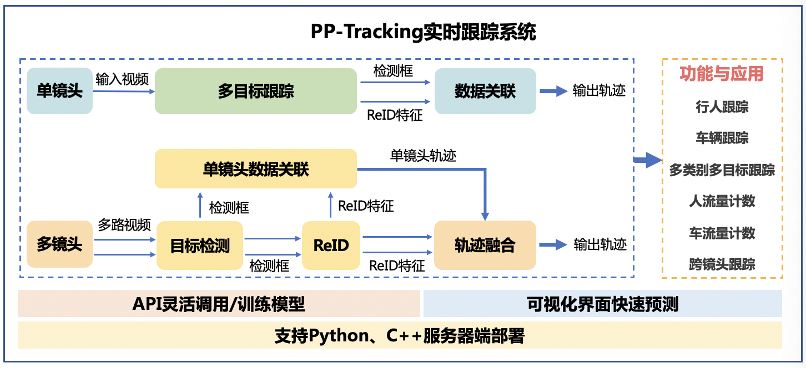

# 实时跟踪系统PP-Tracking

PP-Tracking是基于飞桨深度学习框架的业界首个开源实时跟踪系统。针对实际业务的难点痛点，PP-Tracking内置行人车辆跟踪、跨镜头跟踪、多类别跟踪、小目标跟踪及流量计数等能力与产业应用，同时提供可视化开发界面。模型集成多目标跟踪，目标检测，ReID轻量级算法，进一步提升PP-Tracking在服务器端部署性能。同时支持python，C++部署，适配Linux，Nvidia Jetson多平台环境。

  

  
   
  视频来源：VisDrone2021, BDD100K开源数据集

### 一、快速开始

PP-Tracking提供了简洁的可视化界面，无需开发即可实现多种跟踪功能，可以参考[PP-Tracking可视化界面使用文档](https://github.com/yangyudong2020/PP-Tracking_GUi)快速上手体验

### 二、算法介绍

PP-Tracking集成了多目标跟踪，目标检测，ReID轻量级算法，提升跟踪系统实时性能。多目标跟踪算法基于FairMOT进行优化，实现了服务器端轻量级模型，同时基于不同应用场景提供了针对性的预训练模型。

模型训练评估方法请参考[多目标跟踪快速开始](../../configs/mot/README_cn.md#快速开始)

PP-Tracking中提供的多场景预训练模型及导出模型列表如下：

| 场景  | 数据集 | 精度（MOTA） | NX模型预测速度（FPS） | 配置文件 | 模型权重 | 预测部署模型 |
| :---------:|:--------------- | :-------:  | :------: | :------: |:---: | :---: |
| 行人跟踪 | MOT17 | 65.3 | 23.9 | [配置文件](../../configs/mot/fairmot/fairmot_hrnetv2_w18_dlafpn_30e_576x320.yml) | [下载链接](https://paddledet.bj.bcebos.com/models/mot/fairmot_hrnetv2_w18_dlafpn_30e_576x320.pdparams) | [下载链接](https://bj.bcebos.com/v1/paddledet/models/mot/fairmot_hrnetv2_w18_dlafpn_30e_576x320.tar) |
| 行人小目标跟踪 | VisDrone-pedestrian |  40.5 | 8.35 | [配置文件](../../configs/mot/pedestrian/fairmot_hrnetv2_w18_dlafpn_30e_1088x608_visdrone_pedestrian.yml) | [下载链接](https://paddledet.bj.bcebos.com/models/mot/fairmot_hrnetv2_w18_dlafpn_30e_1088x608_visdrone_pedestrian.pdparams) | [下载链接](https://bj.bcebos.com/v1/paddledet/models/mot/fairmot_hrnetv2_w18_dlafpn_30e_1088x608_visdrone_pedestrian.tar) |
| 车辆跟踪 | BDD100k-vehicle | 32.6 | 24.3 | [配置文件](../../configs/mot/vehicle/fairmot_hrnetv2_w18_dlafpn_30e_576x320_bdd100kmot_vehicle.yml) | [下载链接](https://paddledet.bj.bcebos.com/models/mot/fairmot_hrnetv2_w18_dlafpn_30e_576x320_bdd100kmot_vehicle.pdparams) | [下载链接](https://bj.bcebos.com/v1/paddledet/models/mot/fairmot_hrnetv2_w18_dlafpn_30e_576x320_bdd100kmot_vehicle.tar) |
| 车辆小目标跟踪 | VisDrone-vehicle | 39.8 | 22.8 | [配置文件](../../configs/mot/vehicle/fairmot_hrnetv2_w18_dlafpn_30e_576x320_visdrone_vehicle.yml) | [下载链接](https://paddledet.bj.bcebos.com/models/mot/fairmot_hrnetv2_w18_dlafpn_30e_576x320_visdrone_vehicle.pdparams) | [下载链接](https://bj.bcebos.com/v1/paddledet/models/mot/fairmot_hrnetv2_w18_dlafpn_30e_576x320_visdrone_vehicle.tar)
| 多类别跟踪 | BDD100k |  - | 12.5 | [配置文件]() | [下载链接]() | [下载链接](https://bj.bcebos.com/v1/paddledet/models/mot/mcfairmot_hrnetv2_w18_dlafpn_30e_576x320_bdd100k_mcmot.tar) |
| 多类别小目标跟踪 | VisDrone |  20.4 | 6.74 | [配置文件](../../configs/mot/mcfairmot/mcfairmot_hrnetv2_w18_dlafpn_30e_1088x608_visdrone.yml) | [下载链接](https://paddledet.bj.bcebos.com/models/mot/mcfairmot_hrnetv2_w18_dlafpn_30e_1088x608_visdrone.pdparams) | [下载链接](https://bj.bcebos.com/v1/paddledet/models/mot/mcfairmot_hrnetv2_w18_dlafpn_30e_1088x608_visdrone.tar) |

**注：**

1. 模型预测速度为TensorRT FP16速度，测试环境为CUDA 10.2，JETPACK 4.5.1，TensorRT 7.1
2. 更多跟踪模型请参考[多目标跟踪模型库](../../configs/mot/README_cn.md#模型库)

检测模型使用轻量级特色模型PP-PicoDet，具体请参考[PP-PicoDet文档](../../configs/picodet)

ReID模型使用超轻量骨干网络模型PP-LCNet, 具体请参考[PP-LCNet模型介绍](https://github.com/PaddlePaddle/PaddleClas/blob/release/2.3/docs/zh_CN/models/PP-LCNet.md)

### 三、Python端预测部署

PP-Tracking 使用python预测部署教程请参考[PP-Tracking python部署文档](python/README.md)

### 四、C++端预测部署

PP-Tracking 使用c++预测部署教程请参考[PP-Tracking c++部署文档](cpp/README.md)
