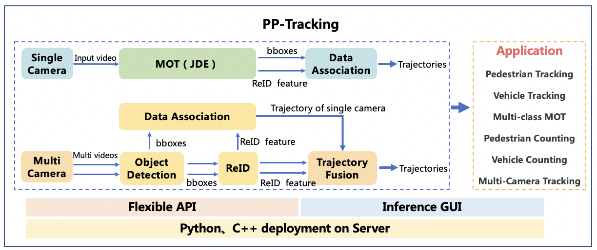

English | [简体中文](README_cn.md)

# Real-time Multi-Object Tracking system PP-Tracking

PP-Tracking is the first open source real-time Multi-Object Tracking system, and it is based on PaddlePaddle deep learning framework. It has rich models, wide application and high efficiency deployment.

PP-Tracking supports two paradigms: single camera tracking (MOT) and multi-camera tracking (MTMCT). Aiming at the difficulties and pain points of actual business, PP-Tracking provides various MOT functions and applications such as pedestrian tracking, vehicle tracking, multi-class tracking, small object tracking, traffic statistics and multi-camera tracking. The deployment method supports API and GUI visual interface, and the deployment language supports Python and C++, The deployment platform environment supports Linux, NVIDIA Jetson, etc.

<div width="1000" align="center">
  
</div>

<div width="1000" align="center">
  
  <br>
  video source：VisDrone and BDD100K dataset</div>
</div>


## 一、Quick Start

### AI studio public project case
PP-tracking provides AI studio public project cases. Please refer to this [tutorial](https://aistudio.baidu.com/aistudio/projectdetail/3022582).

### Python predict and deployment
PP-Tracking supports Python predict and deployment. Please refer to this [doc](python/README.md).

### C++ predict and deployment
PP-Tracking supports C++ predict and deployment. Please refer to this [doc](cpp/README.md).

### GUI predict and deployment
PP-Tracking supports GUI predict and deployment. Please refer to this [doc](https://github.com/yangyudong2020/PP-Tracking_GUi).


## 二、Model Zoo

PP-Tracking supports two paradigms: single camera tracking (MOT) and multi-camera tracking (MTMCT).
- Single camera tracking supports **FairMOT** and **DeepSORT** two MOT models, multi-camera tracking only support **DeepSORT**.
- The applications of  single camera tracking include pedestrian tracking, vehicle tracking, multi-class tracking, small object tracking and traffic statistics. The models are mainly optimized based on FairMOT to achieve the effect of real-time tracking. At the same time, PP-Tracking provides pre-training models based on different application scenarios.
- In DeepSORT (including DeepSORT used in multi-camera tracking), the selected detectors are PaddeDetection's self-developed high-performance detector [PP-YOLOv2](../../configs/ppyolo/) and lightweight detector [PP-PicoDet](../../configs/picodet/), and the selected ReID model is PaddleClas's self-developed ultra lightweight backbone [PP-LCNet](https://github.com/PaddlePaddle/PaddleClas/blob/release/2.3/docs/zh_CN/models/PP-LCNet.md)

PP-Tracking provids multi-scenario pre-training models and the exported models for deployment:

| Scene            | Dataset                | MOTA       | Speed（FPS） | config | model weights  | inference model |
| :---------:      |:---------------        | :-------:  | :------:    | :------:|:-----: | :------------:  |
| pedestrian       | MOT17                  | 65.3       | 23.9        | [config](../../configs/mot/fairmot/fairmot_hrnetv2_w18_dlafpn_30e_576x320.yml) | [download](https://paddledet.bj.bcebos.com/models/mot/fairmot_hrnetv2_w18_dlafpn_30e_576x320.pdparams) | [download](https://bj.bcebos.com/v1/paddledet/models/mot/fairmot_hrnetv2_w18_dlafpn_30e_576x320.tar) |
| pedestrian(small objects) | VisDrone-pedestrian |  40.5| 8.35        | [config](../../configs/mot/pedestrian/fairmot_hrnetv2_w18_dlafpn_30e_1088x608_visdrone_pedestrian.yml) | [download](https://paddledet.bj.bcebos.com/models/mot/fairmot_hrnetv2_w18_dlafpn_30e_1088x608_visdrone_pedestrian.pdparams) | [download](https://bj.bcebos.com/v1/paddledet/models/mot/fairmot_hrnetv2_w18_dlafpn_30e_1088x608_visdrone_pedestrian.tar) |
| vehicle         | BDD100k-vehicle    | 32.6           | 24.3         | [config](../../configs/mot/vehicle/fairmot_hrnetv2_w18_dlafpn_30e_576x320_bdd100kmot_vehicle.yml) | [download](https://paddledet.bj.bcebos.com/models/mot/fairmot_hrnetv2_w18_dlafpn_30e_576x320_bdd100kmot_vehicle.pdparams)| [download](https://bj.bcebos.com/v1/paddledet/models/mot/fairmot_hrnetv2_w18_dlafpn_30e_576x320_bdd100kmot_vehicle.tar) |
| vehicle(small objects)| VisDrone-vehicle   | 39.8      | 22.8        | [config](../../configs/mot/vehicle/fairmot_hrnetv2_w18_dlafpn_30e_576x320_visdrone_vehicle.yml) | [download](https://paddledet.bj.bcebos.com/models/mot/fairmot_hrnetv2_w18_dlafpn_30e_576x320_visdrone_vehicle.pdparams) | [download](https://bj.bcebos.com/v1/paddledet/models/mot/fairmot_hrnetv2_w18_dlafpn_30e_576x320_visdrone_vehicle.tar)
| multi-class       | BDD100k                |  -        | 12.5        | [config](../../configs/mot/mcfairmot/mcfairmot_hrnetv2_w18_dlafpn_30e_576x320_bdd100k_mcmot.yml) | [download](https://paddledet.bj.bcebos.com/models/mot/mcfairmot_hrnetv2_w18_dlafpn_30e_576x320_bdd100k_mcmot.pdparams) | [download](https://bj.bcebos.com/v1/paddledet/models/mot/mcfairmot_hrnetv2_w18_dlafpn_30e_576x320_bdd100k_mcmot.tar) |
| multi-class(small objects)  | VisDrone     |  20.4     | 6.74        | [config](../../configs/mot/mcfairmot/mcfairmot_hrnetv2_w18_dlafpn_30e_1088x608_visdrone.yml) | [download](https://paddledet.bj.bcebos.com/models/mot/mcfairmot_hrnetv2_w18_dlafpn_30e_1088x608_visdrone.pdparams) | [download](https://bj.bcebos.com/v1/paddledet/models/mot/mcfairmot_hrnetv2_w18_dlafpn_30e_1088x608_visdrone.tar) |

**Note：**
1. The equipment predicted by the model is **NVIDIA Jetson Xavier NX**, the speed is tested by **TensorRT FP16**, and the test environment is CUDA 10.2, JETPACK 4.5.1, TensorRT 7.1.
2. `model weights` means the weights saved directly after PaddleDetection training. For more tracking model weights, please refer to [modelzoo](../../configs/mot/README.md#模型库), you can also train according to the corresponding model config file and get the model weights.
3. `inference model` means the model weights with only forward parameters after exported, because only forward parameters are required during the deployment of PP-Tracking project. It can be downloaded and exported according to [modelzoo](../../configs/mot/README.md#模型库), you can also train according to the corresponding model config file and get the model weights, and then export them。In exported model files, there should be `infer_cfg.yml`,`model.pdiparams`,`model.pdiparams.info` and `model.pdmodel` four files in total, which are generally packaged in tar format.


## Citations
```
@ARTICLE{9573394,
  author={Zhu, Pengfei and Wen, Longyin and Du, Dawei and Bian, Xiao and Fan, Heng and Hu, Qinghua and Ling, Haibin},
  journal={IEEE Transactions on Pattern Analysis and Machine Intelligence},
  title={Detection and Tracking Meet Drones Challenge},
  year={2021},
  volume={},
  number={},
  pages={1-1},
  doi={10.1109/TPAMI.2021.3119563}
}
@InProceedings{bdd100k,
    author = {Yu, Fisher and Chen, Haofeng and Wang, Xin and Xian, Wenqi and Chen,
              Yingying and Liu, Fangchen and Madhavan, Vashisht and Darrell, Trevor},
    title = {BDD100K: A Diverse Driving Dataset for Heterogeneous Multitask Learning},
    booktitle = {IEEE/CVF Conference on Computer Vision and Pattern Recognition (CVPR)},
    month = {June},
    year = {2020}
}
@article{zhang2020fair,
  title={FairMOT: On the Fairness of Detection and Re-Identification in Multiple Object Tracking},
  author={Zhang, Yifu and Wang, Chunyu and Wang, Xinggang and Zeng, Wenjun and Liu, Wenyu},
  journal={arXiv preprint arXiv:2004.01888},
  year={2020}
}
@inproceedings{Wojke2018deep,
  title={Deep Cosine Metric Learning for Person Re-identification},
  author={Wojke, Nicolai and Bewley, Alex},
  booktitle={2018 IEEE Winter Conference on Applications of Computer Vision (WACV)},
  year={2018},
  pages={748--756},
  organization={IEEE},
  doi={10.1109/WACV.2018.00087}
}
```
