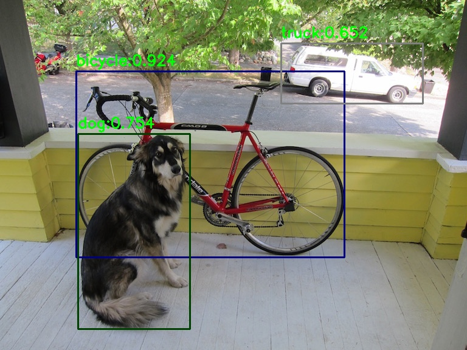

# PicoDet ONNX Runtime Demo

本文件夹提供利用[ONNX Runtime](https://onnxruntime.ai/docs/)进行 PicoDet 部署与Inference images 的 Demo。

## 安装 ONNX Runtime

本demo采用的是 ONNX Runtime 1.10.0，可直接运行如下指令安装：
```shell
pip install onnxruntime
```

详细安装步骤，可参考 [Install ONNX Runtime](https://onnxruntime.ai/docs/install/)。

## Inference images

- 准备测试模型：根据[PicoDet](https://github.com/PaddlePaddle/PaddleDetection/tree/release/2.6/configs/picodet)中【导出及转换模型】步骤，采用包含后处理的方式导出模型（`-o export.benchmark=False` ），并生成待测试模型简化后的onnx模型（可在下文链接中直接下载）。同时在本目录下新建```onnx_file```文件夹，将导出的onnx模型放在该目录下。

- 准备测试所用图片：将待测试图片放在```./imgs```文件夹下，本demo已提供了两张测试图片。

- 在本目录下直接运行：
    ```shell
    python infer_demo.py --modelpath ./onnx_file/picodet_s_320_lcnet_postprocessed.onnx
    ```
    将会对```./imgs```文件夹下所有图片进行识别，并将识别结果保存在```./results```文件夹下。

- 结果：
    <div align="center">
      
    </div>

## 模型下载

| 模型     | 输入尺寸 | ONNX( w/ 后处理)  |
| :-------- | :--------: | :---------------------: |
| PicoDet-XS |  320*320   | [model](https://paddledet.bj.bcebos.com/deploy/third_engine/picodet_xs_320_lcnet_postprocessed.onnx) |
| PicoDet-XS |  416*416   | [model](https://paddledet.bj.bcebos.com/deploy/third_engine/picodet_xs_416_lcnet_postprocessed.onnx) |
| PicoDet-S |  320*320   | [model](https://paddledet.bj.bcebos.com/deploy/third_engine/picodet_s_320_lcnet_postprocessed.onnx) |
| PicoDet-S |  416*416   |  [model](https://paddledet.bj.bcebos.com/deploy/third_engine/picodet_s_416_lcnet_postprocessed.onnx) |
| PicoDet-M |  320*320   | [model](https://paddledet.bj.bcebos.com/deploy/third_engine/picodet_m_320_lcnet_postprocessed.onnx) |
| PicoDet-M |  416*416   | [model](https://paddledet.bj.bcebos.com/deploy/third_engine/picodet_m_416_lcnet_postprocessed.onnx) |
| PicoDet-L |  320*320   | [model](https://paddledet.bj.bcebos.com/deploy/third_engine/picodet_l_320_lcnet_postprocessed.onnx) |
| PicoDet-L |  416*416   | [model](https://paddledet.bj.bcebos.com/deploy/third_engine/picodet_l_416_lcnet_postprocessed.onnx) |
| PicoDet-L |  640*640   | [model](https://paddledet.bj.bcebos.com/deploy/third_engine/picodet_l_640_lcnet_postprocessed.onnx) |
