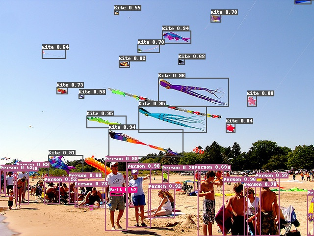

# CascadeClsAware RCNN
## 简介
CascadeClsAware RCNN是百度视觉技术部在Google AI Open Images 2019-Object Detction比赛中的最佳单模型，该单模型也帮助我们获得比赛的第二名。 Open Images Dataset V5(OIDV5)包含500个类别、173W训练图像和超过1220W个标注边框，是目前已知规模最大的目标检测公开数据集，数据集地址：[https://storage.googleapis.com/openimages/web/index.html](https://storage.googleapis.com/openimages/web/index.html)

<div align="center">
  
</div>

## 方法描述

我们结合了当前较优的检测方法，组合在一起作为我们的基线模型。具体地，我们将ResNet200-vd作为检测模型的backbone，其imagenet分类预训练模型可以在[这里](https://github.com/PaddlePaddle/models/blob/develop/PaddleCV/image_classification/README_en.md)下载；我们结合了CascadeClsAware RCNN、Feature Pyramid Networks、Non-local、Deformable V2等方法。在这里需要注意的是，标准的CascadeRCNN是只预测2个框（前景和背景，使用得分信息去判断最终前景所属的类别），我们对其进行修改，对每个类别都单独预测了一个框，即CascaedClsAware RCNN结构。基线模型框图如下图所示。

<div align="center">
  
</div>


由于OIDV5的类别不均衡现象比较严重，在训练时我们采用了动态采样的策略去选择样本并进行训练；我们使用了多尺度训练的方式来解决边框面积范围太大的情况，此外，我们使用了Libra loss替代Smooth L1 loss，来计算预测框的loss。在预测时，我们使用SoftNMS方法进行后处理，保证更多的框可以被召回。

我们发现Objects365 Dataset和OIDV5有大约189个类别是重复的，因此将两个数据集合并，最终该模型在Public/Private Leaderboard上的得分别为0.6269/0.5946。我们提出了Top-k Voting的融合策略，最终基于该模型的多尺度融合结果可以达到0.6492/0.6182。更具体的模型训练和融合策略可以见：[oidv5技术报告](https://arxiv.org/)。

OIDV5模型训练结果如下。


|        模型结构         | Public/Private Score |                           下载链接                           |
| :-----------------: | :--------: | :----------------------------------------------------------: |
| CascadeClsAwareRCNN-FPN-Dcnv2-Nonlocal ResNet200-vd |    0.62690/0.59459    | [模型](https://paddlemodels.bj.bcebos.com/object_detection/oidv5_cascade_rcnn_cls_aware_r200_vd_fpn_dcnv2_nonlocal_softnms.tar) |


此外，为验证模型的性能，我们基于该模型结构，也训练了针对COCO2017和Objects365 Dataset的模型，验证集上的mAP分别可以达到51.7%，34.5%，这也验证了模型的泛化性能。

在特定数据集上的训练结果如下。COCO和Objects365 Dataset数据格式相同，目前支持训练和预测和评估。具体模型如下。

|        模型结构         | 数据集 |  验证集mAP |                           下载链接                           |
| :-----------------: | :--------: | :--------: | :----------------------------------------------------------: |
| CascadeClsAwareRCNN-FPN-Dcnv2-Nonlocal ResNet200-vd | COCO2017 |    51.7%    | [模型](https://paddlemodels.bj.bcebos.com/object_detection/oidv5_cascade_rcnn_cls_aware_r200_vd_fpn_dcnv2_nonlocal_softnms.tar) |
| CascadeClsAwareRCNN-FPN-Dcnv2-Nonlocal ResNet200-vd | Objects365 |    34.5%    | [模型](https://paddlemodels.bj.bcebos.com/object_detection/obj365_cascade_rcnn_cls_aware_r200_vd_fpn_dcnv2_nonlocal_softnms.tar) |


## 使用方法

OIDV5数据集格式与COCO不同，目前支持单张图片的预测。

1. 下载模型并解压。

2. 运行预测程序。

```
python -u tools/infer.py -c configs/oidv5/cascade_rcnn_cls_aware_r200_vd_fpn_dcnv2_nonlocal_softnms.yml -o weights=./oidv5_cascade_rcnn_cls_aware_r200_vd_fpn_dcnv2_nonlocal_softnms/ --infer_img=demo/000000570688.jpg
```

其中模型所在文件夹需要根据自己放置的位置进行修改。

检测结果图像可以在`output`文件夹中查看。

## 模型检测效果

<div align="center">
  
</div>
