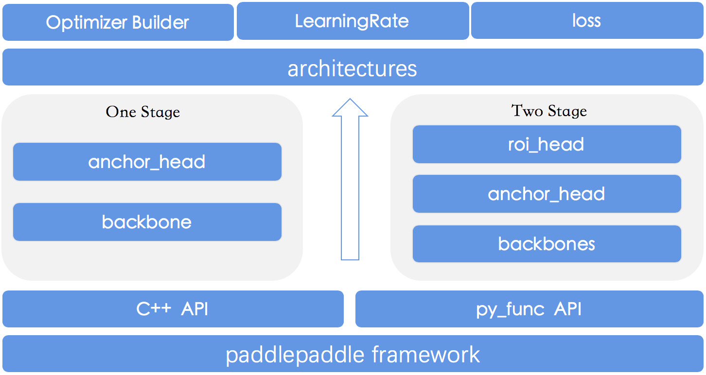

# 新增模型算法
为了让用户更好的使用PaddleDetection，本文档中，我们将介绍PaddleDetection的主要模型技术细节及应用，
包括：如何搭建模型，如何定义检测组件和模型配置与运行。

## 简介
PaddleDetection的网络模型模块所有代码逻辑在`ppdet/modeling/`中，所有网络模型是以组件的形式进行定义与组合，网络模型模块的主要构成如下架构所示：
```
  ppdet/modeling/
  ├── architectures      #
  │   ├── faster_rcnn.py # Faster Rcnn模型
  │   ├── ssd.py         # SSD模型
  │   ├── yolov3.py      # YOLOv3模型
  │   │   ...
  ├── anchor_heads       # anchor生成检测头模块
  │   ├── xxx_head.py    # 定义各类anchor生成检测头
  ├── backbones          # 基干网络模块
  │   ├── resnet.py      # ResNet网络
  │   ├── mobilenet.py   # MobileNet网络
  │   │   ...
  ├── losses             # 损失函数模块
  │   ├── xxx_loss.py    # 定义注册各类loss函数
  ├── roi_extractors     # 检测感兴趣区域提取
  │   ├── roi_extractor.py  # FPNRoIAlign等实现
  ├── roi_heads          # 两阶段检测器检测头
  │   ├── bbox_head.py   # Faster-Rcnn系列检测头
  │   ├── cascade_head.py # cascade-Rcnn系列检测头
  │   ├── mask_head.py   # Mask-Rcnn系列检测头
  ├── tests  # 单元测试模块
  │   ├── test_architectures.py  # 对网络结构进行单元测试
  ├── ops.py  # 封装及注册各类PaddlePaddle物体检测相关公共检测组件/算子
  ├── target_assigners.py # 封装bbox/mask等最终结果的公共检测组件
```



## 新增模型
我们以单阶段检测器YOLOv3为例，结合[yolov3_darknet.yml](https://github.com/PaddlePaddle/PaddleDetection/blob/master/configs/yolov3_darknet.yml)配置文件，对建立模型过程进行详细描述，
按照此思路您可以快速搭建新的模型。

搭建新模型的一般步骤是：Backbone编写、检测组件编写与模型组网这三个步骤，下面为您详细介绍：
### Backbone编写
1.代码编写：
PaddleDetection中现有所有Backbone网络代码都放置在`ppdet/modeling/backbones`目录下，所以我们在其中新建`darknet.py`如下：
```python
from ppdet.core.workspace import register

@register
class DarkNet(object):

    __shared__ = ['norm_type', 'weight_prefix_name']

    def __init__(self,
                 depth=53,
                 norm_type='bn',
                 norm_decay=0.,
                 weight_prefix_name=''):
        # 省略内容
        pass

    def __call__(self, input):
        # 省略处理逻辑
        pass
```
然后在`backbones/__init__.py`中加入引用：
```python
from . import darknet
from .darknet import *
```
**几点说明：**
- 为了在yaml配置文件中灵活配置网络，所有Backbone、模型组件与architecture类需要利用`ppdet.core.workspace`里的`register`进行注册，形式请参考如上示例；
- 在Backbone中都需定义`__init__`函数与`__call__`函数，`__init__`函数负责初始化参数，在调用此Backbone时会执行`__call__`函数；
- `__shared__`为了实现一些参数的配置全局共享，具体细节请参考[配置文件说明文档](config_doc/CONFIG_cn.md#faq)。

2.配置编写：
在yaml文件中以注册好了的`DarkNet`类名为标题，可选择性的对`__init__`函数中的参数进行更新，不在配置文件中配置的参数会保持`__init__`函数中的初始化值：
```yaml
DarkNet:
  norm_type: sync_bn
  norm_decay: 0.
  depth: 53
```

### 检测组件编写
1.代码编写：编写好Backbone后，我们开始编写生成anchor的检测头部分，anchor的检测头代码都在`ppdet/modeling/anchor_heads`目录下，所以我们在其中新建`yolo_head.py`如下：
```python
from ppdet.core.workspace import register

@register
class YOLOv3Head(object):

    __inject__ = ['yolo_loss', 'nms']
    __shared__ = ['num_classes', 'weight_prefix_name']

    def __init__(self,
                 num_classes=80,
                 anchors=[[10, 13], [16, 30], [33, 23], [30, 61], [62, 45],
                          [59, 119], [116, 90], [156, 198], [373, 326]],
                 yolo_loss="YOLOv3Loss",
                 nms=MultiClassNMS(
                     score_threshold=0.01,
                     nms_top_k=1000,
                     keep_top_k=100,
                     nms_threshold=0.45,
                     background_label=-1).__dict__):
        # 省略部分内容
        pass
```
然后在`anchor_heads/__init__.py`中加入引用：
```python
from . import yolo_head
from .yolo_head import *
```
**几点说明：**
- `__inject__`表示引入封装好了的检测组件/算子列表，此处`yolo_loss`与`nms`变量指向外部定义好的检测组件/算子；
- anchor的检测头实现中类函数需有输出loss接口`get_loss`与预测框或建议框输出接口`get_prediction`；
- 两阶段检测器在anchor的检测头里定义的是候选框输出接口`get_proposals`，之后还会在`roi_extractors`与`roi_heads`中进行后续计算，定义方法与如下一致。
- YOLOv3算法的loss函数比较复杂，所以我们将loss函数进行拆分，具体实现在`losses/yolo_loss.py`中，也需要注册；
- nms算法是封装paddlepaddle中现有检测组件/算子，如何定义与注册详见[定义公共检测组件/算子](#定义公共检测组件/算子)部分。

2.配置编写：
在yaml文件中以注册好了的`YOLOv3Head`类名为标题，可选择性的对`__init__`函数中的参数进行更新，不在配置文件中配置的参数会保持`__init__`函数中的初始化值：
```yaml
YOLOv3Head:
  anchor_masks: [[6, 7, 8], [3, 4, 5], [0, 1, 2]]
  anchors: [[10, 13], [16, 30], [33, 23],
            [30, 61], [62, 45], [59, 119],
            [116, 90], [156, 198], [373, 326]]
  norm_decay: 0.
  yolo_loss: YOLOv3Loss
  nms:
    background_label: -1
    keep_top_k: 100
    nms_threshold: 0.45
    nms_top_k: 1000
    normalized: false
    score_threshold: 0.01

YOLOv3Loss:
  batch_size: 8
  ignore_thresh: 0.7
  label_smooth: false
```
如上配置文件中的`YOLOv3Loss`是注册好检测组件接口，所以需要在配置文件中也对`YOLOv3Loss`进行参数设置。

### 模型组网
本步骤中，我们需要将编写好的Backbone、各个检测组件进行整合拼接，搭建一个完整的物体检测网络能够提供给训练、评估和测试程序去运行。
1.组建`architecture`：
所有architecture网络代码都放置在`ppdet/modeling/architectures`目录下，所以我们在其中新建`yolov3.py`如下：
```python
from ppdet.core.workspace import register

@register
class YOLOv3(object):

    __category__ = 'architecture'
    __inject__ = ['backbone', 'yolo_head']
    __shared__ = ['use_fine_grained_loss']

    def __init__(self,
                 backbone,
                 yolo_head='YOLOv3Head',
                 use_fine_grained_loss=False):
        super(YOLOv3, self).__init__()
        # 省略内容

    def build(self, feed_vars, mode='train'):
        # 省略内容
        pass

    def build_inputs(self, ):
        # 详解见【模型输入设置】章节
        pass

    def train(self, feed_vars):
        return self.build(feed_vars, mode='train')

    def eval(self, feed_vars):
        return self.build(feed_vars, mode='test')

    def test(self, feed_vars):
        return self.build(feed_vars, mode='test')
```
**几点说明：**
- 在组建一个完整的网络时必须要设定`__category__ = 'architecture'`来表示一个完整的物体检测模型；
- 在`__init__`函数中传入我们上面定义好的`backbone`与`yolo_head`的名称即可，根据yaml配置文件里这些组件的参数初始化，`ppdet.core.workspace`会自动解析加载；
- 在architecture类里必须定义`build_inputs`函数，为了适配检测网络的输入与Reader模块，具体见[模型输入设置](#模型输入设置)模块；
- 在architecture类里必须定义`train`、`eval`和`test`函数，在训练、评估和测试程序中会分别调用这三个函数来在不同场景中加载网络模型。

2.配置编写：

首先定义网络模型名称：
```yaml
architecture: YOLOv3
```
接下来根据网络模型名称`YOLOv3`来初始化网络组件名称：
```yaml
YOLOv3:
  backbone: DarkNet
  yolo_head: YOLOv3Head
```
之后`backbone`、`yolo_head`的配置步骤在上面已经介绍，完成如上配置就完成了物体检测模型组网的工作。

### 模型输入设置
在architecture定义的类里必须含有`build_inputs`函数，这个函数的作用是生成`feed_vars`和`loader`。

1.`feed_vars`是由`key：fluid.data`构成的字典，key是由如下yaml文件中`fields`字段构成，在不同数据集、训练、评估和测试中字段不尽相同，
在使用中需要合理组合。
```yaml
TrainReader:
  inputs_def:
    fields: ['image', 'gt_bbox', 'gt_class', 'gt_score']

EvalReader:
  inputs_def:
    fields: ['image', 'im_size', 'im_id']
...
```
在[数据源解析](READER.md#数据解析)中已经提到，数据源roidbs会解析为字典的形式，Reader会根据feed_vars所含字段进行解析适配。

2.`loader`是调用[fluid.io.DataLoader](https://www.paddlepaddle.org.cn/documentation/docs/zh/develop/api_cn/io_cn/DataLoader_cn.html#dataloader)
根据`feed_vars`来完成DataLoader的组建。

## 定义公共检测组件/算子
为了更好的复用一些公共检测组件/算子，以及可以在yaml配置文件中配置化，检测模型相关检测组件/算子都在`ppdet/modeling/ops.py`中定义并注册。这部分是选做部分，不是必需的。

（1）基于现有的PaddlePaddle物体检测相关OP进行二次封装注册：

例如[fluid.layers.multiclass_nms](https://www.paddlepaddle.org.cn/documentation/docs/zh/develop/api_cn/layers_cn/multiclass_nms_cn.html)
在PaddlePaddle已经存在，我们想让它在yaml文件中灵活配置，我们只需要在`ops.py`中如下配置即可：
```python
from ppdet.core.workspace import register, serializable

@register
@serializable
class MultiClassNMS(object):
    __op__ = fluid.layers.multiclass_nms
    __append_doc__ = True

    def __init__(self,
                 score_threshold=.05,
                 nms_top_k=-1,
                 keep_top_k=100,
                 nms_threshold=.5,
                 normalized=False,
                 nms_eta=1.0,
                 background_label=0):
        super(MultiClassNMS, self).__init__()
        # 省略
```
**注意：** 我们是对`fluid.layers.multiclass_nms`这个OP进行二次封装，在`__init__`方法中添加所需的可选参数即可，保持默认的参数可以不添加进来。

（2）从零开始定义检测组件/算子：

在`ops.py`中定义`xxx`函数，然后在相应位置添加`from ppdet.modeling.ops import xxx`即可调用，无需注册与序列化。

## 配置及运行
PaddleDetection在`ppdet/optimizer.py`中注册实现了学习率配置接口类`LearningRate`、优化器接口类`OptimizerBuilder`。
- 学习率配置
在yaml文件中可便捷配置学习率各个参数：
```yaml
LearningRate:
  base_lr: 0.001
  schedulers:
  - !PiecewiseDecay
    gamma: 0.1
    milestones:
    - 400000
    - 450000
  - !LinearWarmup
    start_factor: 0.
    steps: 4000
```
**几点说明：**
-  `PiecewiseDecay`与`LinearWarmup`策略在`ppdet/optimizer.py`中都已注册。
- 除了这两个优化器之外，您还可以使用paddlepaddle中所有的优化器[paddlepaddle官网文档](https://www.paddlepaddle.org.cn/documentation/docs/zh/develop/api_guides/low_level/optimizer.html)。

- Optimizer优化器配置：
```yaml
OptimizerBuilder:
  optimizer:
    momentum: 0.9
    type: Momentum
  regularizer:
    factor: 0.0005
    type: L2

```

- 其他配置：在训练、评估与测试阶段，定义了一些所需参数如下：
```yaml
use_gpu: true         # 是否使用GPU运行程序
max_iters: 500200     # 最大迭代轮数
log_iter: 20          # 日志打印队列长度, 训练时日志每迭代x轮打印一次
save_dir: output      # 模型保存路径
snapshot_iter: 2000   # 训练时第x轮保存/评估
metric: COCO          # 数据集名称
pretrain_weights: xxx # 预训练模型地址（网址/路径）
weights: xxx/model_final # 评估或测试时模型权重的路径
num_classes: 80       # 类别数
```

> 看过此文档，您应该对PaddleDetection中模型搭建与配置有了一定经验，结合源码会理解的更加透彻。关于模型技术，如您有其他问题或建议，请给我们提issue，我们非常欢迎您的反馈。
