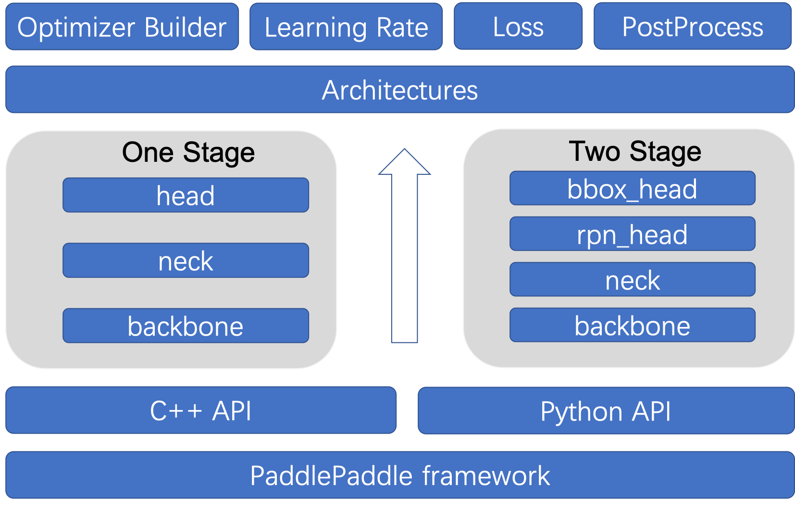

# 新增模型算法
为了让用户更好的使用PaddleDetection，本文档中，我们将介绍PaddleDetection的主要模型技术细节及应用

## 目录
- [1.简介](#1.简介)
- [2.新增模型](#2.新增模型)
  - [2.1新增网络结构](#2.1新增网络结构)
    - [2.1.1新增Backbone](#2.1.1新增Backbone)
    - [2.1.2新增Neck](#2.1.2新增Neck)
    - [2.1.3新增Head](#2.1.3新增Head)
    - [2.1.4新增Loss](#2.1.4新增Loss)
    - [2.1.5新增后处理模块](#2.1.5新增后处理模块)
    - [2.1.6新增Architecture](#2.1.6新增Architecture)
  - [2.2新增配置文件](#2.2新增配置文件)
    - [2.2.1网络结构配置文件](#2.2.1网络结构配置文件)
    - [2.2.2优化器配置文件](#2.2.2优化器配置文件)
    - [2.2.3Reader配置文件](#2.2.3Reader配置文件)

### 1.简介
PaddleDetecion中的每一种模型对应一个文件夹，以yolov3为例，yolov3系列的模型对应于`configs/yolov3`文件夹，其中yolov3_darknet的总配置文件`configs/yolov3/yolov3_darknet53_270e_coco.yml`的内容如下：
```
_BASE_: [
  '../datasets/coco_detection.yml', # 数据集配置文件，所有模型共用
  '../runtime.yml', # 运行时相关配置
  '_base_/optimizer_270e.yml', # 优化器相关配置
  '_base_/yolov3_darknet53.yml', # yolov3网络结构配置文件
  '_base_/yolov3_reader.yml', # yolov3 Reader模块配置
]

# 定义在此处的相关配置可以覆盖上述文件中的同名配置
snapshot_epoch: 5
weights: output/yolov3_darknet53_270e_coco/model_final
```
可以看到，配置文件中的模块进行了清晰的划分，除了公共的数据集配置以及运行时配置，其他配置被划分为优化器，网络结构以及Reader模块。PaddleDetection中支持丰富的优化器，学习率调整策略，预处理算子等，因此大多数情况下不需要编写优化器以及Reader相关的代码，而只需要在配置文件中配置即可。因此，新增一个模型的主要在于搭建网络结构。

PaddleDetection网络结构的代码在`ppdet/modeling/`中，所有网络结构以组件的形式进行定义与组合，网络结构的主要构成如下所示：
```
  ppdet/modeling/
  ├── architectures
  │   ├── faster_rcnn.py # Faster Rcnn模型
  │   ├── ssd.py         # SSD模型
  │   ├── yolo.py      # YOLOv3模型
  │   │   ...
  ├── heads       # 检测头模块
  │   ├── xxx_head.py    # 定义各类检测头
  │   ├── roi_extractor.py #检测感兴趣区域提取
  ├── backbones          # 基干网络模块
  │   ├── resnet.py      # ResNet网络
  │   ├── mobilenet.py   # MobileNet网络
  │   │   ...
  ├── losses             # 损失函数模块
  │   ├── xxx_loss.py    # 定义注册各类loss函数
  ├── necks     # 特征融合模块
  │   ├── xxx_fpn.py  # 定义各种FPN模块
  ├── proposal_generator # anchor & proposal生成与匹配模块
  │   ├── anchor_generator.py   # anchor生成模块
  │   ├── proposal_generator.py # proposal生成模块
  │   ├── target.py   # anchor & proposal的匹配函数
  │   ├── target_layer.py   # anchor & proposal的匹配模块
  ├── tests  # 单元测试模块
  │   ├── test_xxx.py  # 对网络中的算子以及模块结构进行单元测试
  ├── ops.py  # 封装各类PaddlePaddle物体检测相关公共检测组件/算子
  ├── layers.py  # 封装及注册各类PaddlePaddle物体检测相关公共检测组件/算子
  ├── bbox_utils.py # 封装检测框相关的函数
  ├── post_process.py # 封装及注册后处理相关模块
  ├── shape_spec.py # 定义模块输出shape的类
```



### 2.新增模型
接下来，以单阶段检测器YOLOv3为例，对建立模型过程进行详细描述，按照此思路您可以快速搭建新的模型。

#### 2.1新增网络结构

##### 2.1.1新增Backbone

PaddleDetection中现有所有Backbone网络代码都放置在`ppdet/modeling/backbones`目录下，所以我们在其中新建`darknet.py`如下：
```python
import paddle.nn as nn
from ppdet.core.workspace import register, serializable

@register
@serializable
class DarkNet(nn.Layer):

    __shared__ = ['norm_type']

    def __init__(self,
                 depth=53,
                 return_idx=[2, 3, 4],
                 norm_type='bn',
                 norm_decay=0.):
        super(DarkNet, self).__init__()
        # 省略内容

    def forward(self, inputs):
        # 省略处理逻辑
        pass

    @property
    def out_shape(self):
        # 省略内容
        pass
```
然后在`backbones/__init__.py`中加入引用：
```python
from . import darknet
from .darknet import *
```
**几点说明：**
- 为了在yaml配置文件中灵活配置网络，所有Backbone需要利用`ppdet.core.workspace`里的`register`进行注册，形式请参考如上示例。此外，可以使用`serializable`以使backbone支持序列化；
- 所有的Backbone需继承`paddle.nn.Layer`类，并实现forward函数。此外，还需实现out_shape属性定义输出的feature map的channel信息，具体可参见源码；
- `__shared__`为了实现一些参数的配置全局共享，这些参数可以被backbone, neck，head，loss等所有注册模块共享。

##### 2.1.2新增Neck
特征融合模块放置在`ppdet/modeling/necks`目录下，我们在其中新建`yolo_fpn.py`如下：

``` python
import paddle.nn as nn
from ppdet.core.workspace import register, serializable

@register
@serializable
class YOLOv3FPN(nn.Layer):
    __shared__ = ['norm_type']

    def __init__(self,
                in_channels=[256, 512, 1024],
                norm_type='bn'):
        super(YOLOv3FPN, self).__init__()
        # 省略内容

    def forward(self, blocks):
        # 省略内容
        pass

    @classmethod
    def from_config(cls, cfg, input_shape):
        # 省略内容
        pass

    @property
    def out_shape(self):
        # 省略内容
        pass
```
然后在`necks/__init__.py`中加入引用：
```python
from . import yolo_fpn
from .yolo_fpn import *
```
**几点说明：**
- neck模块需要使用`register`进行注册，可以使用`serializable`进行序列化；
- neck模块需要继承`paddle.nn.Layer`类，并实现forward函数。除此之外，还需要实现`out_shape`属性，用于定义输出的feature map的channel信息，还需要实现类函数`from_config`用于在配置文件中推理出输入channel，并用于`YOLOv3FPN`的初始化；
- neck模块可以使用`__shared__`实现一些参数的配置全局共享。

##### 2.1.3新增Head
Head模块全部存放在`ppdet/modeling/heads`目录下，我们在其中新建`yolo_head.py`如下
``` python
import paddle.nn as nn
from ppdet.core.workspace import register

@register
class YOLOv3Head(nn.Layer):
    __shared__ = ['num_classes']
    __inject__ = ['loss']

    def __init__(self,
                 anchors=[[10, 13], [16, 30], [33, 23],
                   [30, 61], [62, 45],[59, 119],
                   [116, 90], [156, 198], [373, 326]],
                 anchor_masks=[[6, 7, 8], [3, 4, 5], [0, 1, 2]],
                 num_classes=80,
                 loss='YOLOv3Loss',
                 iou_aware=False,
                 iou_aware_factor=0.4):
        super(YOLOv3Head, self).__init__()
        # 省略内容

    def forward(self, feats, targets=None):
        # 省略内容
        pass
```
然后在`heads/__init__.py`中加入引用：
```python
from . import yolo_head
from .yolo_head import *
```
**几点说明：**
- Head模块需要使用`register`进行注册；
- Head模块需要继承`paddle.nn.Layer`类，并实现forward函数。
- `__inject__`表示引入全局字典中已经封装好的模块。如loss等。

##### 2.1.4新增Loss
Loss模块全部存放在`ppdet/modeling/losses`目录下，我们在其中新建`yolo_loss.py`下
```python
import paddle.nn as nn
from ppdet.core.workspace import register

@register
class YOLOv3Loss(nn.Layer):

    __inject__ = ['iou_loss', 'iou_aware_loss']
    __shared__ = ['num_classes']

    def __init__(self,
                 num_classes=80,
                 ignore_thresh=0.7,
                 label_smooth=False,
                 downsample=[32, 16, 8],
                 scale_x_y=1.,
                 iou_loss=None,
                 iou_aware_loss=None):
        super(YOLOv3Loss, self).__init__()
        # 省略内容

    def forward(self, inputs, targets, anchors):
        # 省略内容
        pass
```
然后在`losses/__init__.py`中加入引用：
```python
from . import yolo_loss
from .yolo_loss import *
```
**几点说明：**
- loss模块需要使用`register`进行注册；
- loss模块需要继承`paddle.nn.Layer`类，并实现forward函数。
- 可以使用`__inject__`表示引入全局字典中已经封装好的模块，使用`__shared__`可以实现一些参数的配置全局共享。

##### 2.1.5新增后处理模块
后处理模块定义在`ppdet/modeling/post_process.py`中，其中定义了`BBoxPostProcess`类来进行后处理操作，如下所示：
``` python
from ppdet.core.workspace import register

@register
class BBoxPostProcess(object):
    __shared__ = ['num_classes']
    __inject__ = ['decode', 'nms']

    def __init__(self, num_classes=80, decode=None, nms=None):
        # 省略内容
        pass

    def __call__(self, head_out, rois, im_shape, scale_factor):
        # 省略内容
        pass
```
**几点说明：**
- 后处理模块需要使用`register`进行注册
- `__inject__`注入了全局字典中封装好的模块，如decode和nms等。decode和nms定义在`ppdet/modeling/layers.py`中。

##### 2.1.6新增Architecture

所有architecture网络代码都放置在`ppdet/modeling/architectures`目录下，`meta_arch.py`中定义了`BaseArch`类，代码如下：
``` python
import paddle.nn as nn
from ppdet.core.workspace import register

@register
class BaseArch(nn.Layer):
     def __init__(self):
        super(BaseArch, self).__init__()

    def forward(self, inputs):
        self.inputs = inputs
        self.model_arch()

        if self.training:
            out = self.get_loss()
        else:
            out = self.get_pred()
        return out

    def model_arch(self, ):
        pass

    def get_loss(self, ):
        raise NotImplementedError("Should implement get_loss method!")

    def get_pred(self, ):
        raise NotImplementedError("Should implement get_pred method!")
```
所有的architecture需要继承`BaseArch`类，如`yolo.py`中的`YOLOv3`定义如下：
``` python
@register
class YOLOv3(BaseArch):
    __category__ = 'architecture'
    __inject__ = ['post_process']

    def __init__(self,
                 backbone='DarkNet',
                 neck='YOLOv3FPN',
                 yolo_head='YOLOv3Head',
                 post_process='BBoxPostProcess'):
        super(YOLOv3, self).__init__()
        self.backbone = backbone
        self.neck = neck
        self.yolo_head = yolo_head
        self.post_process = post_process

    @classmethod
    def from_config(cls, cfg, *args, **kwargs):
        # 省略内容
        pass

    def get_loss(self):
        # 省略内容
        pass

    def get_pred(self):
        # 省略内容
        pass
```

**几点说明：**
- 所有的architecture需要使用`register`进行注册
- 在组建一个完整的网络时必须要设定`__category__ = 'architecture'`来表示一个完整的物体检测模型；
- backbone, neck, yolo_head以及post_process等检测组件传入到architecture中组成最终的网络。像这样将检测模块化，提升了检测模型的复用性，可以通过组合不同的检测组件得到多个模型。
- from_config类函数实现了模块间组合时channel的自动配置。

#### 2.2新增配置文件

##### 2.2.1网络结构配置文件
上面详细地介绍了如何新增一个architecture，接下来演示如何配置一个模型，yolov3关于网络结构的配置在`configs/yolov3/_base_/`文件夹中定义，如`yolov3_darknet53.yml`定义了yolov3_darknet的网络结构，其定义如下：
```
architecture: YOLOv3
pretrain_weights: https://paddledet.bj.bcebos.com/models/pretrained/DarkNet53_pretrained.pdparams
norm_type: sync_bn

YOLOv3:
  backbone: DarkNet
  neck: YOLOv3FPN
  yolo_head: YOLOv3Head
  post_process: BBoxPostProcess

DarkNet:
  depth: 53
  return_idx: [2, 3, 4]

# use default config
# YOLOv3FPN:

YOLOv3Head:
  anchors: [[10, 13], [16, 30], [33, 23],
            [30, 61], [62, 45], [59, 119],
            [116, 90], [156, 198], [373, 326]]
  anchor_masks: [[6, 7, 8], [3, 4, 5], [0, 1, 2]]
  loss: YOLOv3Loss

YOLOv3Loss:
  ignore_thresh: 0.7
  downsample: [32, 16, 8]
  label_smooth: false

BBoxPostProcess:
  decode:
    name: YOLOBox
    conf_thresh: 0.005
    downsample_ratio: 32
    clip_bbox: true
  nms:
    name: MultiClassNMS
    keep_top_k: 100
    score_threshold: 0.01
    nms_threshold: 0.45
    nms_top_k: 1000

```
可以看到在配置文件中，首先需要指定网络的architecture，pretrain_weights指定训练模型的url或者路径，norm_type等可以作为全局参数共享。模型的定义自上而下依次在文件中定义，与上节中的模型组件一一对应。对于一些模型组件，如果采用默认
的参数，可以不用配置，如上文中的`yolo_fpn`。通过改变相关配置，我们可以轻易地组合出另一个模型，比如`configs/yolov3/_base_/yolov3_mobilenet_v1.yml`将backbone从Darknet切换成MobileNet。

##### 2.2.2优化器配置文件
优化器配置文件定义模型使用的优化器以及学习率的调度策略，目前PaddleDetection中已经集成了多种多样的优化器和学习率策略，具体可参见代码`ppdet/optimizer.py`。比如，yolov3的优化器配置文件定义在`configs/yolov3/_base_/optimizer_270e.yml`，其定义如下：
```
epoch: 270

LearningRate:
  base_lr: 0.001
  schedulers:
  - !PiecewiseDecay
    gamma: 0.1
    milestones:
    # epoch数目
    - 216
    - 243
  - !LinearWarmup
    start_factor: 0.
    steps: 4000

OptimizerBuilder:
  optimizer:
    momentum: 0.9
    type: Momentum
  regularizer:
    factor: 0.0005
    type: L2
```
**几点说明：**
- 可以通过OptimizerBuilder.optimizer指定优化器的类型及参数，目前支持的优化可以参考[PaddlePaddle官方文档](https://www.paddlepaddle.org.cn/documentation/docs/zh/api/paddle/optimizer/Overview_cn.html)
- 可以设置LearningRate.schedulers设置不同学习率调整策略的组合，PaddlePaddle目前支持多种学习率调整策略，具体也可参考[PaddlePaddle官方文档](https://www.paddlepaddle.org.cn/documentation/docs/zh/api/paddle/optimizer/Overview_cn.html)。需要注意的是，你需要对于PaddlePaddle中的学习率调整策略进行简单的封装，具体可参考源码`ppdet/optimizer.py`。

##### 2.2.3Reader配置文件
关于Reader的配置可以参考[Reader配置文档](./READER.md#5.配置及运行)。

> 看过此文档，您应该对PaddleDetection中模型搭建与配置有了一定经验，结合源码会理解的更加透彻。关于模型技术，如您有其他问题或建议，请给我们提issue，我们非常欢迎您的反馈。
