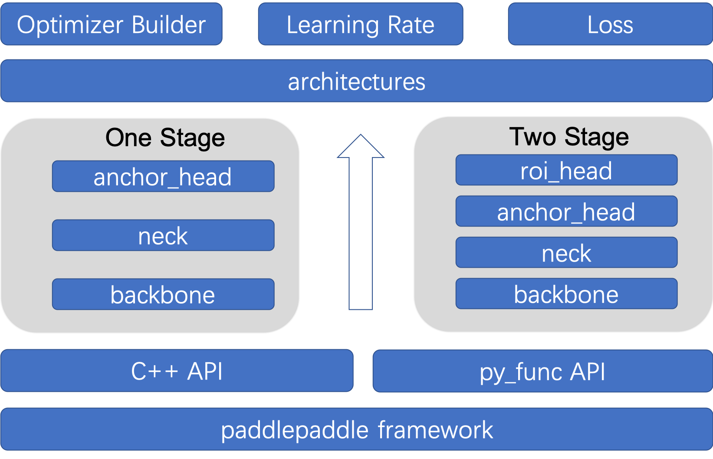

# How to Create Model Algorithm
In order to make better use of PaddleDetection, we will introduce the main model technical details and application of PaddleDetection in this document

## Directory
- [How to Create Model Algorithm](#how-to-create-model-algorithm)
  - [Directory](#directory)
    - [1. Introduction](#1-introduction)
    - [2. Create Model](#2-create-model)
      - [2.1 Create Model Structure](#21-create-model-structure)
        - [2.1.1 Create Backbone](#211-create-backbone)
        - [2.1.2 Create Neck](#212-create-neck)
        - [2.1.3 Create Head](#213-create-head)
        - [2.1.4 Create Loss](#214-create-loss)
        - [2.1.5 Create Post-processing Module](#215-create-post-processing-module)
        - [2.1.6 Create Architecture](#216-create-architecture)
      - [2.2 Create Configuration File](#22-create-configuration-file)
        - [2.2.1 Network Structure Configuration File](#221-network-structure-configuration-file)
        - [2.2.2 Optimizer configuration file](#222-optimizer-configuration-file)
        - [2.2.3 Reader Configuration File](#223-reader-configuration-file)

### 1. Introduction
Each model in the PaddleDetecion corresponds to a folder. In the case of Yolov3, models in the Yolov3 family correspond to the `configs/yolov3` folder. Yolov3 Darknet's general configuration file `configs/yolov3/yolov3_darknet53_270e_coco.yml`.
```
_BASE_: [
  '../datasets/coco_detection.yml', # Dataset configuration file shared by all models
  '../runtime.yml', # Runtime configuration
  '_base_/optimizer_270e.yml', # Optimizer related configuration
  '_base_/yolov3_darknet53.yml', # yolov3 Network structure configuration file
  '_base_/yolov3_reader.yml', # yolov3 Reader module configuration
]

# The relevant configuration defined here can override the configuration of the same name in the above file
snapshot_epoch: 5
weights: output/yolov3_darknet53_270e_coco/model_final
```
As you can see, the modules in the configuration file are clearly divided into optimizer, network structure, and reader modules, with the exception of the common dataset configuration and runtime configuration. Rich optimizers, learning rate adjustment strategies, preprocessing operators, etc., are supported in PaddleDetection, so most of the time you don't need to write the optimizer and reader-related code, just configure it in the configuration file. Therefore, the main purpose of adding a new model is to build the network structure.

In `ppdet/modeling/`, all of the Paddle Detection network structures are defined and combined in the form of components. The main components of the network structure are as follows:
```
  ppdet/modeling/
  ├── architectures
  │   ├── faster_rcnn.py # Faster Rcnn model
  │   ├── ssd.py         # SSD model
  │   ├── yolo.py      # YOLOv3 model
  │   │   ...
  ├── heads       # detection head module
  │   ├── xxx_head.py    # define various detection heads
  │   ├── roi_extractor.py # detection of region of interest extraction
  ├── backbones          # backbone network module
  │   ├── resnet.py      # ResNet network
  │   ├── mobilenet.py   # MobileNet network
  │   │   ...
  ├── losses             # loss function module
  │   ├── xxx_loss.py    # define and register various loss functions
  ├── necks     # feature fusion module
  │   ├── xxx_fpn.py  # define various FPN modules
  ├── proposal_generator # anchor & proposal generate and match modules
  │   ├── anchor_generator.py   # anchor generate modules
  │   ├── proposal_generator.py # proposal generate modules
  │   ├── target.py   # anchor & proposal Matching function
  │   ├── target_layer.py   # anchor & proposal Matching function
  ├── tests  # unit test module
  │   ├── test_xxx.py  # the operator and module structure in the network are unit tested
  ├── ops.py  # encapsulates all kinds of common detection components/operators related to the detection of PaddlePaddle objects
  ├── layers.py  # encapsulates and register all kinds of PaddlePaddle object detection related public detection components/operators
  ├── bbox_utils.py # encapsulates the box-related functions
  ├── post_process.py # encapsulate and process related modules after registration
  ├── shape_spec.py # defines a class for the module to output shape
```



### 2. Create Model
Next, the modeling process is described in detail by taking the single-stage detector YOLOv3 as an example, so that you can quickly build a new model according to this idea.

#### 2.1 Create Model Structure

##### 2.1.1 Create Backbone

All existing Backbone network code in PaddleDetection is placed under `ppdet/modeling/backbones` directory, so we created `darknet.py` as follows:
```python
import paddle.nn as nn
from ppdet.core.workspace import register, serializable

@register
@serializable
class DarkNet(nn.Layer):

    __shared__ = ['norm_type']

    def __init__(self,
                 depth=53,
                 return_idx=[2, 3, 4],
                 norm_type='bn',
                 norm_decay=0.):
        super(DarkNet, self).__init__()
        # Omit the content

    def forward(self, inputs):
        # Ellipsis processing logic
        pass

    @property
    def out_shape(self):
        # Omit the content
        pass
```
Then add a reference to `backbones/__init__.py`:
```python
from . import darknet
from .darknet import *
```
**A few notes:**
- To flexibly configure networks in the YAML configuration file, all backbone nodes need to register in `ppdet.core.workspace` as shown in the preceding example. In addition, `serializable` can be used to enable backbone to support serialization;
- All backbone needs to inherit the `paddle.nn.Layer` class and implement the forward function. In addition, it is necessary to implement the out shape attribute to define the channel information of the output feature map. For details, please refer to the source code.
- `__shared__` To realize global sharing of configuration parameters, these parameters can be shared by all registration modules, such as backbone, neck, head, and loss. 

##### 2.1.2 Create Neck
The feature fusion module is placed under the `ppdet/modeling/necks` directory and we create the following `yolo_fpn.py`:

``` python
import paddle.nn as nn
from ppdet.core.workspace import register, serializable

@register
@serializable
class YOLOv3FPN(nn.Layer):
    __shared__ = ['norm_type']

    def __init__(self,
                in_channels=[256, 512, 1024],
                norm_type='bn'):
        super(YOLOv3FPN, self).__init__()
        # Omit the content

    def forward(self, blocks):
        # Omit the content
        pass

    @classmethod
    def from_config(cls, cfg, input_shape):
        # Omit the content
        pass

    @property
    def out_shape(self):
        # Omit the content
        pass
```
Then add a reference to `necks/__init__.py`:
```python
from . import yolo_fpn
from .yolo_fpn import *
```
**A few notes:**
- The neck module needs to be registered with `register` and can be serialized with `serializable`.
- The neck module needs to inherit the `paddle.nn.Layer` class and implement the forward function. In addition, the `out_shape` attribute needs to be implemented to define the channel information of the output feature map, and the class function `from_config` needs to be implemented to deduce the input channel in the configuration file and initialize `YOLOv3FPN`.
- The neck module can use `shared` to implement global sharing of configuration parameters.

##### 2.1.3 Create Head
The head module is all stored in the `ppdet/modeling/heads` directory, where we create `yolo_head.py` as follows
``` python
import paddle.nn as nn
from ppdet.core.workspace import register

@register
class YOLOv3Head(nn.Layer):
    __shared__ = ['num_classes']
    __inject__ = ['loss']

    def __init__(self,
                 anchors=[[10, 13], [16, 30], [33, 23],
                   [30, 61], [62, 45],[59, 119],
                   [116, 90], [156, 198], [373, 326]],
                 anchor_masks=[[6, 7, 8], [3, 4, 5], [0, 1, 2]],
                 num_classes=80,
                 loss='YOLOv3Loss',
                 iou_aware=False,
                 iou_aware_factor=0.4):
        super(YOLOv3Head, self).__init__()
        # Omit the content

    def forward(self, feats, targets=None):
        # Omit the content
        pass
```
Then add a reference to `heads/__init__.py`:
```python
from . import yolo_head
from .yolo_head import *
```
**A few notes:**
- The head module needs to register with `register`.
- The head module needs to inherit the `paddle.nn.Layer` class and implement the forward function.
- `__inject__` indicates that the module encapsulated in the global dictionary is imported. Such as loss, etc.

##### 2.1.4 Create Loss
The loss modules are all stored under `ppdet/modeling/losses` directory, where we created `yolo_loss.py`
```python
import paddle.nn as nn
from ppdet.core.workspace import register

@register
class YOLOv3Loss(nn.Layer):

    __inject__ = ['iou_loss', 'iou_aware_loss']
    __shared__ = ['num_classes']

    def __init__(self,
                 num_classes=80,
                 ignore_thresh=0.7,
                 label_smooth=False,
                 downsample=[32, 16, 8],
                 scale_x_y=1.,
                 iou_loss=None,
                 iou_aware_loss=None):
        super(YOLOv3Loss, self).__init__()
        # Omit the content

    def forward(self, inputs, targets, anchors):
        # Omit the content
        pass
```
Then add a reference to `losses/__init__.py`:
```python
from . import yolo_loss
from .yolo_loss import *
```
**A few notes:**
- The loss module needs to register with `register`.
- The loss module needs to inherit the `paddle.nn.Layer` class and implement the forward function.
- `__inject__` modules that have been encapsulated in the global dictionary can be used. Some parameters can be globally shared with `__shared__` configuration.

##### 2.1.5 Create Post-processing Module
The post-processing module is defined in `ppdet/modeling/post_process.py`, where the `BBoxPostProcess` class is defined for post-processing operations, as follows:
``` python
from ppdet.core.workspace import register

@register
class BBoxPostProcess(object):
    __shared__ = ['num_classes']
    __inject__ = ['decode', 'nms']

    def __init__(self, num_classes=80, decode=None, nms=None):
        # Omit the content
        pass

    def __call__(self, head_out, rois, im_shape, scale_factor):
        # Omit the content
        pass
```
**A few notes:**
- Post-processing modules need to register with `register`
- `__inject__` modules encapsulated in the global dictionary, such as decode and NMS. Decode and NMS are defined in `ppdet/modeling/layers.py`.

##### 2.1.6 Create Architecture

All architecture network code is placed in `ppdet/modeling/architectures` directory, `meta_arch.py` defines the `BaseArch` class, the code is as follows:
``` python
import paddle.nn as nn
from ppdet.core.workspace import register

@register
class BaseArch(nn.Layer):
     def __init__(self):
        super(BaseArch, self).__init__()

    def forward(self, inputs):
        self.inputs = inputs
        self.model_arch()

        if self.training:
            out = self.get_loss()
        else:
            out = self.get_pred()
        return out

    def model_arch(self, ):
        pass

    def get_loss(self, ):
        raise NotImplementedError("Should implement get_loss method!")

    def get_pred(self, ):
        raise NotImplementedError("Should implement get_pred method!")
```
All architecture needs to inherit from the `BaseArch` class, as defined by `yolo.py` in `YOLOv3` as follows:
``` python
@register
class YOLOv3(BaseArch):
    __category__ = 'architecture'
    __inject__ = ['post_process']

    def __init__(self,
                 backbone='DarkNet',
                 neck='YOLOv3FPN',
                 yolo_head='YOLOv3Head',
                 post_process='BBoxPostProcess'):
        super(YOLOv3, self).__init__()
        self.backbone = backbone
        self.neck = neck
        self.yolo_head = yolo_head
        self.post_process = post_process

    @classmethod
    def from_config(cls, cfg, *args, **kwargs):
        # Omit the content
        pass

    def get_loss(self):
        # Omit the content
        pass

    def get_pred(self):
        # Omit the content
        pass
```

**A few notes:**
- All architecture needs to be registered using a `register`
- When constructing a complete network, `__category__ = 'architecture'` must be set to represent a complete object detection model;
- Backbone, neck, YOLO head, post-process and other inspection components are passed into the architecture to form the final network. Modularization of detection like this improves the reusability of detection models, and multiple models can be obtained by combining different detection components.
- The from config class function implements the automatic configuration of channels when modules are combined.

#### 2.2 Create Configuration File

##### 2.2.1 Network Structure Configuration File
The configuration of the yolov3 network structure is defined in the `configs/yolov3/_base_/` folder. For example, `yolov3_darknet53.yml` defines the network structure of Yolov3 Darknet as follows:
```
architecture: YOLOv3
pretrain_weights: https://paddledet.bj.bcebos.com/models/pretrained/DarkNet53_pretrained.pdparams
norm_type: sync_bn

YOLOv3:
  backbone: DarkNet
  neck: YOLOv3FPN
  yolo_head: YOLOv3Head
  post_process: BBoxPostProcess

DarkNet:
  depth: 53
  return_idx: [2, 3, 4]

# use default config
# YOLOv3FPN:

YOLOv3Head:
  anchors: [[10, 13], [16, 30], [33, 23],
            [30, 61], [62, 45], [59, 119],
            [116, 90], [156, 198], [373, 326]]
  anchor_masks: [[6, 7, 8], [3, 4, 5], [0, 1, 2]]
  loss: YOLOv3Loss

YOLOv3Loss:
  ignore_thresh: 0.7
  downsample: [32, 16, 8]
  label_smooth: false

BBoxPostProcess:
  decode:
    name: YOLOBox
    conf_thresh: 0.005
    downsample_ratio: 32
    clip_bbox: true
  nms:
    name: MultiClassNMS
    keep_top_k: 100
    score_threshold: 0.01
    nms_threshold: 0.45
    nms_top_k: 1000

```
In the configuration file, you need to specify the network architecture, pretrain weights to specify the URL or path of the training model, and norm type to share as global parameters. The definition of the model is defined in the file from top to bottom, corresponding to the model components in the previous section. For some model components, if the default parameters are used, you do not need to configure them, such as `yolo_fpn` above. By changing related configuration, we can easily combine another model, such as `configs/yolov3/_base_/yolov3_mobilenet_v1.yml` to switch backbone from Darknet to MobileNet.

##### 2.2.2 Optimizer configuration file
The optimizer profile defines the optimizer used by the model and the learning rate scheduling strategy. Currently, a variety of optimizers and learning rate strategies have been integrated in PaddleDetection, as described in the code `ppdet/optimizer.py`. For example, the optimizer configuration file for yolov3 is defined in `configs/yolov3/_base_/optimizer_270e.yml` as follows:
```
epoch: 270

LearningRate:
  base_lr: 0.001
  schedulers:
  - !PiecewiseDecay
    gamma: 0.1
    milestones:
    # epoch number
    - 216
    - 243
  - !LinearWarmup
    start_factor: 0.
    steps: 4000

OptimizerBuilder:
  optimizer:
    momentum: 0.9
    type: Momentum
  regularizer:
    factor: 0.0005
    type: L2
```
**A few notes:**
- Optimizer builder. Optimizer specifies the type and parameters of the Optimizer. Currently support the optimizer can reference [PaddlePaddle official documentation](https://www.paddlepaddle.org.cn/documentation/docs/zh/api/paddle/optimizer/Overview_cn.html)
- The `LearningRate.schedulers` sets the combination of different Learning Rate adjustment strategies. Paddle currently supports a variety of Learning Rate adjustment strategies. Specific also can reference [Paddle Paddle official documentation](https://www.paddlepaddle.org.cn/documentation/docs/zh/api/paddle/optimizer/Overview_cn.html). It is important to note that you need to simply package the learning rate adjustment strategy in Paddle, which can be found in the source code `ppdet/optimizer.py`.


##### 2.2.3 Reader Configuration File
For Reader configuration, see [Reader configuration documentation](./READER_en.md#5.Configuration-and-Operation).

> After reading this document, you should have some experience in model construction and configuration of Paddle Detection, and you will understand it more thoroughly with the source code. If you have other questions or suggestions about model technology, please send us an issue. We welcome your feedback.
