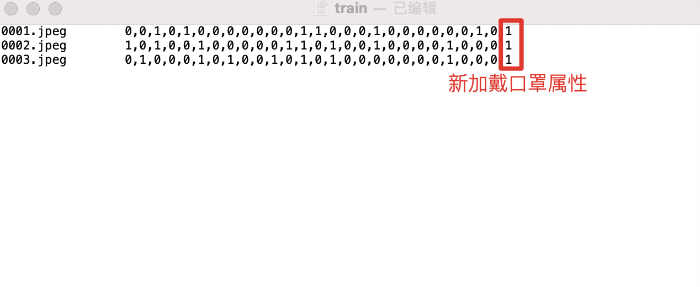

# 属性识别任务二次开发

## 数据准备

### 数据格式

格式采用PA100K的属性标注格式，共有26位属性。

这26位属性的名称、位置、种类数量见下表。

| Attribute |  index    |  length   |
|:----------|:----------|:----------|
| 'Female'    | [0]    | 1    |
| 'AgeOver60', 'Age18-60', 'AgeLess18'    | [1, 2, 3]    | 3    |
| 'Front','Side','Back'    | [4, 5, 6]    |  3    |
| 'Hat','Glasses'   |  [7, 8]   |  2    |
| 'HandBag','ShoulderBag','Backpack','HoldObjectsInFront'   | [9,10,11,12]   | 4    |
| 'ShortSleeve','LongSleeve','UpperStride','UpperLogo','UpperPlaid','UpperSplice'  | [13,14,15,16,17,18]   |  6    |
| 'LowerStripe','LowerPattern','LongCoat','Trousers','Shorts','Skirt&Dress'   | [19,20,21,22,23,24]   |  6    |
| 'boots'   | [25]   |  1   |

举例：

[0, 0, 1, 0, 0, 0, 0, 0, 0, 0, 0, 0, 0, 0, 0, 0, 0, 0, 0, 0, 0, 0, 0, 0, 0, 0]

第一组，位置[0]数值是0，表示'female'

第二组，位置[1,2,3]数值分别是 0、1、0, 表示'Age18-60'

其他组依次类推

### 数据标注

理解了上面`属性标注`格式的含义后，就可以进行数据标注的工作。其本质是：每张单人图建立一组26个长度的标注项，分别与26个位置的属性值对应。

举例：

对于一张原始图片，

1） 使用检测框，标注图片中每一个人的位置。

2） 每一个检测框（对应每一个人），包含一组26位的属性值数组，数组的每一位以0或1表示。对应上述26个属性。例如，如果图片是'Female'，则数组第一位为0，如果满足'Age18-60'，则位置[1,2,3]对应的数值是[0,1,0], 或者满足'AgeOver60'，则相应数值为[1,0,0].

标注完成后利用检测框将每一个人截取成单人图，其图片与26位属性标注建立对应关系。也可先截成单人图再进行标注，效果相同。

## 模型优化

数据标注完成后，就可以拿来做模型的训练，完成自定义模型的优化工作。

其主要有两步工作需要完成：1）将数据与标注数据整理成训练格式。2）修改配置文件开始训练。

### 训练数据格式

训练数据包括训练使用的图片和一个训练列表train.txt，其具体位置在训练配置中指定，其放置方式示例如下：
```
Attribute/
|-- data           训练图片文件夹
|   |-- 00001.jpg
|   |-- 00002.jpg
|   `-- 0000x.jpg
`-- train.txt      训练数据列表

```

train.txt文件内为所有训练图片名称（相对于根路径的文件路径）+ 26个标注值

其每一行表示一个人的图片和标注结果。其格式为：

```
00001.jpg    0,0,1,0,....
```

注意：1)图片与标注值之间是以Tab[\t]符号隔开, 2)标注值之间是以逗号[,]隔开。该格式不能错，否则解析失败。

### 修改配置开始训练

首先执行以下命令下载训练代码：

```shell
git clone https://github.com/PaddlePaddle/PaddleClas
```

需要在配置文件`PaddleClas/blob/develop/ppcls/configs/PULC/person_attribute/PPLCNet_x1_0.yaml`中，修改的配置项如下：

```
DataLoader:
  Train:
    dataset:
      name: MultiLabelDataset
      image_root: "dataset/pa100k/"                     #指定训练图片所在根路径
      cls_label_path: "dataset/pa100k/train_list.txt"   #指定训练列表文件位置
      label_ratio: True
      transform_ops:

  Eval:
    dataset:
      name: MultiLabelDataset
      image_root: "dataset/pa100k/"                     #指定评估图片所在根路径
      cls_label_path: "dataset/pa100k/val_list.txt"     #指定评估列表文件位置
      label_ratio: True
      transform_ops:
```
注意：
1. 这里image_root路径+train.txt中图片相对路径，对应图片的完整路径位置。
2. 如果有修改属性数量，则还需修改内容配置项中属性种类数量：
```
# model architecture
Arch:
  name: "PPLCNet_x1_0"
  pretrained: True
  use_ssld: True
  class_num: 26           #属性种类数量
```

然后运行以下命令开始训练。

```
#多卡训练
export CUDA_VISIBLE_DEVICES=0,1,2,3
python3 -m paddle.distributed.launch \
    --gpus="0,1,2,3" \
    tools/train.py \
        -c ./ppcls/configs/PULC/person_attribute/PPLCNet_x1_0.yaml

#单卡训练
python3 tools/train.py \
        -c ./ppcls/configs/PULC/person_attribute/PPLCNet_x1_0.yaml
```


### 模型导出

使用下述命令将训练好的模型导出为预测部署模型。

```
python3 tools/export_model.py \
    -c ./ppcls/configs/PULC/person_attribute/PPLCNet_x1_0.yaml \
    -o Global.pretrained_model=output/PPLCNet_x1_0/best_model \
    -o Global.save_inference_dir=deploy/models/PPLCNet_x1_0_person_attribute_infer
```

导出模型后，需要下载[infer_cfg.yml](https://bj.bcebos.com/v1/paddledet/models/pipeline/infer_cfg.yml)文件，并放置到导出的模型文件夹`PPLCNet_x1_0_person_attribute_infer`中。

使用时在PP-Human中的配置文件`./deploy/pipeline/config/infer_cfg_pphuman.yml`中修改新的模型路径`model_dir`项，并开启功能`enable: True`。
```
ATTR:
  model_dir: [YOUR_DEPLOY_MODEL_DIR]/PPLCNet_x1_0_person_attribute_infer/   #新导出的模型路径位置
  enable: True                                                              #开启功能
```
然后可以使用-->至此即完成新增属性类别识别任务。

## 属性增减

上述是以26个属性为例的标注、训练过程。

如果需要增加、减少属性数量，则需要：

1)标注时需增加新属性类别信息或删减属性类别信息；

2)对应修改训练中train.txt所使用的属性数量和名称；

3)修改训练配置，例如``PaddleClas/blob/develop/ppcls/configs/PULC/person_attribute/PPLCNet_x1_0.yaml``文件中的属性数量,详细见上述`修改配置开始训练`部分。

增加属性示例：

1. 在标注数据时在26位后继续增加新的属性标注数值；
2. 在train.txt文件的标注数值中也增加新的属性数值。
3. 注意属性类型在train.txt中属性数值列表中的位置的对应关系需要时固定的，例如第1-3位表示年龄，所有图片都要使用1-3位置表示年龄，不再赘述。

<div width="500" align="center">
  
</div>

删减属性同理。
例如，如果不需要年龄属性，则位置[1,2,3]的数值可以去掉。只需在train.txt中标注的26个数字中全部删除第1-3位数值即可，同时标注数据时也不再需要标注这3位属性值。
