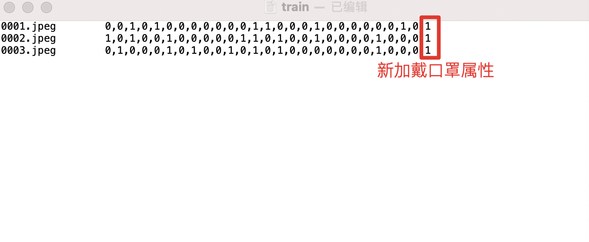

[简体中文](ppvehicle_attribute.md) | English

# Customized Vehicle Attribute Recognition

## Data Preparation

### Data Format

We use the VeRi attribute annotation format, with a total of 10 color and 9 model attributes shown as follows.

```
# colors
- "yellow"
- "orange"
- "green"
- "gray"
- "red"
- "blue"
- "white"
- "golden"
- "brown"
- "black"

# models
- "sedan"
- "suv"
- "van"
- "hatchback"
- "mpv"
- "pickup"
- "bus"
- "truck"
- "estate"
```

A sequence of length 19 is used in the annotation file to represent the above attributes.

Examples:

[1, 0, 0, 0, 0, 0, 0, 0, 0, 0, 0, 1, 0, 0, 0, 0, 0, 0, 0]

In the first 10 bits, the value of bit index 0 is 1, indicating that the vehicle color is `"yellow"`.

In the last 9 bits, the value of bit index 11 is 1, indicating that the model is `"suv"`.


### Data Annotation

After knowing the purpose of the above `Data format`, we can start to annotate data. The essence is that each single-vehicle image creates a set of 19 annotation items, corresponding to the attribute values at 19 positions.

Examples:

For an original image:

1) Using bounding boxes to annotate the position of each vehicle in the picture.

2) Each detection box (corresponding to each vehicle) contains 19 attribute values which are represented by 0 or 1. It corresponds to the above 19 attributes. For example, if the color is 'orange', then the index 1 bit of the array is 1. If the model is 'sedan', then the index 10 bit of the array is 1.

After the annotation is completed, the model will use the detection box to intercept each vehicle into a single-vehicle picture, and its picture establishes a corresponding relationship with the 19 attribute annotation. It is also possible to cut into a single-vehicle image first and then annotate it. The results are the same.


## Model Training

Once the data is annotated, it can be used for model training to complete the optimization of the customized model.

There are two main steps: 1) Organize the data and annotated data into the training format. 2) Modify the configuration file to start training.

### Training Data Format

The training data includes the images used for training and a training list called train.txt. Its location is specified in the training configuration, with the following example:

```
Attribute/
|-- data      Training images folder
|-- 00001.jpg
|-- 00002.jpg
| `-- 0000x.jpg
train.txt     List of training data
```

train.txt file contains the names of all training images (file path relative to the root path) + 19 annotation values

Each line of it represents a vehicle's image and annotation result. The format is as follows:

```
00001.jpg    0,0,1,0,....
```

Note 1) The images are separated by Tab[\t], 2) The annotated values are separated by commas [,]. If the format is wrong, the parsing will fail.


### Modify The Configuration To Start Training

First run the following command to download the training code (for more environmental issues, please refer to [Install_PaddleClas](https://github.com/PaddlePaddle/PaddleClas/blob/release/2.4/docs/en/installation/ install_paddleclas_en.md)):

```
git clone https://github.com/PaddlePaddle/PaddleClas
```

You need to modify the following configuration in the configuration file `PaddleClas/blob/develop/ppcls/configs/PULC/vehicle_attribute/PPLCNet_x1_0.yaml`

```yaml
DataLoader:
  Train:
    dataset:
      name: MultiLabelDataset
      image_root: "dataset/VeRi/"                     # the root path of training images
      cls_label_path: "dataset/VeRi/train_list.txt"   # the location of the training list file
      label_ratio: True
      transform_ops:
        ...

  Eval:
    dataset:
      name: MultiLabelDataset
      image_root: "dataset/VeRi/"                     # the root path of evaluation images
      cls_label_path: "dataset/VeRi/val_list.txt"     # the location of the training list file
      label_ratio: True
      transform_ops:
         ...
```

Note:

1. here image_root path and the relative path of the image in train.txt, corresponding to the full path of the image.
2. If you modify the number of attributes, the number of attribute types in the content configuration item should also be modified accordingly.

```yaml
# model architecture
Arch:
name: "PPLCNet_x1_0"
pretrained: True
use_ssld: True
class_num: 19           # Number of attribute classes
```

Then run the following command to start training:

```bash
#Multi-card training
export CUDA_VISIBLE_DEVICES=0,1,2,3
python3 -m paddle.distributed.launch \
    --gpus="0,1,2,3" \
    tools/train.py \
        -c ./ppcls/configs/PULC/vehicle_attribute/PPLCNet_x1_0.yaml

#Single card training
python3 tools/train.py \
        -c ./ppcls/configs/PULC/vehicle_attribute/PPLCNet_x1_0.yaml
```

You can run the following commands for performance evaluation after the training is completed:

```
#Multi-card evaluation
export CUDA_VISIBLE_DEVICES=0,1,2,3
python3 -m paddle.distributed.launch \
    --gpus="0,1,2,3" \
    tools/eval.py \
        -c ./ppcls/configs/PULC/vehicle_attribute/PPLCNet_x1_0.yaml \
        -o Global.pretrained_model=./output/PPLCNet_x1_0/best_model

#Single card evaluation
python3 tools/eval.py \
        -c ./ppcls/configs/PULC/vehicle_attribute/PPLCNet_x1_0.yaml \
        -o Global.pretrained_model=./output/PPLCNet_x1_0/best_model
```

### Model Export

Use the following command to export the trained model as an inference deployment model.

```
python3 tools/export_model.py \
    -c ./ppcls/configs/PULC/vehicle_attribute/PPLCNet_x1_0.yaml \
    -o Global.pretrained_model=output/PPLCNet_x1_0/best_model \
    -o Global.save_inference_dir=deploy/models/PPLCNet_x1_0_vehicle_attribute_model
```

After exporting the model, if want to use it in PP-Vehicle, you need to download the [deploy infer model](https://bj.bcebos.com/v1/paddledet/models/pipeline/vehicle_attribute_model.zip) and copy `infer_cfg.yml` into the exported model folder `PPLCNet_x1_0_vehicle_attribute_model` .

When you use the model, you need to modify the new model path `model_dir` entry and set `enable: True` in the configuration file of PP-Vehicle `. /deploy/pipeline/config/infer_cfg_ppvehicle.yml` .

```
VEHICLE_ATTR:
  model_dir: [YOUR_DEPLOY_MODEL_DIR]/PPLCNet_x1_0_vehicle_attribute_infer/   #The exported model location
  enable: True                                                              #Whether to enable the function
```

To this point,  a new attribute category recognition task is completed.


## Adding or deleting attributes

This is similar to the increase and decrease process of pedestrian attributes.

If the attributes need to be added or deleted, you need to

1) New attribute category information needs to be added or deleted when annotating the data.

2) Modify the number and name of attributes used in train.txt corresponding to the training.

3) Modify the training configuration, for example, the number of attributes in the ``PaddleClas/blob/develop/ppcls/configs/PULC/vehicle_attribute/PPLCNet_x1_0.yaml`` file, for details, please see the ``Modify configuration to start training`` section above.

Example of adding attributes.

1. Continue to add new attribute annotation values after 19 values when annotating the data.
2. Add new attribute values to the annotated values in the train.txt file as well.
3. The above is the annotation and training process with 19 attributes.

<div width="500" align="center">
  
</div>


The same applies to the deletion of attributes.


## Modifications to post-processing code

After modifying the attribute definition, the post-processing part of the pipeline also needs to be modified accordingly, which mainly affects the display results when the results are visualized.


The code is at [file](https://github.com/PaddlePaddle/PaddleDetection/blob/release/2.6/deploy/pipeline/ppvehicle/vehicle_attr.py#L108), that is, the `postprocess` function.

The function implementation is described as follows:

```python
    # The name of the color/model is defined in the initialization function of the class
    self.color_list = [
        "yellow", "orange", "green", "gray", "red", "blue", "white",
        "golden", "brown", "black"
    ]
    self.type_list = [
        "sedan", "suv", "van", "hatchback", "mpv", "pickup", "bus", "truck",
        "estate"
    ]

    ...

    def postprocess(self, inputs, result):
        # postprocess output of predictor
        im_results = result['output']
        batch_res = []
        for res in im_results:
            res = res.tolist()
            attr_res = []
            color_res_str = "Color: "
            type_res_str = "Type: "
            color_idx = np.argmax(res[:10])   # The first 10 items represent the color scores, and the item with the largest score is used as the color result
            type_idx = np.argmax(res[10:])    # The last 9 items represent the model scores, and the item with the largest score is used as the model result.

            # The score of color and model need to be larger than the corresponding threshold, otherwise it will be regarded as 'UnKnown'
            if res[color_idx] >= self.color_threshold:
                color_res_str += self.color_list[color_idx]
            else:
                color_res_str += "Unknown"
            attr_res.append(color_res_str)

            if res[type_idx + 10] >= self.type_threshold:
                type_res_str += self.type_list[type_idx]
            else:
                type_res_str += "Unknown"
            attr_res.append(type_res_str)

            batch_res.append(attr_res)
        result = {'output': batch_res}
        return result
```
