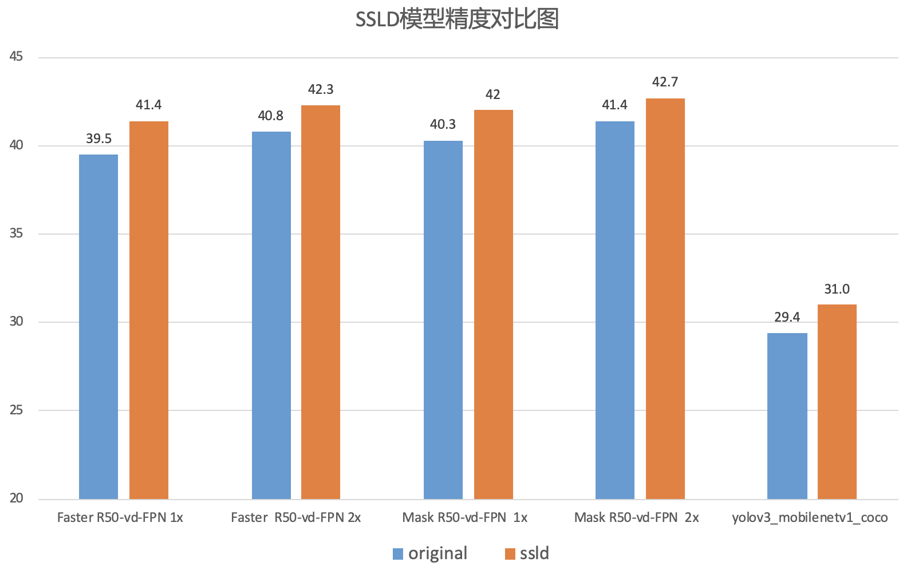

简体中文 | [English](SSLD_PRETRAINED_MODEL_en.md)

### Simple semi-supervised label knowledge distillation solution (SSLD)

### R-CNN on COCO

| 骨架网络              | 网络类型       | 每张GPU图片个数 | 学习率策略 |推理时间(fps) | Box AP | Mask AP |                           下载                          | 配置文件 |
| :------------------- | :------------| :-----: | :-----: | :------------: | :-----: | :-----: | :-----------------------------------------------------: | :-----: |
| ResNet50-vd-SSLDv2-FPN      | Faster         |    1    |   1x    |     ----     |  41.4  |  -  | [下载链接](https://paddledet.bj.bcebos.com/models/faster_rcnn_r50_vd_fpn_ssld_1x_coco.pdparams) | [配置文件](https://github.com/PaddlePaddle/PaddleDetection/tree/develop/configs/faster_rcnn/faster_rcnn_r50_vd_fpn_ssld_1x_coco.yml) |
| ResNet50-vd-SSLDv2-FPN      | Faster         |    1    |   2x    |     ----     |  42.3  |  -  | [下载链接](https://paddledet.bj.bcebos.com/models/faster_rcnn_r50_vd_fpn_ssld_2x_coco.pdparams) | [配置文件](https://github.com/PaddlePaddle/PaddleDetection/tree/develop/configs/faster_rcnn/faster_rcnn_r50_vd_fpn_ssld_2x_coco.yml) |
| ResNet50-vd-SSLDv2-FPN         | Mask         |    1    |   1x    |     ----     |  42.0  |    38.2   | [下载链接](https://paddledet.bj.bcebos.com/models/mask_rcnn_r50_vd_fpn_ssld_1x_coco.pdparams) | [配置文件](https://github.com/PaddlePaddle/PaddleDetection/tree/develop/configs/mask_rcnn/mask_rcnn_r50_vd_fpn_ssld_1x_coco.yml) |
| ResNet50-vd-SSLDv2-FPN         | Mask         |    1    |   2x    |     ----     |  42.7 |    38.9   | [下载链接](https://paddledet.bj.bcebos.com/models/mask_rcnn_r50_vd_fpn_ssld_2x_coco.pdparams) | [配置文件](https://github.com/PaddlePaddle/PaddleDetection/tree/develop/configs/mask_rcnn/mask_rcnn_r50_vd_fpn_ssld_2x_coco.yml) |
| ResNet50-vd-SSLDv2-FPN         | Cascade Faster         |    1    |   1x    |     ----     |  44.4  |    -    | [下载链接](https://paddledet.bj.bcebos.com/models/cascade_rcnn_r50_vd_fpn_ssld_1x_coco.pdparams) | [配置文件](https://github.com/PaddlePaddle/PaddleDetection/tree/develop/configs/cascade_rcnn/cascade_rcnn_r50_vd_fpn_ssld_1x_coco.yml) |
| ResNet50-vd-SSLDv2-FPN         | Cascade Faster         |    1    |   2x    |     ----     |  45.0  |    -    | [下载链接](https://paddledet.bj.bcebos.com/models/cascade_rcnn_r50_vd_fpn_ssld_2x_coco.pdparams) | [配置文件](https://github.com/PaddlePaddle/PaddleDetection/tree/develop/configs/cascade_rcnn/cascade_rcnn_r50_vd_fpn_ssld_2x_coco.yml) |
| ResNet50-vd-SSLDv2-FPN         | Cascade Mask         |    1    |   1x    |     ----     |  44.9 |    39.1    | [下载链接](https://paddledet.bj.bcebos.com/models/cascade_mask_rcnn_r50_vd_fpn_ssld_1x_coco.pdparams) | [配置文件](https://github.com/PaddlePaddle/PaddleDetection/tree/develop/configs/cascade_rcnn/cascade_mask_rcnn_r50_vd_fpn_ssld_1x_coco.yml) |
| ResNet50-vd-SSLDv2-FPN         | Cascade Mask         |    1    |   2x    |     ----     |  45.7  |    39.7    | [下载链接](https://paddledet.bj.bcebos.com/models/cascade_mask_rcnn_r50_vd_fpn_ssld_2x_coco.pdparams) | [配置文件](https://github.com/PaddlePaddle/PaddleDetection/tree/develop/configs/cascade_rcnn/cascade_mask_rcnn_r50_vd_fpn_ssld_2x_coco.yml) |


### YOLOv3 on COCO

| 骨架网络             | 输入尺寸   | 每张GPU图片个数 | 学习率策略 |推理时间(fps) | Box AP |                           下载                          | 配置文件 |
| :----------------- | :-------- | :-----------: | :------: | :---------: | :----: | :----------------------------------------------------: | :-----: |
| MobileNet-V1-SSLD         | 608         |    8    |   270e    |     ----     |  31.0  | [下载链接](https://paddledet.bj.bcebos.com/models/yolov3_mobilenet_v1_ssld_270e_coco.pdparams) | [配置文件](https://github.com/PaddlePaddle/PaddleDetection/tree/develop/configs/yolov3/yolov3_mobilenet_v1_ssld_270e_coco.yml) |
| MobileNet-V1-SSLD         | 416         |    8    |   270e    |     ----     |  30.6  | [下载链接](https://paddledet.bj.bcebos.com/models/yolov3_mobilenet_v1_ssld_270e_coco.pdparams) | [配置文件](https://github.com/PaddlePaddle/PaddleDetection/tree/develop/configs/yolov3/yolov3_mobilenet_v1_ssld_270e_coco.yml) |
| MobileNet-V1-SSLD         | 320         |    8    |   270e    |     ----     |  28.4  | [下载链接](https://paddledet.bj.bcebos.com/models/yolov3_mobilenet_v1_ssld_270e_coco.pdparams) | [配置文件](https://github.com/PaddlePaddle/PaddleDetection/tree/develop/configs/yolov3/yolov3_mobilenet_v1_ssld_270e_coco.yml) |

### YOLOv3 on Pasacl VOC

| 骨架网络             | 输入尺寸   | 每张GPU图片个数 | 学习率策略 |推理时间(fps) | Box AP |                           下载                          | 配置文件 |
| :----------------- | :-------- | :-----------: | :------: | :---------: | :----: | :----------------------------------------------------: | :-----: |
| MobileNet-V1-SSLD | 608  |    8    |   270e  |      -        |  78.3  | [下载链接](https://paddledet.bj.bcebos.com/models/yolov3_mobilenet_v1_ssld_270e_voc.pdparams) | [配置文件](https://github.com/PaddlePaddle/PaddleDetection/tree/develop/configs/yolov3/yolov3_mobilenet_v1_ssld_270e_voc.yml) |
| MobileNet-V1-SSLD | 416  |    8    |   270e  |      -        |  79.6  | [下载链接](https://paddledet.bj.bcebos.com/models/yolov3_mobilenet_v1_ssld_270e_voc.pdparams) | [配置文件](https://github.com/PaddlePaddle/PaddleDetection/tree/develop/configs/yolov3/yolov3_mobilenet_v1_ssld_270e_voc.yml) |
| MobileNet-V1-SSLD | 320  |    8    |   270e  |      -        |  77.3  | [下载链接](https://paddledet.bj.bcebos.com/models/yolov3_mobilenet_v1_ssld_270e_voc.pdparams) | [配置文件](https://github.com/PaddlePaddle/PaddleDetection/tree/develop/configs/yolov3/yolov3_mobilenet_v1_ssld_270e_voc.yml) |
| MobileNet-V3-SSLD | 608  |    8    |   270e  |      -        |  80.4  | [下载链接](https://paddledet.bj.bcebos.com/models/yolov3_mobilenet_v3_large_ssld_270e_voc.pdparams) | [配置文件](https://github.com/PaddlePaddle/PaddleDetection/tree/develop/configs/yolov3/yolov3_mobilenet_v3_large_ssld_270e_voc.yml) |
| MobileNet-V3-SSLD | 416  |    8    |   270e  |      -        |  79.2  | [下载链接](https://paddledet.bj.bcebos.com/models/yolov3_mobilenet_v3_large_ssld_270e_voc.pdparams) | [配置文件](https://github.com/PaddlePaddle/PaddleDetection/tree/develop/configs/yolov3/yolov3_mobilenet_v3_large_ssld_270e_voc.yml) |
| MobileNet-V3-SSLD | 320  |    8    |   270e  |      -        |  77.3  | [下载链接](https://paddledet.bj.bcebos.com/models/yolov3_mobilenet_v3_large_ssld_270e_voc.pdparams) | [配置文件](https://github.com/PaddlePaddle/PaddleDetection/tree/develop/configs/yolov3/yolov3_mobilenet_v3_large_ssld_270e_voc.yml) |

**注意事项:**  

- [SSLD](https://arxiv.org/abs/2103.05959)是一种知识蒸馏方法，我们使用蒸馏后性能更强的backbone预训练模型，进一步提升检测精度，详细方案请参考[知识蒸馏教程](https://github.com/PaddlePaddle/PaddleClas/blob/develop/docs/en/advanced_tutorials/distillation/distillation_en.md)



## Citations
```
@misc{cui2021selfsupervision,
      title={Beyond Self-Supervision: A Simple Yet Effective Network Distillation Alternative to Improve Backbones},
      author={Cheng Cui and Ruoyu Guo and Yuning Du and Dongliang He and Fu Li and Zewu Wu and Qiwen Liu and Shilei Wen and Jizhou Huang and Xiaoguang Hu and Dianhai Yu and Errui Ding and Yanjun Ma},
      year={2021},
      eprint={2103.05959},
      archivePrefix={arXiv},
      primaryClass={cs.CV}
}
```
