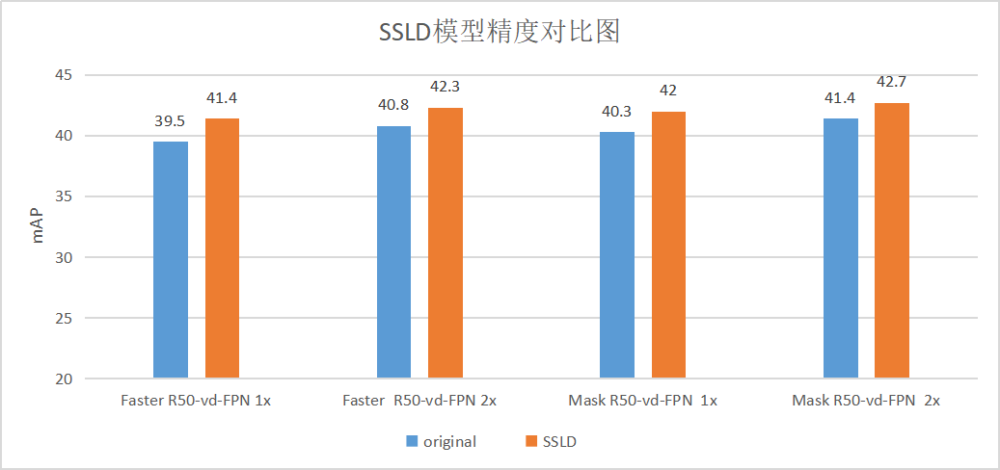

English | [简体中文](SSLD_PRETRAINED_MODEL.md)

### Simple semi-supervised label knowledge distillation solution (SSLD)

### R-CNN on COCO

| Backbone              |  Model       | Images/GPU | Lr schd | FPS | Box AP | Mask AP |                           Download                           | Config |
| :------------------- | :------------| :-----: | :-----: | :------------: | :-----: | :-----: | :-----------------------------------------------------: | :-----: |
| ResNet50-vd-SSLDv2-FPN      | Faster         |    1    |   1x    |     ----     |  41.4  |  -  | [model](https://paddledet.bj.bcebos.com/models/faster_rcnn_r50_vd_fpn_ssld_1x_coco.pdparams) | [config](https://github.com/PaddlePaddle/PaddleDetection/tree/develop/configs/faster_rcnn/faster_rcnn_r50_vd_fpn_ssld_1x_coco.yml) |
| ResNet50-vd-SSLDv2-FPN      | Faster         |    1    |   2x    |     ----     |  42.3  |  -  | [model](https://paddledet.bj.bcebos.com/models/faster_rcnn_r50_vd_fpn_ssld_2x_coco.pdparams) | [config](https://github.com/PaddlePaddle/PaddleDetection/tree/develop/configs/faster_rcnn/faster_rcnn_r50_vd_fpn_ssld_2x_coco.yml) |
| ResNet50-vd-SSLDv2-FPN         | Mask         |    1    |   1x    |     ----     |  42.0  |    38.2   | [model](https://paddledet.bj.bcebos.com/models/mask_rcnn_r50_vd_fpn_ssld_1x_coco.pdparams) | [config](https://github.com/PaddlePaddle/PaddleDetection/tree/develop/configs/mask_rcnn/mask_rcnn_r50_vd_fpn_ssld_1x_coco.yml) |
| ResNet50-vd-SSLDv2-FPN         | Mask         |    1    |   2x    |     ----     |  42.7 |    38.9   | [model](https://paddledet.bj.bcebos.com/models/mask_rcnn_r50_vd_fpn_ssld_2x_coco.pdparams) | [config](https://github.com/PaddlePaddle/PaddleDetection/tree/develop/configs/mask_rcnn/mask_rcnn_r50_vd_fpn_ssld_2x_coco.yml) |
| ResNet50-vd-SSLDv2-FPN         | Cascade Faster         |    1    |   1x    |     ----     |  44.4  |    -    | [model](https://paddledet.bj.bcebos.com/models/cascade_rcnn_r50_vd_fpn_ssld_1x_coco.pdparams) | [config](https://github.com/PaddlePaddle/PaddleDetection/tree/develop/configs/cascade_rcnn/cascade_rcnn_r50_vd_fpn_ssld_1x_coco.yml) |
| ResNet50-vd-SSLDv2-FPN         | Cascade Faster         |    1    |   2x    |     ----     |  45.0  |    -    | [model](https://paddledet.bj.bcebos.com/models/cascade_rcnn_r50_vd_fpn_ssld_2x_coco.pdparams) | [config](https://github.com/PaddlePaddle/PaddleDetection/tree/develop/configs/cascade_rcnn/cascade_rcnn_r50_vd_fpn_ssld_2x_coco.yml) |
| ResNet50-vd-SSLDv2-FPN         | Cascade Mask         |    1    |   1x    |     ----     |  44.9 |    39.1    | [model](https://paddledet.bj.bcebos.com/models/cascade_mask_rcnn_r50_vd_fpn_ssld_1x_coco.pdparams) | [config](https://github.com/PaddlePaddle/PaddleDetection/tree/develop/configs/cascade_rcnn/cascade_mask_rcnn_r50_vd_fpn_ssld_1x_coco.yml) |
| ResNet50-vd-SSLDv2-FPN         | Cascade Mask         |    1    |   2x    |     ----     |  45.7  |    39.7    | [model](https://paddledet.bj.bcebos.com/models/cascade_mask_rcnn_r50_vd_fpn_ssld_2x_coco.pdparams) | [config](https://github.com/PaddlePaddle/PaddleDetection/tree/develop/configs/cascade_rcnn/cascade_mask_rcnn_r50_vd_fpn_ssld_2x_coco.yml) |

### YOLOv3 on COCO

| Backbone            |   Input shape   | Images/GPU | Lr schd | FPS | Box AP |                          Download                           | Config |
| :----------------- | :-------- | :-----------: | :------: | :---------: | :----: | :----------------------------------------------------: | :-----: |
| MobileNet-V1-SSLD         | 608         |    8    |   270e    |     ----     |  31.0  | [model](https://paddledet.bj.bcebos.com/models/yolov3_mobilenet_v1_ssld_270e_coco.pdparams) | [config](https://github.com/PaddlePaddle/PaddleDetection/tree/develop/configs/yolov3/yolov3_mobilenet_v1_ssld_270e_coco.yml) |
| MobileNet-V1-SSLD         | 416         |    8    |   270e    |     ----     |  30.6  | [model](https://paddledet.bj.bcebos.com/models/yolov3_mobilenet_v1_ssld_270e_coco.pdparams) | [config](https://github.com/PaddlePaddle/PaddleDetection/tree/develop/configs/yolov3/yolov3_mobilenet_v1_ssld_270e_coco.yml) |
| MobileNet-V1-SSLD         | 320         |    8    |   270e    |     ----     |  28.4  | [model](https://paddledet.bj.bcebos.com/models/yolov3_mobilenet_v1_ssld_270e_coco.pdparams) | [config](https://github.com/PaddlePaddle/PaddleDetection/tree/develop/configs/yolov3/yolov3_mobilenet_v1_ssld_270e_coco.yml) |

### YOLOv3 on Pasacl VOC

| Backbone            |   Input shape   | Images/GPU | Lr schd | FPS | Box AP |                          Download                           | Config |
| :----------------- | :-------- | :-----------: | :------: | :---------: | :----: | :----------------------------------------------------: | :-----: |
| MobileNet-V1-SSLD | 608  |    8    |   270e  |      -        |  78.3  | [model](https://paddledet.bj.bcebos.com/models/yolov3_mobilenet_v1_ssld_270e_voc.pdparams) | [config](https://github.com/PaddlePaddle/PaddleDetection/tree/develop/configs/yolov3/yolov3_mobilenet_v1_ssld_270e_voc.yml) |
| MobileNet-V1-SSLD | 416  |    8    |   270e  |      -        |  79.6  | [model](https://paddledet.bj.bcebos.com/models/yolov3_mobilenet_v1_ssld_270e_voc.pdparams) | [config](https://github.com/PaddlePaddle/PaddleDetection/tree/develop/configs/yolov3/yolov3_mobilenet_v1_ssld_270e_voc.yml) |
| MobileNet-V1-SSLD | 320  |    8    |   270e  |      -        |  77.3  | [model](https://paddledet.bj.bcebos.com/models/yolov3_mobilenet_v1_ssld_270e_voc.pdparams) | [config](https://github.com/PaddlePaddle/PaddleDetection/tree/develop/configs/yolov3/yolov3_mobilenet_v1_ssld_270e_voc.yml) |
| MobileNet-V3-SSLD | 608  |    8    |   270e  |      -        |  80.4  | [model](https://paddledet.bj.bcebos.com/models/yolov3_mobilenet_v3_large_ssld_270e_voc.pdparams) | [config](https://github.com/PaddlePaddle/PaddleDetection/tree/develop/configs/yolov3/yolov3_mobilenet_v3_large_ssld_270e_voc.yml) |
| MobileNet-V3-SSLD | 416  |    8    |   270e  |      -        |  79.2  | [model](https://paddledet.bj.bcebos.com/models/yolov3_mobilenet_v3_large_ssld_270e_voc.pdparams) | [config](https://github.com/PaddlePaddle/PaddleDetection/tree/develop/configs/yolov3/yolov3_mobilenet_v3_large_ssld_270e_voc.yml) |
| MobileNet-V3-SSLD | 320  |    8    |   270e  |      -        |  77.3  | [model](https://paddledet.bj.bcebos.com/models/yolov3_mobilenet_v3_large_ssld_270e_voc.pdparams) | [config](https://github.com/PaddlePaddle/PaddleDetection/tree/develop/configs/yolov3/yolov3_mobilenet_v3_large_ssld_270e_voc.yml) |

**Notes:**

- [SSLD](https://arxiv.org/abs/2103.05959) is a knowledge distillation method. We use the stronger backbone pretrained model after distillation to further improve the detection accuracy. Please refer to the [knowledge distillation tutorial](https://github.com/PaddlePaddle/PaddleClas/blob/develop/docs/en/advanced_tutorials/distillation/distillation_en.md).



## Citations
```
@misc{cui2021selfsupervision,
      title={Beyond Self-Supervision: A Simple Yet Effective Network Distillation Alternative to Improve Backbones},
      author={Cheng Cui and Ruoyu Guo and Yuning Du and Dongliang He and Fu Li and Zewu Wu and Qiwen Liu and Shilei Wen and Jizhou Huang and Xiaoguang Hu and Dianhai Yu and Errui Ding and Yanjun Ma},
      year={2021},
      eprint={2103.05959},
      archivePrefix={arXiv},
      primaryClass={cs.CV}
}
```
